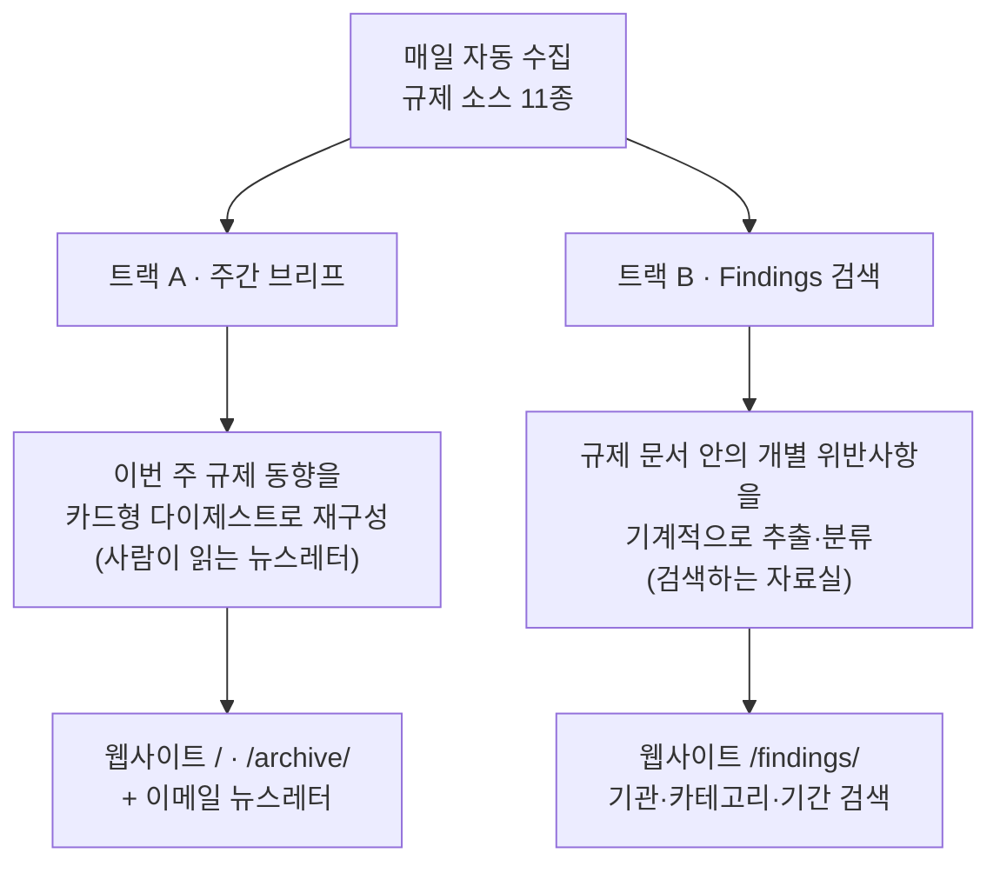
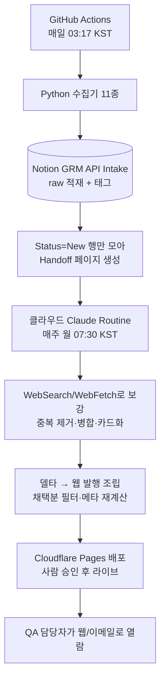
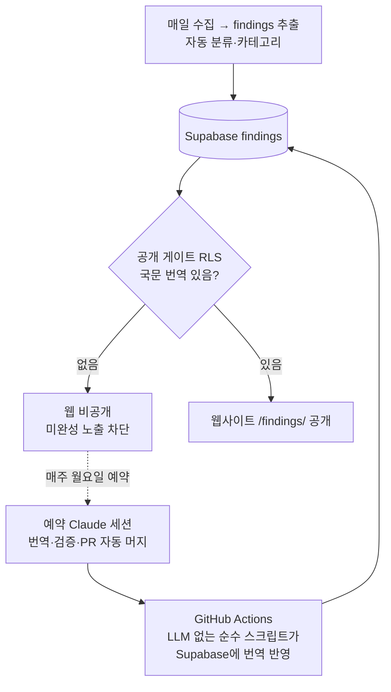

# GRM 시스템 명세서 (System Spec)

> **GRM = Global Regulatory Monitor.** 전 세계·국내(식약처) 제약 GMP·품질 규제 소식을 매일 자동으로 모아, 한국 제약사 QA 담당자가 읽기 쉬운 형태로 매주 웹사이트에 발행하는 자동화 시스템입니다.
>
> 이 문서는 저장소의 단일 시스템 명세서입니다(README 대체). **개발자가 아니어도 시스템의 큰 그림을 이해할 수 있도록** 앞부분(§1~§4)은 쉬운 말로, 뒷부분(§5~§6)은 개발 레퍼런스로 씁니다.

| 문서 메타 | 값 |
|---|---|
| 문서 버전 | `v1.115-draft` |
| 최종 수정일 | 2026-07-09 |
| 현재 상태 | 매일 자동 수집·발행 가동 중. 웹사이트(`grm-solutions.com`)가 주 발행 채널. **Findings 인텔리전스(FIND-1) M1~M9 완료** — 규제 지적사항 검색 DB + 국문 자동 번역 파이프라인 라이브. |
| 코드 저장소 | https://github.com/MINHOYEOM/grm-api-intake |
| 웹사이트 | https://grm-solutions.com (브리프 `/`·`/archive/`, 지적사항 검색 `/findings/`) |
| 변경 이력 | 상세 이력은 **git 로그**로 확인합니다. 이 문서는 "현재 상태"만 유지하고, 오래된 단계별 기록은 남기지 않습니다. |

---

## 0. 이 문서를 쓰는 법 (유지 규칙)

이 문서는 **"살아있는 명세서"** 입니다. 시스템이 바뀌면 함께 갱신하되, **현재 상태를 간결하게 유지**하는 것이 최우선입니다.

- **큰 변경만 반영한다.** 새 소스·새 단계·데이터 흐름 변경·파일 구조 변경 같은 "구조적 변화"만 씁니다. 자잘한 버그·문구 수정은 git 커밋으로 충분합니다.
- **누적하지 말고 갱신한다.** 과거 단계별 기록을 계속 쌓지 않습니다. 낡은 내용은 **과감히 삭제**하고 현재 사실로 대체합니다. 상세 이력이 필요하면 git 로그를 봅니다.
- **파일·폴더가 바뀌면 §5.1 폴더 구조를 함께 갱신합니다.**
- 상단 "문서 메타"의 버전·수정일을 같이 갱신합니다.

---

## 1. 한눈에 보기

### 1.1 무엇을 · 왜 · 누구를 위해
GRM은 FDA·EMA·MHRA·PIC/S·ICH·WHO·Health Canada·식약처(MFDS) 등 **흩어져 있는 규제 소식을 한 곳에 자동으로 모읍니다.** 매주 사람이 일일이 확인하기엔 양이 많고 영문 원문도 부담이라, GRM이 이 모니터링을 자동화하고 핵심을 한국어로 요약하되 **원문 링크를 항상 함께** 제공합니다.

**대상 사용자:** 한국 제약사의 QA(품질보증) 담당자. 특정 제형이 아니라 **화학합성의약품·생물의약품·기타** 3분류로 의약품 전반을 봅니다(의료기기 제외).

### 1.2 두 개의 트랙 (핵심 개념)
같은 원재료(매일 수집한 규제 문서)에서 **완전히 다른 두 가지 제품**이 나옵니다. 이 둘은 서로 데이터를 주고받지 않는 독립 트랙입니다.



| | **트랙 A — 주간 브리프** | **트랙 B — Findings 검색 (FIND-1)** |
|---|---|---|
| 무엇 | "이번 주 규제 뉴스 요약 신문" | "모든 위반사항을 검색하는 자료실" |
| 단위 | 사건 1건 = 카드 1장 | 문서 안의 개별 위반사항 1건씩 |
| 발행 | **매주** 한 번에 묶어 발행 | 매일 계속 쌓이는 **실시간 DB** |
| 읽는 법 | 처음부터 읽는 다이제스트 | 조건으로 검색·필터 |
| 저장 | Notion → 웹 정적 사이트 | Supabase(Postgres) → 웹 |
| 웹 위치 | `/`, `/archive/` | `/findings/` |

### 1.3 핵심 설계 원칙
- **원문 우선·추적 가능:** 모든 카드/항목에 정보 출처와 공식 원문 링크를 붙입니다. 요약·번역이 있어도 법적 판단은 항상 원문 기준.
- **사실과 해석의 분리:** 객관적 사실과 AI 해석을 시각적으로 구분합니다.
- **신뢰도 등급화:** Evidence Level(A/B/C)과 Signal Tier(1/2/3)를 표기합니다.
- **장애에 강하게:** 수집기 하나가 실패해도 나머지는 계속 동작합니다.
- **완성본만 공개:** 미완성(예: 번역 안 된 항목)은 DB 레벨에서 웹 노출을 차단합니다.

---

## 2. 시스템 구성

무거운 서버 없이 **GitHub Actions(연산) + Notion·Supabase(저장) + Claude(분석·생성) + Cloudflare(웹 호스팅)** 를 조합한 구조입니다.

| 계층 | 역할 | 기술 / 위치 |
|---|---|---|
| ① 수집 | 규제 소스 11종에서 원시 데이터 수집 | Python 3.12 (`requests`, `PyMuPDF`) |
| ② 실행·스케줄 | 수집기를 정시 자동 실행 | GitHub Actions (cron) |
| ③ 저장 | raw 데이터 + 분류 태그 적재 | Notion `GRM API Intake` / Supabase |
| ④ 분석·생성 | 신호를 읽어 카드형 다이제스트로 가공 | 클라우드 Claude Routine |
| ⑤ 발행 | 완성본을 사람에게 노출 | **웹 정적 사이트**(주 채널) + 이메일 |

### 2.1 계층별 요약

**① 수집 — Python 수집기.** 가벼운 순수 Python. 외부 의존성은 HTTP 클라이언트(`requests`)와 PDF 파서(`PyMuPDF`, 식약처 실태조사 PDF용)뿐. 공통 HTTP 로직(재시도·429 백오프·파싱)은 `grm_common.py`가 공유합니다.

**② 실행·스케줄 — GitHub Actions.** `grm-intake.yml`(이름 `GRM API Intake (Daily)`)이 **매일 18:17 UTC(= 03:17 KST)** 자동 실행. 실행 말미에 health check를 판정해 실패는 GitHub Issue로, 경고는 누적 comment로 남깁니다. 비밀값은 GitHub Secrets에만 보관합니다.

**③ 저장 — Notion `GRM API Intake` (staging).** 수집한 모든 항목이 1차로 쌓이는 임시 DB. 각 행에 분류 태그가 붙고, 본문에 원본 API 응답 JSON 전체를 보존합니다(재검증용). 트랙 B(Findings)는 여기에 더해 **Supabase**에도 적재됩니다(§4).

**④ 분석·생성 — 클라우드 Claude Routine.** 매주 월요일, 클라우드 "Routines" 제품("Global Regulatory Monitoring [GRM]", 커넥터=Notion)이 프롬프트(`docs/prompts/GRM_Prompt_v16.md`)에 따라 자동 실행됩니다. 수집기가 만든 카드 골격(handoff)을 받아 카드별 산문 슬롯만 채웁니다. WebSearch(이벤트 탐지)·WebFetch(보조 출처 흡수)를 씁니다.

**⑤ 발행 — 웹 정적 사이트 + 이메일 (주 채널).**
- **웹:** `web/render.py`(순수·결정론)가 정적 멀티페이지 사이트를 생성 → `grm-web-deploy.yml`이 Cloudflare Pages로 배포. production 머지만 라이브(사람 승인 게이트).
- **웹 발행 조립:** Routine이 만든 델타(슬롯만)를 빈슬롯 스캐폴드(전 수집 카드)와 `assemble_publish_brief.py`가 합쳐 **채택분만** 남기고 메타(기관·카테고리·커버리지)를 재계산합니다. "수집 89 · 카드 61" 같은 표기의 근거.
- **뉴스레터:** 회원 없이 구독(Brevo SaaS)하고, 그 호 요약 + 웹 링크를 담은 티저 메일을 `grm-newsletter-send.yml`이 **매주 자동 준비 + 1클릭 승인**으로 발송합니다. 발송 게이트 4겹(발행검증·링크체크·멱등·승인).
- **Admin 콘솔:** `/admin` 단일 페이지 운영 UI(Supabase Edge Function 호출). 주간 운영자는 여기서 미리보기 확인 후 **승인 버튼 하나**만 누릅니다.
- **참고 — Notion `🌐 GRM Weekly Brief` DB는 레거시:** 예전 발행 채널이었으나 2026-06-22 이후 웹 파이프라인으로 대체됨(신규 쓰기 중단, 과거 페이지만 보존).

### 2.2 저장소별 데이터베이스

| DB | 트랙 | 역할 |
|---|---|---|
| Notion `GRM API Intake` | 공용 | 수집 staging(기계 적재) |
| Notion `🌐 GRM Weekly Brief` | A(레거시) | 과거 발행물(신규 쓰기 중단) |
| Supabase `grm-reactions` | B + 웹반응 | `raw_signals`·`findings` 테이블(§4) + 웹 하트/스크랩 반응 |

---

## 3. 작동 방식 (트랙 A · 주간 브리프)

### 3.1 데이터 흐름



### 3.2 주간 발행 생애주기 — 단계별 실행 장치

"매주 월요일 카드가 웹사이트에 올라가기까지" 각 단계가 실제로 무엇으로 실행되는지의 단일 기준입니다. **①~⑤·⑦은 전부 클라우드에서 실행**되어 사람 컴퓨터가 꺼져 있어도 진행됩니다. **사람의 역할은 ⑥(승인 버튼) 하나로 수렴합니다.**

| # | 단계 | 실행 장치 | 트리거 | 사람 |
|---|---|---|---|---|
| ① | 매일 수집 + 빈슬롯 스캐폴드 산출 | `grm-intake.yml` | cron 매일 03:17 KST | 없음 |
| ② | 월요일 카드 분석 → 슬롯 델타 작성 | 클라우드 Routine | cron 매주 월 07:30 KST | 없음 |
| ③ | 델타를 git 저장소로 이관 | `grm-delta-bridge.yml` | cron 월 ~09:30 KST | 없음 |
| ④ | 스캐폴드+델타 → 발행본 조립 + PR | `grm-web-publish.yml` | ③ 델타 커밋 | 없음 |
| ⑤ | 발행본 렌더 → 미리보기 URL | `grm-web-deploy.yml` | ④ PR 생성 | 없음 |
| ⑥ | **미리보기 확인 후 승인 = PR 머지** | Admin 승인 버튼 → `admin-github` | 사람 클릭 | **있음(유일)** |
| ⑦ | production 반영 → 라이브 | `grm-web-deploy.yml` | ⑥ 머지 | 없음 |
| 보조 | 델타 부재 감지 → 경보 | `grm-publish-watchdog.yml` | cron 월 10:00 KST | 없음 |

### 3.3 핵심 개념
- **Signal Tier(신호 강도):** Tier 3(우선 카드화·고위험) / Tier 2(참고) / Tier 1(로그만).
- **Evidence Level(근거 등급):** A(1차 공식문서 직접 확인 — 원문 인용 허용) / B(공식 인덱스+보조) / C(보조 단독) / D(예정·Watch).
- **듀얼 링크:** 모든 카드에 정보 출처(📰) + 공식 원본(📎). 모든 링크는 수집 근거(provenance)가 있어야 하며, 근거 없는 링크는 **발행 차단**(발행 전 게이트 + 발행 후 감사 이중 방어).
- **Graceful degradation:** 수집기·Notion 장애로 handoff가 없어도 Routine은 WebSearch 단독 모드로 계속 동작.

### 3.4 수집 대상 소스 (기본 8 + 글로벌 확장 3 + FDA 483)

| # | 소스 | 채널 | 상태 |
|---|---|---|---|
| 1 | Federal Register (FDA 규칙·고시) | 공식 API | 운영 |
| 2 | OpenFDA Drug Enforcement (회수) | 공식 API | 운영 |
| 3~6 | EMA · MHRA · PIC/S · ECA Academy | RSS | 운영 |
| 7 | FDA Warning Letters | 웹 스크래핑 | 운영 (부서 노이즈 필터 적용) |
| 8 | MFDS 식약처 (지침·고시·법령·안전성서한·행정처분·회수·GMP 실태조사·적합판정) | RSS + data.go.kr API + nedrug | 운영 (일부 opt-in) |
| 9 | ICH (가이드라인·공개협의) | 스냅샷 + Routine 검색 | 활성 |
| 10 | WHO Prequalification (WHOPIR 실사보고서 등) | RSS + Drupal | 활성 |
| 11 | Health Canada (약품 recall·safety) | 오픈데이터 JSON | 활성 |
| 12 | FDA 483 (실사 Observation = 가장 깊은 결함 원본) | OII FOIA Reading Room + PDF | 활성 |

> **검토 후 제외:** TGA(WAF 차단·PIC/S로 커버), PMDA(공개 per-event 결함 피드 없음·일본어 전용).

### 3.5 운영 모니터링 (health check)
수집기 실행 말미에 `_evaluate_health()`가 단일 기준으로 판정합니다.
- **Failure(exit 1 + 실패 Issue):** Notion insert 실패, handoff 실패, Federal Register+OpenFDA 동시 실패, 활성 소스 전체 실패 등.
- **Warning(exit 0 + 경고 Issue 갱신):** 공개 endpoint 일시 오류(timeout·429·5xx·403), GMP 첨부 수동검토 필요, 미소비 New 행 잔존 등. 경고 구성이 바뀔 때만 알림(노이즈 억제).
- **0건 판정:** 저빈도 소스의 일일 0건은 정상으로 봅니다.

---

## 4. Findings 인텔리전스 (트랙 B · FIND-1)

### 4.1 무엇인가
트랙 A(브리프)가 "이번 주 뉴스"를 사람이 읽게 재구성한다면, **트랙 B는 규제 문서 안의 개별 위반사항(finding)을 하나씩 기계적으로 추출해 검색 가능한 데이터베이스로 쌓습니다.** 예: FDA 483 실사보고서 한 건 안의 "Observation 1: 작업자가 청정구역에서 빠르게 이동함" 같은 개별 지적을 각각 한 행으로 저장하고, 기관·카테고리·증거등급·기간으로 검색하게 합니다. 웹사이트 `/findings/`가 이 검색 화면입니다.

### 4.2 자동 파이프라인
매일 수집분에서 findings를 뽑아 Supabase에 쌓고, 미번역 항목은 웹에 안 보이게 막았다가, 매주 자동으로 번역해 공개하는 전 과정이 자동입니다. **"번역(AI 판단)"과 "DB 쓰기(기계적 실행)"를 분리**해, AI가 프로덕션 DB에 직접 쓰지 않으면서도 무인 자동화를 달성합니다.



- **매일 적재(M4):** `collect_intake.py`가 Notion 적재 성공분을 Supabase `findings`에 직행 append(기본 off 플래그, 현재 활성).
- **공개 게이트(M9):** `findings_public_read` RLS 정책이 `국문 번역 있음 또는 원문이 한국어`인 행만 anon(공개)에 노출. 미번역은 DB가 원천 차단.
- **주간 번역(M8·M9):** 매주 월요일 예약된 Claude Code 세션(구독 사용량·API 비용 0)이 미번역분을 추출→번역→검증→PR 자동 머지. 머지되면 `grm-findings-translate-apply.yml`(LLM 미관여 순수 스크립트)이 Supabase에 반영.
- **웹 표시(M6·M7):** `/findings/`가 국문 우선 + 원문 접기로 표시하고, 검색·필터 + 대시보드(기관·카테고리·기간·업체 통계)를 제공.

### 4.3 데이터 계약
- **`raw_signals`** (원본 보존층): 재추출 가능한 원본. `raw_json`은 원문 byte 그대로 보존해 해시 재검증 가능. **비공개**(service_role 전용).
- **`findings`** (지적사항 분석층): FDA 483 Observation·Warning Letter·MFDS GMP 지적 등에서 정규화한 개별 위반. `finding_text`(영문 원문·불변) + `finding_text_ko`(국문 해석) + 카테고리·증거등급·검토상태. **공개 게이트 통과분만 노출.**
- **taxonomy v2:** 20개 카테고리(코드·한국어·영문 라벨 고정). 분류기는 단어경계 매칭으로 오분류 방지. `finding_id`는 내용 해시 기반 안정 ID(번역 추가로 안 바뀜).
- **번역 도구(`findings_translate.py`):** `--source {sqlite,supabase}` export/apply. 적용 시 원문 byte 대조 all-or-nothing 검증(원문 변조·미번역·번역=원문 동일 등 거부).

### 4.4 마일스톤 요약 (M1~M9, 전부 완료·라이브)

| 단계 | 내용 |
|---|---|
| M1 | `raw_signals`·`findings` 스키마 동결 + 7월 백필(raw 112 / findings 24) |
| M2 | 로컬 read-only 조회 계층 + 정적 검색 export/뷰어 |
| M3 | Supabase 적재(Postgres) + `/findings/` 웹 검색 페이지 라이브 |
| M4 | 매일 수집분 Supabase 직행 자동 적재(1·2단계 모두 활성) |
| M5 | taxonomy v2(단어경계 분류기·v1/v2 이중 수용 마이그레이션) |
| M6 | 국문 번역 24건 + 웹 국문 우선 표시·카테고리 영문 병기 |
| M7 | `/findings/` 대시보드 밴드(필터 연동 분포·추이·업체 통계) |
| M8 | 번역 도구 라이브 소스 모드(`--source supabase`) |
| M9 | 공개 게이트(RLS) + 주간 번역 자동화(예약 세션 + outbox 워크플로) |

> **운영 지위:** 신규 유입분의 정본은 Supabase. 로컬 SQLite sidecar(`grm-findings.sqlite3`)는 7월 백필 스냅샷 + 로컬 개발용.

---

## 5. 개발자 레퍼런스

### 5.1 저장소 폴더 구조 (요약)
코드(`.py`)는 루트에 평면 배치합니다(`collect_intake.py`가 같은 폴더 모듈을 이름으로 import하므로 하위 폴더 이동 금지).

```
grm-api-intake/
├─ GRM_SYSTEM.md, CLAUDE.md, requirements.txt
├─ collect_intake.py               # 수집 오케스트레이터(단일 진입점)
├─ collect_mfds*.py                # 식약처 수집기(recall/admin/gmp_inspection/law/gmp_cert/safety_letter)
├─ collect_ich.py, collect_who.py, collect_hc.py, collect_fda_483.py, collect_search.py
├─ grm_common.py                   # 공통 HTTP·유틸
├─ grm_notion.py, grm_handoff.py   # Notion 적재 · handoff 멱등성
├─ card_scaffold.py, inject_slots.py, assemble_publish_brief.py, delta_bridge.py
├─ brief_lint.py, verify_published_brief.py, verify_deep_analysis.py, deep_analysis_fanout.py
├─ grm_findings.py                 # [FIND-1] 스키마 계약·taxonomy·validator·SQLite DDL
├─ findings_extractors.py          # raw_signal → findings 변환
├─ findings_store.py, findings_views.py
├─ findings_supabase.py, findings_supabase_append.py   # Postgres DDL/로드 · 직행 append
├─ findings_translate.py, findings_translate_apply_service.py  # 번역 export/apply · CI 반영
├─ findings_search_export.py, findings_search_page.py  # 검색 export · 오프라인 뷰어
├─ findings_backfill*.py, findings_notion_export.py    # 백필 도구
├─ findings_taxonomy_migrate_sqlite.py, findings_translation_migrate_sqlite.py  # sidecar 마이그레이터
├─ web/
│  ├─ render.py, linkcheck.py, newsletter.py
│  ├─ templates/  (landing·archive·brief·findings·me·admin·base)
│  ├─ assets/  (grm.css·archive.js·findings.js·reactions.js·admin.js)
│  ├─ migrations/  (001_reaction ~ 006_findings_publish_gate.sql)
│  ├─ data/  (briefs·deltas)  ·  partials/  ·  tests/  (render 골든)
├─ translations/outbox/            # [FIND-1 M9] 주간 번역 배치 큐(CI가 읽어 Supabase 반영)
├─ tests/                          # unittest + pytest (golden·fixtures 포함)
├─ docs/  (prompts/·specs/ 포함)
└─ .github/workflows/
   ├─ grm-intake.yml, grm-ci.yml
   ├─ grm-web-deploy.yml, grm-web-publish.yml, grm-delta-bridge.yml, grm-publish-watchdog.yml
   ├─ grm-newsletter-send.yml, grm-admin-backend-deploy.yml
   ├─ grm-brief-audit.yml, grm-supabase-keepalive.yml
   └─ grm-findings-translate-apply.yml   # [FIND-1 M9] 번역 outbox → Supabase 반영
```

### 5.2 주요 실행 파일
- **수집 진입점:** `collect_intake.py` (워크플로가 호출하는 유일 파일).
- **Routine 프롬프트:** `docs/prompts/GRM_Prompt_v16.md` (내부 버전 v16).
- **웹 렌더러:** `web/render.py` (순수·결정론, 골든 테스트로 고정).
- **Findings 번역 루프:** `findings_translate.py`(export/apply) + `findings_translate_apply_service.py`(CI 반영).

### 5.3 비밀값(Secrets) · 기능 플래그(Variables)
**Secrets:** `NOTION_TOKEN` · `NOTION_DATABASE_ID` · `OPENFDA_API_KEY`(선택) · `BRAVE_API_KEY` · `DATA_GO_KR_SERVICE_KEY` · `MFDS_HTTP_PROXY`(선택) · `LAW_GO_KR_OC`(선택) · `CLOUDFLARE_*`(웹 배포) · `NEWSLETTER_API_KEY`(Brevo) · `SUPABASE_URL`(vars) · `SUPABASE_SERVICE_ROLE_KEY`(findings 적재·번역 반영, admin 배포와 공용).

**주요 기능 플래그 (`vars.ENABLE_*`, 운영 기본):**

| 플래그 | 상태 |
|---|---|
| `ENABLE_MFDS` / `_RECALL` / `_ADMIN` / `_GMP_INSPECTION` | `true` |
| `ENABLE_ICH` / `_WHO` / `_HC` (글로벌 확장) | `true` |
| `ENABLE_FDA_483` | `true` |
| `ENABLE_MODALITY_TAG` | `true` |
| `ENABLE_MFDS_LAW` / `_GMP_CERT` / `_SAFETY_LETTER` (공식 API opt-in) | `false` |
| `ENABLE_SEARCH`(Brave) / `_SCRAPE` / `_MOLEG_API` | `false` |
| `ENABLE_FINDINGS_SUPABASE_APPEND` (M4 raw 적재) | `true` |
| `ENABLE_FINDINGS_SUPABASE_FINDINGS_APPEND` (M4 findings 적재) | `true` (2026-07-08 활성) |
| `ENABLE_FINDINGS_SQLITE_APPEND` / `_FINDINGS_APPEND` (로컬 개발용) | `false` |

> 운영 기본값은 `grm-intake.yml`의 `vars.* || 'true/false'` fallback으로 정해집니다.

### 5.4 이 저장소 작업 환경 메모
- Python 전체경로: `C:\Users\user\AppData\Local\Programs\Python\Python313\python.exe` (`python` 별칭은 스텁이라 미동작). pytest 9.1.1.
- 실 repo worktree = `v15.0-implementation/`. FIND-1 작업 worktree = `_wt-findings-m1/`. 작업 전 `git fetch origin main` 먼저.
- 라이브 Supabase 쓰기(마이그레이션·데이터)는 세션 권한 게이트상 사람이 SQL Editor에서 실행하거나 CI가 수행합니다(대화 세션 직접 쓰기 회피).

---

## 6. 로드맵 & 잔여 작업

### 6.1 단계 이력 (Phase)
| Phase | 목표 | 상태 |
|---|---|---|
| Phase 1 | 기반 구축(FR + OpenFDA → Notion, GitHub Actions 자동화) | ✅ 완료 |
| Phase 2a | 글로벌 다소스(EMA·MHRA·PIC/S·ECA + FDA WL) | ✅ 완료 |
| Phase 2b | 국내 MFDS(RSS + 행정처분·회수·GMP 실태조사) | ✅ 완료·운영 |
| Phase 3 | 글로벌 심화(ICH·WHO·Health Canada) | ✅ 완료·활성 |
| Phase 4 | 제품군 확장(경구 고형제 → 의약품 전반 3분류) | ✅ 완료·운영 |
| 웹/뉴스레터 | 웹 발행·뉴스레터·Admin 콘솔·클라우드 자동화 | ✅ 완료·라이브 |
| **FIND-1** | Findings 인텔리전스(M1~M9) | ✅ 완료·라이브 |

### 6.2 잔여 작업 (OPEN)
| ID | 내용 | 상태 |
|---|---|---|
| FIND-관찰 | M4 findings 자동 적재 후 첫 실전 수집·주간 번역 사이클 관찰(오늘 밤 첫 수집부터) | 🟡 관찰 대기 |
| FIND-M10 | outbox 누적 정리, 번역 export 1000행 페이지네이션, WL 장문 finding 분할 추출 | 🔲 후보 |
| ROUTINE-AUTO | 클라우드 Routine 실행 자체의 완전 자동화(현재 델타 브릿지까지 자동, 실행은 클라우드 Routines 의존) | 🟡 부분 |
| EVAL-1 | 발행물 내용 품질 Eval 하니스(구조 lint가 못 보는 사실정합성) | 🔲 후보 |
| GAP-2 | 브랜드-only 생물주사제 모달리티 오분류 해소 | 🔲 후보 |
| WHY-1 | 결함 내용 표출 감사(FDA 483/WHOPIR/WL/MFDS GMP로 사실상 확보, 지속 관찰) | 🟡 진행 |
| 운영 | Bus factor 1 대비 `docs/ops_runbook.md` 인수인계·아카이브 정책 실행 | 🟡 문서 완료·실행 대기 |

### 6.3 정기 운영 (사람 개입 지점)
- **매주 월요일:** Admin 콘솔에서 웹 브리프 미리보기 확인 후 **승인 버튼 1클릭**(트랙 A). Findings 번역(트랙 B)은 예약 세션이 자동 처리 — 데스크톱 앱이 열려 있어야 정시 실행(꺼져 있으면 다음 실행 시 처리).
- **가끔:** health 경고 Issue 확인, Secrets 로테이션.
