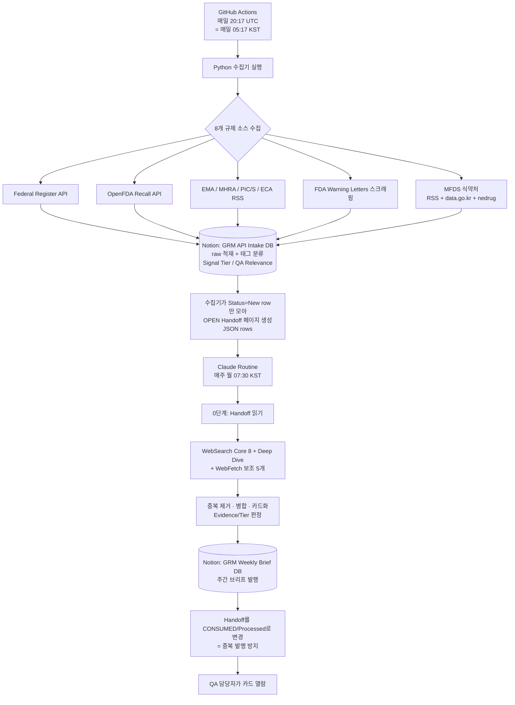

# GRM 시스템 명세서 (System Spec)

> **GRM = Global Regulatory Monitor.** 글로벌·국내(식약처) 제약 GMP/품질 규제 신호를 자동으로 수집·요약해, 한국 제약사 QA 담당자가 "규제가 어떻게 바뀌고 있고 우리가 무엇을 확인해야 하는지"를 카드 형태로 빠르게 파악하도록 돕는 자동화 다이제스트 시스템.
>
> 이 문서는 저장소의 `README.md` 를 **대체** 하는 단일 시스템 명세서입니다. (기존 README는 제거됨)

| 문서 메타 | 값 |
|---|---|
| 문서 버전 | `v1.1` (저장소 폴더 구조 섹션 추가) |
| 최종 수정일 | 2026-06-02 |
| 기준 시스템 버전 | `origin/main` `34ffe3b` (PL-10 handoff 멱등성 머지 반영) · Routine 프롬프트 `v15.6.3` |
| 코드 저장소 | https://github.com/MINHOYEOM/grm-api-intake |
| 발행 위치 | Notion `Global Regulatory Monitor` 부모 페이지 하위 |

---

## 0. 이 문서를 쓰는 법 (유지 규칙)

이 문서는 **"살아있는 명세서"** 입니다. 한 번 쓰고 끝내는 게 아니라, 시스템이 바뀔 때마다 같이 갱신합니다.

- **큰 틀 위주로 갱신한다.** 자잘한 버그 수정·문구 변경은 코드 커밋/프롬프트 버전으로 충분합니다. 이 문서는 **구조·소스·단계가 바뀌는 "큰 변경"** 만 반영합니다. (예: 새 규제 소스 추가, 새 Phase 진입, 데이터 흐름 변경)
- **변경은 해당 섹션 안에 기록한다.** 각 섹션 끝의 `📝 변경 이력` 표에 한 줄 추가합니다. 별도의 통합 changelog는 두지 않습니다.
- **상단 "문서 메타" 의 버전·수정일·기준 버전** 을 같이 갱신합니다.
- **파일·폴더가 추가·이동·삭제되면 `4.1 저장소 폴더 구조` 트리를 함께 갱신합니다.** (이 문서가 폴더 구조의 단일 기준)
- 변경 이력 한 줄 형식: `날짜 · 무엇이 어떻게 바뀌었나 · (연관 커밋/프롬프트 버전)`

> 이 문서의 목적은 ① 개발 중 기준점, ② 다음 작업 때 진행 정도 확인, ③ 추후 최종 사용자 안내문 제작의 토대입니다.

---

## 1. 시스템 개요 · 목적

### 1.1 무엇을 하나
GRM은 전 세계 주요 규제기관과 한국 식약처(MFDS)의 **제약 제조·품질(GMP/QA) 관련 규제 신호** 를 자동으로 모읍니다. 모은 정보를 그대로 던져주는 게 아니라, 사람이 빠르게 읽을 수 있는 **카드형 요약** 으로 가공해 매주 Notion에 발행합니다. 사용자는 카드를 보고 (1) 규제가 어떻게 변하는지 인지하고, (2) 우리 QA가 무엇을 점검해야 하는지 파악하며, (3) 반복적으로 보면서 규제 흐름에 대한 학습 효과를 얻습니다.

### 1.2 왜 만드나 (해결하는 문제)
규제 정보는 FDA·EMA·MHRA·PIC/S·ICH·TGA·식약처 등 **출처가 흩어져 있고**, 매주 사람이 일일이 확인하기에는 양이 많고 영문 원문도 부담입니다. GRM은 이 모니터링을 자동화하고, 핵심만 한국어로 요약하되 **원문 링크(듀얼 링크)** 를 항상 함께 제공해 신뢰성과 추적성을 유지합니다.

### 1.3 핵심 설계 원칙
- **원문 우선·추적 가능:** 모든 카드에 정보 출처(📰)와 공식 원본(📎) 두 링크를 붙입니다. 1차 공식문서 직접 확인 항목(Evidence A)만 원문을 인용(quote)합니다.
- **사실과 해석의 분리:** 객관적 사실과 AI 해석(노란색 '시사점')을 시각적으로 분리합니다.
- **신뢰도 등급화:** 모든 카드에 Evidence Level(A/B/C)과 Signal Tier(1/2/3)를 표기합니다.
- **장애에 강하게(Graceful degradation):** 수집기가 실패해도 Routine은 WebSearch 단독 모드로 계속 동작합니다.

### 1.4 대상 사용자
경구 고형제(정제) 중심 한국 제약사의 **QA 담당자**. 글로벌 규제 변화와 국내 GMP 제조/품질 신호(실태조사·행정처분·회수 등)를 함께 모니터링합니다.

#### 📝 변경 이력 — 개요·목적
| 날짜 | 변경 내용 |
|---|---|
| 2026-06-02 | 최초 작성 (현재 시스템 기준 정리) |

---

## 2. 풀스택 구성

GRM은 크게 **5개 계층** 으로 이루어집니다. 무거운 서버 없이, GitHub Actions(연산) + Notion(저장·표시) + Claude(분석·생성)를 조합한 구조입니다.

| 계층 | 역할 | 사용 기술 / 위치 |
|---|---|---|
| ① 수집(Collector) | 8개 규제 소스에서 원시 데이터를 가져옴 | Python 3.12 (`requests`, `PyMuPDF`) |
| ② 실행·스케줄(Runtime) | 수집기를 정해진 시각에 자동 실행 | GitHub Actions (`ubuntu-latest`, cron) |
| ③ 저장(Staging) | 수집한 raw 데이터 + 분류 태그를 저장 | Notion DB — `GRM API Intake` |
| ④ 분석·생성(Routine) | 저장된 신호를 읽어 카드형 다이제스트로 가공 | Claude (Anthropic) + MCP 도구 |
| ⑤ 발행(Publish) | 완성된 주간 브리프를 사람에게 보여줌 | Notion DB — `🌐 GRM Weekly Brief` |

### 2.1 계층별 상세

**① 수집 — Python 수집기**
순수 Python 스크립트 묶음입니다. 외부 의존성은 HTTP 클라이언트 `requests` 와 PDF 파서 `PyMuPDF`(식약처 실태조사 결과 PDF용) 둘뿐으로 가볍게 유지합니다. 공통 HTTP 로직(재시도, 429 Retry-After 백오프, JSON/XML 파싱)은 `grm_common.py` 로 분리되어 모든 수집기가 공유합니다.

**② 실행·스케줄 — GitHub Actions**
서버를 직접 운영하지 않고 GitHub의 무료 러너에서 주기 실행합니다. 워크플로우(`grm-intake.yml`, 이름 `GRM API Intake (Daily)`)는 **매일 20:17 UTC(= 매일 05:17 KST, cron `17 20 * * *`)** 에 자동 실행되며, 수동 실행(`workflow_dispatch`)으로 dry-run·수집 윈도우·소스별 활성화(`ENABLE_*`) 조정도 가능합니다. 실패하면 자동으로 GitHub Issue를 생성합니다. 비밀값(Notion 토큰 등)은 GitHub Secrets에만 보관합니다.

**③ 저장 — Notion `GRM API Intake` DB (Staging)**
수집기가 가져온 모든 항목이 1차로 쌓이는 **임시 적재(staging) 데이터베이스** 입니다. 각 행(row)에는 분류 태그(Source, Signal Tier, QA Relevance, Evidence Candidate 등)가 붙고, 페이지 본문에는 **원본 API 응답 JSON 전체** 가 보존됩니다(Evidence A 재검증용). 별도의 외부 DB(Postgres 등) 없이 Notion 자체를 DB로 사용하는 것이 이 시스템의 특징입니다.

**④ 분석·생성 — Claude Routine**
주간 Routine은 Claude(Anthropic)가 긴 프롬프트(현재 `v15.6.3`)에 따라 수행합니다. Claude는 세 가지 MCP 도구를 사용합니다: **Notion MCP**(Intake 읽기 + 브리프 쓰기), **WebSearch**(이벤트 탐지, 주 9회 한도), **WebFetch**(지정된 5개 보조 출처 콘텐츠 흡수). Claude가 직접 공식 API를 호출하지는 않습니다(클라우드 egress 차단 → 수집기에 위임).

**⑤ 발행 — Notion `🌐 GRM Weekly Brief` DB**
완성된 주간 다이제스트가 페이지로 발행되는 곳. 사용자가 실제로 읽는 최종 산출물입니다.

### 2.2 두 개의 Notion 데이터베이스
둘 다 `Global Regulatory Monitor` 부모 페이지 하위에 있습니다.

| DB | 역할 | ID |
|---|---|---|
| `GRM API Intake` | 수집 staging (기계가 적재) | `7784c71fb7b343749b2bee5d04db7926` |
| `🌐 GRM Weekly Brief` | 주간 발행물 (사람이 읽음) | `3653142f-dc11-8049-806d-e0a779cafd90` |

`🌐 GRM Weekly Brief` DB의 속성은 `이름`(제목) · `검색 기간`(text) · `발행일`(date) · `출처 기관`(멀티셀렉트) · `카테고리`(멀티셀렉트: Warning Letter / Guidance / Guideline / Other)이며, 갤러리·테이블·카테고리별·기관별 뷰를 제공합니다. ⚠️ 현재 `출처 기관` 옵션은 FDA·EMA·MHRA·PIC/S·ICH·WHO·Health Canada 7종으로, **MFDS(식약처) 옵션이 없습니다** — 국내 카드 발행 시 기관 태그가 비게 되는 경미한 갭(개선 후보).

#### 📝 변경 이력 — 풀스택
| 날짜 | 변경 내용 |
|---|---|
| 2026-06-02 | 최초 작성. 5계층(수집/실행/저장/분석/발행) 구조 정리 |
| 2026-06-02 | 실행 계층 정정: 워크플로우가 **매일(Daily, cron `17 20 * * *`)** 실행임을 `origin/main` 으로 확인·반영 |

---

## 3. 작동 방식 · 데이터 흐름

### 3.1 전체 흐름도



### 3.2 단계별 설명

**1단계 — 수집 (매일 05:17 KST, GitHub Actions)**
수집기가 **매일** 8개 소스를 호출해 최근 항목을 가져옵니다(기본 윈도우 7일). 각 항목에 대해 수집기가 1차로 **Signal Tier(1~3)** 와 **QA Relevance(Likely/Possible/Unrelated/Pending)** 를 휴리스틱으로 자동 분류해 Notion `GRM API Intake` DB에 `Status=New` 로 적재합니다. 페이지 본문에는 원본 JSON 전체를 보존합니다. (수집은 매일, 발행은 주간이므로 한 주간 쌓인 New 항목이 누적되었다가 월요일 Routine이 한 번에 처리합니다.)

**2단계 — Handoff 생성 (멱등성 게이트)**
수집기는 Notion API 속성 필터로 `Status=New` 인 항목만 모아 `OPEN GRM Routine Handoff {날짜}` 라는 인계(handoff) 페이지를 만듭니다. 본문은 `rows[]` 를 담은 JSON입니다. 이것이 **Routine이 읽을 유일한 입력 큐** 입니다.

**3단계 — 분석·생성 (매주 월 07:30 KST, Claude Routine)**
Claude가 handoff의 `rows[]` 만 읽어(0단계), 이어서 WebSearch(Core 8개 슬롯 + Deep Dive 1개, 주 9회 한도)와 WebFetch(지정 보조 출처 5개 URL)로 추가 탐지·보강을 합니다. 그 다음 Intake/Search/Fetch에서 나온 동일 이벤트를 **중복 제거·병합** 하고, 13개 카테고리 필터·Recall 3-tier 규칙 등을 적용해 **카드** 로 만듭니다.

**4단계 — 발행**
완성된 다이제스트를 `🌐 GRM Weekly Brief` DB에 새 페이지로 발행합니다. 글로벌 섹션(🌐)과 국내 식약처 섹션(🇰🇷)을 2단으로 나눠 구성합니다.

**5단계 — 멱등성 마감**
발행이 끝나면 handoff를 `CONSUMED.../Status=Processed` 로 바꿉니다. 같은 날 Routine을 두 번 돌려도 이미 처리된 항목을 다시 카드화하지 않도록 막는 장치입니다(PL-10에서 도입).

### 3.3 핵심 개념

- **Signal Tier (신호 강도):** Tier 3(우선 카드화, 고위험) / Tier 2(학습·참고) / Tier 1(모니터링 로그만). 수집기가 1차 부여하고 Routine이 교차 판단합니다.
- **Evidence Level (근거 등급):** A(1차 공식문서 직접 확인 — 원문 quote 허용) / B(공식 인덱스 + 보조 출처) / C(보조 출처 단독) / D(예정·진행 중 Watch 항목).
- **듀얼 링크:** 모든 카드에 📰 정보 출처(실제로 콘텐츠를 가져온 URL) + 📎 공식 원본(규제기관 사이트 URL)을 함께 표기. 공식 원본은 L1(개별 직링크)→L2(인덱스)→L3(기관 홈) 순으로 fallback.
- **Graceful degradation:** 수집기/Notion 장애로 handoff가 없거나 0건이면, Routine은 WebSearch 단독(v14.5) 모드로 자동 강등해 계속 동작합니다.

### 3.4 수집 대상 8개 소스

| # | 소스 | 채널 | 수집기 |
|---|---|---|---|
| 1 | Federal Register (FDA 규칙·고시) | 공식 API | `collect_intake.py` |
| 2 | OpenFDA Drug Enforcement (회수) | 공식 API | `collect_intake.py` |
| 3 | EMA (유럽) | RSS | `collect_intake.py` |
| 4 | MHRA Inspectorate (영국) | RSS | `collect_intake.py` |
| 5 | PIC/S | RSS | `collect_intake.py` |
| 6 | ECA Academy | RSS | `collect_intake.py` |
| 7 | FDA Warning Letters | 웹 스크래핑 | `collect_intake.py` |
| 8 | MFDS 식약처 (지침·고시·입법예고·안전성서한·행정처분·회수·GMP 실태조사) | RSS + data.go.kr API + nedrug 스크래핑 | `collect_mfds*.py` |

> 보조: `collect_search.py` 가 Brave Search 기반 보충 탐지를 담당(특정 슬롯 한정, `ENABLE_SEARCH` 기본 비활성). MFDS는 RSS 외에 회수·행정처분·GMP 실태조사 하위 수집기(`collect_mfds_recall/admin_action/gmp_inspection.py`, `ENABLE_MFDS_*` 기본 활성)로 세분화되어 있습니다.

#### 📝 변경 이력 — 작동 방식·데이터 흐름
| 날짜 | 변경 내용 |
|---|---|
| 2026-06-02 | 최초 작성. Intake-first + Handoff 멱등성 흐름(v15.6.3) 기준 |
| 2026-06-02 | "매일 수집 / 주간 발행" 모델로 1단계 정정(매일 New 누적 → 월요일 Routine 일괄 처리). 다이어그램·소스 표 반영 |

---

## 4. 구성 요소 레퍼런스 (개발용)

### 4.1 저장소 폴더 구조

> 파일·폴더가 추가/이동/삭제되면 이 트리를 갱신한다. (구조의 단일 기준)

```
v15.0-implementation/
├─ GRM_SYSTEM.md          # 시스템 대표 문서(이 파일, README 대체)
│
├─ collect_intake.py      # 메인 수집기 = 오케스트레이터(워크플로우가 호출하는 단일 진입점)
├─ collect_mfds.py        # 식약처 RSS 게시판
├─ collect_mfds_admin_action.py     # 식약처 행정처분
├─ collect_mfds_gmp_inspection.py   # 식약처 GMP 실태조사
├─ collect_mfds_recall.py           # 식약처 회수·판매중지
├─ collect_search.py      # Brave 보조 검색
├─ grm_common.py          # 공통 HTTP/재시도 헬퍼
├─ probe_*.py             # 개발용 탐침 스크립트(운영 무관)
│
├─ setup.sh / setup.ps1   # 최초 셋업 스크립트
├─ requirements.txt       # 파이썬 의존성
├─ .env.example           # 환경변수 예시
├─ .gitignore             # git 제외 목록(/archive/ 포함)
├─ .github/workflows/grm-intake.yml   # 매일 자동 수집 워크플로우
│
├─ docs/                  # 현행 문서 (git 추적)
│  ├─ notion_intake_db_schema.md      # Intake DB 스키마
│  ├─ setup_guide.md                  # 셋업 가이드
│  ├─ GRM_session_decisions.md        # 의사결정 로그
│  ├─ GRM_점검_통합punchlist_….md      # 최신 점검 목록
│  ├─ prompts/            # 현행 Routine 프롬프트·카드포맷 표준·검증 프롬프트
│  └─ specs/              # 구현된 수집기 스펙
│
└─ archive/               # 옛/완료 문서 (로컬·git 히스토리에 보존, 추적 제외)
   ├─ prompts-old/        # 옛 버전 프롬프트(v15.0/v15.5/patch)
   ├─ handoffs-done/      # 완료된 의뢰·핸드오프
   └─ point-in-time/      # 1회성 산출물
```

구조 원칙: **코드(`.py`)는 루트에 평면 유지**(같은 폴더 import 의존 → 이동 금지). 문서만 폴더로 분류. **git은 현행(루트 + `docs/`)만 추적**하고 `archive/`는 로컬·히스토리에만 보존. `__pycache__`(파이썬 캐시)·`.claude`(설정)는 git 대상이 아닌 로컬 전용.

### 4.2 코드 파일
| 파일 | 역할 |
|---|---|
| `collect_intake.py` | **오케스트레이터 겸 메인 수집기.** FR + OpenFDA + RSS 4종(EMA·MHRA·PIC/S·ECA) + FDA WL을 직접 수집하고, `ENABLE_*` 플래그에 따라 MFDS·Brave 하위 수집기를 import·실행. Intake 적재 + Handoff 생성까지 담당 (워크플로우는 이 파일 하나만 호출) |
| `collect_mfds.py` | 식약처 RSS 7개 게시판 수집 (지침·고시·입법예고·안전성서한 등) |
| `collect_mfds_admin_action.py` | 식약처 행정처분 (data.go.kr) |
| `collect_mfds_gmp_inspection.py` | 식약처 GMP 실태조사 결과 (nedrug, PDF 본문 파싱) |
| `collect_mfds_recall.py` | 식약처 회수·판매중지 |
| `collect_search.py` | Brave Search 보조 탐지 |
| `grm_common.py` | 공통 HTTP/429/재시도/XML·JSON 파싱 헬퍼 |
| `probe_*.py` | 개발용 소스 탐침 스크립트 (운영 무관) |
| `.github/workflows/grm-intake.yml` | 스케줄·실행 워크플로우 |
| `notion_intake_db_schema.md` | Intake DB 스키마 문서 |
| `GRM_Prompt_v15.6.md` 등 | Routine 프롬프트 (Claude가 사용) |

### 4.3 비밀값(Secrets) · 기능 플래그(Variables)

**Secrets (값):** `NOTION_TOKEN` · `NOTION_DATABASE_ID` · `OPENFDA_API_KEY`(선택) · `BRAVE_API_KEY`(검색용) · `DATA_GO_KR_SERVICE_KEY`(식약처 회수 `15059114`·행정처분 `15058457` API) · `DATA_GO_KR_KEY`(법제처 ogLmPp).

**기능 플래그 (`vars.ENABLE_*`):**

| 플래그 | 운영(GitHub Actions) 기본 | 로컬 `.env.example` 기본 |
|---|---|---|
| `ENABLE_MFDS` / `ENABLE_MFDS_RECALL` / `ENABLE_MFDS_ADMIN` / `ENABLE_MFDS_GMP_INSPECTION` | `true` (활성) | `false` |
| `ENABLE_SEARCH` (Brave) · `ENABLE_SCRAPE` · `ENABLE_MOLEG_API` | `false` (비활성) | `false` |

> 운영 기본값은 워크플로우 `grm-intake.yml` 의 `vars.* || 'true/false'` fallback으로 정해집니다. 로컬 dry-run용 `.env.example` 은 모두 `false` 로 시작합니다(샘플).

### 4.4 Intake DB 주요 속성 (라이브 확인 2026-06-02)
`Source`(12종, MFDS·GRM Handoff 포함) · `Type or Class`(약 29종) · `Signal Tier` · `QA Relevance` · `OSD Relevance` · `Evidence Candidate` · `Language`(KO/EN) · `Region/Jurisdiction` · `Site Country`(제조소 소재국, 관할과 분리) · `Status`(New/Processed/Skipped/Error) · `Run Date (KST)` · `API Query` 등. 페이지 본문에 원본 JSON 보존.

#### 📝 변경 이력 — 구성 요소
| 날짜 | 변경 내용 |
|---|---|
| 2026-06-02 | 최초 작성. 코드 파일·Secrets·DB 속성 라이브 검증 반영 |
| 2026-06-02 | `4.1 저장소 폴더 구조` 트리 추가(docs/·archive/ 분류 반영) + 유지 규칙에 "구조 변경 시 트리 갱신" 추가 |

---

## 5. 로드맵 (단계별 구성 이력 + 현재 + 향후)

GRM은 "단순 수집 → 다소스 확대 → 국내 식약처 → 자가점검"으로 단계적으로 확장해 왔습니다. 큰 틀에서의 진행 단계는 아래와 같습니다.

| Phase | 목표 | 상태 | 핵심 내용 |
|---|---|---|---|
| **Phase 1** | 기반 구축 | ✅ 완료 | Federal Register + OpenFDA Recall → Notion 적재. GitHub Actions 자동화(당시 주간 → 이후 매일로 전환). Routine v15.0 연동 |
| **Phase 2a** | 글로벌 다소스 확대 | ✅ 완료 | EMA·MHRA·PIC/S·ECA RSS + FDA Warning Letters 스크래핑 + Brave Search 보조. Evidence/Source Type 태깅 도입 |
| **Phase 2b-1** | 국내(MFDS) 진입 | ✅ 완료 | 식약처 RSS 7개 게시판(지침·고시·입법예고·안전성서한 등). `collect_mfds.py` 분리, 한국어 휴리스틱, Language/Region 필드 |
| **Phase 2b-2** | 국내 제조/품질 심화 | ✅ 완료(운영 기본 활성) | 행정처분·회수·GMP 실태조사(지적사항 본문 요약). 국내/글로벌 2단 섹션, Site Country 분리. 매일 워크플로우에 하위 수집기 기본 on |
| **Phase 2c** | 자가점검(차별화) | 🔜 일부 착수 | "이 규제 신호가 우리 공정/SOP에 해당하는가" 자가점검. `Self-Check Required` 필드 도입(현재 휴면), Applicability 트리거 설계 예정 |

### 5.1 현재 개발 단계 (2026-06-02 기준)
수집과 카드 생성은 **동작하는 상태** 이며, 2026-06-01 라이브 실행에서 국내 섹션·소재국 fallback·지적사항 요약·듀얼 링크가 정상 렌더됨을 확인했습니다. 카드 포맷 표준 자체는 `v15.6.2` 에서 확정되었고, 남은 것은 **카드 내용의 완성도와 일부 오류를 다듬는** 상용화 전 마감 작업입니다.

### 5.2 알려진 이슈 / 잔여 작업
| ID | 내용 | 상태 |
|---|---|---|
| PL-10 | Handoff 멱등성(중복 발행 방지) — `main` 머지 완료(`34ffe3b`). 2주 연속 실행 검증 진행 중(검증 프롬프트 존재) | 🟡 검증 진행 |
| PL-7 | 수집기 부재 소스(품목허가 변경·제조방법/규격, DMF 등 A축 확장) | 🔲 별도 트랙 |
| PL-8 | 보조 출처 WebFetch 403 상시 발생(PIC/S·MHRA·ECA·RAPS·EPR) | 🔲 별도 트랙 |
| Q5 | 카드 포맷 표준 — `v15.6.2` 에서 확정(번호 없는 헤더·규제기관 배지·Signal 방향 표기) | ✅ 완료 |
| — | 카드 내용 완성도·잔여 오류 다듬기(상용화 전 마감 작업) | 🟡 진행 |
| — | Weekly Brief DB `출처 기관` 멀티셀렉트에 MFDS 옵션 부재 → 국내 카드 기관 태그 누락 | 🔲 경미·개선 후보 |

### 5.3 향후 방향
- **Phase 2c 완성** 이 핵심 차별점: 수집을 넘어 "우리 SOP/공정 해당 여부"까지 짚어주는 자가점검(`Self-Check Required`·Applicability).
- 카드 내용 완성도 안정화 + PL-10 멱등성 2주 연속 검증 통과 후 상용화 준비.
- 수집 부재 소스(PL-7) 점진적 확장, Weekly Brief DB `출처 기관` MFDS 옵션 추가.

#### 📝 변경 이력 — 로드맵
| 날짜 | 변경 내용 |
|---|---|
| 2026-06-02 | 최초 작성. Phase 1~2c 히스토리 + 현재 단계·잔여 이슈 정리 |
| 2026-06-02 | Phase 2b-2 "완료(운영 기본 활성)"로 갱신, PL-10 "main 머지 완료(검증 진행)"로 갱신 |
| 2026-06-02 | 폴더·`origin/main` 정밀 재검토 반영: 수집 주기 매일 확정, 단일 오케스트레이터 구조, 플래그 기본값, Weekly Brief DB 속성·MFDS 태그 갭, Q5(카드 포맷 v15.6.2) 완료 |
