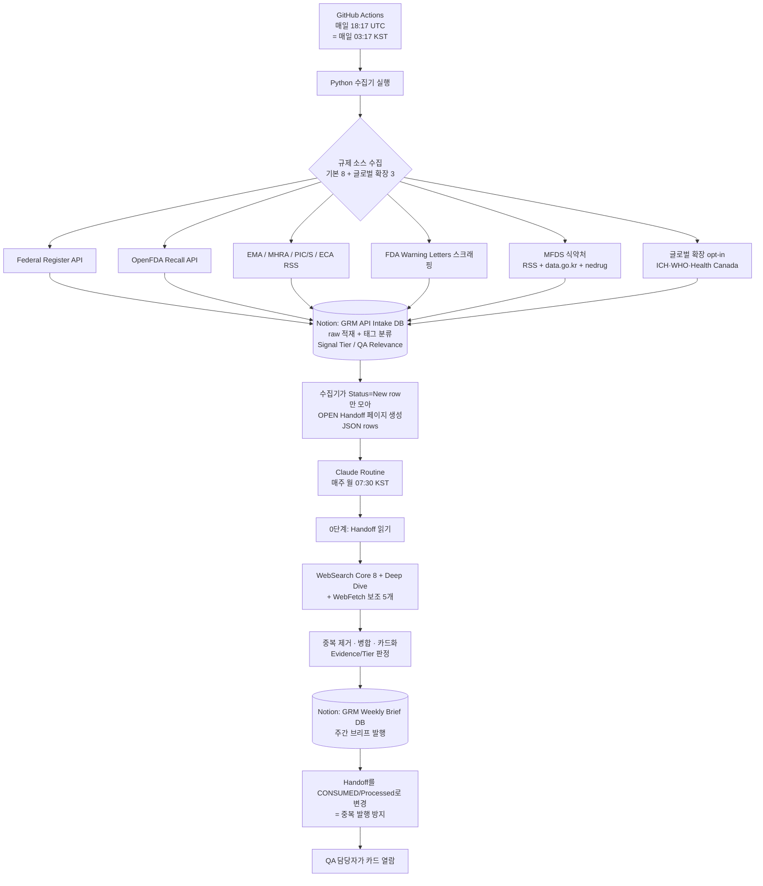

# GRM 시스템 명세서 (System Spec)

> **GRM = Global Regulatory Monitor.** 글로벌·국내(식약처) 제약 GMP/품질 규제 신호를 자동으로 수집·요약해, 한국 제약사 QA 담당자가 "규제가 어떻게 바뀌고 있고 우리가 무엇을 확인해야 하는지"를 카드 형태로 빠르게 파악하도록 돕는 자동화 다이제스트 시스템.
>
> 이 문서는 저장소의 `README.md` 를 **대체** 하는 단일 시스템 명세서입니다. (기존 README는 제거됨)

| 문서 메타 | 값 |
|---|---|
| 문서 버전 | `v1.10` (제형 확장 착수: 경구 고형제 → 회사 생산 제형 전체[경구고형·경구액상·무균주사·바이오]. compute_modality·Modality 속성·프롬프트 v15.8·제형별 발행) |
| 최종 수정일 | 2026-06-04 |
| 현재 상태 | 매일 수집/Notion 적재 동작, GitHub Actions 내부 health check P1 구현, P1 글로벌 3종은 기본 off 상태로 라이브 검증 대기. **제형 확장(Phase 4) 코드·프롬프트 완료(`feature/multi-modality` 브랜치) — `ENABLE_MODALITY_TAG` 기본 off, Notion `Modality` 속성 생성 + 라이브 검증 대기.** Routine 프롬프트는 v15.8 로 개선(다음 라이브 Routine에서 검증 예정) |
| Active phase | Phase 4(제형 확장) 코드·프롬프트 완료·검증 대기 + Phase 3(P1) 글로벌 확장 검증 + Routine 프롬프트 v15.8 검증 |
| 주요 enabled flags | 운영 기본: `ENABLE_MFDS/RECALL/ADMIN/GMP_INSPECTION=true`, `ENABLE_ICH/WHO/HC=false`, `ENABLE_SEARCH/SCRAPE/MOLEG_API=false`, `ENABLE_MODALITY_TAG=false`(제형 태그, Notion 속성 생성 후 활성 예정) |
| 기준 시스템 버전 | `origin/main` `705ec60`(setup 갱신·노이즈 필터·테스트 머지) + 로컬 작업(grm-ci.yml·가스 필터 오탐 수정) + **`feature/multi-modality` 브랜치(제형 확장: collect_intake compute_modality·키워드/Tier 확장·Modality 속성 게이트·test_modality, 프롬프트 v15.8)** · Routine 프롬프트 `v15.8`(v15.7 은 `archive/prompts-old/` 로 이관) |
| 코드 저장소 | https://github.com/MINHOYEOM/grm-api-intake |
| 발행 위치 | Notion `Global Regulatory Monitor` 부모 페이지 하위 |

---

## 0. 이 문서를 쓰는 법 (유지 규칙)

이 문서는 **"살아있는 명세서"** 입니다. 한 번 쓰고 끝내는 게 아니라, 시스템이 바뀔 때마다 같이 갱신합니다.

- **큰 틀 위주로 갱신한다.** 자잘한 버그 수정·문구 변경은 코드 커밋/프롬프트 버전으로 충분합니다. 이 문서는 **구조·소스·단계가 바뀌는 "큰 변경"** 만 반영합니다. (예: 새 규제 소스 추가, 새 Phase 진입, 데이터 흐름 변경)
- **변경은 해당 섹션 안에 기록한다.** 각 섹션 끝의 `📝 변경 이력` 표에 한 줄 추가합니다. 별도의 통합 changelog는 두지 않습니다.
- **상단 "문서 메타" 의 버전·수정일·기준 버전** 을 같이 갱신합니다.
- **파일·폴더가 추가·이동·삭제되면 `4.1 저장소 폴더 구조` 트리를 함께 갱신합니다.** (이 문서가 폴더 구조의 단일 기준)
- 변경 이력 한 줄 형식: `날짜 · 무엇이 어떻게 바뀌었나 · (연관 커밋/프롬프트 버전)`

> 이 문서의 목적은 ① 개발 중 기준점, ② 다음 작업 때 진행 정도 확인, ③ 추후 최종 사용자 안내문 제작의 토대입니다.

---

## 1. 시스템 개요 · 목적

### 1.1 무엇을 하나
GRM은 전 세계 주요 규제기관과 한국 식약처(MFDS)의 **제약 제조·품질(GMP/QA) 관련 규제 신호** 를 자동으로 모읍니다. 모은 정보를 그대로 던져주는 게 아니라, 사람이 빠르게 읽을 수 있는 **카드형 요약** 으로 가공해 매주 Notion에 발행합니다. 사용자는 카드를 보고 (1) 규제가 어떻게 변하는지 인지하고, (2) 우리 QA가 무엇을 점검해야 하는지 파악하며, (3) 반복적으로 보면서 규제 흐름에 대한 학습 효과를 얻습니다.

### 1.2 왜 만드나 (해결하는 문제)
규제 정보는 FDA·EMA·MHRA·PIC/S·ICH·TGA·식약처 등 **출처가 흩어져 있고**, 매주 사람이 일일이 확인하기에는 양이 많고 영문 원문도 부담입니다. GRM은 이 모니터링을 자동화하고, 핵심만 한국어로 요약하되 **원문 링크(듀얼 링크)** 를 항상 함께 제공해 신뢰성과 추적성을 유지합니다.

### 1.3 핵심 설계 원칙
- **원문 우선·추적 가능:** 모든 카드에 정보 출처(📰)와 공식 원본(📎) 두 링크를 붙입니다. 1차 공식문서 직접 확인 항목(Evidence A)만 원문을 인용(quote)합니다.
- **사실과 해석의 분리:** 객관적 사실과 AI 해석(노란색 '시사점')을 시각적으로 분리합니다.
- **신뢰도 등급화:** 모든 카드에 Evidence Level(A/B/C)과 Signal Tier(1/2/3)를 표기합니다.
- **장애에 강하게(Graceful degradation):** 수집기가 실패해도 Routine은 WebSearch 단독 모드로 계속 동작합니다.

### 1.4 대상 사용자
**다양한 제형을 생산하는 한국 제약사의 QA 담당자.** 회사 생산 제형은 경구 고형제(단일제·복합제), 경구 액상, 무균 주사제(항암 주사 포함), 바이오/바이오시밀러·성장호르몬 등 생물학적제제를 포괄합니다(의료기기는 범위 밖). 글로벌 규제 변화와 국내 GMP 제조/품질 신호(실태조사·행정처분·회수 등)를 제형 전반에 걸쳐 함께 모니터링합니다. (2026-06-04 제형 확장 이전에는 경구 고형제 중심.)

#### 📝 변경 이력 — 개요·목적
| 날짜 | 변경 내용 |
|---|---|
| 2026-06-02 | 최초 작성 (현재 시스템 기준 정리) |
| 2026-06-04 | **제형 확장**: 대상 범위를 경구 고형제 중심 → 회사 생산 제형 전체(경구고형·경구액상·무균주사·바이오/바이오시밀러)로 확대(Phase 4). 의료기기는 제외 유지 |

---

## 2. 풀스택 구성

GRM은 크게 **5개 계층** 으로 이루어집니다. 무거운 서버 없이, GitHub Actions(연산) + Notion(저장·표시) + Claude(분석·생성)를 조합한 구조입니다.

| 계층 | 역할 | 사용 기술 / 위치 |
|---|---|---|
| ① 수집(Collector) | 11개 규제 소스에서 원시 데이터를 가져옴 (기본 8 + 글로벌 확장 ICH·WHO·HC, opt-in) | Python 3.12 (`requests`, `PyMuPDF`) |
| ② 실행·스케줄(Runtime) | 수집기를 정해진 시각에 자동 실행 | GitHub Actions (`ubuntu-latest`, cron) |
| ③ 저장(Staging) | 수집한 raw 데이터 + 분류 태그를 저장 | Notion DB — `GRM API Intake` |
| ④ 분석·생성(Routine) | 저장된 신호를 읽어 카드형 다이제스트로 가공 | Claude (Anthropic) + MCP 도구 |
| ⑤ 발행(Publish) | 완성된 주간 브리프를 사람에게 보여줌 | Notion DB — `🌐 GRM Weekly Brief` |

### 2.1 계층별 상세

**① 수집 — Python 수집기**
순수 Python 스크립트 묶음입니다. 외부 의존성은 HTTP 클라이언트 `requests` 와 PDF 파서 `PyMuPDF`(식약처 실태조사 결과 PDF용) 둘뿐으로 가볍게 유지합니다. 공통 HTTP 로직(재시도, 429 Retry-After 백오프, JSON/XML 파싱)은 `grm_common.py` 로 분리되어 모든 수집기가 공유합니다.

**② 실행·스케줄 — GitHub Actions**
서버를 직접 운영하지 않고 GitHub의 무료 러너에서 주기 실행합니다. 워크플로우(`grm-intake.yml`, 이름 `GRM API Intake (Daily)`)는 **매일 18:17 UTC(= 매일 03:17 KST, cron `17 18 * * *`)** 에 자동 실행되며, 수동 실행(`workflow_dispatch`)으로 dry-run·수집 윈도우·소스별 활성화(`ENABLE_*`) 조정도 가능합니다. 수집기는 실행 말미에 `grm-health.json` 과 `GITHUB_STEP_SUMMARY` health 섹션을 생성합니다. 실패(failure)는 workflow exit 1과 KST 실행일 기준 GitHub Issue로, 경고(warning)는 exit 0을 유지하면서 고정 제목 `GRM Intake 운영 경고` Issue에 누적 comment로 남깁니다. 비밀값(Notion 토큰 등)은 GitHub Secrets에만 보관합니다.

**③ 저장 — Notion `GRM API Intake` DB (Staging)**
수집기가 가져온 모든 항목이 1차로 쌓이는 **임시 적재(staging) 데이터베이스** 입니다. 각 행(row)에는 분류 태그(Source, Signal Tier, QA Relevance, Evidence Candidate 등)가 붙고, 페이지 본문에는 **원본 API 응답 JSON 전체** 가 보존됩니다(Evidence A 재검증용). 별도의 외부 DB(Postgres 등) 없이 Notion 자체를 DB로 사용하는 것이 이 시스템의 특징입니다.

**④ 분석·생성 — Claude Routine**
주간 Routine은 Claude(Anthropic)가 긴 프롬프트(현재 `v15.8`)에 따라 수행합니다. Claude는 세 가지 MCP 도구를 사용합니다: **Notion MCP**(Intake 읽기 + 브리프 쓰기), **WebSearch**(이벤트 탐지, 주 9회 한도), **WebFetch**(지정된 5개 보조 출처 콘텐츠 흡수). Claude가 직접 공식 API를 호출하지는 않습니다(클라우드 egress 차단 → 수집기에 위임).

**⑤ 발행 — Notion `🌐 GRM Weekly Brief` DB**
완성된 주간 다이제스트가 페이지로 발행되는 곳. 사용자가 실제로 읽는 최종 산출물입니다.

### 2.2 두 개의 Notion 데이터베이스
둘 다 `Global Regulatory Monitor` 부모 페이지 하위에 있습니다.

| DB | 역할 | ID |
|---|---|---|
| `GRM API Intake` | 수집 staging (기계가 적재) | `7784c71fb7b343749b2bee5d04db7926` |
| `🌐 GRM Weekly Brief` | 주간 발행물 (사람이 읽음) | `3653142f-dc11-8049-806d-e0a779cafd90` |

`🌐 GRM Weekly Brief` DB의 속성은 `이름`(제목) · `검색 기간`(text) · `발행일`(date) · `출처 기관`(멀티셀렉트) · `카테고리`(멀티셀렉트: Warning Letter / Guidance / Guideline / Other)이며, 갤러리·테이블·카테고리별·기관별 뷰를 제공합니다. `출처 기관` 옵션은 FDA·EMA·MHRA·PIC/S·ICH·WHO·Health Canada 에 더해 **2026-06-04 에 MFDS·TGA·ECA 를 추가**해 총 10종이 됐습니다(Routine 프롬프트 v15.7 개선 시 함께 반영). ICH·WHO·Health Canada는 P1 전용 수집기로 채워지고, 이전에 비어 있던 **MFDS(식약처) 옵션 갭이 해소**되어 국내 카드의 기관 태그가 더 이상 비지 않습니다. Routine v15.7 은 그 주 카드에 등장한 모든 기관(국내 카드가 있으면 MFDS 포함)을 빠짐없이 태그하도록 지시합니다.

#### 📝 변경 이력 — 풀스택
| 날짜 | 변경 내용 |
|---|---|
| 2026-06-02 | 최초 작성. 5계층(수집/실행/저장/분석/발행) 구조 정리 |
| 2026-06-02 | 실행 계층 정정: 워크플로우가 **매일(Daily, cron `17 20 * * *`)** 실행임을 `origin/main` 으로 확인·반영 |
| 2026-06-02 | 수집 계층 소스 8개 → 11개(글로벌 확장 ICH·WHO·HC, opt-in). Weekly Brief `출처 기관`의 ICH·WHO·HC 옵션이 실제 수집기로 채워짐을 §2.2에 명시 |
| 2026-06-04 | 실행 계층에 운영 health check 추가: `grm-health.json`, step summary health 섹션, 실패 Issue 보강(KST 실행일·label 보장), warning Issue 누적 comment 방식 반영 |
| 2026-06-04 | cron `17 20` → `17 18 * * *`(03:17 KST)로 2h 앞당김 — scheduled run 실측 ~2.5h 지연(06-02/03)으로 월요일 Routine(07:30 KST)과 역전 위험 해소 |
| 2026-06-04 | FDA WL 식품/HACCP/FSVP/건기식 항목과 MFDS GMP 실태조사 의료용 고압가스 업체를 Intake 단계에서 제외하는 노이즈 필터 추가 |
| 2026-06-04 | Routine 프롬프트 `v15.6.3` → `v15.7` 개선(분석 계층). Weekly Brief `출처 기관` 멀티셀렉트에 MFDS·TGA·ECA 옵션 추가(7종→10종)로 §2.2 MFDS 태그 갭 해소 |
| 2026-06-04 | **제형 확장(Phase 4)**: 분석 계층 프롬프트 `v15.7` → `v15.8`(다제형 역할·백신/주사 제외규칙 재설계·Recall Tier 무균/바이오 확장·제형 배지·제형별 발행 그룹핑). 수집 계층은 소스 추가 없이 `compute_modality`(제형 1차 분류)·키워드/Tier 확장·Notion `Modality` 속성(게이트) 추가 |

---

## 3. 작동 방식 · 데이터 흐름

### 3.1 전체 흐름도



### 3.2 단계별 설명

**1단계 — 수집 (매일 03:17 KST, GitHub Actions)**
수집기가 **매일** 8개 소스를 호출해 최근 항목을 가져옵니다(기본 윈도우 7일). 각 항목에 대해 수집기가 1차로 **Signal Tier(1~3)** 와 **QA Relevance(Likely/Possible/Unrelated/Pending)** 를 휴리스틱으로 자동 분류해 Notion `GRM API Intake` DB에 `Status=New` 로 적재합니다. 페이지 본문에는 원본 JSON 전체를 보존합니다. (수집은 매일, 발행은 주간이므로 한 주간 쌓인 New 항목이 누적되었다가 월요일 Routine이 한 번에 처리합니다.)

경구 고형제 QA 다이제스트 가치가 낮은 명시적 노이즈는 Intake 전에 제외합니다. 현재 제외 기준은 FDA Warning Letter의 식품/HACCP/FSVP/건기식 도메인 항목과 MFDS GMP 실태조사의 의료용 고압가스 업체입니다.

**2단계 — Handoff 생성 (멱등성 게이트)**
수집기는 Notion API 속성 필터로 `Status=New` 인 항목만 모아 `OPEN GRM Routine Handoff {날짜}` 라는 인계(handoff) 페이지를 만듭니다. 본문은 `rows[]` 를 담은 JSON입니다. 이것이 **Routine이 읽을 유일한 입력 큐** 입니다.

**3단계 — 분석·생성 (매주 월 07:30 KST, Claude Routine)**
Claude가 handoff의 `rows[]` 만 읽어(0단계), 이어서 WebSearch(Core 8개 슬롯 + Deep Dive 1개, 주 9회 한도)와 WebFetch(지정 보조 출처 5개 URL)로 추가 탐지·보강을 합니다. 그 다음 Intake/Search/Fetch에서 나온 동일 이벤트를 **중복 제거·병합** 하고, 13개 카테고리 필터·Recall 3-tier 규칙 등을 적용해 **카드** 로 만듭니다.

**4단계 — 발행**
완성된 다이제스트를 `🌐 GRM Weekly Brief` DB에 새 페이지로 발행합니다. 글로벌 섹션(🌐)과 국내 식약처 섹션(🇰🇷)을 2단으로 나눠 구성합니다.

**5단계 — 멱등성 마감**
발행이 끝나면 handoff를 `CONSUMED.../Status=Processed` 로 바꿉니다. 같은 날 Routine을 두 번 돌려도 이미 처리된 항목을 다시 카드화하지 않도록 막는 장치입니다(PL-10에서 도입).

### 3.3 핵심 개념

- **Signal Tier (신호 강도):** Tier 3(우선 카드화, 고위험) / Tier 2(학습·참고) / Tier 1(모니터링 로그만). 수집기가 1차 부여하고 Routine이 교차 판단합니다.
- **Evidence Level (근거 등급):** A(1차 공식문서 직접 확인 — 원문 quote 허용) / B(공식 인덱스 + 보조 출처) / C(보조 출처 단독) / D(예정·진행 중 Watch 항목).
- **듀얼 링크:** 모든 카드에 📰 정보 출처(실제로 콘텐츠를 가져온 URL) + 📎 공식 원본(규제기관 사이트 URL)을 함께 표기. 공식 원본은 L1(개별 직링크)→L2(인덱스)→L3(기관 홈) 순으로 fallback.
- **Graceful degradation:** 수집기/Notion 장애로 handoff가 없거나 0건이면, Routine은 WebSearch 단독(v14.5) 모드로 자동 강등해 계속 동작합니다.

### 3.4 수집 대상 소스 (기본 8 + 글로벌 확장 3)

| # | 소스 | 채널 | 수집기 |
|---|---|---|---|
| 1 | Federal Register (FDA 규칙·고시) | 공식 API | `collect_intake.py` |
| 2 | OpenFDA Drug Enforcement (회수) | 공식 API | `collect_intake.py` |
| 3 | EMA (유럽) | RSS | `collect_intake.py` |
| 4 | MHRA Inspectorate (영국) | RSS | `collect_intake.py` |
| 5 | PIC/S | RSS | `collect_intake.py` |
| 6 | ECA Academy | RSS | `collect_intake.py` |
| 7 | FDA Warning Letters | 웹 스크래핑 | `collect_intake.py` |
| 8 | MFDS 식약처 (지침·고시·입법예고·안전성서한·행정처분·회수·GMP 실태조사) | RSS + data.go.kr API + nedrug 스크래핑 | `collect_mfds*.py` |
| 9 | **ICH** (Quality·Multidisciplinary 가이드라인·Public Consultations) | admin.ich.org 섹션 제목 스냅샷 | `collect_ich.py` (`ENABLE_ICH`, 기본 off) |
| 10 | **WHO Prequalification** (RSS 뉴스 + WHOPIR 공개 실사보고서 + NOC GMP 비순응) | RSS + extranet.who.int Drupal 페이지 | `collect_who.py` (`ENABLE_WHO`, 기본 off) |
| 11 | **Health Canada** (약품 recall·safety alert) | 오픈데이터 JSON | `collect_hc.py` (`ENABLE_HC`, 기본 off) |

> 보조: `collect_search.py` 가 Brave Search 기반 보충 탐지를 담당(특정 슬롯 한정, `ENABLE_SEARCH` 기본 비활성). MFDS는 RSS 외에 회수·행정처분·GMP 실태조사 하위 수집기(`collect_mfds_recall/admin_action/gmp_inspection.py`, `ENABLE_MFDS_*` 기본 활성)로 세분화되어 있습니다.
> 글로벌 확장(ICH·WHO·HC)은 모두 **기본 off**이며 `ENABLE_*` 또는 `--sources {ich,who,hc}` 로 단독 실행됩니다. ICH는 페이지가 정적 토픽 목록이라 Step/Revision 등 동적 정보는 Routine이 보강(하이브리드)합니다.
> **TGA(호주)는 검토 후 제외:** www.tga.gov.au가 비브라우저 fetch를 차단(WAF)하고 공식 API가 없으며, TGA가 **PIC/S를 따르므로 PIC/S 수집기로 상당 부분 커버**되어 가치 대비 비용이 낮음.

### 3.5 운영 모니터링 health check

운영 모니터링의 P1 기준은 **GitHub Actions 내부 health check** 입니다. 장기 운영의 핵심 알림은 수집 직후 같은 workflow에서 판정해야 하므로, Codex heartbeat는 보조 요약자(P2)로 둡니다.

- **단일 판정 지점:** `collect_intake.py` 의 `_evaluate_health()` 가 exit code·step summary·`grm-health.json`·Issue 본문이 공유하는 단일 health 판정 기준입니다. 기존 insert 실패/활성 소스 오류/핵심 소스 전부 실패/handoff 실패 판정을 중복 계층으로 만들지 않고 이 함수에 모았습니다.
- **Failure:** Notion insert 최종 실패, Routine handoff 실패, Federal Register+OpenFDA 동시 실패, Phase 1 비활성 실행에서 활성 소스 전체가 비일시 오류로 실패, `ENABLE_SEARCH=true` Brave 전체 오류, 활성 MFDS/ICH/WHO/HC 소스의 설정 오류·구조 변경·비일시 오류는 exit 1입니다. scheduled run에서는 날짜별 `GRM Intake 실패 — YYYY-MM-DD` Issue가 생성되며 health JSON의 failure finding이 본문에 들어갑니다.
- **Warning:** scheduled run에서 `ENABLE_MOLEG_API=true` 감지, MFDS RSS/nedrug GMP 실태조사 공개 endpoint의 timeout·connection reset·429·5xx·공개 페이지 403 같은 transient 오류, GMP 실태조사 첨부 manual-review 필요, GMP 페이지네이션 경고, FR/OpenFDA truncation, 미구현 `ENABLE_SCRAPE=true` 는 exit 0 warning입니다. scheduled run에서는 고정 제목 `GRM Intake 운영 경고` Issue를 찾고, 열려 있으면 comment를 누적합니다.
- **0건 판정:** MHRA/PIC/S 등 저빈도 소스는 일일 0건이 정상일 수 있습니다. MFDS Recall/Admin/GMP Inspection도 하루 0건은 정상 가능성이 있으므로 P1에서는 failure로 보지 않습니다. “연속 7일 0건” 같은 상태 저장이 필요한 판정은 P2 Codex heartbeat 또는 Actions/Notion 이력 조회 설계로 넘깁니다.
- **GMP 첨부 상태:** `collect_mfds_gmp_inspection.py` 는 `attachment_parse_status`, `attachment_deficiency_assessment`, `manual_review_required`, 중간 페이지 경고를 health 메타로 노출합니다. 사람이 직접 봐야 할 첨부가 생기면 warning으로 남겨 조용히 묻히지 않게 합니다.

#### 📝 변경 이력 — 작동 방식·데이터 흐름
| 날짜 | 변경 내용 |
|---|---|
| 2026-06-02 | 최초 작성. Intake-first + Handoff 멱등성 흐름(v15.6.3) 기준 |
| 2026-06-02 | "매일 수집 / 주간 발행" 모델로 1단계 정정(매일 New 누적 → 월요일 Routine 일괄 처리). 다이어그램·소스 표 반영 |
| 2026-06-02 | P1 글로벌 확장: ICH·WHO·Health Canada 수집기 추가(기본 off). 소스 표·흐름도 갱신. TGA는 WAF 차단·PIC/S 중복으로 제외 |
| 2026-06-04 | §3.5 운영 모니터링 health check 신설. GitHub Actions 내부 판정(P1)과 Codex heartbeat 보조 요약(P2), failure/warning 기준, 0건 판정 원칙, GMP 첨부 parse warning 표면화 기준 명시 |
| 2026-06-04 | MFDS RSS/nedrug GMP 공개 endpoint의 일시 네트워크·WAF성 오류를 failure에서 warning으로 강등. 설정 오류·구조 변경·Notion/handoff 실패는 failure 유지 |

---

## 4. 구성 요소 레퍼런스 (개발용)

### 4.1 저장소 폴더 구조

> 파일·폴더가 추가/이동/삭제되면 이 트리를 갱신한다. (구조의 단일 기준)

```
v15.0-implementation/
├─ GRM_SYSTEM.md          # 시스템 대표 문서(이 파일, README 대체)
├─ CLAUDE.md              # 새 세션이 자동으로 읽는 작업 지침(유지 규칙·구조 원칙 요약)
│
├─ collect_intake.py      # 메인 수집기 = 오케스트레이터(워크플로우가 호출하는 단일 진입점)
├─ collect_mfds.py        # 식약처 RSS 게시판
├─ collect_mfds_admin_action.py     # 식약처 행정처분
├─ collect_mfds_gmp_inspection.py   # 식약처 GMP 실태조사
├─ collect_mfds_recall.py           # 식약처 회수·판매중지
├─ collect_ich.py         # [P1] ICH 가이드라인 섹션 스냅샷 (ENABLE_ICH, off)
├─ collect_who.py         # [P1] WHO PQ: RSS+WHOPIR+NOC (ENABLE_WHO, off)
├─ collect_hc.py          # [P1] Health Canada 약품 recall JSON (ENABLE_HC, off)
├─ collect_search.py      # Brave 보조 검색
├─ grm_common.py          # 공통 HTTP/재시도 헬퍼
├─ probe_*.py             # 개발용 탐침 스크립트(운영 무관)
│
├─ tests/                 # 회귀 테스트 (unittest)
│  ├─ test_noise_filters.py           # WL 식품/건기식·MFDS 가스 필터 회귀
│  └─ test_modality.py                # [제형 확장] 제형(Modality) 분류 + 무균/바이오 신호 비누락 회귀
│
├─ setup.sh / setup.ps1   # 최초 셋업 스크립트
├─ requirements.txt       # 파이썬 의존성
├─ .env.example           # 환경변수 예시
├─ .gitattributes         # 줄끝 정책(eol=lf) — CRLF 회귀 방지
├─ .gitignore             # git 제외 목록(/archive/, grm-health.json, scheduled_*.log 포함)
├─ .github/workflows/grm-intake.yml   # 매일 자동 수집 + health check/Issue 워크플로우
├─ .github/workflows/grm-ci.yml       # push/PR 시 py_compile + unittest 회귀 게이트
│
├─ docs/                  # 현행 문서 (git 추적)
│  ├─ notion_intake_db_schema.md      # Intake DB 스키마
│  ├─ setup_guide.md                  # 셋업 가이드
│  ├─ ops_runbook.md                  # 운영 runbook (Secrets 로테이션·주간 점검·장애 분기·아카이브 정책·인수인계)
│  ├─ GRM_session_decisions.md        # 의사결정 로그
│  ├─ GRM_점검_통합punchlist_….md      # 최신 점검 목록
│  ├─ prompts/            # 현행 Routine 프롬프트(v15.8 제형 확장)·카드포맷 표준·Brief Lint·검증 프롬프트
│  └─ specs/              # 구현된 수집기 스펙
│
└─ archive/               # 옛/완료 문서 (로컬·git 히스토리에 보존, 추적 제외)
   ├─ prompts-old/        # 옛 버전 프롬프트(v15.0/v15.5/patch/v15.6.3/v15.7) — 현행은 docs/prompts/GRM_Prompt_v15.8.md
   ├─ handoffs-done/      # 완료된 의뢰·핸드오프
   └─ point-in-time/      # 1회성 산출물
```

구조 원칙: **코드(`.py`)는 루트에 평면 유지**(같은 폴더 import 의존 → 이동 금지). 문서만 폴더로 분류. **git은 현행(루트 + `docs/`)만 추적**하고 `archive/`는 로컬·히스토리에만 보존. `__pycache__`(파이썬 캐시)·`.claude`(설정)는 git 대상이 아닌 로컬 전용.

### 4.2 코드 파일
| 파일 | 역할 |
|---|---|
| `collect_intake.py` | **오케스트레이터 겸 메인 수집기.** FR + OpenFDA + RSS 4종(EMA·MHRA·PIC/S·ECA) + FDA WL을 직접 수집하고, `ENABLE_*`(또는 `--sources`) 플래그에 따라 MFDS·ICH·WHO·HC·Brave 하위 수집기를 import·실행. Intake 적재 + Handoff 생성 + `_evaluate_health()` 운영 판정 + `grm-health.json` 생성까지 담당 (워크플로우는 이 파일 하나만 호출). **(제형 확장)** `compute_modality()`(경구고형·경구액상·무균주사·바이오 1차 분류)와 무균/바이오 QA·Tier 키워드 확장 포함. `ENABLE_MODALITY_TAG=true` 일 때 Notion `Modality` 속성 기록 |
| `collect_mfds.py` | 식약처 RSS 7개 게시판 수집 (지침·고시·입법예고·안전성서한 등) |
| `collect_mfds_admin_action.py` | 식약처 행정처분 (data.go.kr) |
| `collect_mfds_gmp_inspection.py` | 식약처 GMP 실태조사 결과 (nedrug, PDF/HWPX 본문 파싱; 미파싱 첨부는 manual-review 플래그). 첨부 parse status와 페이지 경고를 `LAST_HEALTH` 메타로 노출해 운영 warning에 반영 |
| `collect_mfds_recall.py` | 식약처 회수·판매중지 |
| `collect_ich.py` | **[P1]** ICH Quality·Multidisciplinary·Public Consultations 섹션 제목 스냅샷 (admin.ich.org, 코드패턴 기반). Step/PDF/마감일은 Routine 보강 |
| `collect_who.py` | **[P1]** WHO Prequalification — RSS(`/prequal/rss.xml`) + WHOPIR 공개 실사보고서 + NOC(GMP 비순응) |
| `collect_hc.py` | **[P1]** Health Canada 오픈데이터 JSON — `Organization=Drugs and health products` 약품 recall/advisory (수의약품·기기 category denylist, Recall class→Tier) |
| `collect_search.py` | Brave Search 보조 탐지 |
| `grm_common.py` | 공통 HTTP/429/재시도/XML·JSON 파싱 헬퍼 |
| `probe_*.py` | 개발용 소스 탐침 스크립트 (운영 무관) |
| `.github/workflows/grm-intake.yml` | 스케줄·실행·운영 health Issue 워크플로우 |
| `notion_intake_db_schema.md` | Intake DB 스키마 문서 |
| `GRM_Prompt_v15.8.md` | 현행 Routine 프롬프트 (Claude가 사용, 제형 확장). v15.7 은 `archive/prompts-old/GRM_Prompt_v15.7.md` 로 이관 |
| `tests/test_modality.py` | 제형(Modality) 분류 회귀 테스트 (경구고형·경구액상·무균주사·바이오 분류 + 무균/바이오 신호 비누락) |

### 4.3 비밀값(Secrets) · 기능 플래그(Variables)

**Secrets (값):** `NOTION_TOKEN` · `NOTION_DATABASE_ID` · `OPENFDA_API_KEY`(선택) · `BRAVE_API_KEY`(검색용) · `DATA_GO_KR_SERVICE_KEY`(식약처 회수 `15059114`·행정처분 `15058457` API) · `DATA_GO_KR_KEY`(법제처 ogLmPp).

**기능 플래그 (`vars.ENABLE_*`):**

| 플래그 | 운영(GitHub Actions) 기본 | 로컬 `.env.example` 기본 |
|---|---|---|
| `ENABLE_MFDS` / `ENABLE_MFDS_RECALL` / `ENABLE_MFDS_ADMIN` / `ENABLE_MFDS_GMP_INSPECTION` | `true` (활성) | `false` |
| `ENABLE_ICH` / `ENABLE_WHO` / `ENABLE_HC` (P1 글로벌 확장) | `false` (CI 검증 후 활성 예정) | `false` |
| `ENABLE_SEARCH` (Brave) · `ENABLE_SCRAPE` · `ENABLE_MOLEG_API` | `false` (비활성) | `false` |
| `ENABLE_MODALITY_TAG` (제형 태그 기록) | `false` (Notion `Modality` 속성 생성 후 활성 예정) | `false` |

> 운영 기본값은 워크플로우 `grm-intake.yml` 의 `vars.* || 'true/false'` fallback으로 정해집니다. `workflow_dispatch` 입력도 `ENABLE_ICH/ENABLE_WHO/ENABLE_HC` 와 `--sources ich/who/hc` 를 지원합니다. 로컬 dry-run용 `.env.example` 은 모두 `false` 로 시작합니다(샘플).
> **`MFDS_ENFORCEMENT_WINDOW_DAYS`**(기본 30): 회수·행정처분·Health Canada 등 지연공개형 enforcement 소스의 backfill 윈도우(일). data.go.kr/HC가 과거 일자로 늦게 공개해도 누락되지 않도록 기본 7일 윈도우 대신 사용(dedup이 중복 흡수).

### 4.4 Intake DB 주요 속성 (라이브 확인 2026-06-02)
`Source`(MFDS·ICH·WHO·Health Canada·GRM Handoff 등 포함) · `Type or Class`(ich-guideline·who-noc·hc-recall 등 추가) · `Signal Tier` · `QA Relevance` · `OSD Relevance` · `Evidence Candidate` · `Language`(KO/EN) · `Region/Jurisdiction` · `Site Country`(제조소 소재국, 관할과 분리) · `Status`(New/Processed/Skipped/Error) · `Run Date (KST)` · `API Query` 등. 페이지 본문에 원본 JSON 보존.

> **(제형 확장, 신규)** `Modality` select 속성 — 값: `OSD`·`Oral-Liquid`·`Sterile-Injectable`·`Biologic`·`Other`·`Unspecified`. `OSD Relevance`(경구 고형제 전용)를 모든 제형으로 일반화한 것으로, `compute_modality()` 가 부여하고 Routine 이 제형별 발행 그룹핑·Recall Tier 판정에 사용. **이 속성은 Notion Intake DB 에 수동으로 먼저 생성해야 하며**(미생성 상태에서 `ENABLE_MODALITY_TAG=true` 로 켜면 insert 실패), 생성 전까지는 기존 `OSD Relevance`·Raw payload 폴백으로 동작.

#### 📝 변경 이력 — 구성 요소
| 날짜 | 변경 내용 |
|---|---|
| 2026-06-02 | 최초 작성. 코드 파일·Secrets·DB 속성 라이브 검증 반영 |
| 2026-06-02 | `4.1 저장소 폴더 구조` 트리 추가(docs/·archive/ 분류 반영) + 유지 규칙에 "구조 변경 시 트리 갱신" 추가 |
| 2026-06-02 | `CLAUDE.md` 추가(새 세션이 자동으로 유지 규칙을 읽도록) + 트리에 반영 |
| 2026-06-02 | P1 글로벌 수집기 `collect_ich/who/hc.py` 추가(트리·코드표·플래그표 반영), `.gitattributes`(eol=lf) 추가, `MFDS_ENFORCEMENT_WINDOW_DAYS` 문서화. Source/Type 옵션에 ICH·WHO·HC 반영 |
| 2026-06-02 | P1 라이브 점검 수정 2건(CODEX): ① `http_get_xml`이 XML 선언 앞 잡음(WHO Drupal 디버그 주석·BOM) 제거 후 파싱 ② ICH·WHO 스냅샷 소스용 Source-한정 장기(1095일) dedup 추가(`notion_query_existing_doc_ids(source_names=...)`) — 30일 후 재삽입 방지. CODEX 최종 GO |
| 2026-06-04 | `collect_intake.py` health JSON/단일 판정 함수 추가, GMP 실태조사 parse status 운영 warning 노출, workflow `ENABLE_ICH/WHO/HC` env·dispatch·source token wiring 보강, `.gitignore`에 generated health/log 산출물 반영 |
| 2026-06-04 | `collect_intake.py` FDA WL 저가치 식품/HACCP/FSVP/건기식 필터 및 `collect_mfds_gmp_inspection.py` 의료용 고압가스 업체 필터 추가. `tests/test_noise_filters.py` 회귀 테스트 신설 |
| 2026-06-04 | 가스 필터 오탐 수정: 영문 브랜드 단어경계(`\b`) 매칭, 단독 "수소"·"밀성산업"·"대성산업" 제거("Lindenberg Pharma"류 오탐 방지, 회귀 테스트 추가). `.github/workflows/grm-ci.yml` 신설 — push/PR 시 py_compile+unittest 자동 실행 |
| 2026-06-04 | **제형 확장(Phase 4, `feature/multi-modality` 브랜치)**: `collect_intake.py` 에 `compute_modality()`(경구고형·경구액상·무균주사·바이오 분류) 추가, QA Category/Likely/Signal Tier 키워드에 무균·바이오 신호 확장, `build_notion_properties` 에 `Modality` 속성 기록(`ENABLE_MODALITY_TAG` 게이트, 기본 off), handoff snapshot 에 `modality` 전달. `tests/test_modality.py` 신설(전체 19 테스트 green), `.env.example` 에 `ENABLE_MODALITY_TAG` 추가. Notion `Modality` 속성은 수동 생성 필요 |

---

## 5. 로드맵 (단계별 구성 이력 + 현재 + 향후)

GRM은 "단순 수집 → 다소스 확대 → 국내 식약처 → 글로벌 규제기관 심화"로 단계적으로 확장해 왔습니다. 큰 틀에서의 진행 단계는 아래와 같습니다.

| Phase | 목표 | 상태 | 핵심 내용 |
|---|---|---|---|
| **Phase 1** | 기반 구축 | ✅ 완료 | Federal Register + OpenFDA Recall → Notion 적재. GitHub Actions 자동화(당시 주간 → 이후 매일로 전환). Routine v15.0 연동 |
| **Phase 2a** | 글로벌 다소스 확대 | ✅ 완료 | EMA·MHRA·PIC/S·ECA RSS + FDA Warning Letters 스크래핑 + Brave Search 보조. Evidence/Source Type 태깅 도입 |
| **Phase 2b-1** | 국내(MFDS) 진입 | ✅ 완료 | 식약처 RSS 7개 게시판(지침·고시·입법예고·안전성서한 등). `collect_mfds.py` 분리, 한국어 휴리스틱, Language/Region 필드 |
| **Phase 2b-2** | 국내 제조/품질 심화 | ✅ 완료(운영 기본 활성) | 행정처분·회수·GMP 실태조사(지적사항 본문 요약). 국내/글로벌 2단 섹션, Site Country 분리. 매일 워크플로우에 하위 수집기 기본 on |
| **Phase 3 (P1)** | 글로벌 규제기관 심화 | ✅ 코드 완료(기본 off) | **ICH**(가이드라인 섹션 스냅샷)·**WHO PQ**(RSS+WHOPIR+NOC)·**Health Canada**(약품 recall JSON) 수집기 추가. CODEX 점검 통과, CI 검증 후 운영 활성 예정. TGA는 WAF 차단·PIC/S 중복으로 제외 |
| **Phase 4** | 제형 확장 (경구 고형제 → 회사 생산 제형 전체) | 🟡 코드·프롬프트 완료, 검증 대기 | 모니터링 범위를 경구 고형제 중심에서 **경구고형·경구액상·무균주사(항암 포함)·바이오/바이오시밀러** 로 확대. 수집기 `compute_modality`(제형 1차 분류)·무균/바이오 키워드·Notion `Modality` 속성(게이트), 프롬프트 v15.8(다제형 역할·제외규칙 재설계·Recall Tier 확장·제형별 발행). 소스 추가 없이 기존 다소스가 이미 전 제형을 수집(버리던 신호를 살림). 의료기기는 범위 밖 |

### 5.1 현재 개발 단계 (2026-06-04 기준)
수집과 카드 생성은 **동작하는 상태** 이며, 2026-06-01 라이브 실행에서 국내 섹션·소재국 fallback·지적사항 요약·듀얼 링크가 정상 렌더됨을 확인했습니다. 카드 포맷 표준 자체는 `v15.6.2` 에서 확정되었습니다. **P0(국내 MFDS) 신호 누락·강등 보강**(지연공개 윈도우·안전성서한 게이트·.hwp 미파싱 플래그·항목별 URL 후보)과 **P1 글로벌 확장(ICH·WHO·HC 수집기)** 은 코드 완료 상태입니다. 이번 운영 모니터링 작업으로 GitHub Actions 내부 health check와 P1 글로벌 3종 workflow flag wiring이 보강됐습니다. 남은 것은 **카드 내용 완성도 다듬기 + 글로벌 3종 CI 라이브 검증 후 운영 활성 + P2 Codex heartbeat 요약 설계**입니다.

### 5.2 알려진 이슈 / 잔여 작업
| ID | 내용 | 상태 |
|---|---|---|
| PL-10 | Handoff 멱등성(중복 발행 방지) — `main` 머지 완료(`34ffe3b`). 2주 연속 실행 검증 진행 중(검증 프롬프트 존재) | 🟡 검증 진행 |
| PL-7 | 수집기 부재 소스(품목허가 변경·제조방법/규격, DMF 등 A축 확장) | 🔲 별도 트랙 |
| PL-8 | 보조 출처 WebFetch 403 상시 발생(PIC/S·MHRA·ECA·RAPS·EPR) | 🔲 별도 트랙 |
| Q5 | 카드 포맷 표준 — `v15.6.2` 에서 확정(번호 없는 헤더·규제기관 배지·Signal 방향 표기) | ✅ 완료 |
| P0 | 국내 MFDS 신호 보강: 회수·행정처분 지연공개 윈도우(30일), 안전성서한 게이트 우회(Tier 3 floor), GMP실사 .hwp 미파싱 manual-review 플래그, 회수·행정처분 항목별 URL 후보 | ✅ 완료 |
| P1 | 글로벌 확장 수집기 ICH·WHO·Health Canada(기본 off) — CODEX 점검 통과 | ✅ 코드 완료 |
| P1-검증 | 글로벌 3종 CI 라이브 검증 후 `ENABLE_*=true` 운영 활성. workflow dispatch/env/source token wiring은 완료 | 🟡 wiring 완료·라이브 검증 대기 |
| MON-P1 | GitHub Actions 내부 health check 강화: 단일 판정 함수, `grm-health.json`, failure Issue 보강, warning Issue 누적 comment, GMP attachment parse status warning | ✅ 완료 |
| MON-P2 | Codex heartbeat 보조 요약: 최근 7일 Actions/Issue/health 결과를 요약하고 연속 0건 같은 상태 저장형 이상 징후를 보고 | 🔲 별도 트랙 |
| P4 | **제형 확장**: 수집기 `compute_modality`·무균/바이오 키워드·Tier 확장·Notion `Modality` 속성(게이트), 프롬프트 v15.8(다제형 역할·제외규칙·Recall Tier·제형별 발행). 전체 19 회귀 테스트 green | ✅ 코드·프롬프트 완료 |
| P4-검증 | Notion Intake DB 에 `Modality` select 속성 생성 → `ENABLE_MODALITY_TAG=true`(워크플로우 wiring 포함) → 1~2주 라이브에서 무균/바이오 카드 분류·제형별 발행 그룹핑·거짓음성(무균오염·CCIT 등 누락) 점검 후 `feature/multi-modality` 머지 | 🔲 대기 |
| PR-15.7 | Routine 프롬프트 v15.7 개선(self-contained화·ICH/WHO/HC 처리·PL-10b 주간 재유입 가드·Publish Lint·사실 drift 수정) | 🟡 적용·1차 라이브 실행 완료(2026-06-04) |
| LV-15.7a | **1차 라이브 결함(2026-06-04)**: 단일 컨텍스트에서 49행+검색14회 처리 중 컨텍스트 압축으로 ① 카드 포맷 규칙과 ② 행별 page_id 가 드롭 → 출력이 일반 마크다운+금지 문법([!WARNING]·[!NOTE]·[TOC]·+++)으로 폴백, Status 갱신 누락. Brief Lint(독립 게이트)가 전부 포착, 페이지 수동 재생성+15행 Status 교정 완료. **근본 해결: 프롬프트 구조 v15.7.1 — 출력계약 말미 배치·page_id 선추출·Brief Lint 필수화** | 🔲 구조 개선 대기 |
| LV-15.7b | **수집기 노이즈 필터 갭(2026-06-04 발견)**: FDA WL Intake 11건 중 다수가 Human Foods Program(베이커리·수산·보바 등) 식품 WL인데 차단되지 않고 Tier 3/1 로 적재됨. v1.7 노이즈 필터가 분류 라벨(Human Foods Program/Office of Inspections)을 못 거름. Routine 은 CGMP 약품만 카드화해 영향은 차단됐으나 Intake 오염·오티어링 존재 | 🔲 수집기(collect_intake.py) 점검 트랙 |
| PL-10b | 주(週) 간 중복: Routine 이 카드화 row 의 `Status→Processed` 갱신에 실패하면 그 row 가 다음 주 handoff(7일 윈도우)로 재유입돼 중복 카드화 가능. v15.7 에서 프롬프트측 가드(직전 CONSUMED handoff 대조 + Status 갱신 재시도) 추가. **근본 차단은 수집기측 권장**(예: handoff 생성 시 row 를 "handed-off" 표시, 또는 handoff 윈도우를 Status 변경과 결합) | 🟡 프롬프트 가드 적용·수집기 보강 별도 트랙 |
| — | 카드 내용 완성도·잔여 오류 다듬기(상용화 전 마감 작업) | 🟡 진행 |
| — | Weekly Brief DB `출처 기관` 멀티셀렉트에 MFDS 옵션 부재 → 국내 카드 기관 태그 누락 | ✅ 완료(2026-06-04, MFDS·TGA·ECA 옵션 추가) |
| — | ICH 하이브리드 ②: Step/Revision/마감일 확인용 Routine WebSearch/WebFetch 슬롯 | ✅ 프롬프트 v15.7 반영(Core 슬롯 7 ICH 보강 지시)·라이브 검증 대기 |
| — | 출력 품질 게이트: 이중화 완료 — ① 작성 세션 내 v15.7 Publish Lint(발행 전 자가 수정) + ② 독립 세션 `GRM_Brief_Lint_실행프롬프트.md`(발행 후 L1~L10 검사, Status·handoff 마감 포함). 매 발행 직후 ② 실행이 운영 원칙 | ✅ 도구 완비·정례 운영 시작 |
| — | Bus factor 1: `docs/ops_runbook.md` 작성 — Secrets 인벤토리·로테이션 절차(특히 data.go.kr 활용기간 만료)·주간 점검·장애 분기·백업 운영자 인수인계 체크리스트. 남은 것은 실제 백업 운영자 지정·동행 점검 1회 | 🟡 문서 완료·인수인계 실행 대기 |
| — | Notion-as-DB 누적: 아카이브 정책 수립(runbook §4) — Processed/Skipped + 180일 경과 row 분기별 Archive, ICH·WHO 스냅샷은 장기 dedup 때문에 제외. 자동화(`ARCHIVE_PROCESSED_DAYS`)는 별도 트랙 | ✅ 정책 수립·수동 운영 |
| — | 콘텐츠 라이선스(ECA·RAPS·EPR 재가공): 사내 참고용은 검토 불요로 확정(2026-06-04). **외부 배포·유료화 전환 시점에 재검토** 트리거만 유지 | ✅ 현 단계 종결 |
| — | "매주 월요일 브리프 보장"의 신뢰성 전제: PL-10 2주 검증·P1-검증 종료가 남음. PL-8(WebFetch 403)은 PIC/S·MHRA 가 RSS 수집기로 이미 커버되어 **영향도 낮음으로 재평가** — Fetch 블록은 보조 경로로 유지하고 PL-8 을 차단 전제에서 제외 | 🟡 PL-10·P1-검증만 잔여 |

### 5.3 향후 방향
- **P1 글로벌 3종 운영 활성화:** CI 라이브 검증 통과 후 `ENABLE_ICH/WHO/HC=true`. workflow flag wiring은 완료됐고, ICH는 하이브리드 ②(Routine WebSearch/WebFetch 슬롯)까지 붙여야 Step/Revision 변화 추적이 완성됨.
- **P2 운영 관찰:** Codex heartbeat는 Actions 내부 health check의 대체가 아니라 보조 요약자로 둔다. 최근 7일 성공/실패/warning Issue와 소스별 0건 추세를 요약하는 방식으로 설계한다.
- **Routine 프롬프트 v15.7 검증·확정:** 다음 라이브 Routine 실행에서 ① self-contained 규칙(인라인된 Evidence C/D·Callout·H3 prefix·페이지 icon)이 의도대로 렌더되는지, ② Publish Lint 가 듀얼링크·quote 규율 위반을 발행 전에 잡는지, ③ ICH/WHO/HC 활성 시 글로벌 확장 카드가 정상 처리되는지 육안 확인 후 확정.
- **PL-10b 근본 차단:** 프롬프트측 가드(직전 CONSUMED handoff 대조)는 임시 방어선이므로, 수집기측에서 handoff 생성 시 row 를 즉시 "handed-off" 로 표시하거나 handoff 윈도우를 Status 전이와 결합해 Status 갱신 실패와 무관하게 재유입을 차단하는 보강을 별도 트랙으로 검토.
- 카드 내용 완성도 안정화 + PL-10 멱등성 2주 연속 검증 통과 후 상용화 준비.
- **다수 사용자 운영 모델:** 파이프라인 1개 + Weekly Brief DB 구독 공유(동일 콘텐츠 N명)가 현실적 경로. 사용자별 파이프라인 실행은 DB ID·Secrets 싱글테넌트 구조상 비권장. 상용화 전 키 로테이션 절차·백업 운영자 문서화 필요.
- 수집 부재 소스(PL-7: 품목허가 변경·제조방법/규격·DMF) 점진적 확장.
- (자가점검/Self-Check 아이디어는 현재 기능에 없어 로드맵에서 제외. v15.7 Publish Lint 는 발행 전 내부 수정 단계이며 자기판정 서술을 브리프에 남기지 않음)

#### 📝 변경 이력 — 로드맵
| 날짜 | 변경 내용 |
|---|---|
| 2026-06-02 | 최초 작성. Phase 1~2c 히스토리 + 현재 단계·잔여 이슈 정리 |
| 2026-06-02 | Phase 2b-2 "완료(운영 기본 활성)"로 갱신, PL-10 "main 머지 완료(검증 진행)"로 갱신 |
| 2026-06-02 | 폴더·`origin/main` 정밀 재검토 반영: 수집 주기 매일 확정, 단일 오케스트레이터 구조, 플래그 기본값, Weekly Brief DB 속성·MFDS 태그 갭, Q5(카드 포맷 v15.6.2) 완료 |
| 2026-06-02 | **자가점검(Phase 2c) 삭제**(현재 기능에 없음). Phase 3(P1 글로벌 심화: ICH·WHO·HC) 신설, P0 보강·P1·TGA 제외를 §5.2/5.3에 반영 |
| 2026-06-04 | 운영 모니터링 P1(MON-P1) 완료 반영. P1 글로벌 3종 workflow flag wiring 완료·라이브 검증 대기 상태로 정정하고, Codex heartbeat는 P2 보조 요약 트랙으로 분리 |
| 2026-06-04 | Routine 프롬프트 v15.7 개선 반영(PR-15.7). PL-10b 주간 재유입 가드 신설, MFDS/TGA/ECA 출처기관 옵션·ICH 하이브리드 ② 완료 처리, 다수 사용자 실운영 모델·잔여 전제(PL-10 검증·PL-8·키 로테이션) 명시 |
| 2026-06-04 | 실운영 보강 4건: ① Brief Lint 발행 후 독립 게이트 프롬프트 신설 ② `docs/ops_runbook.md` 신설(Secrets 로테이션·Intake 아카이브 정책 180일·인수인계) ③ PL-8 영향도 "낮음" 재평가(PIC/S·MHRA RSS 커버) ④ 콘텐츠 라이선스 사내용 종결. 루트 stale GRM_SYSTEM.md(구 v1.3)는 포인터 스텁으로 정리 |
| 2026-06-04 | **Phase 4(제형 확장) 신설**: 대상 제형을 회사 생산 제형 전체로 확대. 분석 방식(Claude Routine)은 유지하고 범위만 확장. 코드(`feature/multi-modality`)·프롬프트(v15.8) 완료, `ENABLE_MODALITY_TAG`·Notion `Modality` 속성 생성·라이브 검증 대기. 향후 CGT/흡입·국소 등은 별도 트랙 |
| 2026-06-04 | v15.7 1차 라이브 실행 결과 반영(LV-15.7a/b). 컨텍스트 압축에 의한 포맷 폴백·Status 누락 결함을 Brief Lint 가 포착→페이지 재생성·Status 교정. 수집기 식품 WL 노이즈 필터 갭 발견. 프롬프트 구조 v15.7.1(출력계약 말미·page_id 선추출·Lint 필수)와 수집기 점검을 잔여 트랙으로 등록 |
