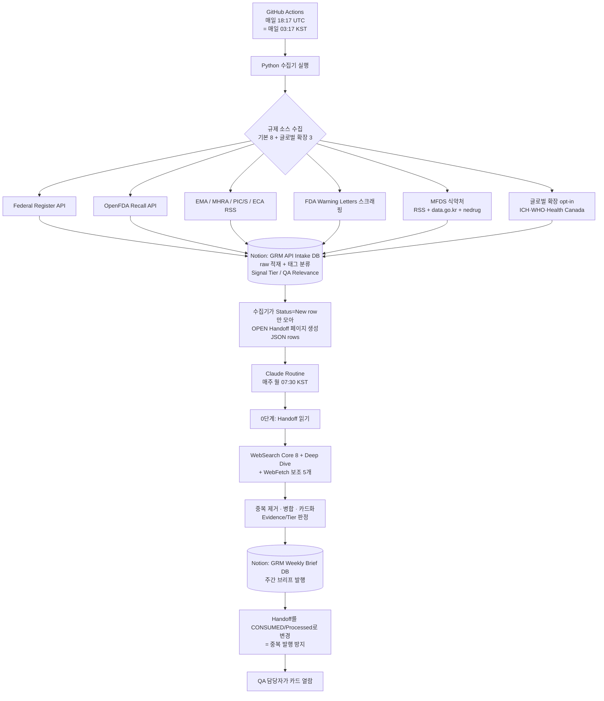

# GRM 시스템 명세서 (System Spec)

> **GRM = Global Regulatory Monitor.** 글로벌·국내(식약처) 제약 GMP/품질 규제 신호를 자동으로 수집·요약해, 한국 제약사 QA 담당자가 "규제가 어떻게 바뀌고 있고 우리가 무엇을 확인해야 하는지"를 카드 형태로 빠르게 파악하도록 돕는 자동화 다이제스트 시스템.
>
> 이 문서는 저장소의 `README.md` 를 **대체** 하는 단일 시스템 명세서입니다. (기존 README는 제거됨)

| 문서 메타 | 값 |
|---|---|
| 최신 변경 | `v1.69` (**AI 자동 생성 고지 재설계 2026-07-03**): v1.68 3표면 고지 위 디자인/배치 재설계(캐논·코드 로직 불변). ① 상단 배지 **스택화**(로봇 아이콘 + `AI 자동 생성 안내` 헤더/캐논/`전문 보기 ↓` 3줄 세로 스택 `.ai-badge-b`). ② 하단 전문 고지 `.disc`(카드폭 박스)→**`.ai-disclosure` full-width 독립 섹션**(`--card` 배경·serif h2 "콘텐츠 생성 방식 및 유의사항"·`AI Disclosure` eyebrow) + `base.html `(구독밴드 다음·푸터 앞)로 **전 페이지 배치 통일**(콘텐츠→뉴스레터밴드→AI 고지→푸터). brief=`#ai-notice`(배지 앵커 타깃)·landing=`#notice`(푸터 앵커 타깃) 동일 컴포넌트·id만 상이. ③ 랜딩 구 `안내·방법론`(`.section soft #notice`)→동일 `.ai-disclosure` 컴포넌트로 이동·제목 통일. ④ 푸터 legal 재구성: `.foot-copy`(© + 영문 provenance `mono`)+`.foot-disclaimer`(책임문 별도 문단)·한국어 `AI가 1차 출처…` 라인 삭제. `newsletter.py` `DISCLOSURE_KO`/`DISCLOSURE_EN` **캐논 불변**(교체 없음)→drift 가드·`test_disclaimer_present*` 무편집. `grm.css` `.ai-badge-b`/`.ai-disclosure`/`.foot-copy`/`.foot-disclaimer` 추가·구 `.disc`/`.notice-body` 제거(§4 한글안전: 인라인 자간/대문자·mono-한글 0). 골든 8종 재동결·**web 139 tests green**(골든 byte-diff·면책 drift·한글안전·disclaimer present/omitted). 직전 `v1.68` (**AI 자동 생성 고지 고도화 2026-07-03**): 발행/랜딩 계층 AI 고지를 3표면으로 재설계(정확성·배치·전문성). ① **주간 호**(`brief.html`): 맨 밑 1문단 `.disc` → **상단 요약 배지**(`.ai-badge`, tldr 하단·`#ai-notice` "전문 보기" 앵커) + **하단 전문 3단 고지**(`<section class="disc" id="ai-notice">` — 1.AI 생성 정보 2.원문 그대로 제공 정보 3.검증·한계·이용자 유의)로 **이원화**(맨밑에만 있어 확인 어렵던 문제 해소). ② **정확성**: 고지 범위를 "시사점·점검"만 → **요약·번역·시사점·점검·심층분석(AI 생성) vs 수치·인용·링크·기계 추출 표=지적사항 표(원문 그대로)** 경계 명시. ③ **랜딩**(`landing.html`·`base.html`): 푸터 죽은 라벨(span)을 `#notice` 앵커(a)로 연결 + **`안내·방법론` 섹션 신설**(`#notice` — 수집소스·생성범위·검증·한계), 푸터 legal 에 책임한정 1줄 추가. ④ **뉴스레터**(`newsletter.py`): `DISCLOSURE_KO` 를 새 배지 캐논으로 교체(EN 캐논 불변 → drift 가드·`test_disclaimer_present*` 무편집). `grm.css` `.ai-badge`/`.disc-h`/`.disc-sec`/`.notice-body` 추가(§4 한글안전: 인라인 자간/대문자·mono-한글 0). 골든 재동결 후 **web 135 tests green**(골든 byte-diff·면책 drift 가드·한글안전 포함). 직전 `v1.67` (**리팩토링 배치6 — Config·소스 레지스트리·RSS 제네릭·main 분해 2026-07-03**): `collect_intake.py`(2,893줄) **재구성**(verbatim 이동이 아닌 재구성 배치). **Phase1** frozen `RunConfig.from_env(args)` — 흩어진 `ENABLE_*`·값형 env(키·윈도우·경로·dry-run) 1회 파싱, main 은 cfg 참조. **Phase2** 수집측 소스 레지스트리 `grm_common.INTAKE_SOURCE_SPECS`(소스당 1 레코드, card_scaffold `_REGISTRY` 발행측과 대칭) — main 의 insert_items+stats 19블록→단일 루프(getattr/setattr), `grm_health._source_health_rows` 수제 19-dict→레지스트리 제너레이터. **CollectionStats 스칼라 필드는 유지(사용자 결정)**·field→dict(④)는 grm_health/health JSON byte 리스크로 deferred. modality `os.environ` 변조 제거: insert_items→notion_create_page→build_notion_properties `modality_enabled`(preflight effective) 전달·미지정 시 env 폴백(하위호환). **Phase3** RSS 4종(EMA·MHRA·PIC/S·ECA)→`collect_rss_feed(spec)`+`RssFeedSpec`+per-source extractor(verbatim 이동→doc_id=dedup 키 불변)·커버리지 0이던 4종에 신규 `tests/test_rss_generic.py`(7종·document_id pin). **Phase4** ~850줄 main→`_run_collection`(stats+18 item 리스트)·`_write_step_summary` 추출(→~384줄, 블록 verbatim; dedupe/insert/handoff/health 파이프라인은 조기반환·dense mutation 이라 인라인 유지). ★재구성 배치라 골든 byte-diff 0 + **운영 산출물 fixture byte-proof 전건 IDENTICAL**(health JSON·step summary·coverage(build_coverage_collected 무수정)·RSS IntakeItem+로그·main 오케스트레이션 mock+dry-run). 1017 unittest(+7)+139 pytest green·py_compile·git diff --check. 후속(보고)=④ field→dict·§7 traceback/truncation 구조화·handoff-v2 os.environ. 지시 `CC 실행 지시문 — 배치 6`. 직전 `v1.66` (**리팩토링 배치5 — collect_intake 분해 2단계 2026-07-03**): `collect_intake.py`(4,347줄)에서 Notion 층 2개를 신규 루트 모듈로 **verbatim 이동**(로직·로그·문자열 편집 0·동작 불변). Phase1 `grm_notion.py`(Notion API 클라이언트: `notion_headers`·`notion_api_request`(429/5xx 재시도 원형 — 통합 없음)·preflight 2종(modality/handoff-ref)·dedupe 조회 `notion_query_existing_doc_ids`·속성/children 빌드 `build_notion_properties`·`build_notion_children`·`_rich_text`/`_select`/`_date_iso`/`_datetime_iso`/`_url`·`notion_create_page` + `PROP_*`/`NOTION_*` 스키마 상수), Phase2 `grm_handoff.py`(handoff v1/v2 조립·emit·STALE 가드 `notion_stale_prior_open_handoffs`·PL-10b reconcile·B1 조회 윈도우·§1-B web brief emit·W1 `coverage_collected` 포맷터·Notion intake page snapshot 리더). Phase0=공용 의존 사전정리: `SOURCE_*`(16종)·공용 텍스트/환경 헬퍼 `truncate`/`chunk_text`/`_env_int`·`NOTION_RICH_TEXT_CHUNK` 를 base leaf `grm_common.py` 로 relocate(두 신규 모듈이 `collect_intake` 역참조 없이 사용 가능하도록). 결과 4-계층(`grm_common` ← `grm_taxonomy`/`grm_notion` ← `grm_handoff` ← `collect_intake`)·**역참조 0**·`IntakeItem` 은 시그니처 주석 전용(지연 문자열)이라 런타임 import 불요. `collect_intake` 가 이동 심볼 전량 재수출 → 위성 수집기 무수정, 테스트는 mock 대상 모듈만 재지정(patch 대상=정의 모듈 관례·어서션·로직 불변). `grm-ci.yml` py_compile +2. 골든 바이트 불변·1010 unittest+139 pytest green. `notion_create_page`·`build_notion_properties` 등 재설계(레지스트리·main 분해)는 배치6. 직전 `v1.65` (**리팩토링 배치3 — collect_intake 분해 1단계 2026-07-03**): `collect_intake.py`(5,424줄) 에서 순수 층 2개를 신규 루트 모듈로 **verbatim 이동**(로직·주석 편집 0·동작 불변). Phase1 `grm_health.py`(소스 헬스 판정 층: `HealthFinding`·`HealthCheckResult`·`_evaluate_health`·`_source_health_rows`·transient 분류·health JSON/요약 쓰기; `CollectionStats`(공유 accumulator·지연 문자열 주석으로 역import 불필요)·`_health_payload`(`now_kst` 의존)는 잔류), Phase2 `grm_taxonomy.py`(분류 판정 순수함수 `compute_relevance`/`compute_modality`/`compute_osd_relevance`·`_fda_wl_office_gate`·`_kw_*` + QA/FDA_WL/MODALITY 키워드 상수; `compute_signal_tier` 는 SOURCE_* 소스 레지스트리 의존=배치4 로 잔류·재수출된 `_kw_match`/`_kw_any` 사용). collect_intake 가 두 모듈 재수출·단방향 의존·**역참조 0**·기존 참조 경로/테스트/위성 무수정. Phase0(고아 라벨 `회수 등급`·`제품명` 제거)=**REFUTED**(recall 카드 render mono+PL18 identity+v16 recall-class 슬롯 = 살아있는 의도 → 미제거·배치2 pin 유지·보고만). `grm-ci.yml` py_compile 에 신규 2 + 기존 누락 `inject_slots`/`deep_analysis_fanout` 추가. 골든 바이트 불변·1006 unittest + 139 pytest green. 지시 `GRM_CC지시문_리팩토링3_intake분해1단계_2026-07-03.md`. 직전 `v1.64` (**FDA 483 심층분석(deep_analysis) 분석층 추가 2026-07-02**): 이미 라이브인 483 결정론 Observation 상세 **위에** WL·행정처분과 동형의 LLM 분석층(4섹션)을 additive 로 얹어 483 을 "층 혼용 완성형"(결정론 층 항상 + 분석층 조건부)으로 편입. `verify_deep_analysis` 에 `REQUIRED_SECTIONS_FDA483`(②=`inspectional_significance` — 실사 지적의 규제적 의미·WL/Import Alert 승격 가능성; 483 은 실사 종료 문서라 응답 평가 없음)+`resolve_required_sections` 483 분기(card_type·`inspectional_significance` 자동판별). ★D2 성격: 483 은 원문(관찰사항)에 CFR 조항을 명시하지 않을 때가 많아 CFR 미근거 인용을 **WARN(비차단)** 으로 강등(WL/admin 하드 FAIL 과 다름 — 정당한 규제 해석 허용; 날조 식별번호는 D3 가 여전히 WARN). `collect_fda_483` 신규 플래그 `ENABLE_FDA_483_DEEP`(opt-in·기본 off, `ENABLE_FDA_483_OBSERVATIONS` 결정론과 독립) on 시 파싱 가능한 483(Observation ≥1) 전문을 `raw.fda483_body_full`(전문 상한 200000·health `fda_483_deep`)로 보존; ★라이브 절단 보완=`_fetch_fda483_pdf_text` 가 483 전용 200000 을 **기본 상한**으로 쓰게 수정(PR #57 이 못 고친 결정론 Observation 라이브 경로 8쪽+ 절단까지 함께 해결·excerpt 산출물 불변), `card_scaffold` `deep_analysis_ready`/`deep_analysis_input` 483 분기(결정론 `fda_483_observations` 경로 불변 — 483 은 두 층 공존), `deep_analysis_fanout` `Job.card_type`(=kind) 동봉·게이트에 유형 전달, `card.html` ②섹션 483 한글명("실사 지적의 의미") 스왑(WL 영문 섹션명 바이트 불변)·`v.observation` 흡수, 신규 프롬프트 `docs/prompts/GRM_Prompt_DeepFda483_v1.md`, `grm-intake.yml` `ENABLE_FDA_483_DEEP` 배선. graceful degrade(게이트 FAIL/플래그 off/전문 미확보 → 결정론 Observation 상세만으로 발행 — 최악=현행). 980 green·기존 골든/6슬롯/WL/admin 불변. 7/6 반영=머지+`ENABLE_FDA_483_DEEP=true`+운영 Routine 프롬프트 [2단계] 483 매핑 재-붙여넣기. 직전 `v1.63` (**뉴스레터 구독 인라인 성공(방식 A) 2026-07-02**): 구독 폼 제출 시 Brevo(sibforms) 호스팅 페이지(빈 화면)로 전체 이동하던 UX 를 개선. `base.html` 구독 밴드에 폼 제출 가로채기 스크립트 추가 — `fetch(mode:'no-cors')` 백그라운드 POST + 인라인 성공 패널(`#grm-sub-done` "확인 메일을 보냈습니다")을 `` 블록 **내부**에 넣어 페이지 이동 0·사이트 잔류. JS off·`fetch` 미지원은 `preventDefault` 미발동 → 네이티브 POST 자연 폴백(기존 동작 보존). `grm.css` `.sub-done`/`.sub-done-ic`(coral-tint·fadeUp 재사용·§4 한글안전: letter-spacing/text-transform/mono 미사용). 폼 미설정(기본·테스트) 빌드는 블록 전체 생략 유지 → 전 페이지 골든 byte-diff 0, `test_newsletter_form_conditional` 요구 필드(EMAIL·required·허니팟·locale·action..method)·밴드 §4 가드 전부 보존(독립 Jinja 렌더 18/18 green). 정적 사이트·런타임 서버 0·PII=SaaS 소유 원칙 불변. 직전 `v1.62` (**FR 상세보기 철회 — FR=요약보강 2026-07-02**): v1.60 Phase B 가 도입한 Federal Register 결정론 상세보기(`deterministic_detail` type=`fr_summary`)를 외과 제거했다. 근거=`GRM_PDF전문수집_FR프로토타입_스키마확정_2026-07-02.md` §0 — 값 있는 마감일/시행일은 `comments_close_on`/`effective_on` API 메타로 이미 확보, 본문은 abstract 가 이미 요약이라 증분 가치 0. `_deterministic_detail` guidance 분기·`_FR_KIND_LABEL`/`_fr_detail_kind`·`card.html` `fr_summary` 분기·`render._detail_preview` FR부·FR 골든 2종(guidance_fr.webcard·brief_web)의 `fr_summary` 를 제거했다. GMP `gmp_deficiencies`·483 `fda_483_observations` 는 같은 슬롯의 다른 `type` 이라 완전 불변(admin deep_analysis·UI 보강도 불변). 직전 `v1.61` (**FDA 483 Observation 결정론 상세보기 + 수집 소스 부활 2026-07-02**): 죽은 FDA 483 `datatables-json/ora-foia-reading.json` 경로를 제거하고 현행 OII FOIA Electronic Reading Room HTML/DataTables(`/datatables/views/ajax`)를 주 경로로 전환했다(`Record Type=483`, media id 링크, Publish Date desc 페이지네이션; 정적 HTML 10행은 degrade fallback). `ENABLE_FDA_483` 는 workflow 기본 on(Repo var false override 가능), `ENABLE_FDA_483_OBSERVATIONS` 는 opt-in 기본 off. PDF 텍스트층은 기존 PyMuPDF 엔진 재사용, `WE OBSERVED` 이후 `OBSERVATION N` 분할→첫 문장 deficiency·나머지 detail 로 `raw.fda_483_observations` 를 저장한다. 추출 실패/OCR 오인식/구조 이질은 WARN + raw 키 미기록으로 요약카드 유지. `card_scaffold._deterministic_detail` 에 `type="fda_483_observations"` 추가, `card.html` Observation 목록 렌더와 `.obs-num` 최소 CSS 추가. 라이브 검증: OII DataTables 483 총 1990대 응답, 2026-07-01~07-02 창 2건 수집·2건 Observation 추출 성공. 상세 `GRM_card_spec_v16.md` §16. 직전 `v1.60` (**소스별 상세보기 확장 + 요약카드 보강 2026-07-02**): WL 심층분석(deep_analysis) 자산을 나머지 소스로 확장 — 실 DB 깊이 기준 펼침 상세보기가 값 있는 소스 3개(FDA WL·MFDS 행정처분·Federal Register). |
| 문서 버전 | `v1.69` (**AI 자동 생성 고지 재설계**: 배지 스택화·하단 고지 `.disc`→`.ai-disclosure` full-width 독립 섹션·`base.html ` 로 전 페이지 배치 통일(콘텐츠→뉴스레터→고지→푸터)·랜딩 `#notice` 동일 컴포넌트 이동·푸터 legal 재구성(`.foot-copy`+`.foot-disclaimer`·한국어 라인 삭제). 캐논 불변·drift/§4 보존·골든 재동결 web 139 green). 직전 `v1.68` (**AI 자동 생성 고지 고도화**: 주간 호 상단 배지+하단 전문 3단 이원화·생성/원문 경계 명시·랜딩 `#notice` 안내 섹션·푸터 앵커화·뉴스레터 캐논 교체, 골든 재동결 web 135 green·§4 한글안전 보존). 직전 `v1.67` (**리팩토링 배치6 — Config·소스 레지스트리·RSS 제네릭·main 분해**: `RunConfig` env 1회 파싱·수집측 레지스트리 `INTAKE_SOURCE_SPECS`(insert 루프+health rows 구동, CollectionStats 스칼라 유지)·modality os.environ 변조 제거(param 전달)·RSS 4종→`collect_rss_feed(spec)`(extractor verbatim·doc_id 불변)·main→`_run_collection`/`_write_step_summary` 추출(~384줄). 재구성 배치=골든 0+운영 산출물 5종 fixture byte-proof IDENTICAL·1017+139 green·④field→dict·§7 개선 deferred). 직전 `v1.66` (**리팩토링 배치5 — collect_intake 분해 2단계**: Notion API 클라이언트 층→`grm_notion.py`·Routine handoff/web emit 층→`grm_handoff.py` verbatim 이동·재수출·단방향 의존·동작 불변; Phase0 공용 relocate(`SOURCE_*`·`truncate`/`chunk_text`/`_env_int`·`NOTION_RICH_TEXT_CHUNK`→`grm_common`)로 역참조 0; `IntakeItem` 주석 전용 잔류; 테스트 patch 대상 정의모듈 재지정·어서션 불변; `grm-ci.yml` py_compile +2; 골든 불변·1010+139 green; 재설계=배치6). 직전 `v1.65` (**리팩토링 배치3 — collect_intake 분해 1단계**: health 판정 층→`grm_health.py`·분류 판정 순수함수 층→`grm_taxonomy.py` 로 verbatim 이동·재수출·단방향 의존·동작 불변; `compute_signal_tier`(SOURCE_*=배치4)·`CollectionStats`·Notion 스키마 상수 잔류; Phase0 고아 라벨 제거=REFUTED·보고만; `grm-ci.yml` py_compile 4개 추가; 골든 불변·1006+139 green). 직전 `v1.64` (**FDA 483 심층분석 분석층 추가**: 483 결정론 Observation 상세 위에 WL/admin 동형 deep_analysis 4섹션(②=`inspectional_significance`) additive·층 혼용 완성. `ENABLE_FDA_483_DEEP` opt-in·`fda483_body_full` 보존·D2 CFR 미근거=WARN(비차단)·신규 `GRM_Prompt_DeepFda483_v1.md`. graceful degrade·980 green·골든/6슬롯/WL/admin 불변). 직전 `v1.63` (**뉴스레터 구독 인라인 성공(방식 A)**: 구독 폼 `fetch(no-cors)` 백그라운드 POST + 인라인 성공 패널로 빈 Brevo 페이지 이동 제거, 폼-off 골든 byte-diff 0·§4 가드·요구 필드 보존, 정적/PII 원칙 불변). 직전 `v1.62` (**FR 상세보기 철회 — FR=요약보강**: v1.60 Phase B 의 Federal Register 결정론 상세보기(`deterministic_detail` type=`fr_summary`)를 외과 제거. GMP·483 상세보기·admin deep_analysis 불변). |
| 최종 수정일 | 2026-07-03 (AI 자동 생성 고지 재설계 — 배지 스택·독립 섹션·배치 통일·푸터 정리) |
| 현재 상태 | 매일 수집/Notion 적재 동작, GitHub Actions 내부 health check P1 구현. **바이오 소스 1단계: Phase 3 P1 글로벌 3종(ICH·WHO·HC) 라이브 검증 통과(dry-run + 실적재 207건 0실패)·운영 활성(`ENABLE_ICH/WHO/HC=true`)·`feature/biologic-sources` → `main` 머지.** ICH는 정적 guideline snapshot 자동 카드화를 중단하고 Tier 1 모니터링/Skipped 기본으로 운용한다. 실제 ICH 변동은 슬롯 7 공식 news/press-release 검색+WebFetch 로 Step 4·Step 2b·총회 보도자료만 카드/🔮 후보화한다. **Keystone K3 완료·운영 전환(2026-06-06): `ENABLE_HANDOFF_V2=true` + 월요일 Routine 프롬프트 v16(Python-scaffold). 4주 관찰 중** |
| Active phase | 바이오 1단계 활성 — 1~2주 관찰(Biologic 칸 누적 증가·세 수집기 health·발행 브리프) + Phase 4 운영 관찰 + **Keystone K1~K4 중 K1·K2·K2.5·K3 완료·운영 전환됨(`ENABLE_HANDOFF_V2=true`·v16 Python-scaffold, 2026-06-06). K3 4주 관찰(Lint 0·Status 누락 0) 통과 시 종료 → K4(Status/Lint Python 마감)** + (필요 시 2단계 FDA CBER guidances 신규 수집기 트랙) + **발행 레이어 웹이관: P0(스키마 v1 동결)·P1(web-card JSON 분리·Codex GO·main 머지) 완료 → P2(웹 렌더러+미리보기) 대기** — routine 은 `grm-web-card/v1` JSON 을 단일 계약으로 산출(Notion 표시는 P4 병행 비교까지 유지) |
| 주요 enabled flags | 운영 기본: `ENABLE_MFDS/RECALL/ADMIN/GMP_INSPECTION=true`, `ENABLE_MFDS_LAW/GMP_CERT/SAFETY_LETTER=false`(공식 API 복구 opt-in), `MFDS_HTTP_PROXY`/`LAW_GO_KR_OC`/`MFDS_RSS_BOARD_MODE`는 선택 KR-egress·본문 enrich 배선, `ENABLE_MODALITY_TAG=true`(2026-06-04 활성), **`ENABLE_ICH/WHO/HC=true`(2026-06-05 활성)**, **`ENABLE_HANDOFF_V2=true`(2026-06-06 활성 — K3 운영 전환)**, `ENABLE_SCRAPE/MOLEG_API=false`, **`ENABLE_FDA_483=true`(2026-07-02 부활 — OII HTML/DataTables 주 경로, repo var false override 가능)**, **`ENABLE_FDA_483_OBSERVATIONS=false`(2026-07-02 신규·opt-in — 483 Observation 결정론 상세보기, 실패는 graceful=요약카드 유지)**, **`ENABLE_WL_BODY_FULL=false`(2026-07-01 신규·opt-in — WL 심층분석 fan-out 전문 확보 게이트, `ENABLE_WL_BODY`와 독립)**, **`ENABLE_GMP_DEFICIENCY_TABLE=true`(2026-07-02 신규·활성 — MFDS GMP 정기실태조사 지적 표 결정론 추출→deterministic_detail 상세보기, `grm-intake.yml` 배선 완료·repo 변수 true, 추출 실패는 graceful=요약카드 유지)**, **`ENABLE_MFDS_ADMIN_BODY_FULL=true`(2026-07-02 신규·활성 — 행정처분 심층분석 fan-out 다단락 Body 확보 게이트, WL `ENABLE_WL_BODY_FULL` 과 동형, `grm-intake.yml` 배선 완료·repo 변수 true. 미확보/얇은 Body 는 verify_deep_analysis 게이트로 graceful degrade=6슬롯 발행)**, **`ENABLE_FDA_483_DEEP=false`(2026-07-02 신규·opt-in — FDA 483 심층분석 fan-out 전문(`fda483_body_full`) 확보 게이트, `ENABLE_FDA_483_OBSERVATIONS` 결정론과 독립·`grm-intake.yml` 배선 완료. off 시 483 은 결정론 Observation 상세만 발행=현행. 7/6 활성 예정)** |
| 기준 시스템 버전 | **§1-B scaffold 영구배선**: `main`(HEAD `78c3db9`, inject_slots PR #24 위) 위 **브랜치 미생성·미커밋 작업본**(CC 구현 → Codex 게이트 → 사람 머지). 명시 경로만(`collect_intake.py`·`.github/workflows/grm-intake.yml`·`tests/test_web_brief_emit.py`·본 캐논) — foreign 미커밋(`docs/GRM_Keystone_charter.md` 등) 불침범. push/머지/활성(`vars.ENABLE_WEB_BRIEF_EMIT`) 사람 게이트. 직전 기준 **웹이관 P1** `feat/web-card-json-p1-2026-06-24`. |
| 코드 저장소 | https://github.com/MINHOYEOM/grm-api-intake |
| 발행 위치 | Notion `Global Regulatory Monitor` 부모 페이지 하위 |

---

## 0. 이 문서를 쓰는 법 (유지 규칙)

이 문서는 **"살아있는 명세서"** 입니다. 한 번 쓰고 끝내는 게 아니라, 시스템이 바뀔 때마다 같이 갱신합니다.

- **큰 틀 위주로 갱신한다.** 자잘한 버그 수정·문구 변경은 코드 커밋/프롬프트 버전으로 충분합니다. 이 문서는 **구조·소스·단계가 바뀌는 "큰 변경"** 만 반영합니다. (예: 새 규제 소스 추가, 새 Phase 진입, 데이터 흐름 변경)
- **변경은 해당 섹션 안에 기록한다.** 각 섹션 끝의 `📝 변경 이력` 표에 한 줄 추가합니다. 별도의 통합 changelog는 두지 않습니다.
- **상단 "문서 메타" 의 버전·수정일·기준 버전** 을 같이 갱신합니다.
- **파일·폴더가 추가·이동·삭제되면 `4.1 저장소 폴더 구조` 트리를 함께 갱신합니다.** (이 문서가 폴더 구조의 단일 기준)
- 변경 이력 한 줄 형식: `날짜 · 무엇이 어떻게 바뀌었나 · (연관 커밋/프롬프트 버전)`

> 이 문서의 목적은 ① 개발 중 기준점, ② 다음 작업 때 진행 정도 확인, ③ 추후 최종 사용자 안내문 제작의 토대입니다.

---

## 1. 시스템 개요 · 목적

### 1.1 무엇을 하나
GRM은 전 세계 주요 규제기관과 한국 식약처(MFDS)의 **제약 제조·품질(GMP/QA) 관련 규제 신호** 를 자동으로 모읍니다. 모은 정보를 그대로 던져주는 게 아니라, 사람이 빠르게 읽을 수 있는 **카드형 요약** 으로 가공해 매주 Notion에 발행합니다. 사용자는 카드를 보고 (1) 규제가 어떻게 변하는지 인지하고, (2) 우리 QA가 무엇을 점검해야 하는지 파악하며, (3) 반복적으로 보면서 규제 흐름에 대한 학습 효과를 얻습니다.

### 1.2 왜 만드나 (해결하는 문제)
규제 정보는 FDA·EMA·MHRA·PIC/S·ICH·TGA·식약처 등 **출처가 흩어져 있고**, 매주 사람이 일일이 확인하기에는 양이 많고 영문 원문도 부담입니다. GRM은 이 모니터링을 자동화하고, 핵심만 한국어로 요약하되 **원문 링크(듀얼 링크)** 를 항상 함께 제공해 신뢰성과 추적성을 유지합니다.

### 1.3 핵심 설계 원칙
- **원문 우선·추적 가능:** 모든 카드에 정보 출처(📰)와 공식 원본(📎) 두 링크를 붙입니다. 1차 공식문서 직접 확인 항목(Evidence A)만 원문을 인용(quote)합니다.
- **사실과 해석의 분리:** 객관적 사실과 AI 해석(노란색 '시사점')을 시각적으로 분리합니다.
- **신뢰도 등급화:** 모든 카드에 Evidence Level(A/B/C)과 Signal Tier(1/2/3)를 표기합니다.
- **장애에 강하게(Graceful degradation):** 수집기가 실패해도 Routine은 WebSearch 단독 모드로 계속 동작합니다.

### 1.4 대상 사용자
**의약품 전반을 다루는 한국 제약사의 QA 담당자.** 특정 제품·제형으로 좁히지 않고 **원료 성격 기준 '큰 틀' 3분류 — 화학합성(케미컬)의약품 · 생물의약품 · 기타** 로 봅니다(의료기기는 범위 밖). 글로벌 규제 변화와 국내 GMP 제조/품질 신호(실태조사·행정처분·회수 등)를 제품군 전반에 걸쳐 함께 모니터링합니다. (2026-06-04 제품군 확장 이전에는 경구 고형제 중심.)

#### 📝 변경 이력 — 개요·목적
| 날짜 | 변경 내용 |
|---|---|
| 2026-06-02 | 최초 작성 (현재 시스템 기준 정리) |
| 2026-06-04 | **제품군 확장**: 대상 범위를 경구 고형제 중심 → 의약품 전반으로 확대(Phase 4). 특정 제품이 아닌 원료 성격 '큰 틀' 3분류(화학합성·생물·기타). 의료기기는 제외 유지 |

---

## 2. 풀스택 구성

GRM은 크게 **5개 계층** 으로 이루어집니다. 무거운 서버 없이, GitHub Actions(연산) + Notion(저장·표시) + Claude(분석·생성)를 조합한 구조입니다.

| 계층 | 역할 | 사용 기술 / 위치 |
|---|---|---|
| ① 수집(Collector) | 11개 규제 소스에서 원시 데이터를 가져옴 (기본 8 + 글로벌 확장 ICH·WHO·HC, opt-in) | Python 3.12 (`requests`, `PyMuPDF`) |
| ② 실행·스케줄(Runtime) | 수집기를 정해진 시각에 자동 실행 | GitHub Actions (`ubuntu-latest`, cron) |
| ③ 저장(Staging) | 수집한 raw 데이터 + 분류 태그를 저장 | Notion DB — `GRM API Intake` |
| ④ 분석·생성(Routine) | 저장된 신호를 읽어 카드형 다이제스트로 가공 | Claude (Anthropic) + MCP 도구 |
| ⑤ 발행(Publish) | 완성된 주간 브리프를 사람에게 보여줌 | Notion DB — `🌐 GRM Weekly Brief` |

### 2.1 계층별 상세

**① 수집 — Python 수집기**
순수 Python 스크립트 묶음입니다. 외부 의존성은 HTTP 클라이언트 `requests` 와 PDF 파서 `PyMuPDF`(식약처 실태조사 결과 PDF용) 둘뿐으로 가볍게 유지합니다. 공통 HTTP 로직(재시도, 429 Retry-After 백오프, JSON/XML 파싱)은 `grm_common.py` 로 분리되어 모든 수집기가 공유합니다.

**② 실행·스케줄 — GitHub Actions**
서버를 직접 운영하지 않고 GitHub의 무료 러너에서 주기 실행합니다. 워크플로우(`grm-intake.yml`, 이름 `GRM API Intake (Daily)`)는 **매일 18:17 UTC(= 매일 03:17 KST, cron `17 18 * * *`)** 에 자동 실행되며, 수동 실행(`workflow_dispatch`)으로 dry-run·수집 윈도우·소스별 활성화(`ENABLE_*`) 조정도 가능합니다. 수집기는 실행 말미에 `grm-health.json` 과 `GITHUB_STEP_SUMMARY` health 섹션을 생성합니다. 실패(failure)는 workflow exit 1과 KST 실행일 기준 GitHub Issue로, 경고(warning)는 exit 0을 유지하면서 고정 제목 `GRM Intake 운영 경고` Issue에 누적 comment로 남깁니다. 비밀값(Notion 토큰 등)은 GitHub Secrets에만 보관합니다.

**③ 저장 — Notion `GRM API Intake` DB (Staging)**
수집기가 가져온 모든 항목이 1차로 쌓이는 **임시 적재(staging) 데이터베이스** 입니다. 각 행(row)에는 분류 태그(Source, Signal Tier, QA Relevance, Evidence Candidate 등)가 붙고, 페이지 본문에는 **원본 API 응답 JSON 전체** 가 보존됩니다(Evidence A 재검증용). 별도의 외부 DB(Postgres 등) 없이 Notion 자체를 DB로 사용하는 것이 이 시스템의 특징입니다.

**④ 분석·생성 — Claude Routine**
주간 Routine은 Claude(Anthropic)가 긴 프롬프트(현행 `v16` Python-scaffold — 카드 골격은 수집기가 조립한 handoff v2 를 받아 카드별 6슬롯 산문만 채워 발행)에 따라 수행합니다. Claude는 세 가지 MCP 도구를 사용합니다: **Notion MCP**(Intake 읽기 + 브리프 쓰기), **WebSearch**(이벤트 탐지, 주 9회 한도), **WebFetch**(지정된 5개 보조 출처 콘텐츠 흡수). Claude가 직접 공식 API를 호출하지는 않습니다(클라우드 egress 차단 → 수집기에 위임).

**⑤ 발행 — Notion `🌐 GRM Weekly Brief` DB**
완성된 주간 다이제스트가 페이지로 발행되는 곳. 사용자가 실제로 읽는 최종 산출물입니다.

**⑥ 웹 발행·뉴스레터 배포 — 정적 사이트 + 이메일 (Notion 발행과 별도·additive·D8)**
발행 산출물(`grm-web-card/v1` JSON)은 두 경로로도 배포됩니다. 둘 다 수집(`grm-intake.yml`)과 **완전 별도 파일·트리거·최소권한**(한쪽 실패가 다른쪽 무영향) 이며 **무변형·결정론·정적$0·provenance** 를 보존합니다.
- **웹**: `web/render.py`(순수·결정론) → 정적 멀티페이지 사이트 → `grm-web-deploy.yml`(linkcheck→render→Cloudflare Pages). 라이브 게이트(D5) = production 브랜치 사람 머지만. 상세 `web/README`.
- **뉴스레터(T1)**: 회원 시스템 없이 **구독**(정적 폼 → 관리형 SaaS=**Brevo** 직접 POST·더블옵트인·수신거부·구독자 PII=SaaS 소유)하고, **티저 메일**(그 호 요약 + 웹 브리프 링크 + 섹션 앵커 + 면책 캐논)을 `web/newsletter.py`(SaaS-무관 어댑터)→Brevo Campaigns API 로 발송합니다. 발송 워크플로 `grm-newsletter-send.yml` 은 **매주 자동 준비 + 1클릭 승인**(T1.4: 주간 cron→최신 호 자동·`environment: newsletter-send` 사람승인) + 수동(`workflow_dispatch`) 경로를 함께 두며, **발송 게이트 4겹**(발행검증·링크체크·멱등·승인)·무인 발송 0(승인 안 하면 안 나감, 새 호 없으면 클린 skip). 메일은 우리 페이지 링크만 담아 카드 출처 URL 불변(provenance). 클릭으로 관심 주제를 측정해 향후 주제 세그먼트 근거를 모읍니다(T2). 상세 §5.3·`web/README`·지시문 `GRM_CC지시문_뉴스레터구독발송측정_2026-06-30.md`.

### 2.2 두 개의 Notion 데이터베이스
둘 다 `Global Regulatory Monitor` 부모 페이지 하위에 있습니다.

| DB | 역할 | ID |
|---|---|---|
| `GRM API Intake` | 수집 staging (기계가 적재) | `7784c71fb7b343749b2bee5d04db7926` |
| `🌐 GRM Weekly Brief` | 주간 발행물 (사람이 읽음) | `3653142f-dc11-8049-806d-e0a779cafd90` |

`🌐 GRM Weekly Brief` DB의 속성은 `이름`(제목) · `검색 기간`(text) · `발행일`(date) · `출처 기관`(멀티셀렉트) · `카테고리`(멀티셀렉트: Warning Letter / Guidance / Guideline / Other)이며, 갤러리·테이블·카테고리별·기관별 뷰를 제공합니다. `출처 기관` 옵션은 FDA·EMA·MHRA·PIC/S·ICH·WHO·Health Canada 에 더해 **2026-06-04 에 MFDS·TGA·ECA 를 추가**해 총 10종이 됐습니다(Routine 프롬프트 v15.7 개선 시 함께 반영). ICH·WHO·Health Canada는 P1 전용 수집기로 채워지고, 이전에 비어 있던 **MFDS(식약처) 옵션 갭이 해소**되어 국내 카드의 기관 태그가 더 이상 비지 않습니다. Routine v15.7 은 그 주 카드에 등장한 모든 기관(국내 카드가 있으면 MFDS 포함)을 빠짐없이 태그하도록 지시합니다.

#### 📝 변경 이력 — 풀스택
| 날짜 | 변경 내용 |
|---|---|
| 2026-07-03 | **④·⑥ 발행/웹 계층 — AI 자동 생성 고지 재설계**(v1.69, v1.68 위 디자인/배치·additive·캐논/로직 불변). ① 상단 배지 스택화(`.ai-badge-b`: 헤더/캐논/전문보기 3줄). ② 하단 전문 고지 `.disc` 카드폭 박스→`.ai-disclosure` full-width 독립 섹션(`--card` 배경·serif h2 `콘텐츠 생성 방식 및 유의사항`) + `base.html `(구독밴드 다음)로 전 페이지 배치 통일(콘텐츠→뉴스레터→고지→푸터). brief `#ai-notice`·landing `#notice` 동일 컴포넌트. ③ 랜딩 구 `안내·방법론` 섹션 동일 컴포넌트 이동·제목 통일. ④ 푸터 legal 재구성: `.foot-copy`(©+영문 provenance mono)+`.foot-disclaimer`(책임문 분리)·한국어 `AI가 1차 출처…` 라인 삭제. `newsletter.py` 캐논 불변→drift 가드·§4 한글안전 보존·`test_disclaimer_present/omitted` 무편집. 골든 8종 재동결, web 139 tests green. 지시문 `GRM_CC지시문_AI고지재설계_2026-07-03.md`. |
| 2026-07-03 | **④·⑥ 발행/웹 계층 — AI 자동 생성 고지 고도화**(v1.68, 카피/템플릿·additive). 세 지적(정확성·배치·전문성) 반영. **정확성**: 고지 범위를 "시사점·점검"만 → AI 생성(요약·번역·시사점·점검·심층분석) vs 원문 그대로(수치·코드·일자·기관/업체명·영문 인용·듀얼 링크·기계 추출 지적사항 표=483 Observation·GMP 정기실태조사) 경계 명시. **배치**: `brief.html` 맨 밑 1문단 `.disc` → 상단 요약 배지(`.ai-badge`·tldr 하단·`#ai-notice` 앵커) + 하단 전문 3단 고지(`<section class="disc" id="ai-notice">`)로 이원화. **랜딩**: `base.html` 푸터 안내 라벨(span)→`#notice` 앵커(a)·notice_href(home/타페이지 분기), `landing.html` `안내·방법론` 섹션(`#notice`) 신설, 푸터 legal 책임한정 1줄. **뉴스레터**: `newsletter.py` `DISCLOSURE_KO`→배지 캐논 교체(EN 캐논 불변→drift 가드·`test_disclaimer_present*` 무편집). `grm.css` `.ai-badge`/`.disc-h`/`.disc-sec`/`.notice-body` 추가(§4 한글안전 준수). 골든 재동결, web 135 tests green. |
| 2026-07-03 | **② 수집 계층 — 리팩토링 배치6(재구성, 동작 불변)**. `collect_intake.py` 재구성으로 "새 소스=수집기 쪽 4~5곳 수정" 부채를 정리. **Phase1** frozen `RunConfig.from_env(args)` 가 흩어진 env(플래그·키·윈도우·경로·dry-run)를 1회 파싱(env 재독해 제거). **Phase2** 수집측 소스 레지스트리 `grm_common.INTAKE_SOURCE_SPECS`(소스당 1 레코드·`card_scaffold._REGISTRY` 발행측과 대칭)가 main insert_items+stats 19블록→단일 루프, `grm_health._source_health_rows` 수제 19-dict→제너레이터를 구동(CollectionStats 스칼라 유지=사용자 결정·field→dict deferred). modality `os.environ` 변조 제거→`build_notion_properties(modality_enabled=)` param 전달(env 폴백 하위호환). **Phase3** RSS 4종(EMA·MHRA·PIC/S·ECA)→`collect_rss_feed(spec)` 제네릭+per-source extractor(추출 로직 verbatim 이동→**doc_id=dedup 키 불변**·전면 재적재 방지)·신규 `tests/test_rss_generic.py`(7종). **Phase4** ~850줄 main→`_run_collection`·`_write_step_summary` 추출(~384줄·블록 verbatim). ★재구성 배치=골든 byte-diff 0 + 운영 산출물 5종 fixture byte-proof(health JSON·step summary·coverage·RSS IntakeItem·main 오케스트레이션) IDENTICAL. 1017 unittest(+7)+139 pytest green. 후속(보고)=④CollectionStats field→dict·§7 traceback/truncation 구조화·handoff-v2 os.environ. 지시 `CC 실행 지시문 — 배치 6`(진단 리뷰 P2). |
| 2026-07-02 | **② 수집 계층 — 리팩토링 배치2(P1, 순수·동작 불변)**. (1) env 플래그 파서 단일화: `grm_common.env_flag()` 로 방언 3종(느슨 `in(...)`·엄격 `==true`·`_env_true`) 통일 — `collect_intake`(~25)·`collect_who`·`collect_fda_483`·`collect_mfds_admin_action`·`collect_mfds_gmp_inspection`·`verify_published_brief` 치환, 부수 픽스=로컬 `ENABLE_WHOPIR_EXCERPT=1` 침묵 무시 해소(CI 는 "true"/"false" 만 넘겨 운영 무변경). (2) data.go.kr 페이지네이션·serviceKey 마스킹 공용화: `grm_common.datago_paginate`/`mask_service_key`/`DatagoPageError` 로 recall·admin-action·gmp-cert·safety-letter 4개 수집기의 ~45줄 복붙 골격·mask 트리오 단일화(masked_url provenance·계약 `(items,error)`·로그/에러 문구 바이트 불변). (3) `collect_mfds_law` 교정: dedup 을 본문 fetch **이전**으로(같은 admrul 반복 fetch 제거·최대 11→1회)+부분 실패 consolidated WARN 표면화(전량 실패만 error 유지). 교차 모듈 드리프트 계약 테스트 2종(PL18↔`card_scaffold._table`·`web.render.MONO_LABELS`↔`_w2_rows`) 추가. 골든 바이트 불변, 990→1006 green. 지시 `GRM_CC지시문_리팩토링2_P1공용화_2026-07-02.md`(진단 리뷰 §6·§8). |
| 2026-07-02 | **② 수집 + ④ 분석·생성/발행 계층 — FDA 483 심층분석(deep_analysis) 분석층 추가**(v1.64, additive·WL/admin 패턴 복제). 이미 라이브인 483 결정론 Observation 상세(`deterministic_detail` type=`fda_483_observations`) **위에** WL·행정처분과 동형의 LLM 분석층(4섹션 deep_analysis)을 얹어 483 을 "층 혼용 완성형"(결정론 층 항상 + 분석층 조건부·게이트 통과 시)으로 편입. **게이트**: `verify_deep_analysis` `REQUIRED_SECTIONS_FDA483`(②=`inspectional_significance` — 실사 지적의 규제적 의미·WL/Import Alert 승격 가능성; 483 은 실사 종료 문서라 응답 평가 없음)+`resolve_required_sections` 483 분기(card_type·`inspectional_significance` 자동판별)+D2 `severity` 파라미터(483=CFR 미근거 시 WARN·비차단 — 정당한 규제 해석 허용, WL/admin 하드 FAIL 과 다름; 날조 식별번호는 D3 WARN 유지). **수집**: `collect_fda_483` 신규 플래그 `ENABLE_FDA_483_DEEP`(opt-in·기본 off·`ENABLE_FDA_483_OBSERVATIONS` 결정론과 독립) on 시 파싱 가능한 483(Observation ≥1) 전문을 `raw.fda483_body_full`(전문 상한 200000·health `fda_483_deep`)로 보존. **★라이브 절단 버그 보완**: `_fetch_fda483_pdf_text` 가 공유 GMP 엔진 기본(12000)이 아니라 483 전용 `FDA483_TEXT_MAX_CHARS`(200000)를 **기본 상한**으로 쓰도록 수정 — PR #57 이 public `_extract_483_observations` API 만 고치고 이 라이브 경로는 12000 그대로 두어, `ENABLE_FDA_483_OBSERVATIONS` on 시 8쪽+ 483 의 결정론 Observation 이 앞 3~4건에서 잘리던 것을 함께 해결(deep 전문도 같은 경로 공유). excerpt 는 앵커 뒤 1500자 재슬라이스라 산출물 불변, GMP/WHO 는 별도 호출로 무관. **조립**: `card_scaffold` `deep_analysis_ready`/`deep_analysis_input` 483 분기(결정론 `fda_483_observations` 경로 불변 — 두 층 공존). **fan-out**: `deep_analysis_fanout` `Job.card_type`(=kind) 동봉·`assemble_deltas` 가 게이트에 유형 전달. **발행**: `card.html` ②섹션 483 한글명("실사 지적의 의미"·③"요구 시정 조치") 스왑(WL 영문 섹션명 바이트 불변)·`v.observation` 흡수, `render._deep_preview` 483 힌트("실사의미"). **프롬프트**: 신규 `docs/prompts/GRM_Prompt_DeepFda483_v1.md`(483 4섹션·②=inspectional_significance·CFR 인용 해석성), `GRM_Prompt_v16.md` [2단계]+`GRM_DeepWL_fanout_실행프롬프트.md` 483 유형·프롬프트 매핑. `grm-intake.yml` `ENABLE_FDA_483_DEEP` 입력+env 배선. graceful degrade(게이트 FAIL/플래그 off/전문 미확보 → 결정론 Observation 상세만 발행·최악=현행). 980 green(+26)·기존 골든/6슬롯/WL/admin/GMP 바이트 불변. 지시 `GRM_CC지시문_FDA483_분석층_2026-07-02.md`·설계 §9·§12(층 혼용). 7/6 반영=머지+`ENABLE_FDA_483_DEEP=true`+운영 Routine 프롬프트 [2단계] 483 매핑 재-붙여넣기+dry-run(build-jobs 483 job 확인). |
| 2026-07-02 | **④ 발행 계층 — FR 상세보기 철회(FR=요약보강)**(v1.62, v1.60 Phase B 되돌림). PDF/전문 수집 트랙 실측(`GRM_PDF전문수집_FR프로토타입_스키마확정_2026-07-02.md` §0) 결과 FR 결정론 상세보기(`deterministic_detail` type=`fr_summary`)는 증분 가치 0(마감일/시행일=`comments_close_on`/`effective_on` API 메타·본문=abstract 요약)으로 확인 → 외과 제거. `_deterministic_detail` guidance 분기·`_FR_KIND_LABEL`/`_fr_detail_kind`·`card.html` `type=='fr_summary'` 분기·`render._detail_preview` FR부·FR 골든 2종(guidance_fr.webcard·brief_web)의 `fr_summary` 삭제, FrDetail/inject_slots FR 테스트는 철회 검증으로 전환. GMP `gmp_deficiencies`·483 `fda_483_observations`(같은 슬롯 다른 `type`)·admin deep_analysis·UI 보강은 완전 불변. 상세 `GRM_card_spec_v16.md` §17(B). |
| 2026-07-02 | **② 수집 + ④ 발행 계층 — FDA 483 Observation 결정론 상세보기 + 수집 소스 부활**(v1.61, additive). `collect_fda_483.py` 의 죽은 DataTables JSON backbone 을 제거하고 현행 OII 리딩룸 HTML/DataTables AJAX(`/datatables/views/ajax`)를 주 경로로 전환(`foia_record_type_name=483`, Publish Date desc, media id dedup, 정적 HTML fallback 시 `fda483-source-degraded`). PDF fetch 는 공용 retry/backoff + 기존 `_extract_pdf_text` 재사용, `ENABLE_FDA_483_OBSERVATIONS` on 일 때 `WE OBSERVED` 이후 `OBSERVATION N` 분할→첫 문장 deficiency·나머지 detail 저장. 품질게이트 실패는 WARN + raw 키 미기록(요약카드 유지). `card_scaffold` `deterministic_detail.type=fda_483_observations`, `card.html` Observation 목록 분기, `.obs-num` CSS, health `fda483_observations_*`, workflow `ENABLE_FDA_483` 기본 on/Observation 기본 off 배선. 라이브 짧은 dry-run(2026-07-01~07-02) 2건 수집·2건 Observation 추출 성공. |
| 2026-07-02 | **④ 분석·생성/발행 계층 — 소스별 상세보기 확장 + 요약카드 보강**(v1.60, WL 심층분석 자산 확장·additive). 펼침 상세보기 값 있는 소스 3개(FDA WL·MFDS 행정처분·Federal Register). **Phase A**: `verify_deep_analysis` 카드타입별 필수섹션(`REQUIRED_SECTIONS_ADMIN`·`resolve_required_sections`)+3검사 `sections` 파라미터(기본=WL)+한국법령 D2(약사법 제N조·규칙·[별표N]·bare 제N조/항/호); WL ②섹션→admin `disposition_basis`. `collect_mfds_admin_action` `ENABLE_MFDS_ADMIN_BODY_FULL`(off) 시 `admin_body_full`, `card_scaffold` deep_analysis_ready 확장, `card.html` 한글 섹션명(WL 영문 불변), `GRM_Prompt_DeepAdmin_v1.md` 신규. **Phase B**(→v1.62 철회): `_fr_detail`→§16 `deterministic_detail`(type=`fr_summary`) 통합(guidance·웹 전용) — **FR=요약보강으로 철회**. **Phase C**: `_dual_links` who-inspection→pdf_url·gmp download_url(신규 블록 없음). **Phase D**: 미리보기 태그·신뢰 라벨·해석 뱃지(`.tag-interp`). Codex 게이트 D2 우회(bare 조/항/호)·과탐(「」) 픽스. 기본 OFF/샘플브리프 부재 → 커밋 골든 additive, 1042 green. 6슬롯 §0~§14·§15·§16 불변. 상세 `GRM_card_spec_v16.md` §17 |
| 2026-07-02 | **④ 발행 계층 — deterministic_detail 결정론 상세보기 슬롯 추가(MFDS GMP실사)**(카드 포맷 additive 확장, 6슬롯 Routine·§15 deep_analysis 불변). 수집 계층: `collect_mfds_gmp_inspection.py` 가 정기실태조사 PDF 지적 표를 PyMuPDF `find_tables()` 로 결정론 추출(`_extract_deficiency_table`/`_normalize_deficiency_table`·`_detect_inspection_type` 유형분기·`ENABLE_GMP_DEFICIENCY_TABLE` opt-in·품질 게이트·앵커 콜론 보정·health→`stats.gmp_deficiency_table_*`) → `raw.gmp_deficiencies`. 조립 계층: `card_scaffold.to_web_card()` 가 gmp-inspection + `gmp_deficiencies` 확보 시 `deterministic_detail`(§15 deep_analysis 와 별개 **결정론 층** — 생성 없음·게이트 불필요·환각 0) 산출. 발행 계층: `web/partials/card.html` WL `.deep` 옆 `<details class="block detail">` 단계적 노출·`web/render.py` `_card_view` 무가공 통과·`grm.css` `.detail`/`.dt-*`(§4 한글안전). 유형 2분기(정기=상세보기·사전평가=요약보강)·점진 활성(off=기존 excerpt 플로우 불변). 기존 20+ web-card golden·전체 회귀(907 green) 바이트 불변(additive), 신규 web-card golden 2종+수집기/card_scaffold/렌더 회귀. 상세 `GRM_card_spec_v16.md` §16(신설). |
| 2026-07-01 | **④ 분석·생성 계층 — WL 심층분석 fan-out 추가**(카드 포맷 additive 확장, Notion Weekly Brief 발행 게이트·6슬롯 Routine 은 불변). 수집 계층: `collect_intake.py` FDA WL 전문(全文) 확보(`_extract_wl_body_full`/`_fetch_wl_body_full`, `ENABLE_WL_BODY_FULL` opt-in, 기존 `wl_body_excerpt` 플로우 무영향). 분석 계층: 카드별 fan-out(카드 1건=독립 호출 1건, 6슬롯 Routine 세션·WebSearch/WebFetch 예산과 완전 분리)으로 warning-letter 카드 한정 4섹션 심층분석(Key Violations & Risk Analysis·FDA's Evaluation of Response·Required Remediation·Administrative Risks — §2.5: Overview 삭제·required_remediation 객체화) 생성 → 신규 `verify_deep_analysis.py`(순수 결정론 게이트: 구조 완전성 D1·조항 인용 근거대조 D2)를 통과한 카드만 `inject_slots.inject_deep_analysis()`로 병합, FAIL 카드는 6슬롯만으로 발행(카드 단위 graceful degrade). 발행 계층: `web/partials/card.html`에 단계적 노출(`<details class="block deep">` 기본 접힘) 추가. 기존 6슬롯 카드 스펙(§0~§14, `GRM_card_spec_v16.md`)·golden 20+종은 완전 불변(860 green·web 130). 상세 `GRM_card_spec_v16.md` §15(§2.5 콘텐츠 경계·시각위계 반영) |
| 2026-06-30 | **⑥ 웹 발행·뉴스레터 배포 계층 추가**(Notion 발행과 별도·additive·D8). 정적 사이트(`web/render.py`→Cloudflare, `grm-web-deploy.yml`) + **뉴스레터**(회원 시스템 없이 정적 구독 폼→Brevo·티저 메일 발송 `web/newsletter.py`→`grm-newsletter-send.yml` 게이트 4겹·수동). 무변형·결정론·정적$0·provenance 보존. 상세 §5.3 |
| 2026-06-02 | 최초 작성. 5계층(수집/실행/저장/분석/발행) 구조 정리 |
| 2026-06-02 | 실행 계층 정정: 워크플로우가 **매일(Daily, cron `17 20 * * *`)** 실행임을 `origin/main` 으로 확인·반영 |
| 2026-06-02 | 수집 계층 소스 8개 → 11개(글로벌 확장 ICH·WHO·HC, opt-in). Weekly Brief `출처 기관`의 ICH·WHO·HC 옵션이 실제 수집기로 채워짐을 §2.2에 명시 |
| 2026-06-04 | 실행 계층에 운영 health check 추가: `grm-health.json`, step summary health 섹션, 실패 Issue 보강(KST 실행일·label 보장), warning Issue 누적 comment 방식 반영 |
| 2026-06-04 | cron `17 20` → `17 18 * * *`(03:17 KST)로 2h 앞당김 — scheduled run 실측 ~2.5h 지연(06-02/03)으로 월요일 Routine(07:30 KST)과 역전 위험 해소 |
| 2026-06-04 | FDA WL 식품/HACCP/FSVP/건기식 항목과 MFDS GMP 실태조사 의료용 고압가스 업체를 Intake 단계에서 제외하는 노이즈 필터 추가 |
| 2026-06-04 | Routine 프롬프트 `v15.6.3` → `v15.7` 개선(분석 계층). Weekly Brief `출처 기관` 멀티셀렉트에 MFDS·TGA·ECA 옵션 추가(7종→10종)로 §2.2 MFDS 태그 갭 해소 |
| 2026-06-04 | **제품군 확장(Phase 4)**: 분석 계층 프롬프트 `v15.7` → `v15.8`(제품군 역할·백신/CGT 제외규칙 재설계·Recall Tier 무균/바이오 확장·제품군 배지·제품군별 발행 그룹핑). 수집 계층은 소스 추가 없이 `compute_modality`(원료 성격 3분류: 화학합성·생물·기타)·키워드/Tier 확장·Notion `Modality` 속성(게이트) 추가 |

---

## 3. 작동 방식 · 데이터 흐름

### 3.1 전체 흐름도



### 3.2 단계별 설명

**1단계 — 수집 (매일 03:17 KST, GitHub Actions)**
수집기가 **매일** 8개 소스를 호출해 최근 항목을 가져옵니다(기본 윈도우 7일). 각 항목에 대해 수집기가 1차로 **Signal Tier(1~3)** 와 **QA Relevance(Likely/Possible/Unrelated/Pending)** 를 휴리스틱으로 자동 분류해 Notion `GRM API Intake` DB에 `Status=New` 로 적재합니다. 페이지 본문에는 원본 JSON 전체를 보존합니다. (수집은 매일, 발행은 주간이므로 한 주간 쌓인 New 항목이 누적되었다가 월요일 Routine이 한 번에 처리합니다.)

경구 고형제 QA 다이제스트 가치가 낮은 명시적 노이즈는 Intake 전에 제외합니다. 현재 제외 기준은 FDA Warning Letter의 식품/HACCP/FSVP/건기식 도메인 항목과 MFDS GMP 실태조사의 의료용 고압가스 업체입니다.

**2단계 — Handoff 생성 (멱등성 게이트)**
수집기는 Notion API 속성 필터로 `Status=New` 인 항목만 모아 `OPEN GRM Routine Handoff {날짜}` 라는 인계(handoff) 페이지를 만듭니다. 본문은 `rows[]` 를 담은 JSON입니다. 이것이 **Routine이 읽을 유일한 입력 큐** 입니다. **(K4-1, 2026-06-08)** handoff 생성 직후 `notion_stale_prior_open_handoffs()` 가 이전 날짜의 OPEN handoff 를 **STALE** 로 전환해 이중 소비를 근본 차단합니다(개별 row 의 Status 는 불가침). 실행일(`run_date`)은 최신 OPEN handoff 의 날짜에서 파생하며, PL-10b 가드가 직전 CONSUMED handoff 와 대조합니다. **(B1 임시 방어, 2026-06-10)** handoff **조회** 윈도우(Run Date 하한)는 기본 **30일**(`GRM_HANDOFF_WINDOW_DAYS`, CLI `--handoff-window-days` 우선)로 발행 cadence(주간 7일)를 초과 — 주간 Routine 이 1회 지연돼도 미소비 New row 가 윈도우 밖으로 빠지지 않습니다. 단 payload 의 `window_start~window_end`(v16 프롬프트가 브리프 **"검색 기간"** 으로 렌더)는 **표시 윈도우 = 수집 윈도우(주간 7일)를 유지**합니다(조회/표시 분리 — 프롬프트 "지난 7일" 문구와 정합, 30일 조회는 누락 catch-up 안전망으로만 동작). 그래도 윈도우 밖에 남은 미소비 New row 는 health 경고(`aged-unconsumed-new`)로 표면화합니다(침묵 누락 방지, §3.5).

**3단계 — 분석·생성 (매주 월 07:30 KST, Claude Routine)**
Claude가 handoff의 `rows[]` 만 읽어(0단계), 이어서 WebSearch(Core 8개 슬롯 + Deep Dive 1개, 주 9회 한도)와 WebFetch(지정 보조 출처 5개 URL)로 추가 탐지·보강을 합니다. 그 다음 Intake/Search/Fetch에서 나온 동일 이벤트를 **중복 제거·병합** 하고, 13개 카테고리 필터·Recall 3-tier 규칙 등을 적용해 **카드** 로 만듭니다.

**4단계 — 발행**
완성된 다이제스트를 `🌐 GRM Weekly Brief` DB에 새 페이지로 발행합니다. 글로벌 섹션(🌐)과 국내 식약처 섹션(🇰🇷)을 2단으로 나눠 구성합니다.

**5단계 — 멱등성 마감**
발행이 끝나면 handoff를 `CONSUMED.../Status=Processed` 로 바꿉니다. 같은 날 Routine을 두 번 돌려도 이미 처리된 항목을 다시 카드화하지 않도록 막는 장치입니다(PL-10에서 도입).

### 3.3 핵심 개념

- **Signal Tier (신호 강도):** Tier 3(우선 카드화, 고위험) / Tier 2(학습·참고) / Tier 1(모니터링 로그만). 수집기가 1차 부여하고 Routine이 교차 판단합니다.
- **Evidence Level (근거 등급):** A(1차 공식문서 직접 확인 — 원문 quote 허용) / B(공식 인덱스 + 보조 출처) / C(보조 출처 단독) / D(예정·진행 중 Watch 항목).
- **듀얼 링크:** 모든 카드에 📰 정보 출처(실제로 콘텐츠를 가져온 URL) + 📎 공식 원본(규제기관 사이트 URL)을 함께 표기. 공식 원본은 L1(개별 직링크)→L2(인덱스)→L3(기관 홈) 순으로 fallback. **(URL전수검사 2026-06-16)** 모든 카드 링크는 **handoff 근거**가 있어야 한다(provenance) — Intake 카드는 scaffold footer 링크 불변, 검증 안 된 건별 URL 은 L1 으로 단언하지 않고 L2+⚠️ 로 강등한다. **footer 무결성 검사는 실제 렌더된 카드(`document_id` 가 발행 평문에 존재하는 row)에만 적용**해 Tier 1/보류/스킵 row 를 오탐하지 않는다. MFDS 는 Core 검색 슬롯이 없어 모든 MFDS/nedrug 링크가 Intake 근거 필수이며, handoff 근거 없는 `mfds.go.kr/brd/*/view.do?seq=`(보도자료 등) 직링크는 **발행 차단**. 이 차단은 "검사기 존재"가 아니라 **매 발행 실행·차단**이다 — 발행 직전 예방 게이트(`brief_lint.run_publish_gate`/CLI `python -m brief_lint`, exit 1=발행 중단·v16 [발행 전 출처 링크 근거 게이트])와 발행 후 독립 탐지(`verify_published_brief`·CI `grm-brief-audit.yml`→`GRM Intake 운영 경고` Issue, 과알림 0)의 이중 방어. 근거 판정은 **전 기관 일반화(W2)** — MFDS 뿐 아니라 handoff 근거에도 세션 fetch 화이트리스트에도 없는 외부 링크는 verify 통과(또는 명확히 죽음)가 아니면 FAIL(Publish Lint 17 ⇔ Brief Lint L11). MFDS 회수 카드 📎 는 회수·폐기 보드 `CCBAI01`(종전 `CCBAH01`=재평가공고 오인 정정). 행정처분 건별 L1 은 `ENABLE_MFDS_URL_VERIFY`(기본 off) on 시 collect 시점 resolve&verify 로 검증된 L1 승격/L2 강등(E2).
- **수집 현황(커버리지) 결정론화:** 브리프 커버리지 callout 의 '수집' 숫자(소스별 + 총계)는 LLM 집계가 아니라 **수집기 산출**이 정본이다. 수집기가 handoff v2 `coverage_collected_md`("Intake row {N}건 (FR …·MFDS …)")를 미리 포맷해 싣고(W1), Routine 은 재집계 없이 전사한다(요일 `weekday_kst` 와 동형). 발행 후 탐지가 같은 정본으로 발행물 숫자를 결정론 대조해 불일치 시 경보(W2, `lint_coverage_counts`). 06-17 검증 동기: 발행=실제 카드수는 확인되나 수집/스킵은 LLM 집계라 무보증 클래스였다(요일 오산과 동형) — 수집은 코드 산출로 감사 가능화. (발행/스킵 컬럼의 라이브 Status 대조는 후속 트랙 §5.2.)
- **Graceful degradation:** 수집기/Notion 장애로 handoff가 없거나 0건이면, Routine은 WebSearch 단독(v14.5) 모드로 자동 강등해 계속 동작합니다.

### 3.4 수집 대상 소스 (기본 8 + 글로벌 확장 3)

| # | 소스 | 채널 | 수집기 |
|---|---|---|---|
| 1 | Federal Register (FDA 규칙·고시) | 공식 API | `collect_intake.py` |
| 2 | OpenFDA Drug Enforcement (회수) | 공식 API | `collect_intake.py` |
| 3 | EMA (유럽) | RSS | `collect_intake.py` |
| 4 | MHRA Inspectorate (영국) | RSS | `collect_intake.py` |
| 5 | PIC/S | RSS | `collect_intake.py` |
| 6 | ECA Academy | RSS | `collect_intake.py` |
| 7 | FDA Warning Letters | 웹 스크래핑 | `collect_intake.py` |
| 8 | MFDS 식약처 (지침·고시·법령·입법예고·안전성서한·행정처분·회수·GMP 실태조사·GMP 적합판정) | RSS + data.go.kr API(1471000·1170000) + nedrug 스크래핑 | `collect_mfds*.py` |
| 9 | **ICH** (Quality·Multidisciplinary 가이드라인·Public Consultations) | admin.ich.org 섹션 제목 스냅샷(Tier 1 참조) + Routine 공식 news/press-release 이벤트 검색 | `collect_ich.py` (`ENABLE_ICH`, 기본 off) + v16 슬롯 7 |
| 10 | **WHO Prequalification** (RSS 뉴스 + WHOPIR 공개 실사보고서 + NOC GMP 비순응) | RSS + extranet.who.int Drupal 페이지 | `collect_who.py` (`ENABLE_WHO`, 기본 off) |
| 11 | **Health Canada** (약품 recall·safety alert) | 오픈데이터 JSON + 상세 페이지 fetch(P7 유효성분→모달리티) | `collect_hc.py` (`ENABLE_HC`, 기본 off) |
| 12 | **FDA 483** (실사 Observation = 가장 깊은 결함 원본, WHY-1 #3) | OII FOIA Reading Room **HTML/DataTables 페이지네이션** + 건별 483 PDF excerpt/Observation 추출(PyMuPDF) | `collect_fda_483.py` (`ENABLE_FDA_483` 기본 on, `ENABLE_FDA_483_OBSERVATIONS` 기본 off) |

> 보조: `collect_search.py` 가 Brave Search 기반 보충 탐지를 담당(특정 슬롯 한정, `ENABLE_SEARCH` 기본 비활성). MFDS는 RSS 외에 회수·행정처분·GMP 실태조사 하위 수집기(`collect_mfds_recall/admin_action/gmp_inspection.py`, 운영 기본 활성)와 법제처 행정규칙·법령/안전성서한/GMP 적합판정 공식 API 수집기(`collect_mfds_law/gmp_cert/safety_letter.py`, 기본 off opt-in)로 세분화되어 있습니다.
> 글로벌 확장(ICH·WHO·HC)은 모두 **기본 off**이며 `ENABLE_*` 또는 `--sources {ich,who,hc}` 로 단독 실행됩니다. ICH guideline 페이지는 정적 토픽 목록이라 스냅샷 row 는 Tier 1/Skipped 기본이며, Step/Revision/공개협의/총회 보도자료 같은 실제 변동은 Routine 슬롯 7 이 공식 ICH news/press-release 를 검색·WebFetch 해 보강합니다.
> **TGA(호주)는 검토 후 제외:** www.tga.gov.au가 비브라우저 fetch를 차단(WAF)하고 공식 API가 없으며, TGA가 **PIC/S를 따르므로 PIC/S 수집기로 상당 부분 커버**되어 가치 대비 비용이 낮음.
> **PMDA(일본)는 검토 후 제외(2026-06-12):** 공개·per-event·기명 GMP 결함 피드가 없음 — GMP 지적은 **연 1회 익명 PDF**(List of Identified Deficiencies)뿐이고 회수는 **일본어 전용**, 영어 제공은 안전성서한(Yellow/Blue)·심사보고서에 그침. "결함 내용(무엇을 왜 잘못했나) 학습 가치 + Python 수집 가능" 기준 미달. (라이브 조사 근거; 신규 결함 소스는 WHY-1으로 FDA 483·WHOPIR·WL·MFDS GMP 확보 후 사실상 소진.)
> **FDA WL 노이즈 필터(Keystone M0, 2026-06-05):** FDA Warning Letters 는 식품·수의·담배·기기 부서 WL 까지 한 페이지에 노출되므로, `collect_intake.py` 가 본문 키워드(`FDA_WL_LOW_VALUE_KEYWORDS`)에 더해 **발행 부서(`issuing_office`) 1차 게이트**(`_fda_wl_office_gate`)로 거른다. 무조건 제외=CFSAN·HFP·CVM·CTP·CDRH, 맥락 제외=OII(식품/HACCP/FSVP 맥락만), 유지=CDER·CBER, 부서 결측·미매핑은 기존 본문 키워드 폴백. OII 맥락 모호분(약품·식품 단서 모두 없음)은 약품 WL 오삭제 방지를 위해 보수적 유지(Notion `Status=Needs Review` 마킹은 인프라 부재로 K4 이월). 정의 근거: `GRM_architecture_redesign.md` §7.

### 3.5 운영 모니터링 health check

운영 모니터링의 P1 기준은 **GitHub Actions 내부 health check** 입니다. 장기 운영의 핵심 알림은 수집 직후 같은 workflow에서 판정해야 하므로, Codex heartbeat는 보조 요약자(P2)로 둡니다.

- **단일 판정 지점:** `collect_intake.py` 의 `_evaluate_health()` 가 exit code·step summary·`grm-health.json`·Issue 본문이 공유하는 단일 health 판정 기준입니다. 기존 insert 실패/활성 소스 오류/핵심 소스 전부 실패/handoff 실패 판정을 중복 계층으로 만들지 않고 이 함수에 모았습니다.
- **Failure:** Notion insert 최종 실패, Routine handoff 실패, Federal Register+OpenFDA 동시 실패, Phase 1 비활성 실행에서 활성 소스 전체가 비일시 오류로 실패, `ENABLE_SEARCH=true` Brave 전체 오류, 활성 MFDS/ICH/WHO/HC 소스의 설정 오류·구조 변경·비일시 오류는 exit 1입니다. scheduled run에서는 날짜별 `GRM Intake 실패 — YYYY-MM-DD` Issue가 생성되며 health JSON의 failure finding이 본문에 들어갑니다.
- **Warning:** scheduled run에서 `ENABLE_MOLEG_API=true` 감지, MFDS RSS/nedrug GMP 실태조사 공개 endpoint **및 ICH/WHO/HC 공개 endpoint(admin.ich.org·extranet.who.int·recalls-rappels.canada.ca — 전부 키 없는 공개 페이지, 정밀검토-T1)** 의 timeout·connection reset·429·5xx·공개 페이지 403 같은 transient 오류, GMP 실태조사 첨부 manual-review 필요, GMP 페이지네이션 경고, FR/OpenFDA truncation, 미구현 `ENABLE_SCRAPE=true`, **handoff 윈도우 밖 미소비 New row 잔존(`aged-unconsumed-new` — 주간 Routine 누락/지연 의심, B1 임시 방어)** 는 exit 0 warning입니다. scheduled run에서는 고정 제목 `GRM Intake 운영 경고` Issue를 찾고, 본문을 silent 갱신하고, **경고 구성(서명)이 변할 때만 comment(알림)**, 해소 시 close합니다(2026-06-18 state-change 알림화).
- **0건 판정:** MHRA/PIC/S 등 저빈도 소스는 일일 0건이 정상일 수 있습니다. MFDS Recall/Admin/GMP Inspection도 하루 0건은 정상 가능성이 있으므로 P1에서는 failure로 보지 않습니다. “연속 7일 0건” 같은 상태 저장이 필요한 판정은 P2 Codex heartbeat 또는 Actions/Notion 이력 조회 설계로 넘깁니다.
- **GMP 첨부 상태:** `collect_mfds_gmp_inspection.py` 는 `attachment_parse_status`, `attachment_deficiency_assessment`, `manual_review_required`, 중간 페이지 경고를 health 메타로 노출합니다. 사람이 직접 봐야 할 첨부가 생기면 warning으로 남겨 조용히 묻히지 않게 합니다.

#### 📝 변경 이력 — 작동 방식·데이터 흐름
| 날짜 | 변경 내용 |
|---|---|
| 2026-06-02 | 최초 작성. Intake-first + Handoff 멱등성 흐름(v15.6.3) 기준 |
| 2026-06-02 | "매일 수집 / 주간 발행" 모델로 1단계 정정(매일 New 누적 → 월요일 Routine 일괄 처리). 다이어그램·소스 표 반영 |
| 2026-06-02 | P1 글로벌 확장: ICH·WHO·Health Canada 수집기 추가(기본 off). 소스 표·흐름도 갱신. TGA는 WAF 차단·PIC/S 중복으로 제외 |
| 2026-06-04 | §3.5 운영 모니터링 health check 신설. GitHub Actions 내부 판정(P1)과 Codex heartbeat 보조 요약(P2), failure/warning 기준, 0건 판정 원칙, GMP 첨부 parse warning 표면화 기준 명시 |
| 2026-06-04 | MFDS RSS/nedrug GMP 공개 endpoint의 일시 네트워크·WAF성 오류를 failure에서 warning으로 강등. 설정 오류·구조 변경·Notion/handoff 실패는 failure 유지 |
| 2026-06-08 | **K4-1 handoff STALE 가드:** handoff emit 시 `notion_stale_prior_open_handoffs()` 가 이전 OPEN handoff 를 STALE 전환(개별 row Status 불가침)·실행일=최신 OPEN run_date 파생·PL-10b 최신 CONSUMED 대조. **P6** GMP 지적사항 excerpt(표지 이후 findings 구간 인용). **P7** HC 상세 fetch → 유효성분 → `MODALITY_BIOLOGIC_TERMS` 매칭(immune globulin 등 brand-only→Biologic). **P8** HC firm = 실제 Company 라벨만(Organization 미사용). **v16 R2** 작성결함(D1~D7) 동결 |
| 2026-06-10 | **정밀검토-B1 임시 방어(배치2):** handoff **조회** 윈도우 기본 7→30일(`GRM_HANDOFF_WINDOW_DAYS`, CLI 우선) — 주간 Routine 1회 지연 시 미소비 New row 영구 누락 차단(dedup 30일과 정합). payload `window_start`(브리프 "검색 기간")는 표시 윈도우=수집 윈도우(주간) 유지 — 조회/표시 분리로 v16 "지난 7일" 정합. 윈도우 밖 잔존 미소비 New 는 `aged-unconsumed-new` health 경고로 표면화(§3.5). 근본 해결(날짜 하한 제거)은 PL-10b 와 묶어 별도 트랙(§5.3) |
| 2026-06-10 | **정밀검토-T1(배치4):** transient warning 강등 스코프를 ICH/WHO/HC 공개 endpoint 로 확장 — 종전엔 MFDS 계열만 적격이라 활성 ICH/WHO/HC 의 timeout·5xx 일시 블립 1건으로도 일일 run 전체가 failure(exit 1)+실패 Issue(false-red). 403 도 키 없는 공개 페이지라 WAF/IP 차단성으로 동일 강등. 설정·구조 오류는 마커 미포함이라 failure 유지. 2026-06-05 활성화 때 누락된 스코프 정정 |
| 2026-06-16 | **듀얼링크 URL 전수검사 + 출처 링크 근거(provenance) 가드:** W24(6/15) MFDS 카드 📎 가 handoff 근거 없는 `m_99/m_218 view.do`(보도자료/자료실) 로 엉뚱한 페이지를 가리킨 사고 감사. 근본원인 = LLM 자유작성 URL 슬롯(검색 카드·🔮 표·graceful)에 코드 게이트 부재(메타 블록 누출과 동형). 방어 = `brief_lint.lint_link_provenance`(Publish Lint 17 / Brief Lint L11): handoff 근거 없는 mfds/nedrug 링크 HARD FAIL. 라이브 검증으로 회수 카드 📎 `CCBAH01`(재평가공고)→`CCBAI01`(회수·폐기) 정정(golden 5종 회수 URL 1줄). admin L1 패턴 정상 확인(실 seq). 상세 §5.2 URL-1·`docs/GRM_URL전수검사_결과_2026-06-16.md` |
| 2026-06-16 | **출처 링크 근거 가드 자동 게이트화(W1~W3 — URL전수검사 잔여 갭 클로즈아웃):** "검사기 존재"를 **매 발행 실행·차단**으로 승격. W1 예방=`brief_lint.run_publish_gate`+CLI(`python -m brief_lint`, exit 1=발행 중단)·v16 [발행 전 출처 링크 근거 게이트] 명문화; W1 탐지=`verify_published_brief.py`+CI `grm-brief-audit.yml`(발행 후 독립 재판정→`GRM Intake 운영 경고` Issue, 과알림 0). W2 전 기관 일반화=`policy=all_domains`+`allowed_fetched`(세션 fetch URL)+`verifier`(기본 mfds_only 무회귀, 게이트만 옵트인). W3 E2=`ENABLE_MFDS_URL_VERIFY`(off) 행정처분 L1 collect-시 resolve&verify(scaffold additive·golden 불변)·R-1 키 위임(턴키 probe). **518 그린**(+50)·golden byte-diff 0·collector(off)·v16 카드 슬롯 불변. 상세 §5.2 URL-1·`docs/GRM_URL전수검사_결과_2026-06-16.md` §8 |
| 2026-06-18 | 운영 경고 Issue를 state-change 알림화(본문 편집=무알림·서명 변동 시만 코멘트·해소 시 close) — 지속 transient 차단의 일일 알림 노이즈 제거 · (`grm-intake.yml` warning-issue 스텝) |
| 2026-06-18 | **MFDS API 복구 W2/W3:** `apis.data.go.kr` 공식 경로로 법제처 행정규칙·법령(`1170000/lawSearchList`, 부분 복구), GMP 적합판정(`15097207`), 안전성서한(`15059182`) opt-in 수집기 추가. 안전성서한은 KR-egress 필요 가설 반증. 잔여 = 입법예고(`lawmaking.go.kr/ogLmPp` LINK)·가이드라인/지침·law.go.kr DRF 본문 detail(`OC`/등록 필요). 상세 `docs/MFDS_API_recovery_2026-06-18.md` |
| 2026-07-02 | **P0 운영 게이트 침묵 실패 2건 차단(리팩토링 배치1):** ① 발행 후 탐지선(`verify_published_brief.py`) skip 을 `skip_class`(infra/content)로 분류 — 탐지선 자체가 죽는 **infra** skip(NOTION_TOKEN 부재·Notion 조회/본문 fetch 실패)은 `grm-brief-audit.yml` 이 **스케줄 실행에서만** `GRM Intake 운영 경고` Issue 에 comment 로 표면화(토큰 만료 시 W1 탐지선이 무기한 죽어도 신호 0 이던 침묵 실패 차단), **content** skip(발행/handoff 대상 부재)은 무알림 유지·audit JSON 미존재(스크립트 사전 크래시)도 스케줄 경보 — 과알림 0·state-change 관행 유지. ② 뉴스레터 발송(`grm-newsletter-send.yml`) `validate-build` 에 environment 보호 사전 assert 추가(mode=send 시): `newsletter-send` 의 Required reviewers 미설정/미확인이면 red → `send` 잡(needs) 미도달 = **무승인 발송 구조 차단**(REST getEnvironment 1차·`actions:read` 이 잡만·403 등 조회 불가 시 `GRM_NEWSLETTER_ENV_CONFIRMED` attestation 폴백). 990 green(+10)·골든 byte-diff 0·발행물 생성 경로 불변. |

---

## 4. 구성 요소 레퍼런스 (개발용)

### 4.1 저장소 폴더 구조

> 파일·폴더가 추가/이동/삭제되면 이 트리를 갱신한다. (구조의 단일 기준)

```
v15.0-implementation/
├─ GRM_SYSTEM.md          # 시스템 대표 문서(이 파일, README 대체)
├─ CLAUDE.md              # 새 세션이 자동으로 읽는 작업 지침(유지 규칙·구조 원칙 요약)
│
├─ collect_intake.py      # 메인 수집기 = 오케스트레이터(워크플로우가 호출하는 단일 진입점) + [WL 심층분석 fan-out 2026-07-01] FDA WL 전문 확보(_extract_wl_body_full/_fetch_wl_body_full, ENABLE_WL_BODY_FULL opt-in) + [배치6 2026-07-03 재구성] RunConfig(env 1회 파싱)·collect_rss_feed(RSS 4종 제네릭)+RssFeedSpec·main 분해(_run_collection/_write_step_summary). INTAKE_SOURCE_SPECS(grm_common)로 insert 루프 구동
├─ grm_health.py          # [리팩토링 배치3 2026-07-03] collect_intake 에서 분리한 소스 헬스 판정 층(순수·네트워크 0): HealthFinding·HealthCheckResult·_evaluate_health·_source_health_rows·transient 분류(_is_transient_source_error)·health JSON/요약 쓰기. collect_intake 가 재수출(하위호환)
├─ grm_taxonomy.py        # [리팩토링 배치3 2026-07-03] collect_intake 에서 분리한 분류 판정 순수함수 층: compute_relevance/modality/osd_relevance·_fda_wl_office_gate·_kw_* + 분류용 키워드 상수(QA_*·FDA_WL_*·MODALITY_*). collect_intake 가 재수출(하위호환). compute_signal_tier 는 SOURCE_* 의존(배치4)으로 잔류
├─ grm_notion.py          # [리팩토링 배치5 2026-07-03] collect_intake 에서 분리한 Notion API 클라이언트 층: notion_headers·notion_api_request(429/5xx 재시도 원형)·preflight 2종(modality/handoff-ref)·dedupe 조회·속성/children 빌드·notion_create_page + PROP_*/NOTION_* 스키마 상수. grm_common/grm_taxonomy 의존·역참조 0·collect_intake 재수출(하위호환)
├─ grm_handoff.py         # [리팩토링 배치5 2026-07-03] collect_intake 에서 분리한 Routine handoff/web emit 층: handoff v1/v2 조립·emit·STALE 가드·PL-10b reconcile·B1 조회 윈도우·§1-B web brief emit·W1 coverage 포맷터·Notion page snapshot 리더. grm_notion/grm_common/card_scaffold 의존(단방향)·collect_intake 재수출
├─ collect_mfds.py        # 식약처 RSS 게시판
├─ collect_mfds_law.py    # [MFDS API 복구] 법제처 행정규칙·법령 목록(data.go.kr 1170000, ENABLE_MFDS_LAW, off)
├─ collect_mfds_admin_action.py     # 식약처 행정처분
├─ collect_mfds_gmp_cert.py         # [MFDS API 복구] GMP 적합판정서 발급현황(data.go.kr 15097207, ENABLE_MFDS_GMP_CERT, off)
├─ collect_mfds_gmp_inspection.py   # 식약처 GMP 실태조사
├─ collect_mfds_recall.py           # 식약처 회수·판매중지
├─ collect_mfds_safety_letter.py    # [MFDS API 복구] 의약품 안전성서한(data.go.kr 15059182, ENABLE_MFDS_SAFETY_LETTER, off)
├─ collect_ich.py         # [P1] ICH 가이드라인 섹션 스냅샷 (ENABLE_ICH, off)
├─ collect_who.py         # [P1] WHO PQ: RSS+WHOPIR+NOC (ENABLE_WHO, off)
├─ collect_hc.py          # [P1] Health Canada 약품 recall JSON (ENABLE_HC, off)
├─ collect_fda_483.py     # [WHY-1 #3] FDA 483 실사 Observation — OII HTML/DataTables+PDF excerpt/detail (ENABLE_FDA_483 on, ENABLE_FDA_483_OBSERVATIONS off) + [483 분석층 2026-07-02] ENABLE_FDA_483_DEEP(off) 시 전문 fda483_body_full 보존(deep_analysis fan-out 입력)
├─ collect_search.py      # Brave 보조 검색
├─ card_scaffold.py       # [K2] 결정론 카드 골격 조립기(순수): build_card_scaffold + assemble_brief_skeleton + [웹이관 P1] to_web_card·assemble_web_brief(grm-web-card/v1 JSON 직렬화, 순수)·_category/_signal_level/_official_is_pdf/_headline_target 파생 헬퍼 + [WL 심층분석 fan-out 2026-07-01] deep_analysis_ready 플래그·7번째 선택 슬롯 조건부 필드(additive)
├─ inject_slots.py        # LLM 슬롯 델타 → scaffold 빈슬롯 브리프 결정론 주입: inject_llm_slots(6종 동결 슬롯) + [WL 심층분석 fan-out 2026-07-01] inject_deep_analysis(신규·별개 함수 — verify_deep_analysis 게이트 통과 카드만 병합)
├─ verify_deep_analysis.py  # [WL 심층분석 fan-out 2026-07-01, 신규] 카드별 4섹션 심층분석 사실 근거(citation grounding) 결정론 게이트(순수·네트워크 없음) — brief_lint.py 와 동형 원칙. [소스확장 2026-07-02] 카드타입별 필수섹션(WL/admin/483, resolve_required_sections)+한국법령 D2(약사법·[별표N]·bare 제N조/항/호)+[483 분석층] REQUIRED_SECTIONS_FDA483(②=inspectional_significance)·483 D2 CFR 미근거=WARN(비차단)
├─ deep_analysis_fanout.py  # [WL 심층분석 fan-out 2026-07-01, 신규] fan-out 오케스트레이션(순수): build_jobs(handoff→서브에이전트 작업목록)·assemble_deltas(응답→게이트→inject 델타). 실행모델=카드당 Claude Code 서브에이전트(무과금, API 과금 배제)
├─ brief_lint.py          # [URL전수검사] 발행물 출처 링크 근거(provenance) 하드 가드(순수)+발행 게이트 CLI(W1)+resolve&verify 엔진 +[v16-슬림] 구조 lint(기계 Publish Lint PL1·3/16·10·14·19) +[06-22] scaffold 고정 셀 전사 무결성(PL18)·Evidence 집계(PL19)
├─ verify_published_brief.py  # [URL전수검사 W1] 발행 후 provenance 탐지(detective) — 최신 brief 재판정(provenance+구조 PL14/19+scaffold 고정 셀 PL18)→운영 경고 Issue
├─ grm_common.py          # 공통 HTTP/재시도 헬퍼 + [배치5 2026-07-03 relocate] 소스 식별 상수 SOURCE_*(16)·공용 텍스트/환경 헬퍼 truncate·chunk_text·_env_int·NOTION_RICH_TEXT_CHUNK (grm_notion/grm_handoff 가 역참조 없이 공유) + [배치6 2026-07-03] 수집측 소스 레지스트리 IntakeSourceSpec·INTAKE_SOURCE_SPECS(소스당 1 레코드→collect_intake insert 루프+grm_health health rows 구동)
├─ probe_*.py             # 개발용 탐침 스크립트(운영 무관)
│
├─ tests/                 # 회귀 테스트 (unittest)
│  ├─ test_noise_filters.py           # WL 부서 게이트(M0)+식품/건기식·MFDS 가스 필터 회귀
│  ├─ test_modality.py                # [제품군 확장] 제품군(Modality) 3분류 + 무균/바이오 신호 비누락 회귀
│  ├─ test_modality_live_revalidation.py  # [제품군 확장] 2026-06-04 라이브 실데이터 한국어 정제/주사제·생물원료 회귀(25건)
│  ├─ test_k2_prep.py                 # [K2] page_id raw fetch·하이브리드 부착·graceful degrade 회귀
│  ├─ test_card_scaffold.py           # [K2/K2.5] build_card_scaffold golden(활성 소스 전 유형 16종+페이지) 바이트 동결·금지문법 부재·Evidence A⟺quote 정합 + [웹이관 P1] web-card golden 20종·category 망라/휴면Type 가드·official_is_pdf 경계 + [WL 심층분석 fan-out 2026-07-01] DeepAnalysisReadyTest(7번째 슬롯 additive 회귀)
│  ├─ test_verify_deep_analysis.py    # [WL 심층분석 fan-out 2026-07-01, 신규] verify_deep_analysis 구조완전성(D1)·조항인용근거대조(D2)·게이트 회귀
│  ├─ test_handoff_v2.py              # [K2] handoff v2 플래그·additive·raw 미포함·children 분할·v1 스냅샷 잠금 + [K4-1] STALE 가드
│  ├─ test_web_brief_emit.py          # [§1-B 영구배선] collector 빈슬롯 web brief emit — 플래그·schema·빈슬롯·코드 verbatim·결정론·실 producer 경로 동치·파일 LF/후행개행·emit 분기(v2+dir)/비차단
│  ├─ test_hc.py                      # [P7/P8] HC 상세 fetch 파서·모달리티 재판정·firm 매핑 회귀 + [A4] 제형 키 표면화
│  ├─ test_gmp_inspection.py          # [P6] GMP 지적사항 excerpt 추출 회귀
│  ├─ test_recall_pagination.py       # [B2] recall 페이지네이션 정렬 비의존·totalCount 종료 회귀
│  ├─ test_handoff_window.py          # [B1] handoff 윈도우 30일 결정·쿼리 하한·노후 미소비 New 경고 회귀
│  ├─ test_orchestration.py           # [D1-T1] dedup 승자/정렬·_evaluate_health 전 분기·transient 분류기 동결
│  ├─ test_parsers_mappers.py         # [D1-T2] RSS/Atom 날짜·윈도우 경계·doc_id·WL 테이블 파서·Notion 속성/children 매핑 동결
│  ├─ test_rss_generic.py             # [배치6 Phase3] EMA·MHRA·PIC/S·ECA 수집기 특성화(collect_rss_feed)·document_id(dedup 키) pin·추출 경로(tail/dc:date/atom/403) 동결
│  ├─ test_collectors_phase1.py       # [D1-T3] FR·OpenFDA 수집기 HTTP 스텁 — error vs empty·pagination·truncation·키 마스킹
│  ├─ test_who.py                     # [B4·C3] WHO NOC sentinel/별칭 선택자/core 전파 + RSS2 태그 제거·WHOPIR .pdf 쿼리 회귀
│  ├─ test_brief_lint.py              # [URL전수검사] 출처 링크 근거 가드 회귀(정상/m_99·m_218 누출 FAIL/검색카드 WARN/오류셸·verify 스텁)+발행 게이트·CLI·all_domains(W1/W2)
│  ├─ test_verify_published_brief.py  # [URL전수검사 W1] 발행 후 탐지 순수 코어(블록 URL 추출·분류 과알림0·audit JSON·verdict)
│  ├─ test_mfds_api_recovery.py       # [MFDS API 복구] 법제처/GMP 적합판정/안전성서한 공식 API 매핑·키없음·scaffold 회귀
│  ├─ test_kr_egress_proxy.py         # [KR-egress] MFDS_HTTP_PROXY 호스트 매칭·RSS residual 보드 선택 회귀
│  ├─ golden/                         # [K2] 카드 골격 golden(input/expected.md/json)+v1 스냅샷 + HC biologic recall + [웹이관 P1] *.expected.webcard.json(20, grm-web-card/v1 카드)·brief_web.expected.json(페이지 봉투, producer 경로)
│  └─ fixtures/                       # 실데이터 회귀 픽스처: brief_2026_06_22.json(PL18, +build_brief_2026_06_22.py·raw handoff_rows) + [웹이관 P1] brief_web_2026_06_22.json(6/22 36행→web-card 변환·verbatim)·build_brief_web_2026_06_22.py(scaffold 파서 빌더)
│
├─ setup.sh / setup.ps1   # 최초 셋업 스크립트
├─ requirements.txt       # 파이썬 의존성
├─ .env.example           # 환경변수 예시
├─ .gitattributes         # 줄끝 정책(eol=lf) — CRLF 회귀 방지
├─ .gitignore             # git 제외 목록(/archive/, grm-health.json, scheduled_*.log 포함)
├─ .github/workflows/grm-intake.yml   # 매일 자동 수집 + health check/Issue 워크플로우
├─ .github/workflows/grm-ci.yml       # push/PR 시 py_compile + unittest 회귀 게이트
├─ .github/workflows/grm-brief-audit.yml  # [URL전수검사 W1] 주간 발행 후 provenance 탐지(detective)→운영 경고 Issue
├─ .github/workflows/grm-web-deploy.yml   # [웹이관 P3] 발행(배포) Action B — linkcheck→render→Cloudflare Pages(수집과 별도·D8·D5 라이브 게이트)
├─ .github/workflows/grm-newsletter-send.yml  # [뉴스레터 T1.3/T1.4] 티저 메일 발송(주간 cron→최신 호 자동 + 수동 workflow_dispatch·게이트 4겹: 발행검증·링크체크·멱등 사전점검·environment:newsletter-send 승인) — Brevo, 수집/배포와 별도(D8). 코어=web/newsletter.py(웹 서브트리, web/README)
│  # [파비콘·OG 2026-07-01] web/assets/favicon.svg·favicon.ico·favicon-{16,32,48,180,192,512}.png·og-image.png(브랜드 마크=올빼미, Cowork 생성) — render.py 가 favicon.ico·favicon.svg 는 dist 루트에도 복사, site.webmanifest 는 build_site_webmanifest() 로 산출(dist 루트)
│
├─ docs/                  # 현행 문서 (git 추적)
│  ├─ notion_intake_db_schema.md      # Intake DB 스키마
│  ├─ setup_guide.md                  # 셋업 가이드
│  ├─ ops_runbook.md                  # 운영 runbook (Secrets 로테이션·주간 점검·장애 분기·아카이브 정책·인수인계)
│  ├─ GRM_architecture_redesign.md    # 목표 아키텍처(v16): Python-thick/Routine-thin 책임분리·handoff v2·마이그레이션 M0~M5
│  ├─ GRM_Keystone_charter.md         # Keystone 프로젝트 헌장·로드맵 K1~K4(+M0/M5)·Phase B
│  ├─ GRM_card_spec_v16.md            # 카드 스펙 v16(틀): 칸별 Python/LLM 책임·필드매핑·출력매트릭스·golden 방법론
│  ├─ GRM_session_decisions.md        # 의사결정 로그
│  ├─ GRM_Brief_Eval_harness_design.md # [EVAL-1] 발행물 내용 품질 채점 하니스 설계(E1~E6·다관점·E1/E2 2단계)
│  ├─ GRM_MON-P2_관측성_설계.md        # [MON-P2/P1-1] 상태저장형 관측성 설계(소스별 연속0건·침묵 추세·ⓑNotion+ⓒRun·빈도등급·M1/M2)
│  ├─ GRM_향후과제_우선순위.md         # 개선·고도화 후보 P0~P3 재배열(§5 보조 로드맵)
│  ├─ 신규소스_EudraGMDP_EDQM_타당성_2026-06-11.md # [P3-1] EudraGMDP NCR·EDQM CEP 접근성 조사(결함내용 기준 정정: EDQM 드롭·EudraGMDP 보류)
│  ├─ 결함내용_표출감사_FDA483조사_2026-06-11.md # [WHY-1] 결함"why" 표출 감사(WHOPIR·WL 본문 미캡처)+FDA 483/EIR 조사(수집 가능)
│  ├─ GRM_URL전수검사_결과_2026-06-16.md # [URL전수검사] 듀얼링크 전수 감사(소스×kind 맵·라이브 검증·누출 근본원인·3층 방어·잔여)
│  ├─ MFDS_API_recovery_2026-06-18.md # [MFDS API 복구] 1170000 법령/행정규칙·15097207 GMP적합판정·15059182 안전성서한 공식 API 조사/잔여
│  ├─ MFDS_KR_egress_setup_2026-06-18.md # [KR-egress] 잔여 QA 3종 프록시/OC/T-E0 도달성 검증 절차
│  ├─ GRM_v16_프롬프트축소_설계_2026-06-17.md # [v16-슬림] Phase 1 설계: 4-way 분류(①수집기·②코드·③scaffold중복·④LLM고유)·오류표면 목록·보존 체크리스트·단계계획
│  ├─ GRM_v16_Phase3_수집이관평가_2026-06-17.md # [v16-슬림] Phase 3 실행: 10-agent 적대적 검증(검색=load-bearing cross-check, 제거 REFUTED)·재구성 편집 A/B·신규수집기 권고(FDA Guidance build·EudraGMDP defer)
│  ├─ GRM_점검_통합punchlist_….md      # 최신 점검 목록
│  ├─ prompts/            # 현행 Routine 프롬프트(v16 Python-scaffold)·카드포맷 표준·Brief Lint·Brief Eval·MON-P2 주간점검·검증·[WL 심층분석 fan-out 2026-07-01] GRM_Prompt_DeepWL_v1(WL 4섹션 심층분석)+[소스확장 2026-07-02] GRM_Prompt_DeepAdmin_v1(행정처분 4섹션·disposition_basis)+[483 분석층 2026-07-02] GRM_Prompt_DeepFda483_v1(FDA 483 4섹션·inspectional_significance)+GRM_DeepWL_fanout_실행프롬프트(월요일 Routine 2단계·유형무관) 프롬프트
│  └─ specs/              # 구현된 수집기 스펙
│
└─ archive/               # 옛/완료 문서 (로컬·git 히스토리에 보존, 추적 제외)
   ├─ prompts-old/        # 옛 버전 프롬프트(v15.0/v15.5/patch/v15.6.3/v15.7/v15.8) — 현행은 docs/prompts/GRM_Prompt_v16.md
   ├─ handoffs-done/      # 완료된 의뢰·핸드오프
   └─ point-in-time/      # 1회성 산출물
```

구조 원칙: **코드(`.py`)는 루트에 평면 유지**(같은 폴더 import 의존 → 이동 금지). 문서만 폴더로 분류. **git은 현행(루트 + `docs/`)만 추적**하고 `archive/`는 로컬·히스토리에만 보존. `__pycache__`(파이썬 캐시)·`.claude`(설정)는 git 대상이 아닌 로컬 전용.

### 4.2 코드 파일
> **Provenance footer scope (2026-06-22):** `lint_scaffold_footer_integrity(rows, urls, published_text=...)` 는 `published_text` 가 주어지면 `document_id` 가 발행 평문에 존재하는 실제 렌더 카드만 검사한다. `run_publish_gate` 는 발행 markdown 을, `verify_published_brief.run()` 은 Notion 평문을 넘겨 Tier 1/보류/스킵 row 의 footer 미출현을 오탐하지 않는다(`published_text=None` 은 하위호환 전수 검사).
> **Scaffold 고정 셀 무결성 (2026-06-22, 주간점검 트랙 A/B/D + 실데이터 스코프 보정):** `lint_scaffold_fixed_cells(rows, published_text)`(PL18) 는 footer 무결성의 **셀-텍스트 일반화** — 각 렌더 카드의 W2 표 **authoritative 셀**이 발행 평문에 글자그대로(백틱/볼드/공백 정규화 후 substring) 보존됐는지 결정론 대조한다. 스코프(6/22 실데이터 보정, FP 0/TP 8 정본): ① **identity 셀**(FEI 동반 제조소/업체·문서번호·시설유형·Class·제품) = 전 소스 verbatim, ② **날짜 셀** = `fda483-`/`admin-` 카드의 발행일/처분일/실사일만 verbatim(그 외 WL·FR·ECA·HC 발행일은 수집일 placeholder→WebSearch enrich 설계분이라 제외 — verbatim 강제 시 정상 enrich 오판=FP), ③ **나머지 셀**(발행부서·주제·발행기관 등 derived) 제외, ④ **카드 영역 한정**(인접 document_id anchor 경계 — M2/M3 메타의 동일 날짜 'CONSUMED 2026-06-17'에 admin 처분일 오류가 가려지던 것 차단). 카드당 1 finding·미렌더/`원문 미기재` 제외(과알림 0). `lint_publish_structure` 의 Evidence 집계(PL19)는 커버리지 헤더 `Evidence A {N}/B {N}/C {N}` 선언값↔카드 W1 배지 수를 대조한다. 둘 다 `run_publish_gate`(PL18 항상·PL19 는 `include_structure`)·`verify_published_brief.run()`(자동 탐지) 양쪽에서 실행돼 관측(Brief Lint L12/L13)·EVAL(E1) 트랙의 판정 비대칭을 제거한다. 실데이터 회귀 픽스처 = `tests/fixtures/brief_2026_06_22.json`(handoff 36행+발행본 실측, FP 0/TP 8). **ICH 0 카드 = by-design**(정적 guideline snapshot 은 Tier 1/Skipped, 변동은 슬롯 7 news/press-release 검색+WebFetch — 발행 시 "Assembly Fetch 403"은 이 LLM WebFetch 계층의 graceful 강등이지 결정론 수집기 차단이 아니다. admin.ich.org 는 봇/브라우저 UA 모두 200 응답).

| 파일 | 역할 |
|---|---|
| `collect_intake.py` | **오케스트레이터 겸 메인 수집기.** FR + OpenFDA + RSS 4종(EMA·MHRA·PIC/S·ECA) + FDA WL을 직접 수집하고, `ENABLE_*`(또는 `--sources`) 플래그에 따라 MFDS·ICH·WHO·HC·Brave 하위 수집기를 import·실행. Intake 적재 + Handoff 생성 + `_evaluate_health()` 운영 판정 + `grm-health.json` 생성까지 담당 (워크플로우는 이 파일 하나만 호출). **(제품군 확장)** `compute_modality()`(화학합성·생물·기타 1차 분류)와 무균/바이오 QA·Tier 키워드 확장 포함. `ENABLE_MODALITY_TAG=true` 일 때 Notion `Modality` 속성 기록. **(요일 결정론 2026-06-17)** `weekday_kst(run_date)`(KST 달력일→한국어 요일) 산출해 handoff v2 payload `weekday_kst` 슬롯에 적재 — LLM 요일 자가 산술 제거(D-1). **(수집 결정론 W1 2026-06-17)** `build_coverage_collected(source_counts)`(소스→callout 라벨 고정 매핑 `COVERAGE_SOURCE_LABELS` 11종·미정의 소스는 count>0 만 끝에 첨부) → handoff v2 `coverage_collected_md` 슬롯("Intake row {N}건 (FR …·MFDS …)") 적재. LLM 은 재집계 없이 전사 — 수집 현황 '수집' 컬럼 결정론화. `coverage_source_counts(rows)` = rows 재집계(발행 후 탐지가 정본 독립 복원). **(§1-B 영구배선 2026-06-29)** raw 가 살아있는 handoff v2 카드 producer 지점에서 `build_web_brief_payload_v2(rows,run_date,window_days)`(순수 — `card_scaffold.assemble_web_brief` 호출, handoff 와 동일 cards·brief_meta)로 **빈슬롯 `grm-web-card/v1` 브리프**를 결정론 산출 → `emit_web_brief_file`(data 관례 `indent=1`·LF·후행개행, `web/render._write_json` 동형)로 `brief_web_{run_date}.json` 기록. `emit_routine_handoff` v2 분기에서만 호출(`web_brief_dir` 지정 시)·비차단(실패해도 handoff 계속). 플래그 `_enable_web_brief_emit`(`ENABLE_WEB_BRIEF_EMIT`, 기본 off)·`resolve_web_brief_dir`(`GRM_WEB_BRIEF_DIR`, 기본 `.`). 워크플로는 산출물을 artifact 업로드 → 사람이 `web/data/briefs/` 커밋(D5 라이브 게이트 보존). 1회용 파서·수기 fixture 제거 |
| `collect_mfds.py` | 식약처 RSS 7개 게시판 수집 (지침·고시·입법예고·안전성서한 등). **[KR-egress 2026-06-18]** `MFDS_RSS_BOARD_MODE=residual` 이면 API가 정본인 안전성서한/고시목록 등은 건너뛰고 잔여 지침 보드(data0013/0011/0010)만 수집. `MFDS_RSS_BOARD_IDS` 명시 allowlist도 지원 |
| `collect_mfds_law.py` | **[MFDS API 복구]** 법제처 국가법령정보 공유서비스(data.go.kr `15000115`, `1170000/lawSearchList`)로 MFDS 소관 행정규칙(`notice-final`)·법령(`regulation-final`) 목록 수집. `소관부처코드=1471000` 후필터. **[KR-egress 2026-06-18]** `LAW_GO_KR_OC`가 있으면 `www.law.go.kr/DRF/lawService.do?target=admrul&ID=...` 본문 발췌를 additive enrich(실패해도 목록 항목 유지) |
| `collect_mfds_admin_action.py` | 식약처 행정처분 (data.go.kr) |
| `collect_mfds_gmp_cert.py` | **[MFDS API 복구]** 의약품 GMP 적합판정서 발급현황(data.go.kr `15097207`) 수집. `Type or Class=gmp-certificate`, `Signal Tier=Tier 1`, 상태/유효기간 인벤토리 성격(차단된 nedrug GMP 실사 지적사항 본문 대체 아님) |
| `collect_mfds_gmp_inspection.py` | 식약처 GMP 실태조사 결과 (nedrug, PDF/HWPX 본문 파싱; 미파싱 첨부는 manual-review 플래그). 첨부 parse status와 페이지 경고를 `LAST_HEALTH` 메타로 노출해 운영 warning에 반영. **(P6)** 지적사항 본문에서 표지 이후 실사 findings(지적사항/결론) 구간만 excerpt 로 추출·인용 |
| `collect_mfds_recall.py` | 식약처 회수·판매중지 |
| `collect_mfds_safety_letter.py` | **[MFDS API 복구]** 의약품 안전성서한 정보(data.go.kr `15059182`, `DrugSafeLetterService02/getDrugSafeLetterList02`) 수집. `Type or Class=safety-letter`, 공고일/공개시작일·본문/조치사항·첨부 URL 매핑. KR-egress 필요 가설 반증 경로 |
| `collect_ich.py` | **[P1]** ICH Quality·Multidisciplinary·Public Consultations 섹션 제목 스냅샷 (admin.ich.org, 코드패턴 기반). Quality·Multidisciplinary 정적 guideline row 는 Tier 1 참조로 강등해 단독 카드화를 막고, Step/PDF/마감일·총회 보도자료는 Routine 슬롯 7 이 공식 news/press-release 로 보강 |
| `collect_who.py` | **[P1]** WHO Prequalification — RSS(`/prequal/rss.xml`) + WHOPIR 공개 실사보고서 + NOC(GMP 비순응) |
| `collect_hc.py` | **[P1]** Health Canada 오픈데이터 JSON — `Organization=Drugs and health products` 약품 recall/advisory (수의약품·기기 category denylist, Recall class→Tier). **(P7)** 상세 페이지 fetch 로 유효성분(strength) 획득 → `MODALITY_BIOLOGIC_TERMS` 매칭으로 brand-only 제품의 모달리티 재판정(immune globulin 등). **(P8)** `firm` 필드는 상세 페이지의 실제 Company 라벨만 사용(Organization 부서명 미사용) |
| `collect_search.py` | Brave Search 보조 탐지 |
| `grm_common.py` | 공통 HTTP/429/재시도/XML·JSON 파싱 헬퍼. **[KR-egress 2026-06-18]** `MFDS_HTTP_PROXY`가 설정된 경우 `www.mfds.go.kr`·`nedrug.mfds.go.kr`·`www.law.go.kr` 요청에만 `requests` proxy를 주입(미설정 시 무회귀) |
| `brief_lint.py` | **[URL전수검사]** 발행물 출처 링크 근거(provenance) 하드 가드(순수): `lint_link_provenance(rows, md, policy=, allowed_fetched=, verifier=)` — handoff 근거 없는 mfds/nedrug 링크 HARD FAIL(Publish Lint 17 / Brief Lint L11). **W1 발행 게이트** `run_publish_gate`+CLI(`python -m brief_lint --handoff h.json --published brief.md`, exit 1=발행 차단) = 결정론 실행·차단. **W2 전 기관 일반화** `policy=all_domains`(기본 mfds_only 무회귀)·`allowed_fetched`(세션 fetch URL)·`verifier`(live verify). +수집기 resolve&verify 엔진 `verify_url_live`·`looks_like_error_page`(nedrug 무효 seq=200 오류셸 판정). 순수 lint + lazy 네트워크 유틸 분리. **[v16-슬림 2026-06-17]** `lint_publish_structure(md)`(순수) — v16 [Publish Lint] 의 기계 판정 5항(PL1 잔존토큰·PL3/16 금지문법·메타토글·PL10 제목 미상/미기재·PL14 요일=날짜)을 결정론 판정. `run_publish_gate(..., include_structure=)`/CLI `--structure` 로 provenance 와 1회 동시 실행(기본 off=무회귀). 프롬프트 자가 서술을 코드 실행으로 강등(오류 표면 축소). **[요일-탐지 2026-06-17]** PL14 정규식 확장 — 괄호형 `YYYY-MM-DD (월)` 뿐 아니라 **비괄호 푸터형 `YYYY-MM-DD 화요일`**(LLM 자유작성 푸터, D-1)도 검출, `.finditer` 로 헤더·제목·푸터 다중 출현 전부 판정(같은 날짜·표기 1회 보고). **[수집 대조 W2 2026-06-17]** `parse_collected_coverage(text)`+`lint_coverage_counts(expected, text)`(순수) — 발행물 수집 callout("Intake row N건 (라벨 n …)")을 파싱해 handoff 정본(`build_coverage_collected` 결과 `expected`)과 총계·소스별 대조. 불일치=FAIL(PL15-COVERAGE-TOTAL/SOURCE), 발행물 단독 라벨=WARN(EXTRA). 앵커·expected 부재면 무판정(과알림 0). collect_intake 비의존(expected 만 받음=순수 유지) |
| `verify_published_brief.py` | **[URL전수검사 W1 + 요일-탐지 2026-06-17]** 발행 후 탐지(detective) — 출처 근거 **+ 구조**. 최신 Weekly Brief 페이지 + 최신 CONSUMED handoff 를 Notion 에서 받아 (1) `lint_link_provenance`(URL 근거) **(2) `lint_publish_structure`(구조: PL1 잔존토큰·PL3/16 금지문법·PL14 요일=날짜)** 둘 다 독립 재판정 → FAIL 시 `GRM Intake 운영 경고` Issue(CI `grm-brief-audit.yml`). 구조 검사 입력은 `extract_text_from_blocks`(Notion 블록 평문; 굵게/제목 annotation 이라 `**`/`###` 없음 → PL10 은 발행 전 `--structure` 마크다운 게이트 담당, PL14·PL1·PL3 는 평문에 드러나 검출). **이 발행 후 탐지가 Notion-전용 CC Routine 에서 요일류 결함의 유일 결정론 방어선(W2)**. **[수집 대조 2026-06-17]** 같은 평문에 `lint_coverage_counts` 도 실행 — handoff rows 로 `coverage_source_counts`→`build_coverage_collected` 정본을 독립 재집계해 발행물 '수집' 숫자와 대조(불일치 FAIL=alert·WARN=info). 정본 산출 실패는 대조 생략(false-red 금지). **과알림 0**: 구조 FAIL=네트워크 없는 결정론(오탐 0), MFDS 미근거=결정론 FAIL, 비-MFDS 는 live verify 명확히 죽음일 때만 FAIL(일시 실패=미확인). 토큰·brief·handoff 부재=ok:true 건너뜀(false-red 금지). 순수 코어(블록 URL·평문 추출·분류·JSON)는 네트워크 없이 테스트, Notion I/O 만 lazy import |
| `probe_*.py` | 개발용 소스 탐침 스크립트 (운영 무관). `probe_mfds_egress.py`는 T-E0용으로 MFDS 가이드라인 RSS·nedrug GMP 실태조사 리스트·law.go.kr DRF 도달성(HTTP 200)을 `MFDS_HTTP_PROXY` 적용 상태에서 확인 |
| `.github/workflows/grm-intake.yml` | 스케줄·실행·운영 health Issue 워크플로우 |
| `notion_intake_db_schema.md` | Intake DB 스키마 문서 |
| `GRM_Prompt_v16.md` | **현행 Routine 프롬프트** (Claude가 사용, Python-scaffold 모드 — 카드별 6슬롯 치환 + A안 조립, 2026-06-06 운영 전환). v15.8 은 `archive/prompts-old/GRM_Prompt_v15.8.md` 로 이관 |
| `tests/test_modality.py` | 제품군(Modality) 분류 회귀 테스트 (화학합성·생물·기타 3분류 + 무균/바이오 신호 비누락) |

### 4.3 비밀값(Secrets) · 기능 플래그(Variables)

**Secrets (값):** `NOTION_TOKEN` · `NOTION_DATABASE_ID` · `OPENFDA_API_KEY`(선택) · `BRAVE_API_KEY`(검색용) · `DATA_GO_KR_SERVICE_KEY`(식약처 회수 `15059114`·행정처분 `15058457`·GMP 적합판정 `15097207`·안전성서한 `15059182`, 법제처 국가법령정보 `15000115` API) · `DATA_GO_KR_KEY`(법제처 ogLmPp) · `MFDS_HTTP_PROXY`(선택 KR-egress, MFDS/nedrug/law.go.kr 호스트 한정) · `LAW_GO_KR_OC`(선택, law.go.kr DRF 본문 enrich) · `CLOUDFLARE_API_TOKEN`/`CLOUDFLARE_ACCOUNT_ID`(웹 배포 `grm-web-deploy.yml`) · `NEWSLETTER_API_KEY`(뉴스레터 발송 — Brevo Campaigns API `api-key` 헤더, **SaaS-무관 이름**=어댑터 교체 대비, `grm-newsletter-send.yml` 전용 — 사람 발급·GitHub Secrets UI 직접 등록(파일·repo 평문 0), ops_runbook 로테이션 인벤토리).

> **웹/뉴스레터 레이어 repo Variables(`vars.*`, render-time·발송 env-param — 값 비밀 아님):** `GRM_SITE_BASE_URL`(공개 URL, 기본 `https://grm-solutions.com` — 커스텀 도메인, 2026-06-30 전환; 이전 `grm-weekly-brief.pages.dev` 는 동일 Pages 프로젝트라 계속 서빙되나 canonical 이 신도메인을 가리켜 중복색인 방지) · `GRM_GOOGLE_SITE_VERIFICATION`/`GRM_NAVER_SITE_VERIFICATION`(소유권 인증, render.py 기본값) · `CF_PAGES_PROJECT`(기본 `grm-weekly-brief`) · **`GRM_NEWSLETTER_FORM_ACTION`**(T1.1 구독 폼 action=SaaS 호스팅 endpoint, 빈값=폼 미출력) · **`GRM_NEWSLETTER_LIST_ID`**(Brevo 대상 리스트 id, 쉼표 다중) · **`GRM_NEWSLETTER_SENDER_EMAIL`**/**`GRM_NEWSLETTER_SENDER_NAME`**(발신 — 자체 인증 도메인) · **`GRM_NEWSLETTER_TEST_EMAILS`**(test 모드 발송 대상). 이 값들은 코드/로그 노출돼도 무해(비밀 아님) — 비밀은 위 Secrets 의 API 키뿐.

**기능 플래그 (`vars.ENABLE_*`):**

| 플래그 | 운영(GitHub Actions) 기본 | 로컬 `.env.example` 기본 |
|---|---|---|
| `ENABLE_MFDS` / `ENABLE_MFDS_RECALL` / `ENABLE_MFDS_ADMIN` / `ENABLE_MFDS_GMP_INSPECTION` | `true` (활성) | `false` |
| `ENABLE_MFDS_LAW` / `ENABLE_MFDS_GMP_CERT` / `ENABLE_MFDS_SAFETY_LETTER` | `false` (MFDS 포털 차단 복구용 공식 API opt-in — 키 보유 dry-run 후 활성) | `false` |
| `MFDS_RSS_BOARD_MODE` / `MFDS_RSS_BOARD_IDS` | `all` / 빈값 (KR-egress 잔여 전용 운영 시 `residual` 또는 allowlist 설정) | `all` / 빈값 |
| `ENABLE_ICH` / `ENABLE_WHO` / `ENABLE_HC` (P1 글로벌 확장 = 바이오 1단계) | **`true` (2026-06-05 활성 — dry-run + 실적재 207건 0실패 라이브 검증 통과 후 운영 ON)** | `false` |
| `ENABLE_SEARCH` (Brave) · `ENABLE_SCRAPE` · `ENABLE_MOLEG_API` | `false` (비활성 — `ENABLE_SEARCH` 는 2026-05-29~06-09 `true` 로 드리프트됐다가 2026-06-09 `false` 정정, §변경이력) | `false` |
| `ENABLE_WHOPIR_EXCERPT` / `ENABLE_WL_BODY` (WHY-1 #1+#2 결함 excerpt) | `false` (머지됨·기본 off — dry-run 검증 후 on) | `false` |
| `ENABLE_FDA_483` (WHY-1 #3 FDA 483 수집기) | `true` (현행 OII HTML/DataTables 소스 부활 — repo var 로 false override 가능) | `true` |
| `ENABLE_FDA_483_OBSERVATIONS` (FDA 483 Observation 결정론 상세보기) | `false` (opt-in — 추출 실패 시 요약카드 유지) | `false` |
| `ENABLE_FDA_483_DEEP` (FDA 483 심층분석 fan-out 전문 확보 = `fda483_body_full`) | `false` (opt-in — Observation 결정론과 독립·off 시 483 은 결정론 상세만; 게이트 FAIL/전문 미확보=graceful degrade. 7/6 활성 예정) | `false` |
| `ENABLE_MFDS_URL_VERIFY` (URL전수검사 E2 — 행정처분 건별 L1 collect-시 resolve&verify) | `false` (기본 off — collector 동작·golden 불변; K3 종료/명시 opt-in 후 on, 건별 nedrug GET 추가) | `false` |
| `ENABLE_MODALITY_TAG` (제품군 태그 기록) | `true` (2026-06-04 활성 — 라이브 재검증 통과 후 운영 ON) | `false` |

> 운영 기본값은 워크플로우 `grm-intake.yml` 의 `vars.* || 'true/false'` fallback으로 정해집니다. `workflow_dispatch` 입력도 `ENABLE_ICH/ENABLE_WHO/ENABLE_HC` 와 `--sources ich/who/hc`, **그리고 `ENABLE_MODALITY_TAG`(제품군 태그, 기본 false)** 를 지원합니다. 로컬 dry-run용 `.env.example` 은 모두 `false` 로 시작합니다(샘플).
> **`MFDS_ENFORCEMENT_WINDOW_DAYS`**(기본 30): 회수·행정처분·Health Canada 등 지연공개형 enforcement 소스의 backfill 윈도우(일). data.go.kr/HC가 과거 일자로 늦게 공개해도 누락되지 않도록 기본 7일 윈도우 대신 사용(dedup이 중복 흡수).

### 4.4 Intake DB 주요 속성 (라이브 확인 2026-06-02)
`Source`(MFDS·ICH·WHO·Health Canada·GRM Handoff 등 포함) · `Type or Class`(ich-guideline·who-noc·hc-recall 등 추가) · `Signal Tier` · `QA Relevance` · `OSD Relevance` · `Evidence Candidate` · `Language`(KO/EN) · `Region/Jurisdiction` · `Site Country`(제조소 소재국, 관할과 분리) · `Status`(New/Processed/Skipped/Error) · `Run Date (KST)` · `API Query` 등. 페이지 본문에 원본 JSON 보존.

> **(제품군 확장, 신규)** `Modality` select 속성 — 값(원료 성격 '큰 틀' 3분류): `Chemical`(화학합성의약품)·`Biologic`(생물의약품)·`Other`(기타·판별 곤란). 특정 제품이 아닌 클래스 단위로만 분류하며(제형은 잘게 나누지 않음 — 오분류 방지), `compute_modality()` 가 부여하고 Routine 이 제품군별 발행 그룹핑·Recall Tier 판정에 사용. **이 속성은 Notion Intake DB 에 수동으로 먼저 생성해야 한다.** (2026-06-04 생성 완료 — Select·옵션 Chemical/Biologic/Other, preflight 통과 검증.) 단, `ENABLE_MODALITY_TAG=true` 인데 속성이 없거나 타입이 Select 가 아니면, 수집기 시작 시 **스키마 preflight(`notion_verify_modality_property`)** 가 이를 감지해 그 실행만 Modality 태그 기록을 끄고 수집은 계속한다(graceful degrade — 'N건 insert 실패' 대신 경고 1건). 생성 전까지 제품군 판정은 Routine 이 `OSD Relevance`·Raw payload(top-level/openfda product_type·route·dosage_form, MFDS 한국어 단서) 폴백으로 수행.
>
> ⚠️ **`ENABLE_MODALITY_TAG` 의 범위(중요):** 이 플래그는 **Notion `Modality` 속성 기록만** 게이트한다. **QA Relevance·Signal Tier 의 무균·생물 키워드 확장(=분류 민감도 변화)과 무균·바이오 치명 신호 Tier 3 floor 는 플래그와 무관하게 브랜치 머지 즉시 적용**된다(범위 확장 자체가 의도). 즉 "플래그 off = 종전과 완전히 동일"이 아니라 "플래그 off = Modality 태그만 미기록"이다. 키워드/Tier 변화는 Intake 태깅(QA Relevance·Signal Tier)에 반영되어 Routine 이 보는 신호 분포를 바꾼다.

#### 📝 변경 이력 — 구성 요소
| 날짜 | 변경 내용 |
|---|---|
| 2026-07-03 | **[리팩토링 배치6 — Config·소스 레지스트리·RSS 제네릭·main 분해]**(재구성·동작 불변). `collect_intake.py`(2,893줄) 재구성으로 "새 소스=수집기 쪽 4~5곳 수정"·env 산재·RSS 4종 복붙·긴 main() 정리. **Phase1** frozen `RunConfig`+`from_env(args)`(collect_intake): 흩어진 `ENABLE_*`·값형 env(키·윈도우·경로·dry-run) 1회 파싱, `env_flag`/`_env_int`/`resolve_handoff_window_days` 재사용, main 은 cfg 참조. **Phase2** 수집측 소스 레지스트리 `IntakeSourceSpec`·`INTAKE_SOURCE_SPECS`(`grm_common`·소스당 1 레코드, `card_scaffold._REGISTRY` 발행측과 대칭)가 (a) collect_intake main 의 insert_items+stats 19블록→단일 루프(getattr/setattr) (b) `grm_health._source_health_rows` 수제 19-dict→레지스트리 제너레이터를 구동. **CollectionStats 스칼라 필드는 유지(사용자 AskUserQuestion 결정)** — field→dict(④)는 grm_health(`_evaluate_health`)·`test_orchestration`·health JSON byte 리스크로 deferred. modality `os.environ` 변조 제거: `build_notion_properties`/`notion_create_page`(grm_notion)+`insert_items`(collect_intake)에 `modality_enabled`(=preflight effective) 파라미터 추가·main insert 루프가 전달, 미지정 시 `env_flag("ENABLE_MODALITY_TAG")` 폴백(직접호출/테스트 하위호환). **Phase3** RSS 4종(EMA·MHRA·PIC/S·ECA)→`collect_rss_feed(spec)`+`RssFeedSpec`+per-source extractor(`_extract_ema/mhra/pics/eca`·`_rss2_or_atom_items`) — extractor 는 기존 추출 로직 **verbatim 이동**이라 `_stable_doc_id` 입력(source·title·link·date_iso)=**dedup 키 불변**(전면 재적재 방지 절대선). 커버리지 0이던 4종에 신규 `tests/test_rss_generic.py`(7종·document_id pin·tail/dc:date/atom/403 경로). **Phase4** ~850줄 main→`_run_collection`(stats+18 item 리스트 반환)·`_write_step_summary` 추출(→~384줄·블록 verbatim 이동; dedupe/insert/handoff/health 파이프라인은 조기반환·dense mutation 이라 인라인 유지). ★재구성 배치=골든 byte-diff 0 + **운영 산출물 5종 fixture byte-proof IDENTICAL**: health JSON payload·GITHUB_STEP_SUMMARY·`coverage_collected_md`(`build_coverage_collected` 무수정)·RSS 4종 IntakeItem+로그·main 오케스트레이션(mock 수집기+dry-run→health JSON+step summary+exit_code). `grm_common`/`grm_health`/`grm_notion` 최소 접촉(레지스트리 추가·`_source_health_rows` 내부 재작성·`modality_enabled` param — 재수출 시그니처 불변). 1017 unittest(+7)+139 pytest green·py_compile·git diff --check. 후속(보고)=④ CollectionStats field→dict·§7 traceback 요약/truncation 구조화 플래그·handoff-v2 `os.environ` 변조. 지시 `CC 실행 지시문 — 배치 6`(진단 리뷰 P2). |
| 2026-07-03 | **[리팩토링 배치3 — collect_intake 분해 1단계]**(순수·verbatim·동작 불변) `collect_intake.py`(5,424줄) 에서 순수 층 2개를 신규 루트 모듈로 **verbatim 이동**(로직·문자열·주석 편집 0). **Phase1 `grm_health.py`**: 소스 헬스 판정 층(`HealthFinding`·`HealthCheckResult`·`_evaluate_health`·`_source_health_rows`·transient 분류 `_is_transient_source_error`+소스코드 셋·`_write_health_json`/`_write_health_summary`). `CollectionStats`(수집 본체가 채우는 공유 accumulator — health 는 읽기만·`from __future__ import annotations` 로 시그니처의 `CollectionStats` 주석이 지연 문자열이라 역import 불필요)와 `_health_payload`(`now_kst` 의존·now_kst 는 health 전용 아니고 `grm_common` 은 스코프 밖)는 잔류. **Phase2 `grm_taxonomy.py`**: 분류 판정 순수함수(`compute_relevance`/`compute_modality`/`compute_osd_relevance`·`_fda_wl_office_gate`·`_is_low_value_fda_warning_letter`·`_kw_match`/`_kw_any`/`_phrase_any`·`_as_lower_set`) + 분류용 키워드 상수(QA_*·FDA_WL_*·MODALITY_ 값3종/텀·`OSD_SOLID_TERMS`·`_KOREAN_FORM_SUFFIX_RE`). `compute_signal_tier`(SOURCE_* 소스 레지스트리 의존=배치4 범위)+전용 상수(SIGNAL_TIER2/3·STERILE_BIO_TIER3_FLOOR)+Notion 스키마 상수(PROP_MODALITY·PROP_OSD_RELEVANCE·OSD_ROUTES·OSD_FORMS·MODALITY_OPTIONS)는 잔류(재수출된 `_kw_match`/`_kw_any` 사용). 두 모듈은 `collect_intake` 로 **역참조 0**(단방향 collect_intake→grm_health/grm_taxonomy)이며 collect_intake 가 재수출해 기존 참조 경로(`collect_intake._evaluate_health`·`collect_intake.compute_modality` 등)·테스트·위성 수집기 무수정. **Phase0(고아 라벨 정리)=REFUTED**: `회수 등급`(`render.MONO_LABELS`)·`회수 등급`/`제품명`(`brief_lint._IDENTITY_CELL_LABELS`)은 `_w2_rows` 미산출이나 recall/HC 카드의 살아있는 어휘(render mono·PL18 identity verbatim·v16 프롬프트 recall-class 슬롯) → 제거 시 잠재 회귀라 미제거·배치2 계약 테스트 pin 유지·보고만. `grm-ci.yml` py_compile 에 grm_health/grm_taxonomy + 기존 누락 `inject_slots.py`/`deep_analysis_fanout.py` 추가. 골든 바이트 불변·1006 unittest + 139 pytest green. 지시 `GRM_CC지시문_리팩토링3_intake분해1단계_2026-07-03.md`(진단 리뷰 P2 1단계). 잔여=이동 후 섹션 구분 헤더 주석 3개(QA Relevance·FR/OSD·Modality)가 고아로 잔존(verbatim 원칙상 미정리·배치4 이 영역 추가 분해 시 정리). |
| 2026-07-01 | **[웹 헤더 로고 락업 — 올빼미+GRM(B안)]** 헤더 좌측 로고를 텍스트 단독("Global Regulatory Monitor"↔"GRM" ≤640px 반응형 스왑) 에서 **아이콘+GRM+서브타이틀** 락업으로 교체(MINO B안 채택 — A안은 아이콘+전체명). `base.html` 로고 `<a class="brand">` 내부만 교체: ``(파비콘 PR #44 에셋 재사용, 신규 SVG/중복 0) + `<span>` 스택(`GRM` 세리프 22px + 서브타이틀 "Global Regulatory Monitor" 11px `var(--muted)`). **`grm.css` 무편집**(디자인 프리즈 불가침) — 정렬(`display:flex;flex-direction:column;line-height:1.05`)·크기·색은 전부 템플릿 인라인 스타일, 폰트는 기존 `var(--serif)`/`var(--ink)` 커스텀 프로퍼티 재사용. 서브타이틀에 **기존 `.brand-full` 클래스를 재사용**해 ≤640px 반응형 은닉을 무편집으로 승계(모바일=아이콘+GRM만, 오버플로 0) — 구 `.brand-abbr`(모바일 전용 "GRM" 축약, `<b>` 엘리먼트) 는 GRM 이 이제 항상 노출되어 불필요해져 마크업에서 제거(`grm.css` 의 `.brand-abbr` 셀렉터 자체는 무해한 죽은 CSS 로 보존, 별도 정리 트랙). `aria-label="Global Regulatory Monitor 홈"`(로고 링크 접근성 이름) + 아이콘 `alt=""`+`aria-hidden`(장식 처리, 서브타이틀이 있어도 GRM+아이콘만 남는 모바일에서도 이름 유지). ★가드 발견: 초안에 `letter-spacing:-.005em`(GRM, 구 `.brand b` 규칙 답습)·`letter-spacing:1px`(서브타이틀) 를 인라인으로 넣었다가 `WebKoreanSafetyTest::test_no_inline_letterspacing_or_transform`(§4 — 언어 무관 전체 HTML 블랭킷 스캔, 영문 텍스트라도 예외 없음) FAIL → 둘 다 제거(letter-spacing 미지정, 시각 차이 미미). 골든 refreeze — diff 는 헤더 로고 락업 한 줄 삽입에만 국한(랜딩·아카이브·상세·멀티 전 페이지, 카드 본문·구조·기존 메타 드리프트 0). `web/tests/test_render.py::test_header_brand_lockup_owl_grm` 신규(아이콘 src/크기·`>GRM</span>`·`.brand-full`·서브타이틀 텍스트·aria-label 단언, 랜딩/아카이브/상세 공통). 로컬 프리뷰 실측(`.brand` 데스크톱 170.9×34.6px·모바일 92.0×34px — `.nav-in` 66px 고정 높이 내 여유, 콘솔 에러 0). **826 green·additive·결정론·무변형·정적$0**. branch `feat/header-logo-owl-2026-07-01`. **사람 후속**: 머지→`grm-web-deploy` 재배포 후 `grm-solutions.com` 헤더 좌측 올빼미+워드마크 육안 확인(모바일 축소 시 줄바꿈/오버플로 없는지 포함). 지시문 `GRM_CC지시문_웹헤더로고_2026-07-01.md`. |
| 2026-07-01 | **[파비콘·OG 이미지 배선 — 올빼미 브랜드 마크]** 브랜드 마크(코랄 배경 올빼미, "지켜보는 모니터" 은유)를 파비콘·앱아이콘·OG 썸네일로 통일(랜딩 로고 워드마크는 유지). 에셋(Cowork 생성) `favicon.svg`·`favicon.ico`·`favicon-{16,32,48,180,192,512}.png`·`og-image.png`(1200×630) → `web/assets/`. `render.py::render_site` 가 기존 assets 복사 루프(전부 `assets/*` verbatim) 뒤에 `favicon.ico`·`favicon.svg` 를 dist **루트**에도 추가 복사(브라우저가 `/favicon.ico`·`/favicon.svg` 를 루트에서 자동 요청 — robots.txt/sitemap.xml 과 동일 패턴) + 신규 `build_site_webmanifest()`(정적·결정론, dist 루트 `site.webmanifest`, 아이콘 192/512·테마색·배경색). `base.html` `<head>`(viewport 아래·인증 메타 위) 에 `<link rel="icon">`(ico+svg)·`apple-touch-icon`·`manifest` 4종 — **루트 절대경로**(`/favicon.ico` 등, `rel_root` 무관, 멀티페이지 깊이와 독립). OG/twitter 블록(기존 canonical 조건부 안): `og:image`/`og:image:width`/`og:image:height`(`{SITE_BASE_URL}/assets/og-image.png`, 1200×630) 추가 + `twitter:card` `summary`→`summary_large_image` 업그레이드 + `twitter:image` 추가(env.globals `og_image`, 전 페이지 공통). JSON-LD `Organization` 노드에 `logo: {SITE_BASE_URL}/assets/favicon-512.png` 추가. 골든 refreeze — diff 는 `<head>` favicon 링크·OG/twitter·JSON-LD logo 삽입에만 국한(카드 본문·구조·기존 메타 순서 드리프트 0). `web/tests/test_render.py` 신규: `test_favicon_links_root_absolute`·`test_open_graph_and_twitter`(확장: og:image·twitter large card)·JSON-LD logo 단언(`test_json_ld_landing_only_and_valid` 확장)·`test_favicon_and_og_assets_present`(바이너리 에셋 verbatim 복사, 골든 비대상)·`test_favicon_copied_to_dist_root`(ico/svg 루트 복사) + `SINGLE_GOLDENS` 에 `site.webmanifest` 추가. 바이너리 에셋(png·ico·og-image)은 골든 대상 아님(존재/byte-verbatim 복사만 확인) — SITE_BASE_URL 파생 URL 은 byte 고정(결정론). **825 green·additive·결정론·무변형·정적$0**. branch `feat/favicon-og-2026-07-01`. **사람 후속**: 머지→`grm-web-deploy` 재배포 후 브라우저 탭 파비콘·SNS 공유 썸네일(og-image) 육안 확인(SNS 캐시로 즉시 미반영 시 디버거로 스크랩 갱신). 지시문 `GRM_CC지시문_파비콘_OG_배선_2026-06-30.md`. |
| 2026-06-30 | **[네이버 소유권 인증 토큰 교체 + GSC/네이버 인증 deploy 배선]** ① `web/render.py` `NAVER_SITE_VERIFICATION` 기본값 `ed2cf23…` → `51283dc3591917baf9e057d220f053a91131bbe2` 교체(신도메인 `grm-solutions.com` 네이버 서치어드바이저 소유확인). 골든 refreeze = 전 페이지 `<head>` 의 `naver-site-verification` 메타 한 줄만 변경(canonical·OG·구조 드리프트 0)·`web/tests/test_render.py` `test_naver_verification_live_by_default` 토큰 정합. ② **인증 토큰 deploy 배선(단일원 유지)**: `grm-web-deploy.yml` build 스텝 env 에 `GRM_GOOGLE_SITE_VERIFICATION`/`GRM_NAVER_SITE_VERIFICATION`(`vars.*`) 배선 → **앞으로 토큰 회전은 repo 변수만 바꾸면 됨(코드 수정 0)**. ★footgun 가드: GitHub Actions 는 미설정 `vars.*` 를 **빈 문자열**로 전달 → `os.environ.get(k, default)` 가 default 를 안 쓰고 ""(=메타 비활성) 반환하는 회귀를 막기 위해 render.py 인증 토큰 읽기를 `_env_or_default`(빈/미설정 → 기본값)로 변경. 결과: 미설정=기본 토큰(무회귀)·설정=그 값. 빈 env 로 "비활성"하던 경로는 제거(라이브 SEO 사이트 비활성은 비현실적)·단언 테스트 추가. additive·결정론·무변형·정적$0 보존. **사람 후속**: 네이버 서치어드바이저 `grm-solutions.com` 소유확인(신토큰 라이브 후)·필요 시 `vars.GRM_NAVER_SITE_VERIFICATION` 설정으로 코드 무수정 회전. |
| 2026-06-30 | **[기준 사이트 URL 전환 — pages.dev → grm-solutions.com]** 커스텀 도메인 `grm-solutions.com` 라이브(Cloudflare Pages Custom domain Active·SSL) → 웹 canonical·sitemap·OG·JSON-LD·이메일 링크의 기준 URL 전환. **단일 진실원**: 웹 빌드(`grm-web-deploy.yml`)가 `GRM_SITE_BASE_URL` 을 render.py 로 전달하지 않고 **기본값에 의존**하므로 repo 변수만으론 미반영 → **하드코딩 기본값 자체를 교체**. 변경 3곳: `web/render.py` `SITE_BASE_URL` 기본값, `grm-newsletter-send.yml` job·step env fallback 2곳. `web/newsletter.py` 는 `render.SITE_BASE_URL` 재사용으로 자동 정합. `vars.GRM_SITE_BASE_URL` override 경로 보존(향후 필요 시). 골든 refreeze(canonical·OG·sitemap.xml·robots.txt·JSON-LD 가 base URL 파생 → diff=base URL 치환에만 국한, 카드 본문·구조 드리프트 0)·`web/tests/test_render.py` `WebSeoMetaTest.BASE` 정합. additive·결정론·무변형·정적$0 보존. 이전 `grm-weekly-brief.pages.dev` 는 동일 Pages 프로젝트라 계속 서빙되나 canonical(=신도메인)이 중복색인 방지(별도 리다이렉트 선택). 변경이력·과거 기록 속 옛 URL 은 보존(역사). **사람 후속**: GSC·네이버 서치어드바이저 신규 속성(`grm-solutions.com`)+사이트맵 재제출·공유 링크 갱신. 지시문 `GRM_CC지시문_도메인전환_grm-solutions_2026-06-30.md`. |
| 2026-06-29 | **[§1-B scaffold 영구배선 — collector 빈슬롯 web brief emit]** 매주 운영이 수기 fixture·1회용 파서 없이 빈슬롯 `web/data/briefs/brief_web_{run_date}.json`(`grm-web-card/v1`)를 자동 산출하게 한다(웹이관 발행 레이어의 진짜 잔여 작업). **근본 통찰**: 실 producer `assemble_web_brief` 는 raw 기반 `CardScaffold` 객체를 입력으로 받는데 핸드오프 JSON(rows[])엔 raw 가 없어 사후 재구성 불가(06-22·06-26 은 scaffold markdown 파싱 1회용 우회). 그러나 **collector 의 handoff v2 생성부**(`build_routine_handoff_payload_v2` 가 `build_card_scaffold`→`merge_recall_cards`→`compute_render_plan` 실행하는 지점)는 **수집 시점이라 raw 가 살아있다** → 거기서 `assemble_web_brief` 호출 시 파싱 우회 없이 결정론 산출. 신설(`collect_intake.py`, additive·순수): `build_web_brief_payload_v2(rows,run_date,window_days)`(handoff 와 동일 cards·brief_meta — `run_date_kst`·window(수집 윈도우)·`publish_date`=run_date·`intake_total`=row수·`tldr=[]`)·`emit_web_brief_file`(data 관례 `indent=1`·`ensure_ascii=False`·LF·후행개행, `web/render._write_json` 동형)·`web_brief_filename`(`brief_web_{YYYY_MM_DD}.json`)·플래그 `_enable_web_brief_emit`(`ENABLE_WEB_BRIEF_EMIT`, 기본 off)·`resolve_web_brief_dir`(`GRM_WEB_BRIEF_DIR`, 기본 `.`). emit 배선: `emit_routine_handoff` v2 분기 내부에서 `enriched`(raw 부착)로 호출(`web_brief_dir` 지정 시만)·**비차단**(try/except·WARN — web 산출 실패가 handoff/수집을 죽이지 않음). 워크플로(Option A·D5 보존): `grm-intake.yml` job-level env `ENABLE_WEB_BRIEF_EMIT`/`GRM_WEB_BRIEF_DIR`(step-scoped 미해석 회피 — grm-web-deploy runner.temp 버그 교훈) + workflow_dispatch input + `brief_web_*.json` **artifact 업로드**(`if-no-files-found:ignore`) → 사람이 `web/data/briefs/` 커밋 = 무인 라이브 0. 코드 verbatim 불가침(facts·quotes[].original·sources·배지·render_order/group)·LLM 슬롯 빈값·같은 입력 byte 동일. `tests/test_web_brief_emit.py`(18: 플래그·schema/brief_meta·coverage(intake_total/rendered)·병합멤버 제외·빈슬롯·코드 verbatim/무마크업·결정론·실 producer 경로 동치·파일 LF/후행개행/디렉터리 생성·emit 분기(v2+dir/없음/v1 무산출)/비차단). additive — handoff/markdown/web-card 골든 byte-diff 0, **759→777 green**. 운영 흐름(활성 후): 수집 → 핸드오프 + 빈슬롯 brief_web → routine(v16 델타) → `inject_slots` → 골든 재동결 → PR → 사람 머지 → 라이브. push/머지/활성(`vars.ENABLE_WEB_BRIEF_EMIT`) 사람 게이트. 지시문 `GRM_CC지시문_1B_scaffold영구배선_2026-06-29.md`. |
| 2026-06-24 | **[웹이관 P1 — web-card JSON 분리]** routine 발행 출력을 Notion 마크업 문자열에서 `grm-web-card/v1` 구조화 JSON 으로 분리(결정문서 §4 스키마 동결분 구현). 신설 순수함수 `CardScaffold.to_web_card(render_entry,cfg)`·`assemble_web_brief(cards,meta,cfg)`(`compute_render_plan` 단일원천 정렬·watch/병합멤버 제외). 파생 헬퍼: `_category`(내부 kind 매핑; `gmp-guideline` 은 collect_mfds 휴면 상수+`resolve_kind` 분기부재로 미발현→`mfds-notice`/Guidance 로 흡수·죽은 매핑 금지)·`_signal_level`(단일원천 `_signal_badge` 파생)·`_signal_tier_num`·`_official_is_pdf`(쿼리/프래그 제거 후 path 검사=collect_who 규칙)·`_headline_target`(제목과 동일 헬퍼=드리프트0)·`_merged_*_value`(병합 markdown 과 공유). 사실 셀=기존 producer verbatim 재사용(문서번호 백틱 제거 `_plain`·JSON 무마크업 `assert_no_card_markup`), LLM 슬롯=title_issue·summary·(비KO)quotes[].translation·key_facts·implication·checks·tldr(빈 placeholder). 신 골든 `tests/golden/*.expected.webcard.json`(20)+`brief_web.expected.json`(producer 경로)+`tests/fixtures/brief_web_2026_06_22.json`(+`build_brief_web_2026_06_22.py`, 36 scaffold 파서·verbatim/PL18 의미 보존). 기존 markdown 골든·`*.expected.json` byte-diff 0(롤백 안전망·표현 틀 물리 삭제는 P4 컷오버). 브랜치 `feat/web-card-json-p1-2026-06-24` `79e1f0d`+Codex 보정 `2a130fb`→local main ff-머지, Codex 게이트 GO, 659 green. 결정문서 `GRM_웹이관_결정+실행계획_2026-06-24.md`(§4 grm-web-card/v1 동결). |
| 2026-06-22 | **[PL18 스코프 실데이터 보정]** 6/22 실 handoff(36행)+발행본 실행 결과 목표 8건은 검출되나 정상 5건(FDA WL·FR·ECA 발행일=수집일 placeholder→WebSearch enrich 설계분) false positive 확인 → PL18 스코프 한정: ① identity 셀(FEI·문서번호·시설유형·Class·제품) 전 소스 verbatim, ② 날짜 셀은 `fda483-`/`admin-` 카드만(그 외 발행일 enrich 제외), ③ derived 셀(발행부서·주제 등) 제외, ④ 카드 영역(인접 anchor) 한정(M2/M3 메타 'CONSUMED 2026-06-17' 가림 차단 — admin 처분일 오류 검출 유지). 실데이터 회귀 픽스처 `tests/fixtures/brief_2026_06_22.json`(+builder·raw handoff) 커밋, FP 0/TP 8. require_scaffold_cells 하드 게이트 유지(보정으로 FP 0 검증). 618→623 green·golden byte-diff 0. |
| 2026-06-22 | **[주간점검 트랙 A/B/D] scaffold 고정 셀(PL18)·Evidence 집계(PL19) 발행 후 게이트** — `lint_scaffold_fixed_cells(rows, published_text)` 신설(W2 표 슬롯 아닌 고정 셀 FEI·발행일·시설유형·Class·문서번호 전사 무결성, footer 무결성의 셀-텍스트 일반화·렌더 카드만·과알림 0), `lint_publish_structure` 에 Evidence 집계(PL19) 추가(헤더 `A{N}/B{N}/C{N}`↔배지 수). `run_publish_gate(require_scaffold_cells=True)`·`verify_published_brief.run()` 양쪽 배선 → Brief Lint(L12/L13)·EVAL(E1) 트랙 판정 비대칭 해소(트랙 D). 06-22 FDA 483 FEI·시설유형 전사오류 + Lancora Class 과억제 삭제 차단. v16 프롬프트 W2 고정 셀 verbatim·양방향 사실 가드 명문화(운영 재-붙여넣기 사람 게이트). 트랙 C: ICH 0 카드 = by-design(Tier 1/Skipped, 403 은 슬롯 7 LLM WebFetch graceful — 결정론 수집기 아님). 테스트 600→618 green·golden byte-diff 0. commit `c547653`. branch `feat/scaffold-cell-evidence-gate-2026-06-22`(push/머지 사람 게이트). |
| 2026-06-22 | **[URL전수검사] scaffold footer 무결성 렌더 스코프 보정** — `lint_scaffold_footer_integrity(rows, urls, published_text=...)` 가 `published_text` 제공 시 `document_id` 가 발행 평문에 존재하는 실제 렌더 카드만 검사해 Tier 1/보류/스킵 row 오탐을 차단한다. `verify_published_brief.run()` 은 Notion 평문, `run_publish_gate` 는 발행 markdown 을 전달한다. `published_text=None` 은 하위호환 전수 검사. |
| 2026-06-18 | **[KR-egress 잔여 QA 3종]** `grm_common.py`에 `MFDS_HTTP_PROXY` 조건부 proxy 주입(`www.mfds.go.kr`·`nedrug.mfds.go.kr`·`www.law.go.kr` 한정, 미설정 무회귀). `collect_mfds.py`에 `MFDS_RSS_BOARD_MODE=residual`/`MFDS_RSS_BOARD_IDS` 보드 선택 추가(API 정본 보드 중복 fetch 감소, 잔여 지침 data0013/0011/0010 전용). `collect_mfds_law.py`는 `LAW_GO_KR_OC` 보유 시 law.go.kr DRF admrul 본문 발췌 enrich(실패해도 목록 유지). `probe_mfds_egress.py` T-E0 도달성 점검 스크립트와 `tests/test_kr_egress_proxy.py` 회귀 추가. workflow/.env/setup/runbook 배선 |
| 2026-06-18 | **[WL본문-앵커 2-tier]** FDA WL 본문 excerpt 앵커 선별을 전 앵커 통합 최이른 위치 → PRIMARY(during our inspection·(significant\|specific) violations were observed including·we found/observed that·fda observed that·specifically, 등)→FALLBACK(this warning letter·violations·cgmp·adulterated) 2단계로. 일반어가 요약 머리말에서 먼저 걸려 excerpt 가 보일러플레이트로 시작하던 문제 교정(CGMP/704(a)(4) 기록검토/Telehealth 라이브 확인). 앵커 미발견 시 폴백→"" graceful 보존. `_earliest_anchor` 헬퍼 신설(`collect_intake.py`만). test_wl_body +4 = 15/15·card_scaffold/orchestration 97/97 green·golden 불변(WL body=flag-off). dry-run(run #27727955433)→non-dry 실적재(run #27729376086, Roen 행 raw `wl_body_excerpt` 실측)로 WHY-1 "flag-on 전 dry-run" 잔여 종결. `ENABLE_WL_BODY` 운영 활성은 **머지 후 결정**(GitHub 변수 미설정 — 머지 전 켜면 구 단일앵커 동작). commit `0138f06`·origin/main(eecfa72 v1.41) 통합 머지 `9bc47b7`. branch `feat/wl-body-anchor-2tier-2026-06-18`·push/머지/활성 사람 게이트. 한계 = §5.2 WL본문-앵커 |
| 2026-06-18 | **[MFDS API 복구]** `collect_mfds_law.py`(data.go.kr `15000115`/1170000 법령·행정규칙), `collect_mfds_gmp_cert.py`(data.go.kr `15097207` GMP 적합판정), `collect_mfds_safety_letter.py`(data.go.kr `15059182` 안전성서한) 추가 및 `collect_intake.py` wiring/health/summary/insert/handoff raw 반영. 신규 flags `ENABLE_MFDS_LAW/GMP_CERT/SAFETY_LETTER` 기본 off, workflow dispatch/env/.env.example 반영, `card_scaffold.py` 에 `gmp-certificate` 렌더 추가(Evidence B 유지). `tests/test_mfds_api_recovery.py` 추가. 로컬 키 부재로 fetched>0 probe 는 키 보유 환경 이월, no-key 401 도달성 + 스텁 회귀로 매핑 검증. 잔여 = 입법예고·가이드라인/지침·law.go.kr 본문 detail. 상세 `docs/MFDS_API_recovery_2026-06-18.md` |
| 2026-06-17 | **[수집 현황 결정론화 W1+W2]** 커버리지 callout '수집' 컬럼을 LLM 집계→코드 산출로. **W1** `collect_intake.build_coverage_collected`/`coverage_source_counts` + handoff v2 `coverage_collected_md` 슬롯(v2 전용·golden 무관) + v16 프롬프트 블록3 "수집 세그먼트=`coverage_collected_md` 전사"(**Routine 재-붙여넣기 필요**). **W2** `brief_lint.parse_collected_coverage`/`lint_coverage_counts`(순수) + `verify_published_brief.run()` 가 발행 후 발행물 '수집' 숫자를 handoff 정본과 결정론 대조(불일치 FAIL=alert·과알림 0). `tests/`(+18, **566 green**)·golden byte-diff 0·scaffold/collector/URL 게이트/요일·v16-슬림 트랙 불변. 발행/스킵 라이브 Status 대조·완전 결정론 렌더(W3)는 후속(§5.2). branch `feat/coverage-collected-deterministic-2026-06-17`·origin push·운영 배포 사람 게이트 |
| 2026-06-17 | **[요일-탐지] 발행 후 탐지에 구조 검사 추가 + PL14 푸터형 확장 + 요일 결정론** — `verify_published_brief.py` 가 `lint_link_provenance`+`lint_publish_structure` 둘 다 실행(`extract_text_from_blocks`/`fetch_brief_blocks` 신설); `brief_lint.lint_publish_structure` PL14 정규식을 비괄호 푸터형 `YYYY-MM-DD 화요일`·다중출현까지 확장; `collect_intake.weekday_kst()` + handoff v2 `weekday_kst` 슬롯(LLM 요일 산술 제거, D-1). v16 프롬프트 요일=`weekday_kst` 인용·M2 내부 필드명 비노출(**Routine 재-붙여넣기 필요**). 실제 dry-run 페이지 재검증 → `PL14-WEEKDAY` FAIL 단건(over-alert 0). `tests/`(+13, **548 green**)·golden byte-diff 0·scaffold/collector/URL 게이트 불변 |
| 2026-06-17 | **[v16-슬림] `brief_lint.py` 에 구조 lint 추가** — `lint_publish_structure(md)`(순수) + `run_publish_gate(include_structure=)` + CLI `--structure`. v16 프롬프트 [Publish Lint] 의 기계 판정 5항(PL1·PL3/16·PL10·PL14)을 결정론 코드로 강등(자가 서술→실행, 오류 표면 축소). 기본 off=기존 호출처 무회귀. `tests/test_brief_lint.py`(+15, **535 green**)·golden byte-diff 0·scaffold/collector 불변. v16 프롬프트는 게이트 위임+MCP 수기 fallback 으로 축약. 설계 `docs/GRM_v16_프롬프트축소_설계_2026-06-17.md` |
| 2026-06-02 | 최초 작성. 코드 파일·Secrets·DB 속성 라이브 검증 반영 |
| 2026-06-16 | **`brief_lint.py` 신설**(URL전수검사 E1) — 출처 링크 근거 하드 가드(순수)+resolve&verify 엔진. `tests/test_brief_lint.py`(18) 신설. `card_scaffold.py::_dual_links` 회수 보드 CCBAH01→CCBAI01 정정(golden 5종). 4.1 트리·§4.2 코드표 반영 |
| 2026-06-02 | `4.1 저장소 폴더 구조` 트리 추가(docs/·archive/ 분류 반영) + 유지 규칙에 "구조 변경 시 트리 갱신" 추가 |
| 2026-06-02 | `CLAUDE.md` 추가(새 세션이 자동으로 유지 규칙을 읽도록) + 트리에 반영 |
| 2026-06-02 | P1 글로벌 수집기 `collect_ich/who/hc.py` 추가(트리·코드표·플래그표 반영), `.gitattributes`(eol=lf) 추가, `MFDS_ENFORCEMENT_WINDOW_DAYS` 문서화. Source/Type 옵션에 ICH·WHO·HC 반영 |
| 2026-06-02 | P1 라이브 점검 수정 2건(CODEX): ① `http_get_xml`이 XML 선언 앞 잡음(WHO Drupal 디버그 주석·BOM) 제거 후 파싱 ② ICH·WHO 스냅샷 소스용 Source-한정 장기(1095일) dedup 추가(`notion_query_existing_doc_ids(source_names=...)`) — 30일 후 재삽입 방지. CODEX 최종 GO |
| 2026-06-04 | `collect_intake.py` health JSON/단일 판정 함수 추가, GMP 실태조사 parse status 운영 warning 노출, workflow `ENABLE_ICH/WHO/HC` env·dispatch·source token wiring 보강, `.gitignore`에 generated health/log 산출물 반영 |
| 2026-06-04 | `collect_intake.py` FDA WL 저가치 식품/HACCP/FSVP/건기식 필터 및 `collect_mfds_gmp_inspection.py` 의료용 고압가스 업체 필터 추가. `tests/test_noise_filters.py` 회귀 테스트 신설 |
| 2026-06-04 | 가스 필터 오탐 수정: 영문 브랜드 단어경계(`\b`) 매칭, 단독 "수소"·"밀성산업"·"대성산업" 제거("Lindenberg Pharma"류 오탐 방지, 회귀 테스트 추가). `.github/workflows/grm-ci.yml` 신설 — push/PR 시 py_compile+unittest 자동 실행 |
| 2026-06-04 | 제품군 확장 워크플로우 wiring: `grm-intake.yml` 에 `ENABLE_MODALITY_TAG` env(`vars.* || 'false'` fallback)·`workflow_dispatch` 입력(`enable_modality_tag`) 추가. 기본 false 유지(Notion `Modality` 속성 생성 전까지 off) |
| 2026-06-08 | **P6~P8 + K4-1 머지.** `collect_mfds_gmp_inspection.py` P6(지적사항 excerpt). `collect_hc.py` P7(상세 fetch→유효성분→모달리티)·P8(firm=Company 라벨만). `card_scaffold.py` HC biologic golden 추가. `collect_intake.py` B1(STALE 가드 `notion_stale_prior_open_handoffs`·run_date 파생·PL-10b CONSUMED 대조). `docs/prompts/GRM_Prompt_v16.md` R2(작성결함 D1~D7 동결)+K4 경계. `tests/test_hc.py`·`tests/test_gmp_inspection.py`·`tests/test_handoff_v2.py`(STALE 가드) 신설/확장. 4.1 트리 갱신 |
| 2026-06-04 | **제품군 확장(Phase 4, `feature/multi-modality` 브랜치)**: `collect_intake.py` 에 `compute_modality()`(원료 성격 3분류: 화학합성·생물·기타) 추가, QA Category/Likely/Signal Tier 키워드에 무균·바이오 신호 확장, `build_notion_properties` 에 `Modality` 속성 기록(`ENABLE_MODALITY_TAG` 게이트, 기본 off), handoff snapshot 에 `modality` 전달. `tests/test_modality.py` 신설, `.env.example` 에 `ENABLE_MODALITY_TAG` 추가. Notion `Modality` 속성은 수동 생성 필요 |
| 2026-06-04 | Codex 점검 1차(조건부 GO) P1·P2 반영: ① 무균·바이오 치명 신호 `STERILE_BIO_TIER3_FLOOR`(sterility failure·viral contamination 등 1개만 있어도 Tier 3) ② `compute_modality` top-level `product_type` 폴백 + MFDS 한국어 단서(생물학적제제·정제·주사제 등) ③ `ccit` 키워드 ④ 프롬프트 폴백 설명을 코드와 정합·v15.7 잔재(발행 버전 라벨 등) v15.8 로 정정 ⑤ 명세에 `ENABLE_MODALITY_TAG` 범위(키워드/Tier 확장은 플래그 무관 적용) 명시 |
| 2026-06-04 | Codex 점검 2차 + 자체 점검 반영: ① Tier3 floor 가 `QA Relevance=Unrelated`(의료기기·식품) 항목을 승격하지 않도록 가드 ② `product_type=Drugs/Human prescription drug` → Chemical(수의/동물용은 제외) ③ `collect_hc.py` 가 `raw_payload` 에 `product_type`(=Category)·`product_description` 정규화 → HC drug recall 분류 ④ 프롬프트 Recall Tier3 reason list 에 `CCIT`·`viral contamination` 추가 ⑤ `Modality` 스키마 문서화(`docs/notion_intake_db_schema.md`) ⑥ **자체 점검 버그 수정**: bare `"mab"` 부분문자열 오탐(‘Mabel’→Biologic)을 `-mab` INN 접미사 정규식으로 한정 |
| 2026-06-04 | Codex 점검 3차 반영: ① 수의/동물용(product_type) **하드 제외** — `compute_modality` 가 biologic/drug/form/route 폴백 이전에 early-return `Other`(수의+ORAL/TABLET/vaccine 모두 Other) ② `QA Relevance=Unrelated` 항목은 강제 예외(Class I·FDA WL cGMP) 외 **Tier 1 고정**(Tier 2 키워드 승격 차단) ③ schema 문서 소개 문구 v15.6.3 → v15.8 |
| 2026-06-04 | Codex 점검 4차 반영(활성화 전 운영 리스크 축소): ① **Notion 스키마 preflight** `notion_verify_modality_property` — `ENABLE_MODALITY_TAG=true` 시 DB 에 `Modality` Select 존재 확인, 불일치면 그 실행만 태그 기록을 끄고 수집은 계속(graceful degrade, 'N건 insert 실패' 방지) ② **텍스트 기반 수의 하드 제외**(`veterinary/animal drug` 등 구조화 필드 없는 소스 대비) + `QA_EXCLUDE` 확장 ③ `정제수`(purified water)→`정제`(tablet) 오탐 가드 ④ 프롬프트 TL;DR Recall 우선순위·`Modality≠포함결정`·v15.6.3 잔재 정리 ⑤ Codex 점검 프롬프트를 `archive/point-in-time/`(비추적)로 이동(add -A 휩쓸림 방지) |
| 2026-06-04 | Codex 점검 5차 반영(관측성·정합): ① preflight degrade 를 **health/Issue 로 표면화** — `_evaluate_health` 에 `modality-preflight-degraded` warning, health flags 에 `ENABLE_MODALITY_TAG_REQUESTED`/`_EFFECTIVE` 추가 ② preflight 를 **dry-run 에서도 실행**(read-only GET, 토큰/DB 있으면) → 활성화 전 스키마 검증 루프 가능 ③ 수의/동물용을 `QA_HARD_EXCLUDE_TERMS` 로 **hard exclude**(boost 구제 없이 Unrelated; 식품/기기-복합제/화장품-OTC 의 soft 구제는 보존) ④ schema 문서·workflow 주석을 'insert 실패'→'preflight graceful degrade' 로 정정. 전체 50 테스트 green |
| 2026-06-04 | **Notion `Modality` Select 속성 생성**(MCP, 옵션 Chemical/Biologic/Other)·preflight 통과 검증. Codex 6차 P3 반영: 자격증명 없는 dry-run 의 health flag 정확화(`ENABLE_MODALITY_TAG_EFFECTIVE=false` + `_PREFLIGHT_SKIPPED=true`), flag 표 문구 정정. **실데이터 분류 미리보기**(FR/EMA/ECA/WL 100여 + OpenFDA Recall 197건): Recall 은 Chemical 196·Biologic 1(저분자 의약품 위주, 정상), FR 은 정책/가이드 위주라 Other 다수·동물약은 Other(수의 제외 정상)·유전자치료/백신/항암바이오는 Biologic 으로 합리적 분류 확인 |
| 2026-06-04 | **라이브 적재 검증(Claude Code, MFDS 55건)에서 한국어 분류 갭 발견 → HOLD 후 수정.** ① 한국 의약품 명명규칙 `XX정`(정제)·`XX주`(주사제)가 본문에 '정제'라는 단어 없이 제품명 접미사로만 드러나 ~40% 가 `Other` 로 오분류 → **제품명 필드(PRDUCT/ITEM_NAME)에만** `[정주]` 접미사 정규식·한국어 제형어 매칭 추가(haystack 전체 적용 시 '개정·규정·행정처분' 오탐되므로 필드 한정). ② 한국어 생물 원료 키워드(자하거추출물·인슐린·인터페론·면역글로불린·톡소이드·보툴리눔·줄기세포 등) 추가, 생물 판정이 형태 접미사보다 우선(자닥신주류). ③ 실데이터 회귀 테스트 6종 추가(전체 56 green). **잔여 한계**: 제품 브랜드명만 있고 원료/클래스 텍스트가 없는 생물 주사제(예: 자닥신주 단독)는 여전히 Chemical — Routine 보강/바이오 소스 확장 트랙으로 이월 |
| 2026-06-04 | **Phase 4 라이브 재검증 통과·운영 활성·머지 완료(Claude Code).** a08fe82 수정 후 dispatched 라이브 적재가 dedup 으로 fresh insert 0 → 결정론적 검증을 위해 직전 세션의 실제 misclassified 페이로드 25건(한국 정제 13·주사제 2·생물 원료 3·Other 5·일반어 오탐 2)을 `tests/test_modality_live_revalidation.py` 로 회귀 추가, **81/81 green**. preflight·health flags(`EFFECTIVE=true`) 정상, degrade/skip warning 없음. 합격기준 ①정/주→Chemical ②한약·치약→Other ③생물원료→Biologic ④`개정·규정·행정` 등 일반어 오탐 0 모두 만족. **저장소 변수 `ENABLE_MODALITY_TAG=true` 운영 활성·`feature/multi-modality` → `main` 머지.** 다음 scheduled run 부터 fresh insert 에 Modality 자동 기록 |
| 2026-06-05 | **바이오 소스 1단계 활성·머지(Phase 3 P1-검증 완료, Claude Code).** Step A dry-run(ICH 31·WHO 168·HC 8 fetched / 0 error / Modality preflight OK / 38s) → 직전 Step B 실적재가 Notion `Source` Select 옵션(ICH·WHO·Health Canada) 미등록으로 1095일 source-scoped dedup `select.equals` 400 → **사람이 옵션 3개 사전등록**(기존 12개 보존) → Step B 재시도 207건 inserted/0 dup·0 fail/snapshot dedup +0 정상. 라이브 검증 중 분류 갭 발견(GAP-1: ICH Q5A-E "Quality of **Biotechnological** Products" → Other) → `MODALITY_BIOLOGIC_TERMS` 에 `biotechnological` 1줄 추가(`biological product` 옆)·`tests/test_modality.py` 회귀 1건 추가 → **82/82 green**. 잔여 한계 GAP-2(브랜드명만 있는 생물 주사제, 예: Hizentra=IgG, 자닥신주 동일 패턴)는 Phase 4 잔여 명시·별도 트랙. 저장소 변수 `ENABLE_ICH/WHO/HC=true` 설정·`feature/biologic-sources` → `main` 머지. 1~2주 관찰(Biologic 칸 누적·health·발행 브리프) → 부족 시 2단계(FDA CBER guidances) 착수 |
| 2026-06-06 | **v16 카드내용 패치 — `docs/prompts/GRM_Prompt_v16.md` §B [2단계] 슬롯 규칙만(Cowork+Codex).** 진단(06-06 발행본 79카드 전 유형): P1 시사점·점검 유형내 복붙(ICH 19장 동일·회수 사유 무관 동일) · P2 사실 오귀속(유케이케미팜 W6 타카드 "거짓작성" 차용) · P3 제목 raw 처분문 절단("…금82,") · P4 다품목 공통 처분 반복확장. 슬롯 규칙에 카드별 차별화·사실격리·유형 앵커·thin 가드·과확장 가드(사유 한 단계 해석·"일반적으로 …연관"·등급어 미첨가·제형추정 명시텍스트 한정·검색근거 M3) 추가, 검색 카드 미니 템플릿에도 동일. **scaffold·collector 미변경 → golden 16종 바이트·163 green 불변, K3 4주 관찰 비훼손(품질 개선).** Codex 교차검토(조건부 GO 보정 5건)·게이트 2차(검색카드 실삽입·P4 표현 하향)·노션점검(과확장 가드) → 사람 승인 → 동결본 반영. 입력측(P6 gmp 첨부·P7 Hizentra 모달리티·P8 HC 업체명)·구조(P5 ICH 정적카탈로그 카드화 축소·ICH 변동추적 = 별도 새 채팅 트랙)는 골든 게이트 별도 배치. 산출물: `GRM_card_content_진단_…`·`GRM_Prompt_v16_패치초안_…(v4)`·`GRM_라이브비교_…`·`GRM_ICH_추적방법_조사_…` |
| 2026-06-06 | **ICH 변동추적 보강(P5 별도 구조 배치)**: 조사 결과 공개협의 page 는 서버 HTML 에 Accordions placeholder 만 노출되고 현 수집기는 0건, `search-index-ich-guidelines` 는 Step/date/XLS 설명만 서버렌더되어 결정론 피드로 부적합. 반면 최신 ICH52 리우 총회 보도자료는 `admin.ich.org/home` 에서 공식 링크로 발견 가능하고 본문/PDF 링크 fetch 가능. 조치: `collect_ich.py` 정적 guideline snapshot Tier 1 고정, `ich-consultation` section=watch, v16 슬롯 7 을 공식 news/press-release 이벤트 검색으로 보강, golden/test 갱신 |
| 2026-06-09 | **ENABLE_SEARCH 드리프트 정정(G 무결성 조사 후속, Claude Code).** Brave 노이즈(Tier1·Pending) 23~30건이 brief 유입된 원인 = `vars.ENABLE_SEARCH` 가 GitHub 저장소 변수에서 `true` 로 드리프트(2026-05-29 설정, **코드 게이트·핸드오프는 정상** — `collect_intake.py:3504/3934`, `_SOURCE_CHOICES` search 미포함). 조치 ① `gh variable set ENABLE_SEARCH false`(다음 scheduled run 부터 Brave skip) ② Intake `Source=Brave Search ∧ Status=New` 5건 New→Skipped(전부 Tier1·Pending 노이즈·HOLD 0)·재조회 0건 검증. 코드·프롬프트·golden·커밋 변경 0. 근거 `GRM_G무결성조사_결과_2026-06-09.md`·`GRM_ENABLE_SEARCH_off_결과_2026-06-09.md`. 프롬프트 정밀점검 결정 4(검색 슬롯 축약) 선행조건 충족 — 슬롯 축약은 6/15 이후 코드 레인 |
| 2026-06-11 | **GAP-2 해소(P0-2, Claude Code) — 브랜드→생물 모달리티 사전.** 브랜드명만 있고 원료/클래스 텍스트가 없는 생물주사제(자닥신주=thymosin α-1·Hizentra=IgG)가 `compute_modality()` 에서 한국어 제형 접미사 `주`(2순위 d)·`product_type=drug`(2순위 a)에 가려 `Chemical` 로 오분류되던 결함(P4-검증·P1-검증 잔여 한계로 이월돼 있던 것)을 큐레이티드 사전으로 교정. `collect_intake.py` 에 `MODALITY_BIOLOGIC_BRANDS = ["자닥신", "hizentra"]`(시드 2개·각 근거 주석·투기적 변이 `자가닥신` 제거) 신설 + **1순위 생물 블록**(`MODALITY_BIOLOGIC_TERMS` 매칭 직후, 제형접미사보다 앞)에서 `haystack`+제품명 필드 부분문자열 매칭 시 `Biologic` 반환. 좁은 범위(MFDS 제품허가 API 미연동=PL-7). `tests/test_modality.py` `TestGap2BrandOnlyBiologic`(GAP2-1~5: 자닥신주/함량변이/Hizentra→Biologic·일반 정주 불변·일반어 비-Biologic) + **의도적 supersession 3건**(`test_modality.py`·`test_hc.py` 의 "HC 상세fetch 실패→graceful Chemical" 단언을 사전 적중분 `Biologic` 로 일원화, 침묵 회귀 아님·주석 동반). 라이브 재검증(brand-only 경로 적중·실코퍼스 20종 flip 0·일반어 0) + 분포 회귀 클린. **341 green·`py -m py_compile` OK·golden 16종/scaffold/v16 바이트 불변(K3 4주 관찰 불훼손, P6~P8 선례와 동일 직교).** Codex 교차검토 **GO**(P-1 supersession·P-2 좁은범위 추인, 비차단 P3=제품명 키 `break`→전체 합산 하드닝 후속). branch `fix/gap2-brand-biologic` `5840b3d`·사람 승인→`main` 머지. 지시문 `archive/point-in-time/GRM_GAP2_modality_ClaudeCode_지시.md`·검토 `…_Codex_review_prompt.md` |

---

## 5. 로드맵 (단계별 구성 이력 + 현재 + 향후)

GRM은 "단순 수집 → 다소스 확대 → 국내 식약처 → 글로벌 규제기관 심화"로 단계적으로 확장해 왔습니다. 큰 틀에서의 진행 단계는 아래와 같습니다.

| Phase | 목표 | 상태 | 핵심 내용 |
|---|---|---|---|
| **Phase 1** | 기반 구축 | ✅ 완료 | Federal Register + OpenFDA Recall → Notion 적재. GitHub Actions 자동화(당시 주간 → 이후 매일로 전환). Routine v15.0 연동 |
| **Phase 2a** | 글로벌 다소스 확대 | ✅ 완료 | EMA·MHRA·PIC/S·ECA RSS + FDA Warning Letters 스크래핑 + Brave Search 보조. Evidence/Source Type 태깅 도입 |
| **Phase 2b-1** | 국내(MFDS) 진입 | ✅ 완료 | 식약처 RSS 7개 게시판(지침·고시·입법예고·안전성서한 등). `collect_mfds.py` 분리, 한국어 휴리스틱, Language/Region 필드 |
| **Phase 2b-2** | 국내 제조/품질 심화 | ✅ 완료(운영 기본 활성) | 행정처분·회수·GMP 실태조사(지적사항 본문 요약). 국내/글로벌 2단 섹션, Site Country 분리. 매일 워크플로우에 하위 수집기 기본 on |
| **Phase 3 (P1)** | 글로벌 규제기관 심화 | ✅ 코드 완료(기본 off) | **ICH**(가이드라인 섹션 스냅샷)·**WHO PQ**(RSS+WHOPIR+NOC)·**Health Canada**(약품 recall JSON) 수집기 추가. CODEX 점검 통과, CI 검증 후 운영 활성 예정. TGA는 WAF 차단·PIC/S 중복으로 제외 |
| **Phase 4** | 제품군 확장 (경구 고형제 → 의약품 전반) | 🟡 코드·프롬프트 완료, 검증 대기 | 모니터링 범위를 경구 고형제 중심에서 **의약품 전반** 으로 확대. 특정 제품이 아닌 원료 성격 '큰 틀' 3분류(**화학합성·생물·기타**). 수집기 `compute_modality`(제품군 1차 분류)·무균/바이오 키워드·Notion `Modality` 속성(게이트), 프롬프트 v15.8(제품군 역할·제외규칙 재설계·Recall Tier 확장·제품군별 발행). 소스 추가 없이 기존 다소스가 이미 전 제품군을 수집(버리던 신호를 살림). 의료기기는 범위 밖 |

### 5.1 현재 개발 단계 (2026-06-05 기준)
수집과 카드 생성은 **동작하는 상태** 이며, 2026-06-01 라이브 실행에서 국내 섹션·소재국 fallback·지적사항 요약·듀얼 링크가 정상 렌더됨을 확인했습니다. 카드 포맷 표준 자체는 `v15.6.2` 에서 확정되었습니다. **P0(국내 MFDS) 신호 누락·강등 보강**·**Phase 4(제품군 확장)**·**Phase 3 P1(글로벌 ICH·WHO·HC) = 바이오 1단계** 모두 라이브 검증 통과·운영 활성 상태이며 머지 완료입니다. 이번 바이오 1단계 활성으로 모집단에 바이오 비중이 높은 채널(WHO PQ·ICH Q-series·HC drug recall)이 일상 수집에 합류했습니다. 남은 것은 **카드 내용 완성도 다듬기 + 바이오 1단계 1~2주 관찰(Biologic 칸 누적·세 수집기 health·발행 브리프) + Keystone K3 4주 관찰(v16 운영 전환 후 매주 발행 Lint 0·Status 누락 0) → 통과 시 K4(Status/Lint Python 마감) + (조건부) 바이오 2단계 = FDA CBER guidances 신규 수집기 + P2 Codex heartbeat 요약 설계**입니다.

### 5.2 알려진 이슈 / 잔여 작업

> 개선·고도화 후보의 **현 상황 기준 우선순위(P0~P3)** 는 `docs/GRM_향후과제_우선순위.md` 가 보조 로드맵으로 정리(구독자 필터·인수인계 제외). 본 표가 캐논.
>
> **⚠️ 상태 갱신 (2026-06-22):** 아래 표의 일부 🟡 행은 플래그가 낡았다 — **요일-탐지·수집현황·v16-슬림·URL-1 은 origin/main 머지 완료(✅)**, 신규 **PL18(scaffold 셀)·PL19(Evidence 집계) 게이트도 머지(✅, PR #19)**. 프로그램 전반 현황·잔여 TASK·정리 목록의 단일 진입점 = 루트 `GRM_로드맵_현황통합_2026-06-22.md`. K3 종료조건은 **두-트랙(안전망 커버리지 + 품질 Sev 스트릭)** 으로 개정됨(charter §5).

| ID | 내용 | 상태 |
|---|---|---|
| EVAL-1 (P0-1) | **발행물 내용 품질 Eval 하니스**: Brief Lint(구조 PASS/FAIL)가 보지 않는 사실정합(E1)·카드 차별화(E2)·시사점/점검 품질(E3/E4)·thin 처리(E5)·**다관점 QA 페르소나 유용성(E6)** 을 발행 후 독립 세션 AI 채점자가 정량 평가. 사람이 "대충 읽는" 검토를 매주 스코어카드로 대체 → **K3 4주 관찰을 정성→정량 객관화·가속**. E1 단계=프롬프트(즉시 적용), E2 단계=Python 반자동화(K3 종료 후). 비파괴(scaffold·collector·golden·v16 불변). 설계 `docs/GRM_Brief_Eval_harness_design.md`·실행프롬프트 v0 `docs/prompts/GRM_Brief_Eval_실행프롬프트.md` · **매주 월 12:00 KST 자동 채점 스케줄 등록** | 🟡 설계·프롬프트 v0·스케줄 완료·시범 채점 대기 |
| GAP-2 (P0-2) | **브랜드-only 생물주사제 모달리티 오분류 해소**: 자닥신주(thymosin α-1)·Hizentra(IgG) 등 원료/클래스 텍스트 없이 브랜드명만 있는 생물의약품이 제형 접미사 `주`(2순위 d)에 가려 `Chemical` 로 분류되던 결함을, 큐레이티드 `MODALITY_BIOLOGIC_BRANDS`(근거 있는 2개) 부분문자열 매칭을 `compute_modality()` **1순위 생물 블록**(제형접미사·`product_type=drug` 앞)에 삽입해 결정론 교정. 좁은 범위 — MFDS 제품허가 API(15095677)=PL-7 별도 트랙 유지. 회귀 GAP2-1~5 + **의도적 supersession 3건**(HC 상세fetch 실패 graceful→Chemical 을 사전 적중분 Biologic 일원화, `test_modality.py`·`test_hc.py`), **341 green**·golden/scaffold/v16 불변. Codex **GO**(P-1·P-2 추인). 지시문·검토 `archive/point-in-time/GRM_GAP2_modality_*`. **BIO-1 관찰 신뢰도의 전제**(바이오 칸 누적 판단 오염 차단). 비차단 P3=제품명 키 합산 하드닝 후속 | 🟡 Codex GO·branch `fix/gap2-brand-biologic`(`5840b3d`)·머지 대기(사람 승인) |
| NEWSRC-1 (P3-1) | **신규 글로벌 소스 타당성 조사 완료**(research-first, Cowork·관찰과 직교): **EudraGMDP GMP 비순응 보고서(NCR)** = WHO NOC 의 EU 정본(현 최대 글로벌 GMP 공백) + **EDQM CEP 정지/철회**(원료 적합성·PL-7 인접). 2026-06-11 라이브 fetch 로 **둘 다 비브라우저 fetch 가능**(TGA 식 WAF 없음)·구조화 파싱 가능 확인 — EudraGMDP=GET 으로 현 NCR 표 반환(Doc Ref 안정키·Issue Date 윈도우·drilldown 상세=Evidence A 후보, Tier 3), EDQM=정적 페이지 저빈도(CEP번호+물질+날짜, Tier 2~3). **채택 권고.** 구현은 Claude Code 별도 트랙(`collect_eudragmdp.py`·`collect_edqm_cep.py`, `ENABLE_*` 기본 off, 바이오 1단계와 동일 dry-run 게이트). 상세 `docs/신규소스_EudraGMDP_EDQM_타당성_2026-06-11.md` | 🟢 조사 완료 → **결함내용 기준 정정**: EDQM 드롭·EudraGMDP 보류(WHY-1 참조) |
| WHY-1 | **결함 내용("왜·무엇을 잘못") 표출 감사 + FDA 483/EIR 조사**(Cowork, 사용자 가치기준=표면❌·결함내용✅). **감사 결과**: GRM 이 결함 본문을 **MFDS GMP(P6)에서만** 추출하고, 글로벌 최대 결함 원본인 **WHO WHOPIR·FDA WL 은 링크+회사명만 잡고 결함 본문(PDF/편지)을 버림**(코드 확인 — `_collect_whopir` anchor_text 만·`collect_fda_warning_letters` 목록 메타만, prose_input 폴백에 두 소스 결함필드 부재). → 표면 카드의 구조적 원인. **권고(고레버리지순)**: ① WHOPIR PDF 결함 excerpt(P6 PyMuPDF 재사용·새소스 0) ② FDA WL 본문 위반 excerpt(HTML·새소스 0) ③ **FDA 483/EIR 신규 수집기**(OII FOIA Reading Room = 구조화 표+RSS+XLSX+건별 PDF, 라이브 확인·수집 가능·가장 깊은 결함 원본, 단 부분 커버리지). 모두 수집기 .py(Routine WebFetch 아님)·관찰과 직교. 상세 `docs/결함내용_표출감사_FDA483조사_2026-06-11.md` · **구현 완료**: #1+#2(WHOPIR PDF·WL 본문 excerpt→prose_input, Evidence B·golden 불변·flag off) = Codex R1 GO·**main 머지 완료**(64dd1fe + 보정 eefe1c0: excerpt 실패 health warning 표면화·WHOPIR 앵커미스 키미기록). #3(`collect_fda_483.py` 신규) = Codex **2-HOLD→GO**: 1차 HOLD(JSON 404·Country=State·health 침묵)→HTML+`_site_country()`+`fda483-excerpt-degraded` 보정, 2차 HOLD(HTML 10행 Publish 윈도우 누락 3/8)→**JSON 전수 backbone + HTML 폴백/Country 보강 + `fda483-source-degraded` 경고**(라이브 7/7 전수·Intas/Dabur 복구). Evidence B·golden 불변·flag off `ENABLE_FDA_483`. JSON 간헐성 안정화 = 운영 P2(flag-on blocker 아님). 해외-갭 country=""(미상, State 오기입 회피). 지시/검토 = `archive/point-in-time/GRM_WHY*` | ✅ #1+#2 머지 / #3 Codex GO·머지 |
| WL본문-앵커 | **WL 본문 excerpt 앵커 2-tier(머리말 회피)** — 구현·테스트·라이브 검증 완료(§구성요소 변경이력 2026-06-18). 전 앵커 통합 최이른 위치 → PRIMARY(위반 서술 직접 지시)→FALLBACK(일반 머리말) 2단계로, 일반어가 요약 머리말에서 먼저 걸려 excerpt 가 보일러플레이트로 시작하던 문제 교정. `ENABLE_WL_BODY` 운영 활성은 **머지 후 결정**(GitHub 변수 미설정 — 머지 전 켜면 구 단일앵커 동작). **알려진 한계(미착수)**: 이미 수집된 WL 행은 dedup(`source::document_id`)으로 skip → excerpt **백필/업데이트 경로 부재**. ⇒ (a1) 플래그 활성 이전 기존 행(예: Sante WL `dce82d3cf578`)은 소급 보강 안 됨; (a2) 향후에도 첫 수집 시 body fetch 가 403/timeout 으로 실패하면 그 letter 는 다음날 skip_dup → 영구 excerpt 누락(단 `wl-body-degraded` health warning 으로 **관측은 됨**, 자동 복구 없음). 향후 P2~P3: "excerpt 없는 기존 WL 행 백필/재시도" 소기능으로 a1·a2 동시 종결. commit `0138f06`·origin/main(eecfa72 v1.41) 통합 머지 `9bc47b7`·branch `feat/wl-body-anchor-2tier-2026-06-18`·push/머지/활성 사람 게이트 | 🟢 2-tier 완료 / flag 활성=머지 후 / 백필 갭 P2~P3 |
| MFDS-API-RECOVERY | **MFDS 포털 차단 복구(W2/W3):** `apis.data.go.kr` 공식 API로 ① 법제처 행정규칙·법령 목록(`1170000/lawSearchList`, T1 부분복구) ② GMP 적합판정 현황(`15097207`, T2) ③ 안전성서한(`15059182`, T4 반증 성공)을 opt-in 수집기로 추가. `www.mfds.go.kr`/`nedrug.mfds.go.kr` 차단을 전부 KR-egress로 풀 필요는 없다는 결론. **한계:** law/admrul 본문 detail은 direct `law.go.kr` DRF `OC`/등록 경로라 목록 메타+링크만, GMP 적합판정은 상태 인벤토리라 GMP 지적사항 본문 대체 아님. **잔여:** 입법예고(`lawmaking.go.kr/ogLmPp` LINK-type, clean `apis.data.go.kr` 대체 미확인)·가이드라인/지침(data.mfds/data.go.kr 일반 API 미발견). 상세 `docs/MFDS_API_recovery_2026-06-18.md` | 🟡 코드·스텁 검증 완료 / 키 보유 dry-run(fetched>0)·커버리지 비교·잔여 KR-egress 판단 이월 |
| URL-1 | **듀얼링크 출처 링크 근거(provenance) 전수검사 + 하드 가드.** 트리거: 2026-06-15(W24) MFDS 카드 📎 가 handoff 근거 없는 `mfds.go.kr/brd/m_99·m_218/view.do?seq=`(보도자료/자료실)로 엉뚱한 페이지를 가리킴(환각 의심). **근본원인**: LLM 자유작성 URL 슬롯(검색 카드 미니템플릿 L346·🔮 표 L361·graceful L151)에 코드 게이트 부재 — 소프트 규칙 L348 뿐(M2/M3 메타 누출과 동형). m_99(보도자료)는 수집기 보드 미구독 → 날조 확정. **방어(E1)**: `brief_lint.py::lint_link_provenance`(순수) 신설 — handoff rows 근거 집합 대조, 근거 없는 mfds/nedrug 링크 HARD FAIL = Publish Lint 17 / Brief Lint L11 + 검색카드 규칙(L348) "MFDS 링크 검색 금지" 명문. **정정(E3)**: 라이브 검증으로 회수 📎 `CCBAH01`(재평가공고)→`CCBAI01`(회수·폐기), golden 5종(회수 URL 1줄). admin L1 `CCBAO01/getItem?dispsApplySeq` 패턴 정상 확인(실 seq 2026004188). **E2 엔진**(`verify_url_live`/`looks_like_error_page`) 테스트 완료, 수집기 통합은 사람 게이트. **468 그린**(brief_lint 18 추가)·scaffold 계약·collector 행위·v16 R2 불훼손. **잔여 R-1**: data.go.kr `ADM_DISPS_SEQ` 실응답 키 보유 CI 덤프. 상세 `docs/GRM_URL전수검사_결과_2026-06-16.md`·branch `audit/url-provenance-2026-06-16`. **▶ 후속 W1~W3 클로즈아웃(branch `audit/url-gate-2026-06-16`, §8)**: 검사기→**자동 게이트** 승격 — W1 예방 `run_publish_gate`+CLI(exit 1=발행 차단)·v16 [발행 전 게이트] 명문화 + 탐지 `verify_published_brief`·CI `grm-brief-audit.yml`(과알림 0); W2 전 기관 일반화(`policy=all_domains`·`allowed_fetched`·`verifier`, 기본 무회귀); W3 E2 `ENABLE_MFDS_URL_VERIFY`(off) 수집기 통합(scaffold additive·golden byte-diff 0)·R-1 키 위임(턴키 probe, E2 활성 시 구조적 마감). **518 그린**(+50). | 🟡 E1·E3+W1~W3 구현(브랜치 2개)·origin push·운영 활성(브리프 게이트·`grm-brief-audit` 스케줄·`ENABLE_MFDS_URL_VERIFY`) 사람 게이트 |
| v16-슬림 | **v16 Routine 프롬프트 축소(오류 표면 강등).** 트리거: 가짜-URL 사고의 근본=긴 프롬프트가 LLM 에게 수집·검색·형식·자가검사까지 시키다 규칙 누락. 원칙 "결정론은 코드·수집은 수집기·LLM 은 판단/산문". **Phase 1 설계**(`docs/GRM_v16_프롬프트축소_설계_2026-06-17.md`): §B 운영 프롬프트(~492줄) 4-way 분류 — ①검색(Core 8/Deep Dive, 오류표면)·②기계 Publish Lint·③scaffold 중복(이미 v16 에서 1,200줄 카드스펙 제거됨→잔존 미미)·④LLM 고유([2단계] 6슬롯·triage·고정블록, 불가침). **Phase 2 실행(완료)**: ② 기계 Publish Lint 5항(PL1·3/16·10·14) → `brief_lint.lint_publish_structure`+게이트 `--structure`(자가 서술→코드 실행, 535 green·golden 불변). 프롬프트 [Publish Lint] 위임 축약. **Phase 3 실행(완료, 재구성)**: 10-agent 적대적 검증으로 Phase 1 전제("슬롯 1·3·4·5·6 + Deep Dive 검색 redundant→제거 시 −20~−35 줄")를 **REFUTED** — 그 검색은 수집기 무음 실패(FDA WL fail-silent·PIC/S/ECA RSS 403 무음 0행·Intake 부서게이트 누락) catch 용 **load-bearing cross-check**·삭제 시 침묵 커버리지 손실(C3 redundancy 미성립·C4 FDA Guidance 는 ENABLE_SEARCH off 라 슬롯 2 가 유일 live 경로). → **제거 대신 재구성**: ① Core 8 헤더 "수집기 커버분=Intake 가 Master·자유검색/출처 URL 작성 금지·cross-check 1회·graceful 만 1~8 전수" ② Deep Dive Fetch PL-8 403-정직화(1~3 수집기 정본·403 정상·URL 날조 금지). 슬롯 2·7(ICH R2 동결)·8 검색 유일경로 보존. 순 줄수 ≈ 중립(+9)·오류 표면(LLM 자유 URL) 축소가 목적. 코드·scaffold·golden·URL 게이트·[2단계] 슬롯 불훼손, **548 green**·golden byte-diff 0. 큰 줄 절감은 별도 트랙 **FDA Guidance FR tier-boost**(키워드 없는 guidance NOTICE→Tier 1 handoff 미도달, floor→Tier 2 시 슬롯 2 순수 cross-check 화). 평가 `docs/GRM_v16_Phase3_수집이관평가_2026-06-17.md`. branch `chore/v16-prompt-slim-phase3-2026-06-17`. **Codex 3-lens 교차검토 go-with-fixes 반영**(ECA fail-silent → 수집기·Fetch 동시 무음 WARN 강제·`(PL-8)` dangling→자기완결·L223 "미검색=미확인" carve-out·cross-check 트리거·MFDS 제외 7종 명시), net +15줄·548 green·golden byte-diff 0. **사용자 승인 main 머지(로컬)**. | 🟡 Phase 1·2·3 + Codex 교차검토·main 머지(로컬) 완료 / origin push·dry-run·**Routine 재-붙여넣기(K3 종료 후로 보류)** 사람 게이트 / 후속=FDA Guidance tier-boost 별도 트랙 |
| 요일-탐지 | **dry-run 요일 오류 + 발행 후 탐지 구조 갭 클로즈아웃.** 트리거: 2026-W25 dry-run(page `3823142f…`) Cowork 검사 — 링크 정확도(핵심)는 통과(국내 지침 📎 `m_1059/seq=15249`·행정처분 L1 정확·날조 0)했으나 **D-1** 푸터 `발행일: 2026-06-17 화요일`(실제 수요일), **D-2** 발행 후 탐지가 provenance 만 보고 구조(요일 등) 미검사, **D-3** M2 내부 필드명 `prose_input` 노출. **근본통찰**: 발행 주체 CC Routine 은 커넥터가 Notion 뿐 → 인-루틴 `--structure` 게이트를 코드로 못 돌려 요일을 LLM 이 자가 계산하다 오산(자가 lint 가 PASS). **W1**(D-1 근본): handoff v2 `weekday_kst`(KST 결정론, `collect_intake.weekday_kst()`) + v16 프롬프트 "요일=handoff `weekday_kst` 인용·산술 금지"(**프롬프트 변경=Routine 재-붙여넣기 필요**). **W2**(D-2, 이 구성의 유일 결정론 방어선): 발행 후 탐지 `verify_published_brief.run()` 이 `lint_link_provenance`+`lint_publish_structure` 둘 다 실행(`extract_text_from_blocks` 신설)·PL14 비괄호 푸터형 확장; 구조 FAIL=결정론 alert(과알림 0). **W3**(D-3): M2/M3 내부 필드명 비노출 가드(프롬프트). **재검증 완료**: 실제 dry-run 페이지 텍스트 → `PL14-WEEKDAY` FAIL 단건 검출(over-alert 0). **548 green**(+13)·golden byte-diff 0. branch `fix/weekday-detect-2026-06-17` | 🟡 구현·재검증 완료(브랜치 로컬)·**프롬프트 변경=Routine 재-붙여넣기**·origin push·운영 배포 사람 게이트 |
| 수집현황 | **수집 현황(커버리지) 표 결정론화.** 트리거: 브리프 커버리지 callout '수집' 숫자가 LLM 집계라 무보증(2026-06-17 검증: 발행=실제 카드수 35 확인되나 수집=53·스킵=18 은 독립 감사 불가 — 요일 오산과 동형 무보증 클래스). **W1(수집 결정론, 완료)**: `collect_intake.build_coverage_collected(source_counts)`(라벨 고정 매핑·미정의 소스 첨부) → handoff v2 `coverage_collected_md` 슬롯; v16 프롬프트 블록3 "수집 세그먼트=전사"(**Routine 재-붙여넣기 필요**). **W2(수집 발행 후 감사, 완료)**: `brief_lint.lint_coverage_counts`(순수) + `verify_published_brief.run()` 가 발행물 '수집' 숫자를 handoff 정본과 결정론 대조(불일치 FAIL=alert·과알림 0, PL14 동형). `tests/`(+18, **566 green**)·golden byte-diff 0·코드/scaffold/URL 게이트/요일·v16-슬림 불변. **후속(미착수)**: ① **발행/스킵 컬럼 라이브 Status 대조** — 그 run handoff rows 의 Intake `Status`(Processed/Skipped)를 페이지네이션 조회해 Source×Status 집계·대조. 단 발행 callout "발행"=카드수 vs Status=Processed row 수(병합 멤버·보류 row 포함)의 **의미 차이**로 과알림 위험 → 실제 run 으로 의미 확정 후 alert 승격(현재는 over-alert 0 위해 미구현). ② **W3 완전 결정론 렌더**(발행 후 코드가 수집 표 블록 자체를 정본으로 치환·Notion 블록 업데이트 동반). | 🟡 W1·W2(수집) 완료(브랜치 로컬)·**Routine 재-붙여넣기**·origin push·운영 배포 사람 게이트 / 발행·스킵 라이브 대조·W3 후속 트랙 |
| PL-10 | Handoff 멱등성(중복 발행 방지) — `main` 머지 완료(`34ffe3b`). 2주 연속 실행 검증 진행 중(검증 프롬프트 존재) | 🟡 검증 진행 |
| PL-7 | 수집기 부재 소스(품목허가 변경·제조방법/규격, DMF 등 A축 확장) | 🔲 별도 트랙 |
| PL-8 | 보조 출처 WebFetch 403 상시 발생(PIC/S·MHRA·ECA·RAPS·EPR) | 🔲 별도 트랙 |
| Q5 | 카드 포맷 표준 — `v15.6.2` 에서 확정(번호 없는 헤더·규제기관 배지·Signal 방향 표기) | ✅ 완료 |
| P0 | 국내 MFDS 신호 보강: 회수·행정처분 지연공개 윈도우(30일), 안전성서한 게이트 우회(Tier 3 floor), GMP실사 .hwp 미파싱 manual-review 플래그, 회수·행정처분 항목별 URL 후보 | ✅ 완료 |
| P0-MFDS-API | 국내 MFDS 포털 차단 복구: 법제처 행정규칙·법령/GMP 적합판정/안전성서한 공식 API 수집기 추가. 안전성서한은 KR-egress 필요 가설 반증. 입법예고·가이드라인/지침·law.go.kr 본문 detail은 잔여 | 🟡 코드 완료·키 보유 dry-run 대기 |
| P0-MFDS-KR-EGRESS | 잔여 QA 3종 복구: ① GMP 실태조사 지적사항 본문(`nedrug`) ② GMP 가이드라인/지침 RSS(data0013/0011/0010) ③ law.go.kr 고시 전문. `MFDS_HTTP_PROXY` 호스트 한정 proxy·RSS residual 모드·`LAW_GO_KR_OC` 본문 enrich·T-E0 probe 추가 | 🟡 코드 완료·KR IP/프록시·OC 보유 dry-run 대기 |
| P1 | 글로벌 확장 수집기 ICH·WHO·Health Canada(기본 off) — CODEX 점검 통과 | ✅ 코드 완료 |
| P1-검증 | 글로벌 3종 라이브 검증 후 `ENABLE_*=true` 운영 활성. **2026-06-05 통과·완료(바이오 1단계 트랙으로 수행).** Step A dry-run(window 14d, ICH 31·WHO 168·HC 8 fetched, 0 error, Modality preflight OK) + Step B 실적재(window 7d, 207 inserted, 0 dup·0 fail, snapshot dedup +0 정상). 라이브 적재 직전 발견된 Notion `Source` Select 옵션 누락(ICH/WHO/Health Canada → 1095일 source-scoped dedup `select.equals` 400) 사전등록으로 해소. 라이브 검증 중 발견된 분류 갭(GAP-1: ICH Q5A-E "Quality of Biotechnological Products" 미분류) → `MODALITY_BIOLOGIC_TERMS` 에 `biotechnological` 추가 + 회귀 1건(82/82 green). 잔여 한계 GAP-2(브랜드명만 있는 생물 주사제, 예: Hizentra=IgG, 자닥신주 동일 패턴)는 Phase 4 잔여로 별도 트랙 유지 | ✅ 완료 |
| BIO-1 | 바이오 소스 1단계 = P1 3종 활성. 의도: Biologic 칸 모집단 늘리기(저분자 회수 압도 보완). 추가 신규 수집기 없이 기존 opt-in 활성으로 첫 수확. 1~2주 관찰 후 부족 시 2단계(FDA CBER guidances 신규 수집기) 착수 | 🟡 활성·관찰 중 |
| BIO-2 | 바이오 소스 2단계 = FDA CBER Biologics Guidances 페이지 (`fda.gov/vaccines-blood-biologics/biologics-guidances`) 신규 스크래퍼. 1단계 관찰로 Biologic 칸이 여전히 얇으면 착수 | 🔲 미착수(조건부) |
| MON-P1 | GitHub Actions 내부 health check 강화: 단일 판정 함수, `grm-health.json`, failure Issue 보강, warning Issue 누적 comment, GMP attachment parse status warning | ✅ 완료 |
| MON-P2 (P1-1) | **상태저장형 관측성 보조 요약자**: P1 health(stateless·그날 run 만)가 못 잡는 소스별 연속 0건·침묵 추세를 최근 N일 이력으로 감지·보고. **설계 확정(2026-06-12)** — 상태저장=ⓑ Notion Intake DB 이력(주, `Run Date(KST)`×`Source` 집계)+ⓒ Actions run 이력(보조). 핵심 발견: `grm-health.json` 은 .gitignore+artifact 부재라 **run 간 보존 0** → ⓐ 부적합, Notion 영구 이력을 1차 원천 채택. baseline=소스별 빈도 등급+등급별 임계(저빈도는 추세 이탈만·절대 0건 알림 금지)+flag gate(비활성 소스 제외) = 과알림 0. 실행=Cowork 주간 스케줄드 태스크(`grm-mon-p2-weekly`, 월 14:00 KST). 알림=기존 운영 경고 Issue 재사용(채널 다변화는 P3). M1=코드 0(프롬프트+스케줄), M2=Python 반자동화+health JSON artifact 보존(K3 종료 후·CC→Codex). 설계 `docs/GRM_MON-P2_관측성_설계.md`·실행프롬프트 v0 `docs/prompts/GRM_MON-P2_주간점검_실행프롬프트.md`. P1 무간섭·읽기전용·관찰 직교·golden 불변 | 🟡 설계·프롬프트 v0·스케줄 완료·M1 시범/M2 구현 대기 |
| P4 | **제품군 확장**: 수집기 `compute_modality`(화학합성·생물·기타 3분류)·무균/바이오 키워드·Tier 확장·Notion `Modality` 속성(게이트), 프롬프트 v15.8(제품군 역할·제외규칙·Recall Tier·제품군별 발행). Codex 점검 5회 + 자체 점검 반영(Tier3 floor·Unrelated→Tier1·수의 hard-exclude(구조+텍스트+QA)·Drugs→Chemical·HC 정규화·-mab/정제수 오탐 수정·Notion preflight+관측성·프롬프트 정합). 전체 50 회귀 테스트 green | ✅ 코드·프롬프트 완료 |
| P4-검증 | **라이브 재검증 통과·운영 활성·머지 완료(2026-06-04).** 1차 라이브 적재(55건 MFDS)에서 한국 정제(`XX정`)/주사제(`XX주`) ~40% Other 오분류 발견 → 수정 a08fe82(제품명 필드 한정 접미사 정규식 `[가-힣A-Za-z0-9][정주](?![가-힣])` + 한국어 생물 원료 키워드 자하거추출물·인슐린·톡소이드·보툴리눔·줄기세포 등). 직전 라이브 오분류 24건+생물/오탐 회귀(`tests/test_modality_live_revalidation.py`) 추가, 회귀 56+25=**81 green**. 합격기준 ①정/주→Chemical ②한약·생약·치약→Other ③생물원료(body)→Biologic ④`개정·규정·행정처분` 등 일반어 오탐 0건 모두 통과. 저장소 변수 `ENABLE_MODALITY_TAG=true` 전환·`feature/multi-modality` → `main` 머지. 남은 트랙: 1~2주 발행 브리프 관찰(제품군 배지·그룹핑·무균/바이오 카드). 잔여 한계: 브랜드명만 있고 원료 텍스트 없는 생물 주사제(예: 자닥신주 단독)는 여전히 Chemical — Routine 보강/바이오 소스 확장으로 이월 **→ 2026-06-11 GAP-2(P0-2) 큐레이티드 사전으로 해소, §5.2 GAP-2 행** | ✅ 완료 |
| PR-15.7 | Routine 프롬프트 v15.7 개선(self-contained화·ICH/WHO/HC 처리·PL-10b 주간 재유입 가드·Publish Lint·사실 drift 수정) | 🟡 적용·1차 라이브 실행 완료(2026-06-04) |
| LV-15.7a | **1차 라이브 결함(2026-06-04)**: 단일 컨텍스트에서 49행+검색14회 처리 중 컨텍스트 압축으로 ① 카드 포맷 규칙과 ② 행별 page_id 가 드롭 → 출력이 일반 마크다운+금지 문법([!WARNING]·[!NOTE]·[TOC]·+++)으로 폴백, Status 갱신 누락. Brief Lint(독립 게이트)가 전부 포착, 페이지 수동 재생성+15행 Status 교정 완료. **근본 해결은 프롬프트 미세조정이 아니라 아키텍처 재설계 — `docs/GRM_architecture_redesign.md`(Python-thick/Routine-thin, M0~M5).** 단기 방어선(M1): 출력계약 말미 배치·page_id 선추출은 프롬프트 v15.8 에 반영. **K1(카드 스펙 v16·디자인 동결) 완료. K2 완료(✅ 머지됨 2026-06-05): M0 부서게이트+Gate A P1·B(K2-prep raw fetch)·C(`build_card_scaffold`+golden)·D(handoff v2 `ENABLE_HANDOFF_V2` 기본 off) 전부 origin/main 머지(133 green). 다음: K3(Routine 얇게 교체·v2 운영 전환)·K4(Lint/Status Python 마감). K2.5(scaffold 전 유형 확장·16 golden·Evidence A⟺quote 정합) 머지 완료** | ✅ K2+K2.5 완료(머지됨) |
| LV-15.7b | **수집기 노이즈 필터 갭(2026-06-04 발견)**: FDA WL Intake 11건 중 다수가 Human Foods Program(베이커리·수산·보바 등) 식품 WL인데 차단되지 않고 Tier 3/1 로 적재됨. v1.7 필터가 본문 키워드만 보고 WL 발행 부서(center/office)를 안 봄. **수정 명세: `GRM_architecture_redesign.md` §7 — 부서 게이트(CDER 유지·식품/CVM/CTP/CDRH 제외)+unittest (마이그레이션 M0).** 구현 완료(2026-06-05, Keystone M0): `_fda_wl_office_gate()` 발행 부서 1차 게이트(무조건 제외 CFSAN·HFP·CVM·CTP·CDRH · OII 맥락 제외 · CDER/CBER 유지 · 결측 본문 폴백) + `tests/test_noise_filters.py` 8 시나리오(전체 90 green). `feature/keystone-k2` (Codex 교차검토 후 단독 선머지 예정) | ✅ 부서 게이트 구현(머지 대기) |
| PL-10b | 주(週) 간 중복: Routine 이 카드화 row 의 `Status→Processed` 갱신에 실패하면 그 row 가 다음 주 handoff(7일 윈도우)로 재유입돼 중복 카드화 가능. v15.7 에서 프롬프트측 가드(직전 CONSUMED handoff 대조 + Status 갱신 재시도) 추가. **근본 차단은 수집기측 권장**(예: handoff 생성 시 row 를 "handed-off" 표시, 또는 handoff 윈도우를 Status 변경과 결합) | 🟡 프롬프트 가드 적용·수집기 보강 별도 트랙 |
| — | 카드 내용 완성도·잔여 오류 다듬기(상용화 전 마감 작업) | 🟡 진행 |
| — | Weekly Brief DB `출처 기관` 멀티셀렉트에 MFDS 옵션 부재 → 국내 카드 기관 태그 누락 | ✅ 완료(2026-06-04, MFDS·TGA·ECA 옵션 추가) |
| — | ICH 하이브리드 ②: Step/Revision/마감일 확인용 Routine WebSearch/WebFetch 슬롯 | ✅ 프롬프트 v15.7 반영(Core 슬롯 7 ICH 보강 지시)·라이브 검증 대기 |
| — | 출력 품질 게이트: 이중화 완료 — ① 작성 세션 내 v15.7 Publish Lint(발행 전 자가 수정) + ② 독립 세션 `GRM_Brief_Lint_실행프롬프트.md`(발행 후 L1~L10 검사, Status·handoff 마감 포함). 매 발행 직후 ② 실행이 운영 원칙 | ✅ 도구 완비·정례 운영 시작 |
| — | Bus factor 1: `docs/ops_runbook.md` 작성 — Secrets 인벤토리·로테이션 절차(특히 data.go.kr 활용기간 만료)·주간 점검·장애 분기·백업 운영자 인수인계 체크리스트. 남은 것은 실제 백업 운영자 지정·동행 점검 1회 | 🟡 문서 완료·인수인계 실행 대기 |
| — | Notion-as-DB 누적: 아카이브 정책 수립(runbook §4) — Processed/Skipped + 180일 경과 row 분기별 Archive, ICH·WHO 스냅샷은 장기 dedup 때문에 제외. 자동화(`ARCHIVE_PROCESSED_DAYS`)는 별도 트랙 | ✅ 정책 수립·수동 운영 |
| — | 콘텐츠 라이선스(ECA·RAPS·EPR 재가공): 사내 참고용은 검토 불요로 확정(2026-06-04). **외부 배포·유료화 전환 시점에 재검토** 트리거만 유지 | ✅ 현 단계 종결 |
| — | "매주 월요일 브리프 보장"의 신뢰성 전제: PL-10 2주 검증·P1-검증 종료가 남음. PL-8(WebFetch 403)은 PIC/S·MHRA 가 RSS 수집기로 이미 커버되어 **영향도 낮음으로 재평가** — Fetch 블록은 보조 경로로 유지하고 PL-8 을 차단 전제에서 제외 | 🟡 PL-10·P1-검증만 잔여 |
| SRCH-1 | **ENABLE_SEARCH 드리프트**: `vars.ENABLE_SEARCH` 가 의도(false)와 달리 GitHub 변수에서 `true` 로 떠 Brave 노이즈가 매일 수집·brief 유입(G 조사 2026-06-09 규명, 코드 게이트는 정상). ① `false` 정정 ② 잔존 Brave New 5건 Skipped 완료. 잔여: 결정 4 검색 슬롯 축약(6/15 후 코드 레인)·(선택) handoff Brave 제외 가드(방어) | ✅ ①② 완료·슬롯 축약 잔여 |
| 정밀검토-배치1 | **아키텍처 정밀검토(2026-06-09) 배치1 국소 결함 5건 수정**: A4 HC 제형 키 불일치(`dosage_form`→`dosage form`)·A5 행정처분 게이트 `정제수`→`정제` 오탐 가드 전파·A6 의료가스 회사명 `가스` 토큰경계 매칭(메가스터디제약 과배제 차단)·B2 recall 페이지네이션 정렬 비의존(날짜 조기중단 제거→totalCount 종료)·A3 recall-quality 인용 250자 절단(Notion 2000자 한도). 각 회귀 동반, 236 green. (커밋 f93c16c·0eef9d0·8e0e633·d61ef45·39404bc) | ✅ 완료 |
| 정밀검토-B1 | handoff 윈도우(7일)=발행 cadence(7일) 무여유 + dedup(30)/handoff(7) 비대칭 → 주간 Routine 1회 지연 시 미소비 New row 영구 누락(PL-10b의 거울상, 침묵). **임시 방어(배치2)**: handoff **조회** 윈도우 확대(기본 30일, `GRM_HANDOFF_WINDOW_DAYS`) + 노후 미소비 New health 경고(`aged-unconsumed-new`). 브리프 "검색 기간"(payload `window_start`)은 표시 윈도우=주간 유지(조회/표시 분리 — v16 "지난 7일" 정합). 근본 해결(날짜 하한 제거)은 PL-10b와 묶어 별도 트랙 | 🟡 임시 방어 적용·근본 별도 트랙 |
| 정밀검토-D1 | **테스트 커버리지 공백(배치3, 테스트 전용)**: 오케스트레이션·파서 무회귀 영역을 행동 단언으로 동결 — Tier1 dedup 승자/정렬·`_evaluate_health` 전 분기·transient 분류기(29), Tier2 날짜/윈도우/ID·WL 테이블 파서·Notion 속성/children 매핑(26), Tier3 FR·OpenFDA HTTP 스텁(error vs empty·pagination·truncation·키 마스킹, 9). 프로덕션 로직 무변경·동결 중 신규 결함 미발견. 잔여(배치 3b): EMA/MHRA/PIC/S/ECA/WL 수집기 HTTP 목 | 🟡 Tier1~3 완료·3b 잔여 |
| 정밀검토-T1 | **ICH/WHO/HC 일시오류 false-red(배치3 동결 중 발굴, 배치4 수정)**: `_is_transient_source_error` 적격이 MFDS 계열뿐이라 활성 ICH/WHO/HC(2026-06-05~)의 timeout·5xx·연결 블립 1건으로 일일 scheduled run 이 failure(exit 1)+`GRM Intake 실패` Issue — FR/OpenFDA 정상·handoff 생성인데도 red. 수정: transient 적격을 `ich`/`who`/`health-canada` 로 확장(403 도 키리스 공개 endpoint 라 WAF성 포함, error_msg 마커 보존 경로 확인 완료). 설정·구조 오류는 failure 유지. 배치3 frozen 테스트는 의도 동작으로 정정 | ✅ 완료(배치4) |
| 정밀검토-배치4 | **잔여 결함 5건 수정(2026-06-09 정밀검토 §B·§C)**: B3 GMP `present` 판정어 앵커(보일러플레이트 `제조소 (일반)현황` 오승격·"Deficiencies"+무'없음' fallback 제거 — 근거 불충분은 unknown→manual_review)·B4 WHO NOC 침묵 0건 금지(별칭 선택자+구조 sentinel 3분기+**core 승격**: 종전 core=False 는 RSS/WHOPIR 정상 시 NOC 오류가 health 에 묻힘 — T1 선행으로 네트워크 블립은 warning 유지)·C1 `_neg_date` 비ASCII 크래시(정수 튜플 키, ASCII 순서 동치=golden 불변)·C2 병합 품목수 off-by-one(표시 수 비공란 일원화)·C3-a/b WHO RSS2 태그 제거+WHOPIR `.pdf` 쿼리스트링 수용·C4 암호화 PDF `pdf-encrypted` 라벨. golden 바이트 불변(재생성 불요). 잔여(배치4b): C3-c ICH q1 부분문자열(dead-code, 낮음) | ✅ 완료·4b 잔여 |

### 5.3 향후 방향

> **현 상황 기준 우선순위(2026-06-11):** 시스템은 *정상 운영 + 검증창 3개(K3 4주·BIO-1·Phase 4) 열림* 상태다. 원칙 — ① 열린 관찰을 **객관적으로 종료**시키는 작업 최우선(P0), ② 사용자 수 무관 신뢰도 침묵-실패 방어(P1), ③ 다사용자·누적·신규소스처럼 관찰 결과/상용화에 종속된 것은 뒤로(P3). 상세 = `docs/GRM_향후과제_우선순위.md`.
> - **P0-1 EVAL-1(착수):** 발행물 내용 품질 채점으로 K3 관찰 객관화 — "막연한 주간 대기" → "스코어카드 기반 능동 종료". 매주 발행 → Brief Lint(구조)+Brief Eval(내용) 이중 게이트. K3 종료조건을 "4주 연속 Lint 위반 0 AND Eval E1 사실오류 0 AND E2~E5 안정"으로 정량화.
> - **P0-2 GAP-2 모달리티 근본해결(🟡 Codex GO·머지 대기):** 브랜드명만 있는 생물주사제(자닥신주·Hizentra)를 큐레이티드 사전 `MODALITY_BIOLOGIC_BRANDS` 로 결정론 교정 — 제형접미사보다 앞서 매칭. 좁은 범위(MFDS 제품허가 API=PL-7 미연동). 341 green·golden 불변. BIO-1 관찰 신뢰도의 전제였고, EVAL-1 의 E1-c·바이오 페르소나가 잔여 오분류를 계속 표면화. branch `fix/gap2-brand-biologic`.
> - **P1-1 MON-P2(상태저장 관측성):** 연속 0건·소스 침묵을 잡는 heartbeat 요약(WHO NOC 침묵 재발 방지). **P1-2 PL-10b/B1 근본해결:** 임시방어(조회윈도우 30일+`aged-unconsumed-new`) 위에서 K3 종료 직후 근본(날짜 하한 제거+handed-off 표시) 착수.
> - **P3 확장(조건부):** BIO-2(FDA CBER)는 BIO-1 관찰 결과 종속. 신규 소스 후보 = EU EudraGMDP 비순응·EDQM CEP 정지(원료). 큰 그림(트렌드 인텔리전스·과거카드 RAG·고위험 즉시알림)은 누적·상용화 전제.

- **P1 글로벌 3종 운영 활성화:** CI 라이브 검증 통과 후 `ENABLE_ICH/WHO/HC=true`. workflow flag wiring은 완료됐고, ICH는 하이브리드 ②(Routine WebSearch/WebFetch 슬롯)까지 붙여야 Step/Revision 변화 추적이 완성됨.
- **P2 운영 관찰:** Codex heartbeat는 Actions 내부 health check의 대체가 아니라 보조 요약자로 둔다. 최근 7일 성공/실패/warning Issue와 소스별 0건 추세를 요약하는 방식으로 설계한다.
- **Routine 프롬프트 v16 4주 관찰·확정:** 2026-06-06 운영 전환(v15.8→v16 Python-scaffold + handoff v2) 후 매주 월요일 발행분에서 ① scaffold 슬롯 치환·잔존 토큰 0·금지 문법 0, ② Publish Lint 듀얼링크·quote 규율, ③ 글로벌 확장·제품군 배지·병합 카드 렌더, ④ Status/CONSUMED 마감·조용한 유실 0(불건 해소 불변식)을 독립 Brief Lint 로 확인. 4주 연속 위반 0 시 K3 종료. (v15.8 self-contained 규칙은 v16 에서 Python scaffold 로 대체됨.)
- **PL-10b 근본 차단:** 프롬프트측 가드(직전 CONSUMED handoff 대조)는 임시 방어선이므로, 수집기측에서 handoff 생성 시 row 를 즉시 "handed-off" 로 표시하거나 handoff 윈도우를 Status 전이와 결합해 Status 갱신 실패와 무관하게 재유입을 차단하는 보강을 별도 트랙으로 검토. (B1 누락 증상 포함 — 같은 뿌리[Status 큐를 날짜 윈도우로 조회]의 거울상. 단계적: ① 임시 방어[handoff 윈도우 30일 확대 + 노후 미소비 New health 경고]는 정밀검토 배치2에서 선반영 ② 근본 해결[날짜 하한 제거 + handed-off 표시]은 PL-10b 관찰 종료 후 본 트랙과 통합. 트리거: 주간 Routine 잦은 누락·상용화/다수 구독자 확장 직전이면 앞당김. 임시 방어는 근본 해결이 들어와도 무해하게 흡수되고 `aged-unconsumed-new` 경고가 실제 발생 데이터를 모아 근본 설계의 근거가 된다.)
- 카드 내용 완성도 안정화 + PL-10 멱등성 2주 연속 검증 통과 후 상용화 준비.
- **다수 사용자 운영 모델:** 파이프라인 1개 + Weekly Brief DB 구독 공유(동일 콘텐츠 N명)가 현실적 경로. 사용자별 파이프라인 실행은 DB ID·Secrets 싱글테넌트 구조상 비권장. 상용화 전 키 로테이션 절차·백업 운영자 문서화 필요.
- **이메일 발송·측정 (회원 시스템 없이 — 2026-06-30 착수, P3 이메일 진입):** 주간 브리프를 정기 이메일로 발송하고 클릭으로 관심 주제를 측정해 향후 세그먼트 분할 근거를 모은다. 종전 §5.2 "구독자 필터 제외"의 **회원 시스템 없는 경량 경로** — 필요한 건 회원제가 아니라 **뉴스레터 구독**(이메일+더블옵트인+수신거부). 명단·옵트인·수신거부·발송·클릭추적은 **관리형 SaaS 위임**(구독자 PII=SaaS 소유·Notion 비복제), 개인화는 "회원"이 아니라 "주제 채널"로(나중). **티저 메일+웹 브리프 링크**(이메일 전용 풀카드 X — 디자인 동결 v4·무변형·정적$0 보존, 메일 CSS 호환·클릭분석 단순화).
  - **T1.1 정적 구독 폼(완료·코드):** `render.py` env-param `GRM_NEWSLETTER_FORM_ACTION`(`_safe_url` 스킴가드) → `base.html` 푸터 위 env-gated 밴드(이메일 1칸·`method=post`·브라우저가 SaaS endpoint 직접 POST=사이트 100% 정적 유지) + `grm.css` `.subscribe`/`.sub-form`(디자인 토큰 재사용·§4 한글안전). 더블옵트인·수신거부는 SaaS. 미설정(기본·테스트)이면 폼 블록 전체 생략 → 전 페이지 골든 byte-diff 0(`test_newsletter_form_conditional`, 786 green). push/머지/SaaS 셋업(`GRM_NEWSLETTER_FORM_ACTION` 설정) 사람 게이트. **(v1.63 인라인 성공=방식 A)** 제출 시 Brevo(sibforms) 호스팅 페이지(빈 화면)로 전체 이동하던 UX 를 개선 — 밴드에 폼 제출 가로채기 스크립트 추가: `fetch(mode:'no-cors')` 백그라운드 POST 후 인라인 성공 패널(`#grm-sub-done` "확인 메일을 보냈습니다"·입력 이메일 표시) 표시, 페이지 이동 0·사이트 잔류. 스크립트·패널 모두 `` 블록 **내부** → 폼-off 골든 byte-diff 0 불변. JS off·`fetch` 미지원은 `preventDefault` 미발동 → 네이티브 POST 자연 폴백(기존 동작). no-cors 는 응답 판독 불가라 낙관적 성공 표시(오류 구분 불가)이나 Brevo 가 검증·더블옵트인 처리. `grm.css` `.sub-done`/`.sub-done-ic`(coral-tint·`fadeUp` 재사용·§4 가드: letter-spacing/text-transform/mono 미사용). 밴드 §4 가드·요구 필드(EMAIL·required·허니팟·locale·action..method) 전부 보존(독립 Jinja 렌더 18/18 green).
  - **T1.3 발송 워크플로(완료·코드):** 신규 `web/newsletter.py`(순수 티저 빌더 + 게이트 + SaaS-무관 `NewsletterSender` 인터페이스 + `BrevoSender` Campaigns API 어댑터 + CLI) + `.github/workflows/grm-newsletter-send.yml`(`grm-web-deploy.yml` 패턴·수집/배포와 별도 파일·별도 트리거·`permissions: contents:read`·D8). 발송 게이트 **4겹**: ① 발행검증=`run_gates`(구조: 스키마·발행일·카드·면책 + provenance: 메일이 우리 페이지만 링크·추적 파라미터 0) — 무거운 Brief Lint/handoff provenance 는 발행 시점 Routine 에서 이미 실행, 여기선 web-card 산출물 무결성 재확인 ② 링크체크 승격=`web/linkcheck.py` 재사용(broken→발송 **보류**, degraded/KR-egress 스킵은 비차단) ③ 멱등=캠페인명(`publish_date` 파생) 키(`find_campaign`→이미 발송 호 재발송 0) ④ 사람승인=send 잡 `environment`(required reviewer, T1.4 에서 `production`→**`newsletter-send`** 분리)=무인 발송 0(D5). 본문=티저(제목 발행일+호수[요일 미표기=산술 금지 클래스 차단]·tldr verbatim·"전체 보기"·섹션 `#sec-{그룹}` 앵커 링크[관심 주제 클릭 신호]·면책 캐논 KO+EN[brief.html drift 가드]). **무변형**: 메일은 우리 페이지 링크만 — 카드 사실/원문 인용/카드 출처 URL(provenance 보호) 미포함. 클릭 추적은 SaaS 발송 시점 래핑 → 우리 산출 URL·JSON 불변. From=자체 발송 도메인(SPF·DKIM·DMARC, 사람). 모드 validate(게이트만)/test(테스트 발송)/send(실발송). `web/tests/test_newsletter.py`(25: 빌더 결정론·무변형·provenance·게이트·면책 drift·Brevo 어댑터 fake-session·멱등명, **811 green**). branch `feat/newsletter-send-t13-2026-06-30`(T1.1 위 stacked).
  - **T1.4 주간 자동 발송 + 1클릭 승인(완료·코드):** 발송 운영을 "수동"→**"매주 자동 준비 + 1클릭 승인"**으로. `grm-newsletter-send.yml` 에 **주간 cron**(`0 5 * * 1`=월 05:00 UTC=14:00 KST·기본 브랜치 main 한정·발행 ~07:30 KST 이후) 추가. **스케줄 경로**=mode=send·**최신 호 자동 선택**(`resolve_latest_publish_date`·ISO 사전식 max·하드코딩 0). **스케줄 무해성(핵심)**=비-environment 잡(`validate-build`)이 게이트 ①②(구조·provenance·링크체크) 실행 후 **멱등 사전점검**(`decide_should_send`→`should_send` step output, `find_campaign` read-only)으로 *보낼 새 호가 있는지*를 먼저 판정 → send 잡은 `if: should_send=='true'` 일 때만 생성된다. **이미 발송된 호면 send 잡(=사람 승인 요청)에 아예 도달하지 않음**(새 호 없으면 클린 skip: 승인 요청 0·중복 0·exit 0). **승인 게이트**=`environment: newsletter-send`(웹 배포 `production` 과 분리·required reviewer)=스케줄/수동 모두 승인 전 보류(되돌릴 수 없는 발송 보호; 승인 안 하면 안 나감). **발송 게이트 4겹 보존**(발행검증·링크체크·멱등·승인). 수동 `workflow_dispatch`(validate/test/send·publish_date 직접) 경로 불변. CLI 추가 모드 `latest-date`(스케줄 해석)·`precheck`(멱등 사전점검). `web/tests/test_newsletter.py`+9(최신 호 해석·`decide_should_send`·precheck exit0·`should_send` 방출, **821 green**). branch `feat/newsletter-weekly-autosend-t14-2026-06-30`. **사람 후속(필수·CC 대행 불가)**: Settings→Environments 에 `newsletter-send` 생성 + Required reviewers 본인 등록(미설정이면 environment 보호 없이 무인 발송 — 첫 월요일 스케줄 전 권장: 머지 전 설정). 지시문 `GRM_CC지시문_뉴스레터_주간자동발송_2026-06-30.md`.
  - **T2 세그먼트·공개(데이터 누적 후):** SaaS 클릭 CSV ↔ `web/data/briefs/*.json`(URL→카드→facet) 조인 = 주제별 클릭 집계(`web/analytics/click_rollup.py`, PII 미보관). 주제 채널 = `render.py` 세그먼트 변형(같은 JSON·카드만 필터·무변형·결정론) + SaaS 그룹/태그. 정보통신망법 위생(옵트인 기록·즉시 수신거부·추적 고지)은 변호사 자문. 지시문 `GRM_CC지시문_뉴스레터구독발송측정_2026-06-30.md`.
- 수집 부재 소스(PL-7: 품목허가 변경·제조방법/규격·DMF) 점진적 확장.
- (자가점검/Self-Check 아이디어는 현재 기능에 없어 로드맵에서 제외. v15.7 Publish Lint 는 발행 전 내부 수정 단계이며 자기판정 서술을 브리프에 남기지 않음)

#### 📝 변경 이력 — 로드맵
| 날짜 | 변경 내용 |
|---|---|
| 2026-07-02 | **[뉴스레터 구독 인라인 성공 — 방식 A (v1.63)]** 구독 폼 제출 시 Brevo(sibforms) 호스팅 페이지(빈 화면)로 전체 이동하던 UX 개선. `base.html` 구독 밴드에 폼 제출 가로채기 스크립트 추가 — `fetch(mode:'no-cors')` 백그라운드 POST 후 인라인 성공 패널(`#grm-sub-done` "확인 메일을 보냈습니다"·입력 이메일 표시)로 전환, 페이지 이동 0·사이트 잔류. 스크립트·패널 모두 `` **블록 내부**(폼-off=골든 byte-diff 0 불변). JS off·`fetch` 미지원=`preventDefault` 미발동→네이티브 POST 자연 폴백(기존 동작). no-cors=응답 판독 불가→낙관적 성공 표시(오류 구분 불가, 검증·더블옵트인은 Brevo). `grm.css` `.sub-done`/`.sub-done-ic`(coral-tint·`fadeUp` 재사용·§4: letter-spacing/text-transform/mono 미사용). 밴드 §4 가드·`test_newsletter_form_conditional` 요구 필드(EMAIL·required·허니팟·locale·action..method) 전부 보존(독립 Jinja 렌더 18/18 green; 로컬 pytest 는 마운트 트렁케이션 환경 이슈로 미실행). `render.py`·수집기·발송(`newsletter.py`)·워크플로 불변. push/머지 사람 게이트. 지시문 `GRM_CC지시문_웹구독인라인성공_방식A_2026-07-02.md`. |
| 2026-06-30 | **[뉴스레터 T1.4 — 주간 자동 발송 + 1클릭 승인]** 발송 운영을 "수동"→**"매주 자동 준비 + 1클릭 승인"**으로 전환(완전 무인 cron·완전 수동 모두 비채택). `grm-newsletter-send.yml`: **주간 cron**(`0 5 * * 1`=월 05:00 UTC=14:00 KST·기본 브랜치 main 한정) 추가, 스케줄 경로=mode=send·**최신 호 자동 선택**(`newsletter.resolve_latest_publish_date`·하드코딩 0). **스케줄 무해성**=비-environment 잡(`validate-build`)의 멱등 사전점검(`decide_should_send`→`should_send` step output)이 *보낼 새 호가 있을 때만* send 잡(`if: should_send=='true'`)을 띄움 → 이미 발송된 호면 **send 잡=사람 승인 요청에 미도달**(새 호 없으면 클린 skip: 승인 요청 0·중복 0·exit 0). **승인 게이트**=`environment: newsletter-send`(웹 배포 `production` 과 분리·required reviewer)=스케줄/수동 공통 승인 전 보류(되돌릴 수 없는 발송 보호). **발송 게이트 4겹 보존**·수동 `workflow_dispatch` 경로 불변. `web/newsletter.py` CLI 모드 `latest-date`/`precheck` 추가(additive, validate/test/send 불변). `test_newsletter`+9(**821 green**). branch `feat/newsletter-weekly-autosend-t14-2026-06-30`·push/머지·**environment reviewer 등록**(사람·CC 대행 불가) 게이트. 지시문 `GRM_CC지시문_뉴스레터_주간자동발송_2026-06-30.md`. |
| 2026-06-30 | **[뉴스레터 T1.3 발송 워크플로 — Brevo·게이트 4겹]** 신규 `web/newsletter.py`(순수 티저 빌더 + 발송 게이트 + SaaS-무관 `NewsletterSender` 인터페이스 + `BrevoSender` Campaigns API 어댑터 + CLI) + `.github/workflows/grm-newsletter-send.yml`(수동·`permissions: contents:read`·수집/배포와 별도 D8). 게이트 ①발행검증=`run_gates`(구조 스키마·발행일·카드·면책 + provenance 메일이 우리 페이지만·추적 파라미터 0) ②링크체크 승격=`web/linkcheck.py` 재사용(broken→발송 보류) ③멱등=캠페인명(`publish_date` 파생) 키(이미 발송 호 재발송 0) ④사람승인=`workflow_dispatch`+send 잡 `environment: production`(무인 발송 0, D5). 티저=발행일+호수 제목(요일 미표기=산술 금지 클래스 차단)·tldr verbatim·"전체 보기"·섹션 `#sec-{그룹}` 앵커(관심 주제 클릭 신호)·면책 캐논 KO+EN(`brief.html` drift 가드). **무변형**: 메일은 우리 페이지 링크만(카드 사실/원문/출처 URL 미포함)·결정론·정적$0(발송 워크플로 별도 실행). 클릭 추적은 SaaS 발송 시점 래핑→우리 산출 URL 불변. `web/tests/test_newsletter.py`+CI shim(+25, **811 green**). SaaS=**Brevo**(사용자 결정, 어댑터 인터페이스 격리=MailerLite/Mailchimp 등 교체 가능). branch `feat/newsletter-send-t13-2026-06-30`(T1.1 위 stacked)·push/머지/SaaS 셋업(`NEWSLETTER_API_KEY`·리스트·발송 도메인 SPF/DKIM/DMARC) 사람 게이트. **2026-06-30 Brevo 값 배선**: repo vars(`GRM_NEWSLETTER_FORM_ACTION`=sibforms serve·`LIST_ID`=3·`SENDER_NAME/EMAIL`=GRM Solutions Brief/brief@grm-solutions.com) gh 등록 완료, 폼 필드 라이브 검증(EMAIL·허니팟·locale), 도메인 `grm-solutions.com` DKIM/DMARC 인증. API 키=사람 UI 등록. |
| 2026-06-30 | **[뉴스레터 구독·발송·측정 트랙 신설 — 회원 시스템 없이]** §5.3 향후 방향에 이메일 발송·측정 진입(P3) 추가(종전 "구독자 필터 제외"의 경량 경로). **T1.1 정적 구독 폼(코드)**: `render.py` env-param `GRM_NEWSLETTER_FORM_ACTION`(`_safe_url` 가드) → `base.html` 푸터 위 env-gated 밴드(이메일 1칸·SaaS endpoint 직접 POST·회원/PII 0·정적$0 보존) + `grm.css` `.subscribe`/`.sub-form`(토큰 재사용·§4 한글안전). 미설정(기본·테스트)=폼 미출력 → 전 페이지 골든 byte-diff 0. `test_render.py::test_newsletter_form_conditional`(+1, **786 green**: off=부재·on=action/email-only/PII 0/한글안전·비http 스킴 fail-safe). 디자인 동결·무변형·provenance 불변(구독 폼 action 은 카드 URL 과 무관한 SaaS endpoint). branch `feat/newsletter-subscribe-form-t1-2026-06-30`·push/머지/SaaS 셋업 사람 게이트. T1.3 발송 워크플로(게이트 4겹: 발행검증·링크체크·멱등·사람승인)·T2 세그먼트(클릭 조인·주제 채널) 후속. 지시문 `GRM_CC지시문_뉴스레터구독발송측정_2026-06-30.md` |
| 2026-06-18 | **KR-egress 잔여 QA 3종 트랙:** `MFDS_HTTP_PROXY` 호스트 한정 proxy, MFDS RSS residual 보드 선택, `LAW_GO_KR_OC` 기반 law.go.kr 본문 enrich, `probe_mfds_egress.py` 도달성 게이트 추가. API 복구 트랙은 정본으로 유지하고 KR-egress는 API 미커버 3종 전용 |
| 2026-06-18 | **MFDS API 복구 트랙:** 포털 차단 대응으로 `apis.data.go.kr` 공식 API 3종(1170000 법령·행정규칙, 15097207 GMP 적합판정, 15059182 안전성서한)을 신규 opt-in 수집기로 추가. 안전성서한은 KR-egress 필요 가설 반증, 입법예고·가이드라인/지침은 잔여로 명시 |
| 2026-06-17 | **요일-탐지 행 추가**(§5.2) — 2026-W25 dry-run D-1(요일 오산)·D-2(탐지 구조 갭)·D-3(필드명 노출) 클로즈아웃: W1 `weekday_kst` 결정론·W2 발행 후 탐지 구조검사(유일 결정론 방어선)·W3 문구. 재검증 D-1 FAIL 검출·548 green·branch `fix/weekday-detect-2026-06-17`(사람 게이트) |
| 2026-06-02 | 최초 작성. Phase 1~2c 히스토리 + 현재 단계·잔여 이슈 정리 |
| 2026-06-02 | Phase 2b-2 "완료(운영 기본 활성)"로 갱신, PL-10 "main 머지 완료(검증 진행)"로 갱신 |
| 2026-06-02 | 폴더·`origin/main` 정밀 재검토 반영: 수집 주기 매일 확정, 단일 오케스트레이터 구조, 플래그 기본값, Weekly Brief DB 속성·MFDS 태그 갭, Q5(카드 포맷 v15.6.2) 완료 |
| 2026-06-02 | **자가점검(Phase 2c) 삭제**(현재 기능에 없음). Phase 3(P1 글로벌 심화: ICH·WHO·HC) 신설, P0 보강·P1·TGA 제외를 §5.2/5.3에 반영 |
| 2026-06-04 | 운영 모니터링 P1(MON-P1) 완료 반영. P1 글로벌 3종 workflow flag wiring 완료·라이브 검증 대기 상태로 정정하고, Codex heartbeat는 P2 보조 요약 트랙으로 분리 |
| 2026-06-04 | Routine 프롬프트 v15.7 개선 반영(PR-15.7). PL-10b 주간 재유입 가드 신설, MFDS/TGA/ECA 출처기관 옵션·ICH 하이브리드 ② 완료 처리, 다수 사용자 실운영 모델·잔여 전제(PL-10 검증·PL-8·키 로테이션) 명시 |
| 2026-06-04 | 실운영 보강 4건: ① Brief Lint 발행 후 독립 게이트 프롬프트 신설 ② `docs/ops_runbook.md` 신설(Secrets 로테이션·Intake 아카이브 정책 180일·인수인계) ③ PL-8 영향도 "낮음" 재평가(PIC/S·MHRA RSS 커버) ④ 콘텐츠 라이선스 사내용 종결. 루트 stale GRM_SYSTEM.md(구 v1.3)는 포인터 스텁으로 정리 |
| 2026-06-04 | **Phase 4(제품군 확장) 신설**: 대상을 경구 고형제 → 의약품 전반으로 확대. 특정 제품이 아닌 원료 성격 '큰 틀' 3분류(화학합성·생물·기타). 분석 방식(Claude Routine)은 유지하고 범위만 확장. 코드(`feature/multi-modality`)·프롬프트(v15.8) 완료, `ENABLE_MODALITY_TAG`·Notion `Modality` 속성 생성·라이브 검증 대기. 향후 CGT 제품 등은 별도 트랙 |
| 2026-06-04 | v15.7 1차 라이브 실행 결과 반영(LV-15.7a/b). 컨텍스트 압축에 의한 포맷 폴백·Status 누락 결함을 Brief Lint 가 포착→페이지 재생성·Status 교정. 수집기 식품 WL 노이즈 필터 갭 발견. 프롬프트 구조 v15.7.1(출력계약 말미·page_id 선추출·Lint 필수)와 수집기 점검을 잔여 트랙으로 등록 |
| 2026-06-04 | **아키텍처 재설계 설계문서 `docs/GRM_architecture_redesign.md` 신설.** 단일 컨텍스트 폭주의 근본 해결로 Python-thick/Routine-thin(결정론=Python, 판단 산문=LLM 카드별) 책임분리·handoff v2 데이터계약·카드별 산문 루프·노이즈필터 부서게이트 명세(§7)·마이그레이션 M0~M5 정의. multi-modality(v15.8)와 직교 정합 |
| 2026-06-04 | **Keystone 프로젝트 착수(GO, 제형 v15.8 머지·라이브 후).** `GRM_Keystone_charter.md`(헌장·로드맵 K1~K4) + `GRM_card_spec_v16.md`(카드 고정 템플릿 틀: 칸별 Python/LLM 책임·유형별 필드매핑·출력매트릭스·제품군 배지·golden 방법론) 신설. 다음: 유형별 대표 카드 견본 렌더 → 디자인 리뷰 → 스펙 동결 → K2 코드화 |
| 2026-06-04 | Keystone 견본 렌더(Notion 페이지) + **Codex 구현 타당성 검토 = "조건부 구현 가능"**. K2 전 필수 3건(raw 포함 handoff v2·실제 raw 키 기준 필드명 보정·Evidence/quote/grouping 결정론화)을 `GRM_card_spec_v16.md` §12 에 반영, M0 부서게이트 정정(OII 맥락제외·CTP/CDRH 추가·alias)·redesign §4 raw fetch 보강. 디자인 리뷰 §11(색·배지·W2행수)은 사용자 결정 대기. `GRM_Keystone_Codex_review_prompt.md` 신설 |
| 2026-06-04 | Keystone 디자인 리뷰 1차: 사용자 의견(글로벌 영문인용+한글번역 ①②짝·AI면책 고정·이모지 절제·W2에서 Evidence/Signal/언어 제거·제품군명칭 전문화) + Claude 개선안(제목 간소화·색사각형 제거·색은 점검에 집중)을 `GRM_card_spec_v16.md` §13 에 기록. Notion 견본에 "개선안 v2" 카드 추가 시연. `GRM_Keystone_Codex_design_review_prompt.md`(디자인 UX 검토) 신설. 디자인 동결은 Codex 디자인 검토 후 |
| 2026-06-05 | **K1 완료 · 카드 디자인 동결**(`GRM_card_spec_v16.md` §13.1, 12개 원칙: 제목 인덱스화·제품군 W1 배지·W2 경량 4행·원문번역 인터리브·W5 라벨 통일·시사점 노랑/순서 현행 유지·면책 간소화·목차). 제품군 명칭 한글 확정(💊합성의약품·🧬바이오의약품·▫️기타). 견본 Notion 페이지는 동결 후 삭제. **다음: K2(별도 채팅) — Cowork 조율 + Claude Code 구현 + Codex 검토** |
| 2026-06-05 | **바이오 소스 1단계 활성(P1-검증 ✅ 완료·BIO-1 활성).** 신규 수집기 없이 기존 opt-in 3종(ICH·WHO·HC) 활성으로 첫 수확. 라이브 검증 207건 0실패·Source 옵션 사전등록(ICH·WHO·Health Canada)·GAP-1(`biotechnological` 1줄 보강) 동반 수정. BIO-2(FDA CBER guidances 신규 수집기)는 1~2주 관찰 후 조건부 착수 |
| 2026-06-05 | **Keystone K2 착수**(별도 Claude Code 세션, 발행/조립 계층 — 수집 계층과 직교). K1(카드 스펙 v16·디자인 동결) 완료 후 K2 = Python 카드 조립기. 단계 게이트(M0 부서게이트 → K2-prep page_id raw fetch → `build_card_scaffold()` 순수함수 + golden 테스트 → handoff v2 additive). scaffold 저장위치 = handoff JSON 본문 포함으로 결정(redesign §9). 지시문 `archive/point-in-time/GRM_Keystone_K2_ClaudeCode_지시.md`. 코드 변경 없음(지시문·설계문서만) |
| 2026-06-05 | **Keystone K2.5 완료 · origin/main 머지됨.** Codex 종합점검 P1(golden 5종 밖 유형 커버리지 공백) 해소 — `card_scaffold.py` scaffold 분기를 **활성 소스 전 유형**(openfda-recall·hc-recall·who-noc/inspection/news·ich·rss-news(EMA/MHRA/PIC/S/ECA)·safety-letter·legislative·regulation·mfds-notice)으로 확장. 불변식 **Evidence A ⟺ 인용 가능 raw 필드**(determine_evidence 정합 가드 + `test_evidence_quote_consistency`). prose_input whitelist 확장(P1-2, gmp `attachment_text` 빈값 버그 수정). golden 16종(5+11). card_spec §12(C-확장) 매핑 동결. 134 green. Codex 재확인 GO + 사람 승인 → ff-머지·push |
| 2026-06-05 | **Keystone K2 완료 · origin/main 머지됨.** B~D(K2-prep raw fetch·`card_scaffold.py`·handoff v2) 일괄 ff-머지·push 완료(Codex 재검토 GO + 사람 승인). `ENABLE_HANDOFF_V2` 저장소 변수 미설정(기본 off) → scheduled 운영은 v1 그대로, WL 부서게이트만 활성. 다음: K3(Routine 얇게 교체·v2 운영 전환)·K4(Lint/Status Python 마감) |
| 2026-06-05 | **Keystone K2 B~D 코드 완료(머지 직전).** B(K2-prep): `fetch_intake_raw_payload`·`attach_raw_to_rows`(하이브리드 메모리우선)·`enrich_rows_with_raw`(dedupe 선적용)·graceful degrade(`status_hint='Error'`·Evidence B). C(M2): `card_scaffold.py` 신설 — `build_card_scaffold(row,raw,cfg)` 순수함수(§0~§9·§12·§13.1 구현, 제목 §13.1-1·8 동결안·prefix/소재국/DocID 제거)·`assemble_brief_skeleton()`(페이지 분리)·golden 5종+페이지(Notion 렌더 문법만, 금지 문법 부재 assert). D(M4 일부): `ENABLE_HANDOFF_V2`(기본 off, vars fallback) 뒤 `build_routine_handoff_payload_v2`(additive: card_scaffold·prose_input·section·card_id·recall_group_key, v1 호환 whitelist·raw 미포함)·children >90 append 분할·v1 바이트 동일 보존. 133 green. Stage A(M0+P1)는 origin/main 머지 완료. B~D 는 Codex 재검토 후 일괄 머지. **이월: inmemory_raw 의 `main()` 와이어링·v2 운영 전환·Needs Review/Error Status 실제 전이는 K3/K4** |
| 2026-06-05 | **Keystone K3 착수(Cowork).** 인계메모 기반 결정 3건 확정: ①·② 전환 방식·플래그 순서 = Codex 권장안(병행 dry-run → 수동 dispatch → one-off 실페이지 → scheduled 전환) ④ Watch/WebSearch 카드 = v16 프롬프트 내 미니 템플릿(`build_search_scaffold()` 신설 안 함, Watch 🔮 표 구방식 유지) ⑥ recall 병합 = 규칙 정의+K3 구현. card_spec v16 **§14**(병합 렌더: `merge_recall_cards()` 순수함수·대표 card_id 오름차순·W2 toggle 품목목록·멤버 `merged_into`) 초안 신설. 게이트 G1(병합 구현)→G2(inmemory_raw 와이어링+조립 입력 A/B안)→G3(v16 프롬프트, G1·G2 후 동결)→G4(전환·사람 승인). 지시문 `archive/point-in-time/GRM_Keystone_K3_ClaudeCode_지시.md` |
| 2026-06-06 | **K3 G4 완료 — v16 + handoff v2 운영 전환.** 재 dry-run: New 303→24 이상징후는 `--sources` 인자가 handoff 후보 쿼리를 한정한 산물로 판명(소비 0, 21/21 샘플 New — 데이터 무손실), 정정 run(OPEN 선파킹·`enable_mfds=false`, 4분 success)으로 305행 클린 v2 handoff → [TEST] 06-06 재발행 → Step C 합격(노이즈 카드 0·잔존 토큰/금지문법 0·섹션 순서 정상·예정 배정 Processed 89=카드79+멤버10·Skipped 49·**보류 167 Status 미변경+DEFERRED 예정** — C-1/C-2 완전 해소). 사람 승인 후 전환 3종: ① WHO backfill 167건(who-inspection Tier2 전수, 2020~24 구날짜) 일회성 New→Skipped(0 실패, dedup 으로 재유입 없음) ② `ENABLE_HANDOFF_V2=true` 저장소 변수 ③ 테스트 잔재 페이지 UI 삭제(사람). 월요일 Routine 프롬프트 v16 교체(동결본 §B 대조 검토 통과). 운영 발견 이월 2건: 같은 날 재dispatch 시 대형 OPEN 페이지 child-archive 병목(>6분, 코드 개선 후보)·MFDS RSS 간헐 ~11분 지연. **다음: 4주 관찰(매주 발행 후 Brief Lint — 구조 위반 0·Status/CONSUMED 누락 0·품질 유지) 통과 시 K3 종료, 이후 K4(Status/Lint Python 마감)** |
| 2026-06-05 | **K3 G4 1차 dry-run(병행) — Step A 합격·Step C 결함 2건 발견·해소.** Step A: G4-pre `ENABLE_HANDOFF_V2` workflow wiring(`726ac86`) 후 수동 dispatch — v2 handoff 310행(대표 300+병합 멤버 10) 스키마·슬롯·render_order·raw 부착(메모리 83·fetch 227·실패 0) 전부 정상. Step B: v16 테스트 발행(89카드, Status 무변경 격리). Step C(Cowork 검증): 구조 PASS(잔존 토큰·금지문법 0, 병합 toggle·면책 바이트 일치)였으나 **C-1** LLM 이 WHO Tier2 를 대표 5장으로 임의 축약, 보류 162건을 예정 Processed 배정 → 조용한 영구 유실 위험. **C-2** 식품 WL 4건(M0 게이트 `8a072e9` 머지 이전 백로그, 함수 실증상 현 게이트는 전부 exclude — 재발 없음)·의료기기 FR 분류 Rule 3건(M0 미커버 경로 + `medical devices` 복수형 키워드 미스, 매주 재발) 카드 렌더. **해소**: C-1 = v16 에 ⛔불건 해소 불변식(조치 4종 Processed/Skipped/Error/보류·"카드 없이 Processed" 금지·Tier2 표본추출 금지·DEFERRED 블록 영속 기록·PL-10b 대조 제외, Codex HOLD 1회 보완 후 GO) · C-2 = 식품 4건 New→Skipped 일회성 정리 + `QA_DEVICE_EXCLUDE_TERMS`(복수형)·`QA_DEVICE_DRUG_GUARD`(오배제 가드, bare 'drug' 제외 — FDA 상용구 오통과 방지) `d31c5b5` 푸시, 163 green. Unrelated→Tier1→v16 생략 경로로 FR 드롭 게이트 신설 불요(별도 트랙 이월). **재 dry-run 통과 후 전환** |
| 2026-06-05 | **Keystone K3 G3 완료 — Routine 프롬프트 v16 동결.** LLM 역할 = handoff v2 카드별 6슬롯(`TITLE_ISSUE`·`W1`·`W4|W4_n`·`W5`·`W6`·`W7`) 채우기 + 치환 + A안 조립(render_order 순·section H2·group_label H3)로 축소 — 1,200줄 카드 포맷 스펙 제거(LV-15.7a 구조 차단). v15.8 탐지 기계(Core 8·Deep Dive·Fetch 5·9회 hard stop)·운영 가드(PL-10/10b·KST·graceful degradation·Status 갱신) 이관. 신규: 검색 카드 미니 템플릿(scaffold 동형)·v1 schema 감지 중단(전환 안전장치)·K4 경계 고지. Codex 판정: F-1 Tier 1 = 프롬프트 생략/Skipped(Python 사전 필터 안 함), F-2 Watch = Intake scaffold 카드 + 🔮 표 비카드 전용(card_spec §6 정정). 조건부 GO 반영 3건: PL-10b 대조 키 `source`+`document_id`·`Signal Med (T2)` 라벨 정합·`status_hint='Error'` 최종 Status 우선. 남은 게이트: G4(병행 dry-run → one-off → `ENABLE_HANDOFF_V2` 전환, 사람 승인) |
| 2026-06-05 | **Keystone K3 G1·G2 완료·main 머지.** G1 = recall 다품목 병합 렌더(§14 동결): `merge_recall_cards()` 순수함수(build_card_scaffold 무수정·기존 golden 16종 불변)·대표 card_id 오름차순·W2 `<details>` toggle 품목목록·prose_input 통합(`merged_count`, product 최종 300자 가드)·멤버 row = v1 필드+`merged_into`만(page_id 보존→Status 갱신 목록 잔존). G2 = `build_inmemory_raw()` main() 와이어링(당일분 children fetch 0) + fork A안 `compute_render_plan()`(`render_order`·`group_label` additive, `assemble_brief_skeleton()` 과 정렬 로직 공유 — `_ordered_cards_with_groups()` 단일 진실원, 순서 일치 회귀로 강제). `keystone-k3` 4커밋(48bd61e·4c9e2fb·e3d10a5·fa1ba22) Codex 게이트 2회(조건부 GO→R1→GO)+사람 승인 후 ff-머지. **160 green**·v1 경로 바이트 동일·페이지 골든 불변. 다음: G3(v16 프롬프트, Cowork)·G4(운영 전환) |
| 2026-06-05 | **Keystone M0 구현(Stage A) — FDA WL 발행 부서 게이트.** `collect_intake.py` 에 `_fda_wl_office_gate(issuing_office, *context)` 추가(무조건 제외 CFSAN·HFP·CVM·CTP·CDRH · OII 맥락 제외 · CDER/CBER 유지 · 부서 결측/미매핑은 기존 본문 키워드 폴백). alias 정규화는 `_kw_any`(단어경계). OII 맥락 모호분은 약품 WL 오삭제 방지로 보수적 유지 — Notion `Status=Needs Review` 마킹은 인프라 부재로 **K4 이월**. `tests/test_noise_filters.py` +8 시나리오(전체 90 green). LV-15.7b 해소. `feature/keystone-k2`(Codex 교차검토 후 단독 선머지 예정) |
| 2026-06-08 | **K4-1 + P6~P8 cutover 머지 (`feat/p6p8-input` ff + `feat/k4-r2` auto-merge → `2dcc714`).** K4-1(B1): `collect_intake.py` handoff emit STALE 가드 — `notion_stale_prior_open_handoffs()` 이전 OPEN handoff STALE 전환(개별 row 불가침)·실행일=최신 OPEN run_date 파생·PL-10b 최신 CONSUMED 대조. P6: `collect_mfds_gmp_inspection.py` 지적사항 표지 이후 findings excerpt 인용. P7: `collect_hc.py` 상세 페이지 fetch → 유효성분 → `MODALITY_BIOLOGIC_TERMS`(immune globulin·immunoglobulin 등) brand-only Biologic 재판정. P8: HC `firm` = 상세 Company 라벨만(Organization 부서명 미사용). `docs/prompts/GRM_Prompt_v16.md` R2 작성결함(D1~D7) 동결 + K4 경계 고지. `tests/test_hc.py`·`tests/test_gmp_inspection.py` 신설, `tests/test_handoff_v2.py` STALE 가드 시나리오 추가, golden HC biologic fixture. **190 green·CI 대기** |
| 2026-06-11 | **EVAL-1(P0-1) 착수 + 개선 후보 P0~P3 재배열.** 진단: 발행물 품질이 작성세션 슬롯규칙·Publish Lint·Brief Lint(전부 구조/예방)로만 막혀 있고 *내용 품질*(사실정합·차별화·시사점/점검 유용성)을 채점하는 장치 부재 → 06-06 복붙·오귀속도 사람이 79카드 수작업 발견. K3 종료조건 "품질 유지"가 정성적이라 관찰이 막연한 주간 대기로 굳음. 조치: ① **발행물 내용 품질 Eval 하니스** 설계 — 발행 후 독립 세션 AI 채점자(E1 사실정합·E2 차별화·E3 시사점·E4 점검·E5 thin·**E6 다관점 QA 페르소나**), E1=프롬프트 즉시적용/E2=Python 반자동화(K3 종료 후), Brief Lint 와 이중 게이트, K3 종료 정량화(`docs/GRM_Brief_Eval_harness_design.md`·`docs/prompts/GRM_Brief_Eval_실행프롬프트.md` v0). ② §5.2/§5.3 개선 후보를 현 상황(단일 사용자·관찰 3창) 기준 P0~P3 재배열(`docs/GRM_향후과제_우선순위.md`) — P0-1 EVAL-1·P0-2 GAP-2 모달리티·P1-1 MON-P2·P1-2 PL-10b/B1·P3 커버리지(EudraGMDP·EDQM 등)/큰그림. 사용자 지정 제외 2건(구독자 필터·인수인계). **비파괴: 코드·프롬프트·golden 변경 0(문서만), K3 4주 관찰 불훼손.** 4.1 트리·메타·§5.2/§5.3 갱신 |
| 2026-06-11 | **P0-2 GAP-2 해소 — 첫 우선순위 후보 착수·완료(Codex GO).** P0~P3 재배열 직후 P0-2 를 다음 타자로 선택(BIO-1 관찰 신뢰도 전제). 도구 분담 = Cowork(설계·CC 지시문·Codex 검토 프롬프트·문서 갱신)·Claude Code(`collect_intake.py` 구현+회귀+라이브 재검증)·Codex(교차검토 게이트) — 의존 체인이라 병렬 대신 파이프라인(토큰 절약). 범위 결정: 사용자 승인으로 **큐레이티드 사전(좁음)** 채택, MFDS 제품허가 API(15095677)는 PL-7 별도 트랙 유지. 구현·테스트·Codex GO 상세 = §4.4 변경이력 2026-06-11. EVAL-1 의 E1-c·바이오 페르소나가 향후 잔여 brand-only 오분류를 표면화하는 관측 짝. 비차단 P3(제품명 키 합산 하드닝) 후속 |
| 2026-06-11 | **신규 글로벌 소스 타당성 조사(P3-1, Cowork research-first·관찰과 직교).** 관찰 대기 중 K3 무영향 작업으로 수행 — P3 "조건부 대기"를 "착수 가능하나 ROI 차"로 정정하는 실행. **EudraGMDP GMP 비순응 보고서(NCR)**(WHO NOC EU 정본·현 최대 글로벌 GMP 공백)와 **EDQM CEP 정지/철회**(원료 적합성·PL-7 인접)를 2026-06-11 라이브 fetch 로 조사: **둘 다 비브라우저 fetch 가능**(TGA WAF 와 대조)·구조화 파싱 가능. EudraGMDP = `searchGMPNonCompliance.do` GET → 현 NCR 표(Doc Ref 안정 dedup키·Issue Date 윈도우·Excel export·drilldown 상세 Evidence A 후보·Site Country 정합·Tier 3), 세션/페이지네이션은 저볼륨이라 전체 파싱+클라이언트 윈도우로 회피. EDQM = `actions-on-ceps` 정적 페이지(CEP번호+물질명+날짜+사유, 저빈도, Tier 2~3). **채택 권고**·구현은 CC 별도 트랙(`collect_eudragmdp.py`·`collect_edqm_cep.py`, `ENABLE_*` off, 바이오 1단계 동일 dry-run 게이트). 산출물 `docs/신규소스_EudraGMDP_EDQM_타당성_2026-06-11.md`. 코드 변경 0(조사·문서만) |
| 2026-06-11 | **결함 내용("왜·무엇을 잘못") 표출 감사 + FDA 483/EIR 조사(WHY-1, Cowork).** 사용자 가치기준 정정(표면 "누가·리콜"❌ → 결함 내용✅)에 따라 ① 기존 소스의 결함 표출 감사 ② 가장 깊은 결함 원본 FDA 483/EIR 조사. **감사**(코드 확인): 결함 본문은 **MFDS GMP(P6 `attachment_text`/`deficiency_excerpt`)에서만** 추출, **WHO WHOPIR**(`collect_who.py::_collect_whopir`)은 PDF 링크+제조소명+`anchor_text`만(본문 미fetch), **FDA WL**(`collect_fda_warning_letters`)은 목록 메타+`wl_href`만(편지 본문 미fetch) — `card_scaffold.py::_prose_input` 폴백 체인에 두 소스 결함필드 부재 확인 → 카드 표면화의 구조적 원인. **조사**: FDA 483/EIR 이 **OII FOIA Electronic Reading Room** 으로 수집 가능(구조화 표·Record Type 필터 483/EIR·건별 PDF 직링크·XLSX·RSS·현행성 05/27 확인, 제약 제조소 다수). **권고**: WHOPIR PDF excerpt(P6 재사용·1순위)→WL 본문 excerpt(2순위)→FDA 483 신규 수집기(3순위), 세 작업이 "문서 fetch+결함 excerpt" 동일 엔진으로 수렴·모두 수집기 .py(Routine WebFetch 무관)·관찰 직교. **이전 신규소스 제안 정정**: EDQM CEP 드롭(결함내용 없음)·EudraGMDP NCR 보류(카테고리 수준 why). 산출물 `docs/결함내용_표출감사_FDA483조사_2026-06-11.md`. 코드 변경 0 |
| 2026-06-12 | **WHY-1 결함내용 트랙 구현 완료(Cowork 설계·CC 구현·Codex 검증 파이프라인).** ① **#1+#2(WHOPIR PDF·FDA WL 본문 결함 excerpt)** — `_collect_whopir` PDF fetch+영문 결함 앵커 excerpt(P6 `_extract_pdf_text` 재사용)·`collect_fda_warning_letters` 편지 본문 위반 excerpt → `card_scaffold._prose_input` `_first` 폴백 추가(기존 golden 바이트 불변·Evidence B·`_quote_source` 무수정·인용 비승격). Codex 조건부 GO→P1 보정(excerpt 실패 `whopir-excerpt-degraded`/`wl-body-degraded` warning-only 표면화)+P2-A(WHOPIR 앵커미스 키미기록)→R1 GO. flag off `ENABLE_WHOPIR_EXCERPT`/`ENABLE_WL_BODY`. **main 머지 완료**(64dd1fe+eefe1c0). ② **#3 `collect_fda_483.py` 신규** — FDA 483/EIR(가장 깊은 결함=실사 관찰사항). Codex **2-HOLD**: 1차(JSON 404·Country=State 오기입·excerpt health 침묵)→HTML 표+`_site_country()`(US→United States·해외→Country·갭→""·State 분리)+`fda483-excerpt-degraded` 보정; 2차(HTML 10행이 Record Date 정렬이라 Publish 윈도우 누락 3/8·sentinel false-neg)→**JSON 전수 backbone**(probe: XLSX 503/WAF·483DB 404 dead·JSON만 전수+링크) **+ HTML 폴백/Country 보강 + `fda483-source-degraded` warning**(라이브 7/7 전수·Intas/Dabur India 복구·미가용 시 비침묵). dedup=href media id(node mid≠). Evidence B·golden 불변·flag off `ENABLE_FDA_483`·Codex **GO**(P-1 JSON-primary·P-2 country 갭 추인, JSON 안정화=운영 P2). 소스표 #12·트리·플래그 3종 추가. 지시/검토 = `archive/point-in-time/GRM_WHY1-2_*`·`GRM_WHY3_FDA483_*`. **잔여**: flag-on 전 dry-run(WHOPIR/WL/483 실 excerpt·실패 graceful·Notion `Source`=FDA 483 옵션 등록) | 
| 2026-06-12 | **MON-P2(P1-1) 상태저장형 관측성 설계 착수(Cowork, 설계+프롬프트 v0).** P1 health(`_evaluate_health`)가 stateless 라 못 잡는 소스별 연속 0건·침묵 추세를 보조 요약하는 관측 계층 설계. 사용자와 설계 결정 4건 확정(사용자 위임→권장안): ① 상태저장=**ⓑ Notion Intake DB 이력(주)+ⓒ Actions run 이력(보조)** — 현황 조사로 `grm-health.json` 이 .gitignore+artifact 업로드 부재라 **run 간 보존 0**임을 확인, ⓐ(health JSON 누적) 부적합 판단하고 일별 영구 보존되는 Notion(`Run Date(KST)`×`Source`)을 1차 원천 채택 ② baseline=**소스별 빈도 등급+등급별 임계**(High fr/recall 4~5영업일 절대 0건·Med 10~14일·Low ich/who/mhra/pics/mfds_recall/mfds_admin/fda483 추세 이탈만, 절대 0건 알림 금지)+**flag gate**(비활성 소스 제외)=과알림 0 ③ 실행=**Cowork 주간 스케줄드 태스크**(`grm-mon-p2-weekly`, 월 14:00 KST) ④ 알림=**기존 운영 경고 Issue 재사용**(Slack·이메일은 다사용자 P3). WHO NOC 침묵(B4) 재발 방지=2차 방어선(셀렉터 즉시탐지는 P1 sentinel). M1=코드 0(프롬프트+스케줄)·M2=Python 반자동화+health JSON artifact 보존(K3 종료 후 CC→Codex). **비파괴: 코드·프롬프트·golden·v16·scaffold 변경 0(문서만), P1 무간섭·읽기전용·K3/BIO-1 관찰 직교.** 산출물 `docs/GRM_MON-P2_관측성_설계.md`·`docs/prompts/GRM_MON-P2_주간점검_실행프롬프트.md`. 4.1 트리·메타·§5.2 갱신 |
| 2026-06-16 | **6/15(W24) 발행결함 클로즈아웃 — W5 역방향 모순(트랙1)+toggle 회귀(트랙2) v16 프롬프트 머지.** EVAL-1(6/15) E1 사실오류 7건(FDA 경고장 6 + 현진 단삼 marker/수치 오기) = W2 표/`prose_input.w2_facts` 확정값(예: "CDER·06/02/2026")을 W5 가 "원문 미기재"로 과소표기하는 역방향 슬롯 모순. **트랙1(W5)**: §B [2단계] W5 `[W2 우선 인용]`(확정값=빈값·미기재·미확인 제외, 그 값 인용)·공통 가드 기준 슬롯 W2(역방향 모순 금지)·성분/marker/수치 단정 가드(원문 'A'→상위어 'B' 치환 금지·살비아놀산B↔탄시논류·4.1%↑/1.5%)·Publish Lint 15(D8, 회수 등급 raw 가드 우선). Codex 조건부 GO→§1.3 "확정값" 한정 반영. **트랙2(toggle)**: 6/15 M2/M3 메타 literal `<toggle>` 노출(Brief Lint L3 FAIL) — 페이지 메타 블록은 LLM 작성이고 `_neutralize_forbidden` 은 메타 미적용이 원인 → 메타 템플릿 `<details>`/`<summary>` 강제·`<toggle>`/`[toc]` 금지·Publish Lint 16·Brief Lint L3 HARD. 변경=`docs/prompts/GRM_Prompt_v16.md`+`docs/prompts/GRM_Brief_Lint_실행프롬프트.md` 2파일만(scaffold·`card_scaffold.py`·collector·golden·tests 불변·**450 green**). 트랙1→트랙2 순서 FF 머지(`aba4eb5`·`f354ebf`·`1de5618`·`1e8e48d`). **origin push 보류**(다음 월 Routine 운영 배포=사람 게이트). 동시편집 사고 후 단일 세션·read-only 선검증으로 수행. 지시/진단 `GRM_발행결함_클로즈아웃_지시문초안_2026-06-16.md`. ※ `v1.33`(PL-10b/B1 문서화)은 별도 트랙 미커밋분 stash 보존(무관·추후 반영) |
| 2026-06-16 | **듀얼링크 URL 전수검사(URL-1) — 출처 링크 근거 하드 가드.** 트리거=W24(6/15) MFDS 카드 📎 `m_99/m_218 view.do` 누출. 전수 감사(정적 A·라이브 B/C·누출 D): 근본원인=LLM 자유작성 URL 슬롯(검색카드·🔮·graceful) 코드 게이트 부재. 신규 결함=회수 📎 `CCBAH01`(재평가)→`CCBAI01`(회수·폐기) 라이브 정정. admin L1 패턴 정상 확인. 3층 방어: E1 `brief_lint.py`(provenance 하드가드, Publish Lint 17/Brief Lint L11)+프롬프트, E3 회수 보드 정정+golden 5종, E2 verify 엔진(통합은 사람 게이트). **468 그린**·scaffold 계약·collector 행위·v16 R2 불훼손. 잔여 R-1(data.go.kr `ADM_DISPS_SEQ` 키 보유 CI 덤프). branch `audit/url-provenance-2026-06-16`(origin 미push). 산출물 `docs/GRM_URL전수검사_결과_2026-06-16.md`. 지시 `GRM_URL전수검사_지시문_2026-06-16.md` |
