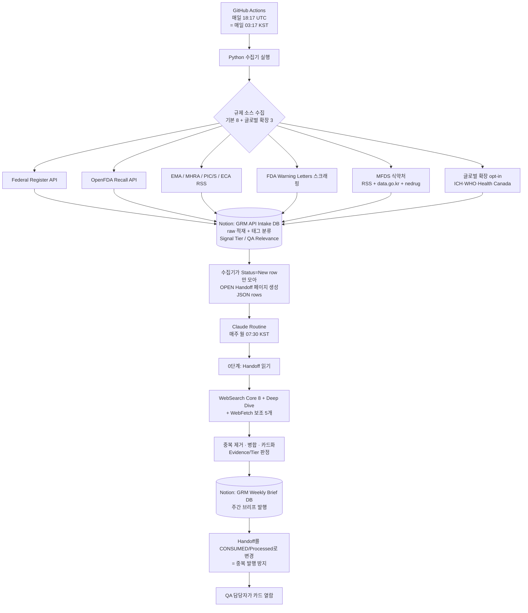

# GRM 시스템 명세서 (System Spec)

> **GRM = Global Regulatory Monitor.** 글로벌·국내(식약처) 제약 GMP/품질 규제 신호를 자동으로 수집·요약해, 한국 제약사 QA 담당자가 "규제가 어떻게 바뀌고 있고 우리가 무엇을 확인해야 하는지"를 카드 형태로 빠르게 파악하도록 돕는 자동화 다이제스트 시스템.
>
> 이 문서는 저장소의 `README.md` 를 **대체** 하는 단일 시스템 명세서입니다. (기존 README는 제거됨)

| 문서 메타 | 값 |
|---|---|
| 문서 버전 | `v1.32` (**MON-P2 상태저장형 관측성 설계 착수 2026-06-12**: P1 health(stateless)가 못 잡는 소스별 연속 0건·침묵 추세를 보조 요약하는 관측 계층 — 설계 결정 4건 확정(ⓑ Notion 이력+ⓒ Run 이력·소스별 빈도등급+flag gate 과알림0·Cowork 주간 스케줄드 태스크 `grm-mon-p2-weekly`·기존 운영경고 Issue). 핵심 발견=`grm-health.json` .gitignore+artifact 부재로 run 간 보존0 → ⓐ 부적합·Notion 1차 원천. M1=코드0(프롬프트+스케줄)·M2=Python 반자동화(K3 종료 후). 비파괴(코드·golden·v16 불변·P1 무간섭·관찰 직교). 설계 `docs/GRM_MON-P2_관측성_설계.md`+실행프롬프트 v0. 직전 **WHY-1 결함내용 트랙 완료 2026-06-12**: 결함 "왜·무엇을" 표출 3종 모두 구현 — ① WHOPIR PDF·② FDA WL 본문 결함 excerpt(→prose_input·Evidence B·flag off `ENABLE_WHOPIR_EXCERPT`/`ENABLE_WL_BODY`·**main 머지 완료**) ③ **FDA 483/EIR 신규 수집기 `collect_fda_483.py`**(가장 깊은 결함 원본=실사 관찰사항·**JSON 전수 backbone + HTML 폴백/Country 보강**·`fda483-source-degraded` 경고·flag off `ENABLE_FDA_483`·Codex 2-HOLD[완전성·데이터경로]→**GO**·머지). 모두 수집기 .py(Routine WebFetch 무관)·golden 불변·K3/BIO-1 관찰 직교. 소스표 #12·플래그 3종 추가. JSON 간헐성 안정화(재시도·캐시)는 운영 P2. 상세 `docs/결함내용_표출감사_FDA483조사_2026-06-11.md`. 직전 **결함내용 표출 감사 + FDA 483 조사(WHY-1) 2026-06-11**: 사용자 가치기준(결함 "why" 우선)으로 감사 — GRM 이 결함 본문을 **MFDS GMP(P6)에서만** 추출하고 **WHO WHOPIR·FDA WL 은 링크+회사명만 잡고 결함 본문을 버림**(코드 확인) → 카드 표면화의 구조적 원인. **권고**: ① WHOPIR PDF 결함 excerpt(P6 재사용) ② FDA WL 본문 excerpt ③ FDA 483/EIR 신규 수집기(OII FOIA Reading Room 으로 수집 가능 확인) — 모두 수집기 .py(Routine WebFetch 무관)·관찰 직교. 이전 신규소스 제안 정정(EDQM 드롭·EudraGMDP 보류). 산출물 `docs/결함내용_표출감사_FDA483조사_2026-06-11.md`. 코드 변경 0. 직전 **신규소스 타당성 조사 2026-06-11**: 관찰 대기 중 K3 무영향 작업으로 **EudraGMDP GMP 비순응 보고서(NCR, WHO NOC 의 EU 정본)** 와 **EDQM CEP 정지/철회**(원료 적합성)를 라이브 fetch 조사 — 둘 다 비브라우저 fetch 가능·구조화 파싱 가능, **채택 권고**. 구현은 CC 별도 트랙(P3-1, 관찰과 직교·착수 자유). 산출물 `docs/신규소스_EudraGMDP_EDQM_타당성_2026-06-11.md`(§5.2 NEWSRC-1). 코드 변경 0. 직전 **GAP-2 해소(P0-2) 2026-06-11**: 브랜드명만 있는 생물주사제(자닥신주=thymosin α-1·Hizentra=IgG)가 한국어 제형 접미사 `주`에 가려 `Chemical`로 오분류되던 GAP-2를 큐레이티드 사전 `MODALITY_BIOLOGIC_BRANDS`(근거 있는 2개: 자닥신·hizentra, 투기적 변이 제거)로 결정론 교정 — `compute_modality()` 1순위 생물 블록에 제형접미사·`product_type=drug`보다 **앞서** 브랜드 부분문자열 매칭 삽입(`collect_intake.py`만). 회귀 GAP2-1~5 + **의도적 supersession 3건**(HC 상세fetch 실패 graceful→Chemical 을 사전 적중분 Biologic 로 일원화), **341 green**. 좁은 범위(MFDS 제품허가 API=PL-7 미연동). golden·scaffold·v16 불변(K3 관찰 불훼손). Codex **GO**(P-1 supersession·P-2 좁은범위 추인)·branch `fix/gap2-brand-biologic` `5840b3d`·사람 승인→머지. 지시문/검토 `archive/point-in-time/GRM_GAP2_modality_*`. 비차단 P3(제품명 키 break→전체합산 하드닝) 후속. 직전 **EVAL-1 착수 2026-06-11**: 발행물 **내용 품질** 채점 게이트 신설 — Brief Lint(구조 PASS/FAIL)가 보지 않는 사실정합·카드 차별화·시사점/점검 유용성을 발행 후 독립 세션 AI 채점자가 정량 평가(E1~E6 rubric·**다관점 QA 페르소나**). 목적=K3 4주 관찰을 정성→정량으로 객관화·가속(매주 스코어카드). 설계 `docs/GRM_Brief_Eval_harness_design.md` + 실행프롬프트 v0 `docs/prompts/GRM_Brief_Eval_실행프롬프트.md`. 함께 §5.2/§5.3 개선 후보를 현 상황(단일 사용자·관찰 3창) 기준 P0~P3 우선순위로 재배열 `docs/GRM_향후과제_우선순위.md`(P0-1=EVAL-1·P0-2=GAP-2 모달리티·P1-1=MON-P2·P1-2=PL-10b/B1). 비파괴(scaffold·collector·golden·v16 불변, K3 관찰 불훼손). 직전 **정밀검토 배치4 2026-06-10**: T1 transient warning 강등 스코프를 ICH/WHO/HC 공개 endpoint 로 확장 — 활성 글로벌 소스의 일시 블립 1건이 일일 run 을 red 로 만들던 false-red 정정(§3.5). 잔여 결함 5건 동반 수정 — B3 GMP 헤더 오탐 판정어 앵커·B4 WHO NOC 침묵 0건 sentinel+core 승격·C1 `_neg_date` 비ASCII 크래시·C2 병합 품목수 off-by-one·C3/C4 WHO RSS2 태그/.pdf 쿼리·암호화 PDF 라벨(§5.2 정밀검토-배치4, golden 불변). 직전 **정밀검토-B1 임시 방어 2026-06-10**: handoff 조회 윈도우 기본 7→30일(`GRM_HANDOFF_WINDOW_DAYS`) + 윈도우 밖 미소비 New row health 경고(`aged-unconsumed-new`) — 주간 Routine 1회 지연 시 New row 영구 누락(침묵) 차단. 브리프 "검색 기간"(payload `window_start`)은 표시 윈도우=주간 유지(조회/표시 분리). 근본 해결(날짜 하한 제거)은 PL-10b 와 별도 트랙(§5.2/§5.3). 직전 **ENABLE_SEARCH 드리프트 false 정정 2026-06-09**: G 무결성 조사로 `vars.ENABLE_SEARCH` 가 GitHub 변수에서 true 로 드리프트(2026-05-29~)된 것을 확인→false 복원, 잔존 Brave New 5건 Skipped(6/15 brief Brave-free). 직전 **K4-1 handoff STALE 가드 + P6~P8 입력 수집 보강 반영 2026-06-08**: handoff emit 시 이전 OPEN handoff 를 STALE 처리(`notion_stale_prior_open_handoffs`)·실행일=handoff run_date 파생·PL-10b 최신 CONSUMED 대조. P6 GMP 지적 excerpt 인용·P7 HC 상세 fetch→유효성분→모달리티 판정(`MODALITY_BIOLOGIC_TERMS` immune globulin 등)·P8 HC firm=실제 회사만(Organization 미사용). v16 R2 작성결함(D1~D7) 동결. 직전 v1.22: ICH 변동추적 보강. **현행 = v16 + handoff v2** (v15.8 은 archive/prompts-old 이관). 4주 관찰 중) |
| 최종 수정일 | 2026-06-11 |
| 현재 상태 | 매일 수집/Notion 적재 동작, GitHub Actions 내부 health check P1 구현. **바이오 소스 1단계: Phase 3 P1 글로벌 3종(ICH·WHO·HC) 라이브 검증 통과(dry-run + 실적재 207건 0실패)·운영 활성(`ENABLE_ICH/WHO/HC=true`)·`feature/biologic-sources` → `main` 머지.** ICH는 정적 guideline snapshot 자동 카드화를 중단하고 Tier 1 모니터링/Skipped 기본으로 운용한다. 실제 ICH 변동은 슬롯 7 공식 news/press-release 검색+WebFetch 로 Step 4·Step 2b·총회 보도자료만 카드/🔮 후보화한다. **Keystone K3 완료·운영 전환(2026-06-06): `ENABLE_HANDOFF_V2=true` + 월요일 Routine 프롬프트 v16(Python-scaffold). 4주 관찰 중** |
| Active phase | 바이오 1단계 활성 — 1~2주 관찰(Biologic 칸 누적 증가·세 수집기 health·발행 브리프) + Phase 4 운영 관찰 + **Keystone K1~K4 중 K1·K2·K2.5·K3 완료·운영 전환됨(`ENABLE_HANDOFF_V2=true`·v16 Python-scaffold, 2026-06-06). K3 4주 관찰(Lint 0·Status 누락 0) 통과 시 종료 → K4(Status/Lint Python 마감)** + (필요 시 2단계 FDA CBER guidances 신규 수집기 트랙) |
| 주요 enabled flags | 운영 기본: `ENABLE_MFDS/RECALL/ADMIN/GMP_INSPECTION=true`, `ENABLE_MODALITY_TAG=true`(2026-06-04 활성), **`ENABLE_ICH/WHO/HC=true`(2026-06-05 활성)**, **`ENABLE_HANDOFF_V2=true`(2026-06-06 활성 — K3 운영 전환)**, `ENABLE_SCRAPE/MOLEG_API=false` |
| 기준 시스템 버전 | `origin/main` `2dcc714`(K4-1 + P6~P8 머지) — 바이오 1단계·Keystone K1~K3·K4-1·P6~P8 머지 반영 · **Routine 프롬프트 `v16`(Python-scaffold, 현행 — R2 작성결함 동결 포함)** |
| 코드 저장소 | https://github.com/MINHOYEOM/grm-api-intake |
| 발행 위치 | Notion `Global Regulatory Monitor` 부모 페이지 하위 |

---

## 0. 이 문서를 쓰는 법 (유지 규칙)

이 문서는 **"살아있는 명세서"** 입니다. 한 번 쓰고 끝내는 게 아니라, 시스템이 바뀔 때마다 같이 갱신합니다.

- **큰 틀 위주로 갱신한다.** 자잘한 버그 수정·문구 변경은 코드 커밋/프롬프트 버전으로 충분합니다. 이 문서는 **구조·소스·단계가 바뀌는 "큰 변경"** 만 반영합니다. (예: 새 규제 소스 추가, 새 Phase 진입, 데이터 흐름 변경)
- **변경은 해당 섹션 안에 기록한다.** 각 섹션 끝의 `📝 변경 이력` 표에 한 줄 추가합니다. 별도의 통합 changelog는 두지 않습니다.
- **상단 "문서 메타" 의 버전·수정일·기준 버전** 을 같이 갱신합니다.
- **파일·폴더가 추가·이동·삭제되면 `4.1 저장소 폴더 구조` 트리를 함께 갱신합니다.** (이 문서가 폴더 구조의 단일 기준)
- 변경 이력 한 줄 형식: `날짜 · 무엇이 어떻게 바뀌었나 · (연관 커밋/프롬프트 버전)`

> 이 문서의 목적은 ① 개발 중 기준점, ② 다음 작업 때 진행 정도 확인, ③ 추후 최종 사용자 안내문 제작의 토대입니다.

---

## 1. 시스템 개요 · 목적

### 1.1 무엇을 하나
GRM은 전 세계 주요 규제기관과 한국 식약처(MFDS)의 **제약 제조·품질(GMP/QA) 관련 규제 신호** 를 자동으로 모읍니다. 모은 정보를 그대로 던져주는 게 아니라, 사람이 빠르게 읽을 수 있는 **카드형 요약** 으로 가공해 매주 Notion에 발행합니다. 사용자는 카드를 보고 (1) 규제가 어떻게 변하는지 인지하고, (2) 우리 QA가 무엇을 점검해야 하는지 파악하며, (3) 반복적으로 보면서 규제 흐름에 대한 학습 효과를 얻습니다.

### 1.2 왜 만드나 (해결하는 문제)
규제 정보는 FDA·EMA·MHRA·PIC/S·ICH·TGA·식약처 등 **출처가 흩어져 있고**, 매주 사람이 일일이 확인하기에는 양이 많고 영문 원문도 부담입니다. GRM은 이 모니터링을 자동화하고, 핵심만 한국어로 요약하되 **원문 링크(듀얼 링크)** 를 항상 함께 제공해 신뢰성과 추적성을 유지합니다.

### 1.3 핵심 설계 원칙
- **원문 우선·추적 가능:** 모든 카드에 정보 출처(📰)와 공식 원본(📎) 두 링크를 붙입니다. 1차 공식문서 직접 확인 항목(Evidence A)만 원문을 인용(quote)합니다.
- **사실과 해석의 분리:** 객관적 사실과 AI 해석(노란색 '시사점')을 시각적으로 분리합니다.
- **신뢰도 등급화:** 모든 카드에 Evidence Level(A/B/C)과 Signal Tier(1/2/3)를 표기합니다.
- **장애에 강하게(Graceful degradation):** 수집기가 실패해도 Routine은 WebSearch 단독 모드로 계속 동작합니다.

### 1.4 대상 사용자
**의약품 전반을 다루는 한국 제약사의 QA 담당자.** 특정 제품·제형으로 좁히지 않고 **원료 성격 기준 '큰 틀' 3분류 — 화학합성(케미컬)의약품 · 생물의약품 · 기타** 로 봅니다(의료기기는 범위 밖). 글로벌 규제 변화와 국내 GMP 제조/품질 신호(실태조사·행정처분·회수 등)를 제품군 전반에 걸쳐 함께 모니터링합니다. (2026-06-04 제품군 확장 이전에는 경구 고형제 중심.)

#### 📝 변경 이력 — 개요·목적
| 날짜 | 변경 내용 |
|---|---|
| 2026-06-02 | 최초 작성 (현재 시스템 기준 정리) |
| 2026-06-04 | **제품군 확장**: 대상 범위를 경구 고형제 중심 → 의약품 전반으로 확대(Phase 4). 특정 제품이 아닌 원료 성격 '큰 틀' 3분류(화학합성·생물·기타). 의료기기는 제외 유지 |

---

## 2. 풀스택 구성

GRM은 크게 **5개 계층** 으로 이루어집니다. 무거운 서버 없이, GitHub Actions(연산) + Notion(저장·표시) + Claude(분석·생성)를 조합한 구조입니다.

| 계층 | 역할 | 사용 기술 / 위치 |
|---|---|---|
| ① 수집(Collector) | 11개 규제 소스에서 원시 데이터를 가져옴 (기본 8 + 글로벌 확장 ICH·WHO·HC, opt-in) | Python 3.12 (`requests`, `PyMuPDF`) |
| ② 실행·스케줄(Runtime) | 수집기를 정해진 시각에 자동 실행 | GitHub Actions (`ubuntu-latest`, cron) |
| ③ 저장(Staging) | 수집한 raw 데이터 + 분류 태그를 저장 | Notion DB — `GRM API Intake` |
| ④ 분석·생성(Routine) | 저장된 신호를 읽어 카드형 다이제스트로 가공 | Claude (Anthropic) + MCP 도구 |
| ⑤ 발행(Publish) | 완성된 주간 브리프를 사람에게 보여줌 | Notion DB — `🌐 GRM Weekly Brief` |

### 2.1 계층별 상세

**① 수집 — Python 수집기**
순수 Python 스크립트 묶음입니다. 외부 의존성은 HTTP 클라이언트 `requests` 와 PDF 파서 `PyMuPDF`(식약처 실태조사 결과 PDF용) 둘뿐으로 가볍게 유지합니다. 공통 HTTP 로직(재시도, 429 Retry-After 백오프, JSON/XML 파싱)은 `grm_common.py` 로 분리되어 모든 수집기가 공유합니다.

**② 실행·스케줄 — GitHub Actions**
서버를 직접 운영하지 않고 GitHub의 무료 러너에서 주기 실행합니다. 워크플로우(`grm-intake.yml`, 이름 `GRM API Intake (Daily)`)는 **매일 18:17 UTC(= 매일 03:17 KST, cron `17 18 * * *`)** 에 자동 실행되며, 수동 실행(`workflow_dispatch`)으로 dry-run·수집 윈도우·소스별 활성화(`ENABLE_*`) 조정도 가능합니다. 수집기는 실행 말미에 `grm-health.json` 과 `GITHUB_STEP_SUMMARY` health 섹션을 생성합니다. 실패(failure)는 workflow exit 1과 KST 실행일 기준 GitHub Issue로, 경고(warning)는 exit 0을 유지하면서 고정 제목 `GRM Intake 운영 경고` Issue에 누적 comment로 남깁니다. 비밀값(Notion 토큰 등)은 GitHub Secrets에만 보관합니다.

**③ 저장 — Notion `GRM API Intake` DB (Staging)**
수집기가 가져온 모든 항목이 1차로 쌓이는 **임시 적재(staging) 데이터베이스** 입니다. 각 행(row)에는 분류 태그(Source, Signal Tier, QA Relevance, Evidence Candidate 등)가 붙고, 페이지 본문에는 **원본 API 응답 JSON 전체** 가 보존됩니다(Evidence A 재검증용). 별도의 외부 DB(Postgres 등) 없이 Notion 자체를 DB로 사용하는 것이 이 시스템의 특징입니다.

**④ 분석·생성 — Claude Routine**
주간 Routine은 Claude(Anthropic)가 긴 프롬프트(현행 `v16` Python-scaffold — 카드 골격은 수집기가 조립한 handoff v2 를 받아 카드별 6슬롯 산문만 채워 발행)에 따라 수행합니다. Claude는 세 가지 MCP 도구를 사용합니다: **Notion MCP**(Intake 읽기 + 브리프 쓰기), **WebSearch**(이벤트 탐지, 주 9회 한도), **WebFetch**(지정된 5개 보조 출처 콘텐츠 흡수). Claude가 직접 공식 API를 호출하지는 않습니다(클라우드 egress 차단 → 수집기에 위임).

**⑤ 발행 — Notion `🌐 GRM Weekly Brief` DB**
완성된 주간 다이제스트가 페이지로 발행되는 곳. 사용자가 실제로 읽는 최종 산출물입니다.

### 2.2 두 개의 Notion 데이터베이스
둘 다 `Global Regulatory Monitor` 부모 페이지 하위에 있습니다.

| DB | 역할 | ID |
|---|---|---|
| `GRM API Intake` | 수집 staging (기계가 적재) | `7784c71fb7b343749b2bee5d04db7926` |
| `🌐 GRM Weekly Brief` | 주간 발행물 (사람이 읽음) | `3653142f-dc11-8049-806d-e0a779cafd90` |

`🌐 GRM Weekly Brief` DB의 속성은 `이름`(제목) · `검색 기간`(text) · `발행일`(date) · `출처 기관`(멀티셀렉트) · `카테고리`(멀티셀렉트: Warning Letter / Guidance / Guideline / Other)이며, 갤러리·테이블·카테고리별·기관별 뷰를 제공합니다. `출처 기관` 옵션은 FDA·EMA·MHRA·PIC/S·ICH·WHO·Health Canada 에 더해 **2026-06-04 에 MFDS·TGA·ECA 를 추가**해 총 10종이 됐습니다(Routine 프롬프트 v15.7 개선 시 함께 반영). ICH·WHO·Health Canada는 P1 전용 수집기로 채워지고, 이전에 비어 있던 **MFDS(식약처) 옵션 갭이 해소**되어 국내 카드의 기관 태그가 더 이상 비지 않습니다. Routine v15.7 은 그 주 카드에 등장한 모든 기관(국내 카드가 있으면 MFDS 포함)을 빠짐없이 태그하도록 지시합니다.

#### 📝 변경 이력 — 풀스택
| 날짜 | 변경 내용 |
|---|---|
| 2026-06-02 | 최초 작성. 5계층(수집/실행/저장/분석/발행) 구조 정리 |
| 2026-06-02 | 실행 계층 정정: 워크플로우가 **매일(Daily, cron `17 20 * * *`)** 실행임을 `origin/main` 으로 확인·반영 |
| 2026-06-02 | 수집 계층 소스 8개 → 11개(글로벌 확장 ICH·WHO·HC, opt-in). Weekly Brief `출처 기관`의 ICH·WHO·HC 옵션이 실제 수집기로 채워짐을 §2.2에 명시 |
| 2026-06-04 | 실행 계층에 운영 health check 추가: `grm-health.json`, step summary health 섹션, 실패 Issue 보강(KST 실행일·label 보장), warning Issue 누적 comment 방식 반영 |
| 2026-06-04 | cron `17 20` → `17 18 * * *`(03:17 KST)로 2h 앞당김 — scheduled run 실측 ~2.5h 지연(06-02/03)으로 월요일 Routine(07:30 KST)과 역전 위험 해소 |
| 2026-06-04 | FDA WL 식품/HACCP/FSVP/건기식 항목과 MFDS GMP 실태조사 의료용 고압가스 업체를 Intake 단계에서 제외하는 노이즈 필터 추가 |
| 2026-06-04 | Routine 프롬프트 `v15.6.3` → `v15.7` 개선(분석 계층). Weekly Brief `출처 기관` 멀티셀렉트에 MFDS·TGA·ECA 옵션 추가(7종→10종)로 §2.2 MFDS 태그 갭 해소 |
| 2026-06-04 | **제품군 확장(Phase 4)**: 분석 계층 프롬프트 `v15.7` → `v15.8`(제품군 역할·백신/CGT 제외규칙 재설계·Recall Tier 무균/바이오 확장·제품군 배지·제품군별 발행 그룹핑). 수집 계층은 소스 추가 없이 `compute_modality`(원료 성격 3분류: 화학합성·생물·기타)·키워드/Tier 확장·Notion `Modality` 속성(게이트) 추가 |

---

## 3. 작동 방식 · 데이터 흐름

### 3.1 전체 흐름도



### 3.2 단계별 설명

**1단계 — 수집 (매일 03:17 KST, GitHub Actions)**
수집기가 **매일** 8개 소스를 호출해 최근 항목을 가져옵니다(기본 윈도우 7일). 각 항목에 대해 수집기가 1차로 **Signal Tier(1~3)** 와 **QA Relevance(Likely/Possible/Unrelated/Pending)** 를 휴리스틱으로 자동 분류해 Notion `GRM API Intake` DB에 `Status=New` 로 적재합니다. 페이지 본문에는 원본 JSON 전체를 보존합니다. (수집은 매일, 발행은 주간이므로 한 주간 쌓인 New 항목이 누적되었다가 월요일 Routine이 한 번에 처리합니다.)

경구 고형제 QA 다이제스트 가치가 낮은 명시적 노이즈는 Intake 전에 제외합니다. 현재 제외 기준은 FDA Warning Letter의 식품/HACCP/FSVP/건기식 도메인 항목과 MFDS GMP 실태조사의 의료용 고압가스 업체입니다.

**2단계 — Handoff 생성 (멱등성 게이트)**
수집기는 Notion API 속성 필터로 `Status=New` 인 항목만 모아 `OPEN GRM Routine Handoff {날짜}` 라는 인계(handoff) 페이지를 만듭니다. 본문은 `rows[]` 를 담은 JSON입니다. 이것이 **Routine이 읽을 유일한 입력 큐** 입니다. **(K4-1, 2026-06-08)** handoff 생성 직후 `notion_stale_prior_open_handoffs()` 가 이전 날짜의 OPEN handoff 를 **STALE** 로 전환해 이중 소비를 근본 차단합니다(개별 row 의 Status 는 불가침). 실행일(`run_date`)은 최신 OPEN handoff 의 날짜에서 파생하며, PL-10b 가드가 직전 CONSUMED handoff 와 대조합니다. **(B1 임시 방어, 2026-06-10)** handoff **조회** 윈도우(Run Date 하한)는 기본 **30일**(`GRM_HANDOFF_WINDOW_DAYS`, CLI `--handoff-window-days` 우선)로 발행 cadence(주간 7일)를 초과 — 주간 Routine 이 1회 지연돼도 미소비 New row 가 윈도우 밖으로 빠지지 않습니다. 단 payload 의 `window_start~window_end`(v16 프롬프트가 브리프 **"검색 기간"** 으로 렌더)는 **표시 윈도우 = 수집 윈도우(주간 7일)를 유지**합니다(조회/표시 분리 — 프롬프트 "지난 7일" 문구와 정합, 30일 조회는 누락 catch-up 안전망으로만 동작). 그래도 윈도우 밖에 남은 미소비 New row 는 health 경고(`aged-unconsumed-new`)로 표면화합니다(침묵 누락 방지, §3.5).

**3단계 — 분석·생성 (매주 월 07:30 KST, Claude Routine)**
Claude가 handoff의 `rows[]` 만 읽어(0단계), 이어서 WebSearch(Core 8개 슬롯 + Deep Dive 1개, 주 9회 한도)와 WebFetch(지정 보조 출처 5개 URL)로 추가 탐지·보강을 합니다. 그 다음 Intake/Search/Fetch에서 나온 동일 이벤트를 **중복 제거·병합** 하고, 13개 카테고리 필터·Recall 3-tier 규칙 등을 적용해 **카드** 로 만듭니다.

**4단계 — 발행**
완성된 다이제스트를 `🌐 GRM Weekly Brief` DB에 새 페이지로 발행합니다. 글로벌 섹션(🌐)과 국내 식약처 섹션(🇰🇷)을 2단으로 나눠 구성합니다.

**5단계 — 멱등성 마감**
발행이 끝나면 handoff를 `CONSUMED.../Status=Processed` 로 바꿉니다. 같은 날 Routine을 두 번 돌려도 이미 처리된 항목을 다시 카드화하지 않도록 막는 장치입니다(PL-10에서 도입).

### 3.3 핵심 개념

- **Signal Tier (신호 강도):** Tier 3(우선 카드화, 고위험) / Tier 2(학습·참고) / Tier 1(모니터링 로그만). 수집기가 1차 부여하고 Routine이 교차 판단합니다.
- **Evidence Level (근거 등급):** A(1차 공식문서 직접 확인 — 원문 quote 허용) / B(공식 인덱스 + 보조 출처) / C(보조 출처 단독) / D(예정·진행 중 Watch 항목).
- **듀얼 링크:** 모든 카드에 📰 정보 출처(실제로 콘텐츠를 가져온 URL) + 📎 공식 원본(규제기관 사이트 URL)을 함께 표기. 공식 원본은 L1(개별 직링크)→L2(인덱스)→L3(기관 홈) 순으로 fallback.
- **Graceful degradation:** 수집기/Notion 장애로 handoff가 없거나 0건이면, Routine은 WebSearch 단독(v14.5) 모드로 자동 강등해 계속 동작합니다.

### 3.4 수집 대상 소스 (기본 8 + 글로벌 확장 3)

| # | 소스 | 채널 | 수집기 |
|---|---|---|---|
| 1 | Federal Register (FDA 규칙·고시) | 공식 API | `collect_intake.py` |
| 2 | OpenFDA Drug Enforcement (회수) | 공식 API | `collect_intake.py` |
| 3 | EMA (유럽) | RSS | `collect_intake.py` |
| 4 | MHRA Inspectorate (영국) | RSS | `collect_intake.py` |
| 5 | PIC/S | RSS | `collect_intake.py` |
| 6 | ECA Academy | RSS | `collect_intake.py` |
| 7 | FDA Warning Letters | 웹 스크래핑 | `collect_intake.py` |
| 8 | MFDS 식약처 (지침·고시·입법예고·안전성서한·행정처분·회수·GMP 실태조사) | RSS + data.go.kr API + nedrug 스크래핑 | `collect_mfds*.py` |
| 9 | **ICH** (Quality·Multidisciplinary 가이드라인·Public Consultations) | admin.ich.org 섹션 제목 스냅샷(Tier 1 참조) + Routine 공식 news/press-release 이벤트 검색 | `collect_ich.py` (`ENABLE_ICH`, 기본 off) + v16 슬롯 7 |
| 10 | **WHO Prequalification** (RSS 뉴스 + WHOPIR 공개 실사보고서 + NOC GMP 비순응) | RSS + extranet.who.int Drupal 페이지 | `collect_who.py` (`ENABLE_WHO`, 기본 off) |
| 11 | **Health Canada** (약품 recall·safety alert) | 오픈데이터 JSON + 상세 페이지 fetch(P7 유효성분→모달리티) | `collect_hc.py` (`ENABLE_HC`, 기본 off) |
| 12 | **FDA 483/EIR** (실사 관찰사항·실사보고서 = 가장 깊은 결함 원본, WHY-1 #3) | OII FOIA Reading Room **DataTables JSON 전수** + HTML 폴백/Country 보강 + 건별 483 PDF excerpt(PyMuPDF) | `collect_fda_483.py` (`ENABLE_FDA_483`, 기본 off) |

> 보조: `collect_search.py` 가 Brave Search 기반 보충 탐지를 담당(특정 슬롯 한정, `ENABLE_SEARCH` 기본 비활성). MFDS는 RSS 외에 회수·행정처분·GMP 실태조사 하위 수집기(`collect_mfds_recall/admin_action/gmp_inspection.py`, `ENABLE_MFDS_*` 기본 활성)로 세분화되어 있습니다.
> 글로벌 확장(ICH·WHO·HC)은 모두 **기본 off**이며 `ENABLE_*` 또는 `--sources {ich,who,hc}` 로 단독 실행됩니다. ICH guideline 페이지는 정적 토픽 목록이라 스냅샷 row 는 Tier 1/Skipped 기본이며, Step/Revision/공개협의/총회 보도자료 같은 실제 변동은 Routine 슬롯 7 이 공식 ICH news/press-release 를 검색·WebFetch 해 보강합니다.
> **TGA(호주)는 검토 후 제외:** www.tga.gov.au가 비브라우저 fetch를 차단(WAF)하고 공식 API가 없으며, TGA가 **PIC/S를 따르므로 PIC/S 수집기로 상당 부분 커버**되어 가치 대비 비용이 낮음.
> **FDA WL 노이즈 필터(Keystone M0, 2026-06-05):** FDA Warning Letters 는 식품·수의·담배·기기 부서 WL 까지 한 페이지에 노출되므로, `collect_intake.py` 가 본문 키워드(`FDA_WL_LOW_VALUE_KEYWORDS`)에 더해 **발행 부서(`issuing_office`) 1차 게이트**(`_fda_wl_office_gate`)로 거른다. 무조건 제외=CFSAN·HFP·CVM·CTP·CDRH, 맥락 제외=OII(식품/HACCP/FSVP 맥락만), 유지=CDER·CBER, 부서 결측·미매핑은 기존 본문 키워드 폴백. OII 맥락 모호분(약품·식품 단서 모두 없음)은 약품 WL 오삭제 방지를 위해 보수적 유지(Notion `Status=Needs Review` 마킹은 인프라 부재로 K4 이월). 정의 근거: `GRM_architecture_redesign.md` §7.

### 3.5 운영 모니터링 health check

운영 모니터링의 P1 기준은 **GitHub Actions 내부 health check** 입니다. 장기 운영의 핵심 알림은 수집 직후 같은 workflow에서 판정해야 하므로, Codex heartbeat는 보조 요약자(P2)로 둡니다.

- **단일 판정 지점:** `collect_intake.py` 의 `_evaluate_health()` 가 exit code·step summary·`grm-health.json`·Issue 본문이 공유하는 단일 health 판정 기준입니다. 기존 insert 실패/활성 소스 오류/핵심 소스 전부 실패/handoff 실패 판정을 중복 계층으로 만들지 않고 이 함수에 모았습니다.
- **Failure:** Notion insert 최종 실패, Routine handoff 실패, Federal Register+OpenFDA 동시 실패, Phase 1 비활성 실행에서 활성 소스 전체가 비일시 오류로 실패, `ENABLE_SEARCH=true` Brave 전체 오류, 활성 MFDS/ICH/WHO/HC 소스의 설정 오류·구조 변경·비일시 오류는 exit 1입니다. scheduled run에서는 날짜별 `GRM Intake 실패 — YYYY-MM-DD` Issue가 생성되며 health JSON의 failure finding이 본문에 들어갑니다.
- **Warning:** scheduled run에서 `ENABLE_MOLEG_API=true` 감지, MFDS RSS/nedrug GMP 실태조사 공개 endpoint **및 ICH/WHO/HC 공개 endpoint(admin.ich.org·extranet.who.int·recalls-rappels.canada.ca — 전부 키 없는 공개 페이지, 정밀검토-T1)** 의 timeout·connection reset·429·5xx·공개 페이지 403 같은 transient 오류, GMP 실태조사 첨부 manual-review 필요, GMP 페이지네이션 경고, FR/OpenFDA truncation, 미구현 `ENABLE_SCRAPE=true`, **handoff 윈도우 밖 미소비 New row 잔존(`aged-unconsumed-new` — 주간 Routine 누락/지연 의심, B1 임시 방어)** 는 exit 0 warning입니다. scheduled run에서는 고정 제목 `GRM Intake 운영 경고` Issue를 찾고, 열려 있으면 comment를 누적합니다.
- **0건 판정:** MHRA/PIC/S 등 저빈도 소스는 일일 0건이 정상일 수 있습니다. MFDS Recall/Admin/GMP Inspection도 하루 0건은 정상 가능성이 있으므로 P1에서는 failure로 보지 않습니다. “연속 7일 0건” 같은 상태 저장이 필요한 판정은 P2 Codex heartbeat 또는 Actions/Notion 이력 조회 설계로 넘깁니다.
- **GMP 첨부 상태:** `collect_mfds_gmp_inspection.py` 는 `attachment_parse_status`, `attachment_deficiency_assessment`, `manual_review_required`, 중간 페이지 경고를 health 메타로 노출합니다. 사람이 직접 봐야 할 첨부가 생기면 warning으로 남겨 조용히 묻히지 않게 합니다.

#### 📝 변경 이력 — 작동 방식·데이터 흐름
| 날짜 | 변경 내용 |
|---|---|
| 2026-06-02 | 최초 작성. Intake-first + Handoff 멱등성 흐름(v15.6.3) 기준 |
| 2026-06-02 | "매일 수집 / 주간 발행" 모델로 1단계 정정(매일 New 누적 → 월요일 Routine 일괄 처리). 다이어그램·소스 표 반영 |
| 2026-06-02 | P1 글로벌 확장: ICH·WHO·Health Canada 수집기 추가(기본 off). 소스 표·흐름도 갱신. TGA는 WAF 차단·PIC/S 중복으로 제외 |
| 2026-06-04 | §3.5 운영 모니터링 health check 신설. GitHub Actions 내부 판정(P1)과 Codex heartbeat 보조 요약(P2), failure/warning 기준, 0건 판정 원칙, GMP 첨부 parse warning 표면화 기준 명시 |
| 2026-06-04 | MFDS RSS/nedrug GMP 공개 endpoint의 일시 네트워크·WAF성 오류를 failure에서 warning으로 강등. 설정 오류·구조 변경·Notion/handoff 실패는 failure 유지 |
| 2026-06-08 | **K4-1 handoff STALE 가드:** handoff emit 시 `notion_stale_prior_open_handoffs()` 가 이전 OPEN handoff 를 STALE 전환(개별 row Status 불가침)·실행일=최신 OPEN run_date 파생·PL-10b 최신 CONSUMED 대조. **P6** GMP 지적사항 excerpt(표지 이후 findings 구간 인용). **P7** HC 상세 fetch → 유효성분 → `MODALITY_BIOLOGIC_TERMS` 매칭(immune globulin 등 brand-only→Biologic). **P8** HC firm = 실제 Company 라벨만(Organization 미사용). **v16 R2** 작성결함(D1~D7) 동결 |
| 2026-06-10 | **정밀검토-B1 임시 방어(배치2):** handoff **조회** 윈도우 기본 7→30일(`GRM_HANDOFF_WINDOW_DAYS`, CLI 우선) — 주간 Routine 1회 지연 시 미소비 New row 영구 누락 차단(dedup 30일과 정합). payload `window_start`(브리프 "검색 기간")는 표시 윈도우=수집 윈도우(주간) 유지 — 조회/표시 분리로 v16 "지난 7일" 정합. 윈도우 밖 잔존 미소비 New 는 `aged-unconsumed-new` health 경고로 표면화(§3.5). 근본 해결(날짜 하한 제거)은 PL-10b 와 묶어 별도 트랙(§5.3) |
| 2026-06-10 | **정밀검토-T1(배치4):** transient warning 강등 스코프를 ICH/WHO/HC 공개 endpoint 로 확장 — 종전엔 MFDS 계열만 적격이라 활성 ICH/WHO/HC 의 timeout·5xx 일시 블립 1건으로도 일일 run 전체가 failure(exit 1)+실패 Issue(false-red). 403 도 키 없는 공개 페이지라 WAF/IP 차단성으로 동일 강등. 설정·구조 오류는 마커 미포함이라 failure 유지. 2026-06-05 활성화 때 누락된 스코프 정정 |

---

## 4. 구성 요소 레퍼런스 (개발용)

### 4.1 저장소 폴더 구조

> 파일·폴더가 추가/이동/삭제되면 이 트리를 갱신한다. (구조의 단일 기준)

```
v15.0-implementation/
├─ GRM_SYSTEM.md          # 시스템 대표 문서(이 파일, README 대체)
├─ CLAUDE.md              # 새 세션이 자동으로 읽는 작업 지침(유지 규칙·구조 원칙 요약)
│
├─ collect_intake.py      # 메인 수집기 = 오케스트레이터(워크플로우가 호출하는 단일 진입점)
├─ collect_mfds.py        # 식약처 RSS 게시판
├─ collect_mfds_admin_action.py     # 식약처 행정처분
├─ collect_mfds_gmp_inspection.py   # 식약처 GMP 실태조사
├─ collect_mfds_recall.py           # 식약처 회수·판매중지
├─ collect_ich.py         # [P1] ICH 가이드라인 섹션 스냅샷 (ENABLE_ICH, off)
├─ collect_who.py         # [P1] WHO PQ: RSS+WHOPIR+NOC (ENABLE_WHO, off)
├─ collect_hc.py          # [P1] Health Canada 약품 recall JSON (ENABLE_HC, off)
├─ collect_fda_483.py     # [WHY-1 #3] FDA 483/EIR 실사 관찰사항 — JSON 전수+HTML 폴백+PDF excerpt (ENABLE_FDA_483, off)
├─ collect_search.py      # Brave 보조 검색
├─ card_scaffold.py       # [K2] 결정론 카드 골격 조립기(순수): build_card_scaffold + assemble_brief_skeleton
├─ grm_common.py          # 공통 HTTP/재시도 헬퍼
├─ probe_*.py             # 개발용 탐침 스크립트(운영 무관)
│
├─ tests/                 # 회귀 테스트 (unittest)
│  ├─ test_noise_filters.py           # WL 부서 게이트(M0)+식품/건기식·MFDS 가스 필터 회귀
│  ├─ test_modality.py                # [제품군 확장] 제품군(Modality) 3분류 + 무균/바이오 신호 비누락 회귀
│  ├─ test_modality_live_revalidation.py  # [제품군 확장] 2026-06-04 라이브 실데이터 한국어 정제/주사제·생물원료 회귀(25건)
│  ├─ test_k2_prep.py                 # [K2] page_id raw fetch·하이브리드 부착·graceful degrade 회귀
│  ├─ test_card_scaffold.py           # [K2/K2.5] build_card_scaffold golden(활성 소스 전 유형 16종+페이지) 바이트 동결·금지문법 부재·Evidence A⟺quote 정합
│  ├─ test_handoff_v2.py              # [K2] handoff v2 플래그·additive·raw 미포함·children 분할·v1 스냅샷 잠금 + [K4-1] STALE 가드
│  ├─ test_hc.py                      # [P7/P8] HC 상세 fetch 파서·모달리티 재판정·firm 매핑 회귀 + [A4] 제형 키 표면화
│  ├─ test_gmp_inspection.py          # [P6] GMP 지적사항 excerpt 추출 회귀
│  ├─ test_recall_pagination.py       # [B2] recall 페이지네이션 정렬 비의존·totalCount 종료 회귀
│  ├─ test_handoff_window.py          # [B1] handoff 윈도우 30일 결정·쿼리 하한·노후 미소비 New 경고 회귀
│  ├─ test_orchestration.py           # [D1-T1] dedup 승자/정렬·_evaluate_health 전 분기·transient 분류기 동결
│  ├─ test_parsers_mappers.py         # [D1-T2] RSS/Atom 날짜·윈도우 경계·doc_id·WL 테이블 파서·Notion 속성/children 매핑 동결
│  ├─ test_collectors_phase1.py       # [D1-T3] FR·OpenFDA 수집기 HTTP 스텁 — error vs empty·pagination·truncation·키 마스킹
│  ├─ test_who.py                     # [B4·C3] WHO NOC sentinel/별칭 선택자/core 전파 + RSS2 태그 제거·WHOPIR .pdf 쿼리 회귀
│  └─ golden/                         # [K2] 카드 골격 golden fixture(input/expected.md/json)+v1 스냅샷 + HC biologic recall fixture
│
├─ setup.sh / setup.ps1   # 최초 셋업 스크립트
├─ requirements.txt       # 파이썬 의존성
├─ .env.example           # 환경변수 예시
├─ .gitattributes         # 줄끝 정책(eol=lf) — CRLF 회귀 방지
├─ .gitignore             # git 제외 목록(/archive/, grm-health.json, scheduled_*.log 포함)
├─ .github/workflows/grm-intake.yml   # 매일 자동 수집 + health check/Issue 워크플로우
├─ .github/workflows/grm-ci.yml       # push/PR 시 py_compile + unittest 회귀 게이트
│
├─ docs/                  # 현행 문서 (git 추적)
│  ├─ notion_intake_db_schema.md      # Intake DB 스키마
│  ├─ setup_guide.md                  # 셋업 가이드
│  ├─ ops_runbook.md                  # 운영 runbook (Secrets 로테이션·주간 점검·장애 분기·아카이브 정책·인수인계)
│  ├─ GRM_architecture_redesign.md    # 목표 아키텍처(v16): Python-thick/Routine-thin 책임분리·handoff v2·마이그레이션 M0~M5
│  ├─ GRM_Keystone_charter.md         # Keystone 프로젝트 헌장·로드맵 K1~K4(+M0/M5)·Phase B
│  ├─ GRM_card_spec_v16.md            # 카드 스펙 v16(틀): 칸별 Python/LLM 책임·필드매핑·출력매트릭스·golden 방법론
│  ├─ GRM_session_decisions.md        # 의사결정 로그
│  ├─ GRM_Brief_Eval_harness_design.md # [EVAL-1] 발행물 내용 품질 채점 하니스 설계(E1~E6·다관점·E1/E2 2단계)
│  ├─ GRM_MON-P2_관측성_설계.md        # [MON-P2/P1-1] 상태저장형 관측성 설계(소스별 연속0건·침묵 추세·ⓑNotion+ⓒRun·빈도등급·M1/M2)
│  ├─ GRM_향후과제_우선순위.md         # 개선·고도화 후보 P0~P3 재배열(§5 보조 로드맵)
│  ├─ 신규소스_EudraGMDP_EDQM_타당성_2026-06-11.md # [P3-1] EudraGMDP NCR·EDQM CEP 접근성 조사(결함내용 기준 정정: EDQM 드롭·EudraGMDP 보류)
│  ├─ 결함내용_표출감사_FDA483조사_2026-06-11.md # [WHY-1] 결함"why" 표출 감사(WHOPIR·WL 본문 미캡처)+FDA 483/EIR 조사(수집 가능)
│  ├─ GRM_점검_통합punchlist_….md      # 최신 점검 목록
│  ├─ prompts/            # 현행 Routine 프롬프트(v16 Python-scaffold)·카드포맷 표준·Brief Lint·Brief Eval·MON-P2 주간점검·검증 프롬프트
│  └─ specs/              # 구현된 수집기 스펙
│
└─ archive/               # 옛/완료 문서 (로컬·git 히스토리에 보존, 추적 제외)
   ├─ prompts-old/        # 옛 버전 프롬프트(v15.0/v15.5/patch/v15.6.3/v15.7/v15.8) — 현행은 docs/prompts/GRM_Prompt_v16.md
   ├─ handoffs-done/      # 완료된 의뢰·핸드오프
   └─ point-in-time/      # 1회성 산출물
```

구조 원칙: **코드(`.py`)는 루트에 평면 유지**(같은 폴더 import 의존 → 이동 금지). 문서만 폴더로 분류. **git은 현행(루트 + `docs/`)만 추적**하고 `archive/`는 로컬·히스토리에만 보존. `__pycache__`(파이썬 캐시)·`.claude`(설정)는 git 대상이 아닌 로컬 전용.

### 4.2 코드 파일
| 파일 | 역할 |
|---|---|
| `collect_intake.py` | **오케스트레이터 겸 메인 수집기.** FR + OpenFDA + RSS 4종(EMA·MHRA·PIC/S·ECA) + FDA WL을 직접 수집하고, `ENABLE_*`(또는 `--sources`) 플래그에 따라 MFDS·ICH·WHO·HC·Brave 하위 수집기를 import·실행. Intake 적재 + Handoff 생성 + `_evaluate_health()` 운영 판정 + `grm-health.json` 생성까지 담당 (워크플로우는 이 파일 하나만 호출). **(제품군 확장)** `compute_modality()`(화학합성·생물·기타 1차 분류)와 무균/바이오 QA·Tier 키워드 확장 포함. `ENABLE_MODALITY_TAG=true` 일 때 Notion `Modality` 속성 기록 |
| `collect_mfds.py` | 식약처 RSS 7개 게시판 수집 (지침·고시·입법예고·안전성서한 등) |
| `collect_mfds_admin_action.py` | 식약처 행정처분 (data.go.kr) |
| `collect_mfds_gmp_inspection.py` | 식약처 GMP 실태조사 결과 (nedrug, PDF/HWPX 본문 파싱; 미파싱 첨부는 manual-review 플래그). 첨부 parse status와 페이지 경고를 `LAST_HEALTH` 메타로 노출해 운영 warning에 반영. **(P6)** 지적사항 본문에서 표지 이후 실사 findings(지적사항/결론) 구간만 excerpt 로 추출·인용 |
| `collect_mfds_recall.py` | 식약처 회수·판매중지 |
| `collect_ich.py` | **[P1]** ICH Quality·Multidisciplinary·Public Consultations 섹션 제목 스냅샷 (admin.ich.org, 코드패턴 기반). Quality·Multidisciplinary 정적 guideline row 는 Tier 1 참조로 강등해 단독 카드화를 막고, Step/PDF/마감일·총회 보도자료는 Routine 슬롯 7 이 공식 news/press-release 로 보강 |
| `collect_who.py` | **[P1]** WHO Prequalification — RSS(`/prequal/rss.xml`) + WHOPIR 공개 실사보고서 + NOC(GMP 비순응) |
| `collect_hc.py` | **[P1]** Health Canada 오픈데이터 JSON — `Organization=Drugs and health products` 약품 recall/advisory (수의약품·기기 category denylist, Recall class→Tier). **(P7)** 상세 페이지 fetch 로 유효성분(strength) 획득 → `MODALITY_BIOLOGIC_TERMS` 매칭으로 brand-only 제품의 모달리티 재판정(immune globulin 등). **(P8)** `firm` 필드는 상세 페이지의 실제 Company 라벨만 사용(Organization 부서명 미사용) |
| `collect_search.py` | Brave Search 보조 탐지 |
| `grm_common.py` | 공통 HTTP/429/재시도/XML·JSON 파싱 헬퍼 |
| `probe_*.py` | 개발용 소스 탐침 스크립트 (운영 무관) |
| `.github/workflows/grm-intake.yml` | 스케줄·실행·운영 health Issue 워크플로우 |
| `notion_intake_db_schema.md` | Intake DB 스키마 문서 |
| `GRM_Prompt_v16.md` | **현행 Routine 프롬프트** (Claude가 사용, Python-scaffold 모드 — 카드별 6슬롯 치환 + A안 조립, 2026-06-06 운영 전환). v15.8 은 `archive/prompts-old/GRM_Prompt_v15.8.md` 로 이관 |
| `tests/test_modality.py` | 제품군(Modality) 분류 회귀 테스트 (화학합성·생물·기타 3분류 + 무균/바이오 신호 비누락) |

### 4.3 비밀값(Secrets) · 기능 플래그(Variables)

**Secrets (값):** `NOTION_TOKEN` · `NOTION_DATABASE_ID` · `OPENFDA_API_KEY`(선택) · `BRAVE_API_KEY`(검색용) · `DATA_GO_KR_SERVICE_KEY`(식약처 회수 `15059114`·행정처분 `15058457` API) · `DATA_GO_KR_KEY`(법제처 ogLmPp).

**기능 플래그 (`vars.ENABLE_*`):**

| 플래그 | 운영(GitHub Actions) 기본 | 로컬 `.env.example` 기본 |
|---|---|---|
| `ENABLE_MFDS` / `ENABLE_MFDS_RECALL` / `ENABLE_MFDS_ADMIN` / `ENABLE_MFDS_GMP_INSPECTION` | `true` (활성) | `false` |
| `ENABLE_ICH` / `ENABLE_WHO` / `ENABLE_HC` (P1 글로벌 확장 = 바이오 1단계) | **`true` (2026-06-05 활성 — dry-run + 실적재 207건 0실패 라이브 검증 통과 후 운영 ON)** | `false` |
| `ENABLE_SEARCH` (Brave) · `ENABLE_SCRAPE` · `ENABLE_MOLEG_API` | `false` (비활성 — `ENABLE_SEARCH` 는 2026-05-29~06-09 `true` 로 드리프트됐다가 2026-06-09 `false` 정정, §변경이력) | `false` |
| `ENABLE_WHOPIR_EXCERPT` / `ENABLE_WL_BODY` (WHY-1 #1+#2 결함 excerpt) | `false` (머지됨·기본 off — dry-run 검증 후 on) | `false` |
| `ENABLE_FDA_483` (WHY-1 #3 FDA 483/EIR 수집기) | `false` (Codex GO·머지·기본 off — Notion `Source` 옵션 등록 → dry-run → on) | `false` |
| `ENABLE_MODALITY_TAG` (제품군 태그 기록) | `true` (2026-06-04 활성 — 라이브 재검증 통과 후 운영 ON) | `false` |

> 운영 기본값은 워크플로우 `grm-intake.yml` 의 `vars.* || 'true/false'` fallback으로 정해집니다. `workflow_dispatch` 입력도 `ENABLE_ICH/ENABLE_WHO/ENABLE_HC` 와 `--sources ich/who/hc`, **그리고 `ENABLE_MODALITY_TAG`(제품군 태그, 기본 false)** 를 지원합니다. 로컬 dry-run용 `.env.example` 은 모두 `false` 로 시작합니다(샘플).
> **`MFDS_ENFORCEMENT_WINDOW_DAYS`**(기본 30): 회수·행정처분·Health Canada 등 지연공개형 enforcement 소스의 backfill 윈도우(일). data.go.kr/HC가 과거 일자로 늦게 공개해도 누락되지 않도록 기본 7일 윈도우 대신 사용(dedup이 중복 흡수).

### 4.4 Intake DB 주요 속성 (라이브 확인 2026-06-02)
`Source`(MFDS·ICH·WHO·Health Canada·GRM Handoff 등 포함) · `Type or Class`(ich-guideline·who-noc·hc-recall 등 추가) · `Signal Tier` · `QA Relevance` · `OSD Relevance` · `Evidence Candidate` · `Language`(KO/EN) · `Region/Jurisdiction` · `Site Country`(제조소 소재국, 관할과 분리) · `Status`(New/Processed/Skipped/Error) · `Run Date (KST)` · `API Query` 등. 페이지 본문에 원본 JSON 보존.

> **(제품군 확장, 신규)** `Modality` select 속성 — 값(원료 성격 '큰 틀' 3분류): `Chemical`(화학합성의약품)·`Biologic`(생물의약품)·`Other`(기타·판별 곤란). 특정 제품이 아닌 클래스 단위로만 분류하며(제형은 잘게 나누지 않음 — 오분류 방지), `compute_modality()` 가 부여하고 Routine 이 제품군별 발행 그룹핑·Recall Tier 판정에 사용. **이 속성은 Notion Intake DB 에 수동으로 먼저 생성해야 한다.** (2026-06-04 생성 완료 — Select·옵션 Chemical/Biologic/Other, preflight 통과 검증.) 단, `ENABLE_MODALITY_TAG=true` 인데 속성이 없거나 타입이 Select 가 아니면, 수집기 시작 시 **스키마 preflight(`notion_verify_modality_property`)** 가 이를 감지해 그 실행만 Modality 태그 기록을 끄고 수집은 계속한다(graceful degrade — 'N건 insert 실패' 대신 경고 1건). 생성 전까지 제품군 판정은 Routine 이 `OSD Relevance`·Raw payload(top-level/openfda product_type·route·dosage_form, MFDS 한국어 단서) 폴백으로 수행.
>
> ⚠️ **`ENABLE_MODALITY_TAG` 의 범위(중요):** 이 플래그는 **Notion `Modality` 속성 기록만** 게이트한다. **QA Relevance·Signal Tier 의 무균·생물 키워드 확장(=분류 민감도 변화)과 무균·바이오 치명 신호 Tier 3 floor 는 플래그와 무관하게 브랜치 머지 즉시 적용**된다(범위 확장 자체가 의도). 즉 "플래그 off = 종전과 완전히 동일"이 아니라 "플래그 off = Modality 태그만 미기록"이다. 키워드/Tier 변화는 Intake 태깅(QA Relevance·Signal Tier)에 반영되어 Routine 이 보는 신호 분포를 바꾼다.

#### 📝 변경 이력 — 구성 요소
| 날짜 | 변경 내용 |
|---|---|
| 2026-06-02 | 최초 작성. 코드 파일·Secrets·DB 속성 라이브 검증 반영 |
| 2026-06-02 | `4.1 저장소 폴더 구조` 트리 추가(docs/·archive/ 분류 반영) + 유지 규칙에 "구조 변경 시 트리 갱신" 추가 |
| 2026-06-02 | `CLAUDE.md` 추가(새 세션이 자동으로 유지 규칙을 읽도록) + 트리에 반영 |
| 2026-06-02 | P1 글로벌 수집기 `collect_ich/who/hc.py` 추가(트리·코드표·플래그표 반영), `.gitattributes`(eol=lf) 추가, `MFDS_ENFORCEMENT_WINDOW_DAYS` 문서화. Source/Type 옵션에 ICH·WHO·HC 반영 |
| 2026-06-02 | P1 라이브 점검 수정 2건(CODEX): ① `http_get_xml`이 XML 선언 앞 잡음(WHO Drupal 디버그 주석·BOM) 제거 후 파싱 ② ICH·WHO 스냅샷 소스용 Source-한정 장기(1095일) dedup 추가(`notion_query_existing_doc_ids(source_names=...)`) — 30일 후 재삽입 방지. CODEX 최종 GO |
| 2026-06-04 | `collect_intake.py` health JSON/단일 판정 함수 추가, GMP 실태조사 parse status 운영 warning 노출, workflow `ENABLE_ICH/WHO/HC` env·dispatch·source token wiring 보강, `.gitignore`에 generated health/log 산출물 반영 |
| 2026-06-04 | `collect_intake.py` FDA WL 저가치 식품/HACCP/FSVP/건기식 필터 및 `collect_mfds_gmp_inspection.py` 의료용 고압가스 업체 필터 추가. `tests/test_noise_filters.py` 회귀 테스트 신설 |
| 2026-06-04 | 가스 필터 오탐 수정: 영문 브랜드 단어경계(`\b`) 매칭, 단독 "수소"·"밀성산업"·"대성산업" 제거("Lindenberg Pharma"류 오탐 방지, 회귀 테스트 추가). `.github/workflows/grm-ci.yml` 신설 — push/PR 시 py_compile+unittest 자동 실행 |
| 2026-06-04 | 제품군 확장 워크플로우 wiring: `grm-intake.yml` 에 `ENABLE_MODALITY_TAG` env(`vars.* || 'false'` fallback)·`workflow_dispatch` 입력(`enable_modality_tag`) 추가. 기본 false 유지(Notion `Modality` 속성 생성 전까지 off) |
| 2026-06-08 | **P6~P8 + K4-1 머지.** `collect_mfds_gmp_inspection.py` P6(지적사항 excerpt). `collect_hc.py` P7(상세 fetch→유효성분→모달리티)·P8(firm=Company 라벨만). `card_scaffold.py` HC biologic golden 추가. `collect_intake.py` B1(STALE 가드 `notion_stale_prior_open_handoffs`·run_date 파생·PL-10b CONSUMED 대조). `docs/prompts/GRM_Prompt_v16.md` R2(작성결함 D1~D7 동결)+K4 경계. `tests/test_hc.py`·`tests/test_gmp_inspection.py`·`tests/test_handoff_v2.py`(STALE 가드) 신설/확장. 4.1 트리 갱신 |
| 2026-06-04 | **제품군 확장(Phase 4, `feature/multi-modality` 브랜치)**: `collect_intake.py` 에 `compute_modality()`(원료 성격 3분류: 화학합성·생물·기타) 추가, QA Category/Likely/Signal Tier 키워드에 무균·바이오 신호 확장, `build_notion_properties` 에 `Modality` 속성 기록(`ENABLE_MODALITY_TAG` 게이트, 기본 off), handoff snapshot 에 `modality` 전달. `tests/test_modality.py` 신설, `.env.example` 에 `ENABLE_MODALITY_TAG` 추가. Notion `Modality` 속성은 수동 생성 필요 |
| 2026-06-04 | Codex 점검 1차(조건부 GO) P1·P2 반영: ① 무균·바이오 치명 신호 `STERILE_BIO_TIER3_FLOOR`(sterility failure·viral contamination 등 1개만 있어도 Tier 3) ② `compute_modality` top-level `product_type` 폴백 + MFDS 한국어 단서(생물학적제제·정제·주사제 등) ③ `ccit` 키워드 ④ 프롬프트 폴백 설명을 코드와 정합·v15.7 잔재(발행 버전 라벨 등) v15.8 로 정정 ⑤ 명세에 `ENABLE_MODALITY_TAG` 범위(키워드/Tier 확장은 플래그 무관 적용) 명시 |
| 2026-06-04 | Codex 점검 2차 + 자체 점검 반영: ① Tier3 floor 가 `QA Relevance=Unrelated`(의료기기·식품) 항목을 승격하지 않도록 가드 ② `product_type=Drugs/Human prescription drug` → Chemical(수의/동물용은 제외) ③ `collect_hc.py` 가 `raw_payload` 에 `product_type`(=Category)·`product_description` 정규화 → HC drug recall 분류 ④ 프롬프트 Recall Tier3 reason list 에 `CCIT`·`viral contamination` 추가 ⑤ `Modality` 스키마 문서화(`docs/notion_intake_db_schema.md`) ⑥ **자체 점검 버그 수정**: bare `"mab"` 부분문자열 오탐(‘Mabel’→Biologic)을 `-mab` INN 접미사 정규식으로 한정 |
| 2026-06-04 | Codex 점검 3차 반영: ① 수의/동물용(product_type) **하드 제외** — `compute_modality` 가 biologic/drug/form/route 폴백 이전에 early-return `Other`(수의+ORAL/TABLET/vaccine 모두 Other) ② `QA Relevance=Unrelated` 항목은 강제 예외(Class I·FDA WL cGMP) 외 **Tier 1 고정**(Tier 2 키워드 승격 차단) ③ schema 문서 소개 문구 v15.6.3 → v15.8 |
| 2026-06-04 | Codex 점검 4차 반영(활성화 전 운영 리스크 축소): ① **Notion 스키마 preflight** `notion_verify_modality_property` — `ENABLE_MODALITY_TAG=true` 시 DB 에 `Modality` Select 존재 확인, 불일치면 그 실행만 태그 기록을 끄고 수집은 계속(graceful degrade, 'N건 insert 실패' 방지) ② **텍스트 기반 수의 하드 제외**(`veterinary/animal drug` 등 구조화 필드 없는 소스 대비) + `QA_EXCLUDE` 확장 ③ `정제수`(purified water)→`정제`(tablet) 오탐 가드 ④ 프롬프트 TL;DR Recall 우선순위·`Modality≠포함결정`·v15.6.3 잔재 정리 ⑤ Codex 점검 프롬프트를 `archive/point-in-time/`(비추적)로 이동(add -A 휩쓸림 방지) |
| 2026-06-04 | Codex 점검 5차 반영(관측성·정합): ① preflight degrade 를 **health/Issue 로 표면화** — `_evaluate_health` 에 `modality-preflight-degraded` warning, health flags 에 `ENABLE_MODALITY_TAG_REQUESTED`/`_EFFECTIVE` 추가 ② preflight 를 **dry-run 에서도 실행**(read-only GET, 토큰/DB 있으면) → 활성화 전 스키마 검증 루프 가능 ③ 수의/동물용을 `QA_HARD_EXCLUDE_TERMS` 로 **hard exclude**(boost 구제 없이 Unrelated; 식품/기기-복합제/화장품-OTC 의 soft 구제는 보존) ④ schema 문서·workflow 주석을 'insert 실패'→'preflight graceful degrade' 로 정정. 전체 50 테스트 green |
| 2026-06-04 | **Notion `Modality` Select 속성 생성**(MCP, 옵션 Chemical/Biologic/Other)·preflight 통과 검증. Codex 6차 P3 반영: 자격증명 없는 dry-run 의 health flag 정확화(`ENABLE_MODALITY_TAG_EFFECTIVE=false` + `_PREFLIGHT_SKIPPED=true`), flag 표 문구 정정. **실데이터 분류 미리보기**(FR/EMA/ECA/WL 100여 + OpenFDA Recall 197건): Recall 은 Chemical 196·Biologic 1(저분자 의약품 위주, 정상), FR 은 정책/가이드 위주라 Other 다수·동물약은 Other(수의 제외 정상)·유전자치료/백신/항암바이오는 Biologic 으로 합리적 분류 확인 |
| 2026-06-04 | **라이브 적재 검증(Claude Code, MFDS 55건)에서 한국어 분류 갭 발견 → HOLD 후 수정.** ① 한국 의약품 명명규칙 `XX정`(정제)·`XX주`(주사제)가 본문에 '정제'라는 단어 없이 제품명 접미사로만 드러나 ~40% 가 `Other` 로 오분류 → **제품명 필드(PRDUCT/ITEM_NAME)에만** `[정주]` 접미사 정규식·한국어 제형어 매칭 추가(haystack 전체 적용 시 '개정·규정·행정처분' 오탐되므로 필드 한정). ② 한국어 생물 원료 키워드(자하거추출물·인슐린·인터페론·면역글로불린·톡소이드·보툴리눔·줄기세포 등) 추가, 생물 판정이 형태 접미사보다 우선(자닥신주류). ③ 실데이터 회귀 테스트 6종 추가(전체 56 green). **잔여 한계**: 제품 브랜드명만 있고 원료/클래스 텍스트가 없는 생물 주사제(예: 자닥신주 단독)는 여전히 Chemical — Routine 보강/바이오 소스 확장 트랙으로 이월 |
| 2026-06-04 | **Phase 4 라이브 재검증 통과·운영 활성·머지 완료(Claude Code).** a08fe82 수정 후 dispatched 라이브 적재가 dedup 으로 fresh insert 0 → 결정론적 검증을 위해 직전 세션의 실제 misclassified 페이로드 25건(한국 정제 13·주사제 2·생물 원료 3·Other 5·일반어 오탐 2)을 `tests/test_modality_live_revalidation.py` 로 회귀 추가, **81/81 green**. preflight·health flags(`EFFECTIVE=true`) 정상, degrade/skip warning 없음. 합격기준 ①정/주→Chemical ②한약·치약→Other ③생물원료→Biologic ④`개정·규정·행정` 등 일반어 오탐 0 모두 만족. **저장소 변수 `ENABLE_MODALITY_TAG=true` 운영 활성·`feature/multi-modality` → `main` 머지.** 다음 scheduled run 부터 fresh insert 에 Modality 자동 기록 |
| 2026-06-05 | **바이오 소스 1단계 활성·머지(Phase 3 P1-검증 완료, Claude Code).** Step A dry-run(ICH 31·WHO 168·HC 8 fetched / 0 error / Modality preflight OK / 38s) → 직전 Step B 실적재가 Notion `Source` Select 옵션(ICH·WHO·Health Canada) 미등록으로 1095일 source-scoped dedup `select.equals` 400 → **사람이 옵션 3개 사전등록**(기존 12개 보존) → Step B 재시도 207건 inserted/0 dup·0 fail/snapshot dedup +0 정상. 라이브 검증 중 분류 갭 발견(GAP-1: ICH Q5A-E "Quality of **Biotechnological** Products" → Other) → `MODALITY_BIOLOGIC_TERMS` 에 `biotechnological` 1줄 추가(`biological product` 옆)·`tests/test_modality.py` 회귀 1건 추가 → **82/82 green**. 잔여 한계 GAP-2(브랜드명만 있는 생물 주사제, 예: Hizentra=IgG, 자닥신주 동일 패턴)는 Phase 4 잔여 명시·별도 트랙. 저장소 변수 `ENABLE_ICH/WHO/HC=true` 설정·`feature/biologic-sources` → `main` 머지. 1~2주 관찰(Biologic 칸 누적·health·발행 브리프) → 부족 시 2단계(FDA CBER guidances) 착수 |
| 2026-06-06 | **v16 카드내용 패치 — `docs/prompts/GRM_Prompt_v16.md` §B [2단계] 슬롯 규칙만(Cowork+Codex).** 진단(06-06 발행본 79카드 전 유형): P1 시사점·점검 유형내 복붙(ICH 19장 동일·회수 사유 무관 동일) · P2 사실 오귀속(유케이케미팜 W6 타카드 "거짓작성" 차용) · P3 제목 raw 처분문 절단("…금82,") · P4 다품목 공통 처분 반복확장. 슬롯 규칙에 카드별 차별화·사실격리·유형 앵커·thin 가드·과확장 가드(사유 한 단계 해석·"일반적으로 …연관"·등급어 미첨가·제형추정 명시텍스트 한정·검색근거 M3) 추가, 검색 카드 미니 템플릿에도 동일. **scaffold·collector 미변경 → golden 16종 바이트·163 green 불변, K3 4주 관찰 비훼손(품질 개선).** Codex 교차검토(조건부 GO 보정 5건)·게이트 2차(검색카드 실삽입·P4 표현 하향)·노션점검(과확장 가드) → 사람 승인 → 동결본 반영. 입력측(P6 gmp 첨부·P7 Hizentra 모달리티·P8 HC 업체명)·구조(P5 ICH 정적카탈로그 카드화 축소·ICH 변동추적 = 별도 새 채팅 트랙)는 골든 게이트 별도 배치. 산출물: `GRM_card_content_진단_…`·`GRM_Prompt_v16_패치초안_…(v4)`·`GRM_라이브비교_…`·`GRM_ICH_추적방법_조사_…` |
| 2026-06-06 | **ICH 변동추적 보강(P5 별도 구조 배치)**: 조사 결과 공개협의 page 는 서버 HTML 에 Accordions placeholder 만 노출되고 현 수집기는 0건, `search-index-ich-guidelines` 는 Step/date/XLS 설명만 서버렌더되어 결정론 피드로 부적합. 반면 최신 ICH52 리우 총회 보도자료는 `admin.ich.org/home` 에서 공식 링크로 발견 가능하고 본문/PDF 링크 fetch 가능. 조치: `collect_ich.py` 정적 guideline snapshot Tier 1 고정, `ich-consultation` section=watch, v16 슬롯 7 을 공식 news/press-release 이벤트 검색으로 보강, golden/test 갱신 |
| 2026-06-09 | **ENABLE_SEARCH 드리프트 정정(G 무결성 조사 후속, Claude Code).** Brave 노이즈(Tier1·Pending) 23~30건이 brief 유입된 원인 = `vars.ENABLE_SEARCH` 가 GitHub 저장소 변수에서 `true` 로 드리프트(2026-05-29 설정, **코드 게이트·핸드오프는 정상** — `collect_intake.py:3504/3934`, `_SOURCE_CHOICES` search 미포함). 조치 ① `gh variable set ENABLE_SEARCH false`(다음 scheduled run 부터 Brave skip) ② Intake `Source=Brave Search ∧ Status=New` 5건 New→Skipped(전부 Tier1·Pending 노이즈·HOLD 0)·재조회 0건 검증. 코드·프롬프트·golden·커밋 변경 0. 근거 `GRM_G무결성조사_결과_2026-06-09.md`·`GRM_ENABLE_SEARCH_off_결과_2026-06-09.md`. 프롬프트 정밀점검 결정 4(검색 슬롯 축약) 선행조건 충족 — 슬롯 축약은 6/15 이후 코드 레인 |
| 2026-06-11 | **GAP-2 해소(P0-2, Claude Code) — 브랜드→생물 모달리티 사전.** 브랜드명만 있고 원료/클래스 텍스트가 없는 생물주사제(자닥신주=thymosin α-1·Hizentra=IgG)가 `compute_modality()` 에서 한국어 제형 접미사 `주`(2순위 d)·`product_type=drug`(2순위 a)에 가려 `Chemical` 로 오분류되던 결함(P4-검증·P1-검증 잔여 한계로 이월돼 있던 것)을 큐레이티드 사전으로 교정. `collect_intake.py` 에 `MODALITY_BIOLOGIC_BRANDS = ["자닥신", "hizentra"]`(시드 2개·각 근거 주석·투기적 변이 `자가닥신` 제거) 신설 + **1순위 생물 블록**(`MODALITY_BIOLOGIC_TERMS` 매칭 직후, 제형접미사보다 앞)에서 `haystack`+제품명 필드 부분문자열 매칭 시 `Biologic` 반환. 좁은 범위(MFDS 제품허가 API 미연동=PL-7). `tests/test_modality.py` `TestGap2BrandOnlyBiologic`(GAP2-1~5: 자닥신주/함량변이/Hizentra→Biologic·일반 정주 불변·일반어 비-Biologic) + **의도적 supersession 3건**(`test_modality.py`·`test_hc.py` 의 "HC 상세fetch 실패→graceful Chemical" 단언을 사전 적중분 `Biologic` 로 일원화, 침묵 회귀 아님·주석 동반). 라이브 재검증(brand-only 경로 적중·실코퍼스 20종 flip 0·일반어 0) + 분포 회귀 클린. **341 green·`py -m py_compile` OK·golden 16종/scaffold/v16 바이트 불변(K3 4주 관찰 불훼손, P6~P8 선례와 동일 직교).** Codex 교차검토 **GO**(P-1 supersession·P-2 좁은범위 추인, 비차단 P3=제품명 키 `break`→전체 합산 하드닝 후속). branch `fix/gap2-brand-biologic` `5840b3d`·사람 승인→`main` 머지. 지시문 `archive/point-in-time/GRM_GAP2_modality_ClaudeCode_지시.md`·검토 `…_Codex_review_prompt.md` |

---

## 5. 로드맵 (단계별 구성 이력 + 현재 + 향후)

GRM은 "단순 수집 → 다소스 확대 → 국내 식약처 → 글로벌 규제기관 심화"로 단계적으로 확장해 왔습니다. 큰 틀에서의 진행 단계는 아래와 같습니다.

| Phase | 목표 | 상태 | 핵심 내용 |
|---|---|---|---|
| **Phase 1** | 기반 구축 | ✅ 완료 | Federal Register + OpenFDA Recall → Notion 적재. GitHub Actions 자동화(당시 주간 → 이후 매일로 전환). Routine v15.0 연동 |
| **Phase 2a** | 글로벌 다소스 확대 | ✅ 완료 | EMA·MHRA·PIC/S·ECA RSS + FDA Warning Letters 스크래핑 + Brave Search 보조. Evidence/Source Type 태깅 도입 |
| **Phase 2b-1** | 국내(MFDS) 진입 | ✅ 완료 | 식약처 RSS 7개 게시판(지침·고시·입법예고·안전성서한 등). `collect_mfds.py` 분리, 한국어 휴리스틱, Language/Region 필드 |
| **Phase 2b-2** | 국내 제조/품질 심화 | ✅ 완료(운영 기본 활성) | 행정처분·회수·GMP 실태조사(지적사항 본문 요약). 국내/글로벌 2단 섹션, Site Country 분리. 매일 워크플로우에 하위 수집기 기본 on |
| **Phase 3 (P1)** | 글로벌 규제기관 심화 | ✅ 코드 완료(기본 off) | **ICH**(가이드라인 섹션 스냅샷)·**WHO PQ**(RSS+WHOPIR+NOC)·**Health Canada**(약품 recall JSON) 수집기 추가. CODEX 점검 통과, CI 검증 후 운영 활성 예정. TGA는 WAF 차단·PIC/S 중복으로 제외 |
| **Phase 4** | 제품군 확장 (경구 고형제 → 의약품 전반) | 🟡 코드·프롬프트 완료, 검증 대기 | 모니터링 범위를 경구 고형제 중심에서 **의약품 전반** 으로 확대. 특정 제품이 아닌 원료 성격 '큰 틀' 3분류(**화학합성·생물·기타**). 수집기 `compute_modality`(제품군 1차 분류)·무균/바이오 키워드·Notion `Modality` 속성(게이트), 프롬프트 v15.8(제품군 역할·제외규칙 재설계·Recall Tier 확장·제품군별 발행). 소스 추가 없이 기존 다소스가 이미 전 제품군을 수집(버리던 신호를 살림). 의료기기는 범위 밖 |

### 5.1 현재 개발 단계 (2026-06-05 기준)
수집과 카드 생성은 **동작하는 상태** 이며, 2026-06-01 라이브 실행에서 국내 섹션·소재국 fallback·지적사항 요약·듀얼 링크가 정상 렌더됨을 확인했습니다. 카드 포맷 표준 자체는 `v15.6.2` 에서 확정되었습니다. **P0(국내 MFDS) 신호 누락·강등 보강**·**Phase 4(제품군 확장)**·**Phase 3 P1(글로벌 ICH·WHO·HC) = 바이오 1단계** 모두 라이브 검증 통과·운영 활성 상태이며 머지 완료입니다. 이번 바이오 1단계 활성으로 모집단에 바이오 비중이 높은 채널(WHO PQ·ICH Q-series·HC drug recall)이 일상 수집에 합류했습니다. 남은 것은 **카드 내용 완성도 다듬기 + 바이오 1단계 1~2주 관찰(Biologic 칸 누적·세 수집기 health·발행 브리프) + Keystone K3 4주 관찰(v16 운영 전환 후 매주 발행 Lint 0·Status 누락 0) → 통과 시 K4(Status/Lint Python 마감) + (조건부) 바이오 2단계 = FDA CBER guidances 신규 수집기 + P2 Codex heartbeat 요약 설계**입니다.

### 5.2 알려진 이슈 / 잔여 작업

> 개선·고도화 후보의 **현 상황 기준 우선순위(P0~P3)** 는 `docs/GRM_향후과제_우선순위.md` 가 보조 로드맵으로 정리(구독자 필터·인수인계 제외). 본 표가 캐논.

| ID | 내용 | 상태 |
|---|---|---|
| EVAL-1 (P0-1) | **발행물 내용 품질 Eval 하니스**: Brief Lint(구조 PASS/FAIL)가 보지 않는 사실정합(E1)·카드 차별화(E2)·시사점/점검 품질(E3/E4)·thin 처리(E5)·**다관점 QA 페르소나 유용성(E6)** 을 발행 후 독립 세션 AI 채점자가 정량 평가. 사람이 "대충 읽는" 검토를 매주 스코어카드로 대체 → **K3 4주 관찰을 정성→정량 객관화·가속**. E1 단계=프롬프트(즉시 적용), E2 단계=Python 반자동화(K3 종료 후). 비파괴(scaffold·collector·golden·v16 불변). 설계 `docs/GRM_Brief_Eval_harness_design.md`·실행프롬프트 v0 `docs/prompts/GRM_Brief_Eval_실행프롬프트.md` · **매주 월 12:00 KST 자동 채점 스케줄 등록** | 🟡 설계·프롬프트 v0·스케줄 완료·시범 채점 대기 |
| GAP-2 (P0-2) | **브랜드-only 생물주사제 모달리티 오분류 해소**: 자닥신주(thymosin α-1)·Hizentra(IgG) 등 원료/클래스 텍스트 없이 브랜드명만 있는 생물의약품이 제형 접미사 `주`(2순위 d)에 가려 `Chemical` 로 분류되던 결함을, 큐레이티드 `MODALITY_BIOLOGIC_BRANDS`(근거 있는 2개) 부분문자열 매칭을 `compute_modality()` **1순위 생물 블록**(제형접미사·`product_type=drug` 앞)에 삽입해 결정론 교정. 좁은 범위 — MFDS 제품허가 API(15095677)=PL-7 별도 트랙 유지. 회귀 GAP2-1~5 + **의도적 supersession 3건**(HC 상세fetch 실패 graceful→Chemical 을 사전 적중분 Biologic 일원화, `test_modality.py`·`test_hc.py`), **341 green**·golden/scaffold/v16 불변. Codex **GO**(P-1·P-2 추인). 지시문·검토 `archive/point-in-time/GRM_GAP2_modality_*`. **BIO-1 관찰 신뢰도의 전제**(바이오 칸 누적 판단 오염 차단). 비차단 P3=제품명 키 합산 하드닝 후속 | 🟡 Codex GO·branch `fix/gap2-brand-biologic`(`5840b3d`)·머지 대기(사람 승인) |
| NEWSRC-1 (P3-1) | **신규 글로벌 소스 타당성 조사 완료**(research-first, Cowork·관찰과 직교): **EudraGMDP GMP 비순응 보고서(NCR)** = WHO NOC 의 EU 정본(현 최대 글로벌 GMP 공백) + **EDQM CEP 정지/철회**(원료 적합성·PL-7 인접). 2026-06-11 라이브 fetch 로 **둘 다 비브라우저 fetch 가능**(TGA 식 WAF 없음)·구조화 파싱 가능 확인 — EudraGMDP=GET 으로 현 NCR 표 반환(Doc Ref 안정키·Issue Date 윈도우·drilldown 상세=Evidence A 후보, Tier 3), EDQM=정적 페이지 저빈도(CEP번호+물질+날짜, Tier 2~3). **채택 권고.** 구현은 Claude Code 별도 트랙(`collect_eudragmdp.py`·`collect_edqm_cep.py`, `ENABLE_*` 기본 off, 바이오 1단계와 동일 dry-run 게이트). 상세 `docs/신규소스_EudraGMDP_EDQM_타당성_2026-06-11.md` | 🟢 조사 완료 → **결함내용 기준 정정**: EDQM 드롭·EudraGMDP 보류(WHY-1 참조) |
| WHY-1 | **결함 내용("왜·무엇을 잘못") 표출 감사 + FDA 483/EIR 조사**(Cowork, 사용자 가치기준=표면❌·결함내용✅). **감사 결과**: GRM 이 결함 본문을 **MFDS GMP(P6)에서만** 추출하고, 글로벌 최대 결함 원본인 **WHO WHOPIR·FDA WL 은 링크+회사명만 잡고 결함 본문(PDF/편지)을 버림**(코드 확인 — `_collect_whopir` anchor_text 만·`collect_fda_warning_letters` 목록 메타만, prose_input 폴백에 두 소스 결함필드 부재). → 표면 카드의 구조적 원인. **권고(고레버리지순)**: ① WHOPIR PDF 결함 excerpt(P6 PyMuPDF 재사용·새소스 0) ② FDA WL 본문 위반 excerpt(HTML·새소스 0) ③ **FDA 483/EIR 신규 수집기**(OII FOIA Reading Room = 구조화 표+RSS+XLSX+건별 PDF, 라이브 확인·수집 가능·가장 깊은 결함 원본, 단 부분 커버리지). 모두 수집기 .py(Routine WebFetch 아님)·관찰과 직교. 상세 `docs/결함내용_표출감사_FDA483조사_2026-06-11.md` · **구현 완료**: #1+#2(WHOPIR PDF·WL 본문 excerpt→prose_input, Evidence B·golden 불변·flag off) = Codex R1 GO·**main 머지 완료**(64dd1fe + 보정 eefe1c0: excerpt 실패 health warning 표면화·WHOPIR 앵커미스 키미기록). #3(`collect_fda_483.py` 신규) = Codex **2-HOLD→GO**: 1차 HOLD(JSON 404·Country=State·health 침묵)→HTML+`_site_country()`+`fda483-excerpt-degraded` 보정, 2차 HOLD(HTML 10행 Publish 윈도우 누락 3/8)→**JSON 전수 backbone + HTML 폴백/Country 보강 + `fda483-source-degraded` 경고**(라이브 7/7 전수·Intas/Dabur 복구). Evidence B·golden 불변·flag off `ENABLE_FDA_483`. JSON 간헐성 안정화 = 운영 P2(flag-on blocker 아님). 해외-갭 country=""(미상, State 오기입 회피). 지시/검토 = `archive/point-in-time/GRM_WHY*` | ✅ #1+#2 머지 / #3 Codex GO·머지 |
| PL-10 | Handoff 멱등성(중복 발행 방지) — `main` 머지 완료(`34ffe3b`). 2주 연속 실행 검증 진행 중(검증 프롬프트 존재) | 🟡 검증 진행 |
| PL-7 | 수집기 부재 소스(품목허가 변경·제조방법/규격, DMF 등 A축 확장) | 🔲 별도 트랙 |
| PL-8 | 보조 출처 WebFetch 403 상시 발생(PIC/S·MHRA·ECA·RAPS·EPR) | 🔲 별도 트랙 |
| Q5 | 카드 포맷 표준 — `v15.6.2` 에서 확정(번호 없는 헤더·규제기관 배지·Signal 방향 표기) | ✅ 완료 |
| P0 | 국내 MFDS 신호 보강: 회수·행정처분 지연공개 윈도우(30일), 안전성서한 게이트 우회(Tier 3 floor), GMP실사 .hwp 미파싱 manual-review 플래그, 회수·행정처분 항목별 URL 후보 | ✅ 완료 |
| P1 | 글로벌 확장 수집기 ICH·WHO·Health Canada(기본 off) — CODEX 점검 통과 | ✅ 코드 완료 |
| P1-검증 | 글로벌 3종 라이브 검증 후 `ENABLE_*=true` 운영 활성. **2026-06-05 통과·완료(바이오 1단계 트랙으로 수행).** Step A dry-run(window 14d, ICH 31·WHO 168·HC 8 fetched, 0 error, Modality preflight OK) + Step B 실적재(window 7d, 207 inserted, 0 dup·0 fail, snapshot dedup +0 정상). 라이브 적재 직전 발견된 Notion `Source` Select 옵션 누락(ICH/WHO/Health Canada → 1095일 source-scoped dedup `select.equals` 400) 사전등록으로 해소. 라이브 검증 중 발견된 분류 갭(GAP-1: ICH Q5A-E "Quality of Biotechnological Products" 미분류) → `MODALITY_BIOLOGIC_TERMS` 에 `biotechnological` 추가 + 회귀 1건(82/82 green). 잔여 한계 GAP-2(브랜드명만 있는 생물 주사제, 예: Hizentra=IgG, 자닥신주 동일 패턴)는 Phase 4 잔여로 별도 트랙 유지 | ✅ 완료 |
| BIO-1 | 바이오 소스 1단계 = P1 3종 활성. 의도: Biologic 칸 모집단 늘리기(저분자 회수 압도 보완). 추가 신규 수집기 없이 기존 opt-in 활성으로 첫 수확. 1~2주 관찰 후 부족 시 2단계(FDA CBER guidances 신규 수집기) 착수 | 🟡 활성·관찰 중 |
| BIO-2 | 바이오 소스 2단계 = FDA CBER Biologics Guidances 페이지 (`fda.gov/vaccines-blood-biologics/biologics-guidances`) 신규 스크래퍼. 1단계 관찰로 Biologic 칸이 여전히 얇으면 착수 | 🔲 미착수(조건부) |
| MON-P1 | GitHub Actions 내부 health check 강화: 단일 판정 함수, `grm-health.json`, failure Issue 보강, warning Issue 누적 comment, GMP attachment parse status warning | ✅ 완료 |
| MON-P2 (P1-1) | **상태저장형 관측성 보조 요약자**: P1 health(stateless·그날 run 만)가 못 잡는 소스별 연속 0건·침묵 추세를 최근 N일 이력으로 감지·보고. **설계 확정(2026-06-12)** — 상태저장=ⓑ Notion Intake DB 이력(주, `Run Date(KST)`×`Source` 집계)+ⓒ Actions run 이력(보조). 핵심 발견: `grm-health.json` 은 .gitignore+artifact 부재라 **run 간 보존 0** → ⓐ 부적합, Notion 영구 이력을 1차 원천 채택. baseline=소스별 빈도 등급+등급별 임계(저빈도는 추세 이탈만·절대 0건 알림 금지)+flag gate(비활성 소스 제외) = 과알림 0. 실행=Cowork 주간 스케줄드 태스크(`grm-mon-p2-weekly`, 월 14:00 KST). 알림=기존 운영 경고 Issue 재사용(채널 다변화는 P3). M1=코드 0(프롬프트+스케줄), M2=Python 반자동화+health JSON artifact 보존(K3 종료 후·CC→Codex). 설계 `docs/GRM_MON-P2_관측성_설계.md`·실행프롬프트 v0 `docs/prompts/GRM_MON-P2_주간점검_실행프롬프트.md`. P1 무간섭·읽기전용·관찰 직교·golden 불변 | 🟡 설계·프롬프트 v0·스케줄 완료·M1 시범/M2 구현 대기 |
| P4 | **제품군 확장**: 수집기 `compute_modality`(화학합성·생물·기타 3분류)·무균/바이오 키워드·Tier 확장·Notion `Modality` 속성(게이트), 프롬프트 v15.8(제품군 역할·제외규칙·Recall Tier·제품군별 발행). Codex 점검 5회 + 자체 점검 반영(Tier3 floor·Unrelated→Tier1·수의 hard-exclude(구조+텍스트+QA)·Drugs→Chemical·HC 정규화·-mab/정제수 오탐 수정·Notion preflight+관측성·프롬프트 정합). 전체 50 회귀 테스트 green | ✅ 코드·프롬프트 완료 |
| P4-검증 | **라이브 재검증 통과·운영 활성·머지 완료(2026-06-04).** 1차 라이브 적재(55건 MFDS)에서 한국 정제(`XX정`)/주사제(`XX주`) ~40% Other 오분류 발견 → 수정 a08fe82(제품명 필드 한정 접미사 정규식 `[가-힣A-Za-z0-9][정주](?![가-힣])` + 한국어 생물 원료 키워드 자하거추출물·인슐린·톡소이드·보툴리눔·줄기세포 등). 직전 라이브 오분류 24건+생물/오탐 회귀(`tests/test_modality_live_revalidation.py`) 추가, 회귀 56+25=**81 green**. 합격기준 ①정/주→Chemical ②한약·생약·치약→Other ③생물원료(body)→Biologic ④`개정·규정·행정처분` 등 일반어 오탐 0건 모두 통과. 저장소 변수 `ENABLE_MODALITY_TAG=true` 전환·`feature/multi-modality` → `main` 머지. 남은 트랙: 1~2주 발행 브리프 관찰(제품군 배지·그룹핑·무균/바이오 카드). 잔여 한계: 브랜드명만 있고 원료 텍스트 없는 생물 주사제(예: 자닥신주 단독)는 여전히 Chemical — Routine 보강/바이오 소스 확장으로 이월 **→ 2026-06-11 GAP-2(P0-2) 큐레이티드 사전으로 해소, §5.2 GAP-2 행** | ✅ 완료 |
| PR-15.7 | Routine 프롬프트 v15.7 개선(self-contained화·ICH/WHO/HC 처리·PL-10b 주간 재유입 가드·Publish Lint·사실 drift 수정) | 🟡 적용·1차 라이브 실행 완료(2026-06-04) |
| LV-15.7a | **1차 라이브 결함(2026-06-04)**: 단일 컨텍스트에서 49행+검색14회 처리 중 컨텍스트 압축으로 ① 카드 포맷 규칙과 ② 행별 page_id 가 드롭 → 출력이 일반 마크다운+금지 문법([!WARNING]·[!NOTE]·[TOC]·+++)으로 폴백, Status 갱신 누락. Brief Lint(독립 게이트)가 전부 포착, 페이지 수동 재생성+15행 Status 교정 완료. **근본 해결은 프롬프트 미세조정이 아니라 아키텍처 재설계 — `docs/GRM_architecture_redesign.md`(Python-thick/Routine-thin, M0~M5).** 단기 방어선(M1): 출력계약 말미 배치·page_id 선추출은 프롬프트 v15.8 에 반영. **K1(카드 스펙 v16·디자인 동결) 완료. K2 완료(✅ 머지됨 2026-06-05): M0 부서게이트+Gate A P1·B(K2-prep raw fetch)·C(`build_card_scaffold`+golden)·D(handoff v2 `ENABLE_HANDOFF_V2` 기본 off) 전부 origin/main 머지(133 green). 다음: K3(Routine 얇게 교체·v2 운영 전환)·K4(Lint/Status Python 마감). K2.5(scaffold 전 유형 확장·16 golden·Evidence A⟺quote 정합) 머지 완료** | ✅ K2+K2.5 완료(머지됨) |
| LV-15.7b | **수집기 노이즈 필터 갭(2026-06-04 발견)**: FDA WL Intake 11건 중 다수가 Human Foods Program(베이커리·수산·보바 등) 식품 WL인데 차단되지 않고 Tier 3/1 로 적재됨. v1.7 필터가 본문 키워드만 보고 WL 발행 부서(center/office)를 안 봄. **수정 명세: `GRM_architecture_redesign.md` §7 — 부서 게이트(CDER 유지·식품/CVM/CTP/CDRH 제외)+unittest (마이그레이션 M0).** 구현 완료(2026-06-05, Keystone M0): `_fda_wl_office_gate()` 발행 부서 1차 게이트(무조건 제외 CFSAN·HFP·CVM·CTP·CDRH · OII 맥락 제외 · CDER/CBER 유지 · 결측 본문 폴백) + `tests/test_noise_filters.py` 8 시나리오(전체 90 green). `feature/keystone-k2` (Codex 교차검토 후 단독 선머지 예정) | ✅ 부서 게이트 구현(머지 대기) |
| PL-10b | 주(週) 간 중복: Routine 이 카드화 row 의 `Status→Processed` 갱신에 실패하면 그 row 가 다음 주 handoff(7일 윈도우)로 재유입돼 중복 카드화 가능. v15.7 에서 프롬프트측 가드(직전 CONSUMED handoff 대조 + Status 갱신 재시도) 추가. **근본 차단은 수집기측 권장**(예: handoff 생성 시 row 를 "handed-off" 표시, 또는 handoff 윈도우를 Status 변경과 결합) | 🟡 프롬프트 가드 적용·수집기 보강 별도 트랙 |
| — | 카드 내용 완성도·잔여 오류 다듬기(상용화 전 마감 작업) | 🟡 진행 |
| — | Weekly Brief DB `출처 기관` 멀티셀렉트에 MFDS 옵션 부재 → 국내 카드 기관 태그 누락 | ✅ 완료(2026-06-04, MFDS·TGA·ECA 옵션 추가) |
| — | ICH 하이브리드 ②: Step/Revision/마감일 확인용 Routine WebSearch/WebFetch 슬롯 | ✅ 프롬프트 v15.7 반영(Core 슬롯 7 ICH 보강 지시)·라이브 검증 대기 |
| — | 출력 품질 게이트: 이중화 완료 — ① 작성 세션 내 v15.7 Publish Lint(발행 전 자가 수정) + ② 독립 세션 `GRM_Brief_Lint_실행프롬프트.md`(발행 후 L1~L10 검사, Status·handoff 마감 포함). 매 발행 직후 ② 실행이 운영 원칙 | ✅ 도구 완비·정례 운영 시작 |
| — | Bus factor 1: `docs/ops_runbook.md` 작성 — Secrets 인벤토리·로테이션 절차(특히 data.go.kr 활용기간 만료)·주간 점검·장애 분기·백업 운영자 인수인계 체크리스트. 남은 것은 실제 백업 운영자 지정·동행 점검 1회 | 🟡 문서 완료·인수인계 실행 대기 |
| — | Notion-as-DB 누적: 아카이브 정책 수립(runbook §4) — Processed/Skipped + 180일 경과 row 분기별 Archive, ICH·WHO 스냅샷은 장기 dedup 때문에 제외. 자동화(`ARCHIVE_PROCESSED_DAYS`)는 별도 트랙 | ✅ 정책 수립·수동 운영 |
| — | 콘텐츠 라이선스(ECA·RAPS·EPR 재가공): 사내 참고용은 검토 불요로 확정(2026-06-04). **외부 배포·유료화 전환 시점에 재검토** 트리거만 유지 | ✅ 현 단계 종결 |
| — | "매주 월요일 브리프 보장"의 신뢰성 전제: PL-10 2주 검증·P1-검증 종료가 남음. PL-8(WebFetch 403)은 PIC/S·MHRA 가 RSS 수집기로 이미 커버되어 **영향도 낮음으로 재평가** — Fetch 블록은 보조 경로로 유지하고 PL-8 을 차단 전제에서 제외 | 🟡 PL-10·P1-검증만 잔여 |
| SRCH-1 | **ENABLE_SEARCH 드리프트**: `vars.ENABLE_SEARCH` 가 의도(false)와 달리 GitHub 변수에서 `true` 로 떠 Brave 노이즈가 매일 수집·brief 유입(G 조사 2026-06-09 규명, 코드 게이트는 정상). ① `false` 정정 ② 잔존 Brave New 5건 Skipped 완료. 잔여: 결정 4 검색 슬롯 축약(6/15 후 코드 레인)·(선택) handoff Brave 제외 가드(방어) | ✅ ①② 완료·슬롯 축약 잔여 |
| 정밀검토-배치1 | **아키텍처 정밀검토(2026-06-09) 배치1 국소 결함 5건 수정**: A4 HC 제형 키 불일치(`dosage_form`→`dosage form`)·A5 행정처분 게이트 `정제수`→`정제` 오탐 가드 전파·A6 의료가스 회사명 `가스` 토큰경계 매칭(메가스터디제약 과배제 차단)·B2 recall 페이지네이션 정렬 비의존(날짜 조기중단 제거→totalCount 종료)·A3 recall-quality 인용 250자 절단(Notion 2000자 한도). 각 회귀 동반, 236 green. (커밋 f93c16c·0eef9d0·8e0e633·d61ef45·39404bc) | ✅ 완료 |
| 정밀검토-B1 | handoff 윈도우(7일)=발행 cadence(7일) 무여유 + dedup(30)/handoff(7) 비대칭 → 주간 Routine 1회 지연 시 미소비 New row 영구 누락(PL-10b의 거울상, 침묵). **임시 방어(배치2)**: handoff **조회** 윈도우 확대(기본 30일, `GRM_HANDOFF_WINDOW_DAYS`) + 노후 미소비 New health 경고(`aged-unconsumed-new`). 브리프 "검색 기간"(payload `window_start`)은 표시 윈도우=주간 유지(조회/표시 분리 — v16 "지난 7일" 정합). 근본 해결(날짜 하한 제거)은 PL-10b와 묶어 별도 트랙 | 🟡 임시 방어 적용·근본 별도 트랙 |
| 정밀검토-D1 | **테스트 커버리지 공백(배치3, 테스트 전용)**: 오케스트레이션·파서 무회귀 영역을 행동 단언으로 동결 — Tier1 dedup 승자/정렬·`_evaluate_health` 전 분기·transient 분류기(29), Tier2 날짜/윈도우/ID·WL 테이블 파서·Notion 속성/children 매핑(26), Tier3 FR·OpenFDA HTTP 스텁(error vs empty·pagination·truncation·키 마스킹, 9). 프로덕션 로직 무변경·동결 중 신규 결함 미발견. 잔여(배치 3b): EMA/MHRA/PIC/S/ECA/WL 수집기 HTTP 목 | 🟡 Tier1~3 완료·3b 잔여 |
| 정밀검토-T1 | **ICH/WHO/HC 일시오류 false-red(배치3 동결 중 발굴, 배치4 수정)**: `_is_transient_source_error` 적격이 MFDS 계열뿐이라 활성 ICH/WHO/HC(2026-06-05~)의 timeout·5xx·연결 블립 1건으로 일일 scheduled run 이 failure(exit 1)+`GRM Intake 실패` Issue — FR/OpenFDA 정상·handoff 생성인데도 red. 수정: transient 적격을 `ich`/`who`/`health-canada` 로 확장(403 도 키리스 공개 endpoint 라 WAF성 포함, error_msg 마커 보존 경로 확인 완료). 설정·구조 오류는 failure 유지. 배치3 frozen 테스트는 의도 동작으로 정정 | ✅ 완료(배치4) |
| 정밀검토-배치4 | **잔여 결함 5건 수정(2026-06-09 정밀검토 §B·§C)**: B3 GMP `present` 판정어 앵커(보일러플레이트 `제조소 (일반)현황` 오승격·"Deficiencies"+무'없음' fallback 제거 — 근거 불충분은 unknown→manual_review)·B4 WHO NOC 침묵 0건 금지(별칭 선택자+구조 sentinel 3분기+**core 승격**: 종전 core=False 는 RSS/WHOPIR 정상 시 NOC 오류가 health 에 묻힘 — T1 선행으로 네트워크 블립은 warning 유지)·C1 `_neg_date` 비ASCII 크래시(정수 튜플 키, ASCII 순서 동치=golden 불변)·C2 병합 품목수 off-by-one(표시 수 비공란 일원화)·C3-a/b WHO RSS2 태그 제거+WHOPIR `.pdf` 쿼리스트링 수용·C4 암호화 PDF `pdf-encrypted` 라벨. golden 바이트 불변(재생성 불요). 잔여(배치4b): C3-c ICH q1 부분문자열(dead-code, 낮음) | ✅ 완료·4b 잔여 |

### 5.3 향후 방향

> **현 상황 기준 우선순위(2026-06-11):** 시스템은 *정상 운영 + 검증창 3개(K3 4주·BIO-1·Phase 4) 열림* 상태다. 원칙 — ① 열린 관찰을 **객관적으로 종료**시키는 작업 최우선(P0), ② 사용자 수 무관 신뢰도 침묵-실패 방어(P1), ③ 다사용자·누적·신규소스처럼 관찰 결과/상용화에 종속된 것은 뒤로(P3). 상세 = `docs/GRM_향후과제_우선순위.md`.
> - **P0-1 EVAL-1(착수):** 발행물 내용 품질 채점으로 K3 관찰 객관화 — "막연한 주간 대기" → "스코어카드 기반 능동 종료". 매주 발행 → Brief Lint(구조)+Brief Eval(내용) 이중 게이트. K3 종료조건을 "4주 연속 Lint 위반 0 AND Eval E1 사실오류 0 AND E2~E5 안정"으로 정량화.
> - **P0-2 GAP-2 모달리티 근본해결(🟡 Codex GO·머지 대기):** 브랜드명만 있는 생물주사제(자닥신주·Hizentra)를 큐레이티드 사전 `MODALITY_BIOLOGIC_BRANDS` 로 결정론 교정 — 제형접미사보다 앞서 매칭. 좁은 범위(MFDS 제품허가 API=PL-7 미연동). 341 green·golden 불변. BIO-1 관찰 신뢰도의 전제였고, EVAL-1 의 E1-c·바이오 페르소나가 잔여 오분류를 계속 표면화. branch `fix/gap2-brand-biologic`.
> - **P1-1 MON-P2(상태저장 관측성):** 연속 0건·소스 침묵을 잡는 heartbeat 요약(WHO NOC 침묵 재발 방지). **P1-2 PL-10b/B1 근본해결:** 임시방어(조회윈도우 30일+`aged-unconsumed-new`) 위에서 K3 종료 직후 근본(날짜 하한 제거+handed-off 표시) 착수.
> - **P3 확장(조건부):** BIO-2(FDA CBER)는 BIO-1 관찰 결과 종속. 신규 소스 후보 = EU EudraGMDP 비순응·EDQM CEP 정지(원료). 큰 그림(트렌드 인텔리전스·과거카드 RAG·고위험 즉시알림)은 누적·상용화 전제.

- **P1 글로벌 3종 운영 활성화:** CI 라이브 검증 통과 후 `ENABLE_ICH/WHO/HC=true`. workflow flag wiring은 완료됐고, ICH는 하이브리드 ②(Routine WebSearch/WebFetch 슬롯)까지 붙여야 Step/Revision 변화 추적이 완성됨.
- **P2 운영 관찰:** Codex heartbeat는 Actions 내부 health check의 대체가 아니라 보조 요약자로 둔다. 최근 7일 성공/실패/warning Issue와 소스별 0건 추세를 요약하는 방식으로 설계한다.
- **Routine 프롬프트 v16 4주 관찰·확정:** 2026-06-06 운영 전환(v15.8→v16 Python-scaffold + handoff v2) 후 매주 월요일 발행분에서 ① scaffold 슬롯 치환·잔존 토큰 0·금지 문법 0, ② Publish Lint 듀얼링크·quote 규율, ③ 글로벌 확장·제품군 배지·병합 카드 렌더, ④ Status/CONSUMED 마감·조용한 유실 0(불건 해소 불변식)을 독립 Brief Lint 로 확인. 4주 연속 위반 0 시 K3 종료. (v15.8 self-contained 규칙은 v16 에서 Python scaffold 로 대체됨.)
- **PL-10b 근본 차단:** 프롬프트측 가드(직전 CONSUMED handoff 대조)는 임시 방어선이므로, 수집기측에서 handoff 생성 시 row 를 즉시 "handed-off" 로 표시하거나 handoff 윈도우를 Status 전이와 결합해 Status 갱신 실패와 무관하게 재유입을 차단하는 보강을 별도 트랙으로 검토. (B1 누락 증상 포함 — 같은 뿌리[Status 큐를 날짜 윈도우로 조회]의 거울상. 단계적: ① 임시 방어[handoff 윈도우 30일 확대 + 노후 미소비 New health 경고]는 정밀검토 배치2에서 선반영 ② 근본 해결[날짜 하한 제거 + handed-off 표시]은 PL-10b 관찰 종료 후 본 트랙과 통합. 트리거: 주간 Routine 잦은 누락·상용화/다수 구독자 확장 직전이면 앞당김. 임시 방어는 근본 해결이 들어와도 무해하게 흡수되고 `aged-unconsumed-new` 경고가 실제 발생 데이터를 모아 근본 설계의 근거가 된다.)
- 카드 내용 완성도 안정화 + PL-10 멱등성 2주 연속 검증 통과 후 상용화 준비.
- **다수 사용자 운영 모델:** 파이프라인 1개 + Weekly Brief DB 구독 공유(동일 콘텐츠 N명)가 현실적 경로. 사용자별 파이프라인 실행은 DB ID·Secrets 싱글테넌트 구조상 비권장. 상용화 전 키 로테이션 절차·백업 운영자 문서화 필요.
- 수집 부재 소스(PL-7: 품목허가 변경·제조방법/규격·DMF) 점진적 확장.
- (자가점검/Self-Check 아이디어는 현재 기능에 없어 로드맵에서 제외. v15.7 Publish Lint 는 발행 전 내부 수정 단계이며 자기판정 서술을 브리프에 남기지 않음)

#### 📝 변경 이력 — 로드맵
| 날짜 | 변경 내용 |
|---|---|
| 2026-06-02 | 최초 작성. Phase 1~2c 히스토리 + 현재 단계·잔여 이슈 정리 |
| 2026-06-02 | Phase 2b-2 "완료(운영 기본 활성)"로 갱신, PL-10 "main 머지 완료(검증 진행)"로 갱신 |
| 2026-06-02 | 폴더·`origin/main` 정밀 재검토 반영: 수집 주기 매일 확정, 단일 오케스트레이터 구조, 플래그 기본값, Weekly Brief DB 속성·MFDS 태그 갭, Q5(카드 포맷 v15.6.2) 완료 |
| 2026-06-02 | **자가점검(Phase 2c) 삭제**(현재 기능에 없음). Phase 3(P1 글로벌 심화: ICH·WHO·HC) 신설, P0 보강·P1·TGA 제외를 §5.2/5.3에 반영 |
| 2026-06-04 | 운영 모니터링 P1(MON-P1) 완료 반영. P1 글로벌 3종 workflow flag wiring 완료·라이브 검증 대기 상태로 정정하고, Codex heartbeat는 P2 보조 요약 트랙으로 분리 |
| 2026-06-04 | Routine 프롬프트 v15.7 개선 반영(PR-15.7). PL-10b 주간 재유입 가드 신설, MFDS/TGA/ECA 출처기관 옵션·ICH 하이브리드 ② 완료 처리, 다수 사용자 실운영 모델·잔여 전제(PL-10 검증·PL-8·키 로테이션) 명시 |
| 2026-06-04 | 실운영 보강 4건: ① Brief Lint 발행 후 독립 게이트 프롬프트 신설 ② `docs/ops_runbook.md` 신설(Secrets 로테이션·Intake 아카이브 정책 180일·인수인계) ③ PL-8 영향도 "낮음" 재평가(PIC/S·MHRA RSS 커버) ④ 콘텐츠 라이선스 사내용 종결. 루트 stale GRM_SYSTEM.md(구 v1.3)는 포인터 스텁으로 정리 |
| 2026-06-04 | **Phase 4(제품군 확장) 신설**: 대상을 경구 고형제 → 의약품 전반으로 확대. 특정 제품이 아닌 원료 성격 '큰 틀' 3분류(화학합성·생물·기타). 분석 방식(Claude Routine)은 유지하고 범위만 확장. 코드(`feature/multi-modality`)·프롬프트(v15.8) 완료, `ENABLE_MODALITY_TAG`·Notion `Modality` 속성 생성·라이브 검증 대기. 향후 CGT 제품 등은 별도 트랙 |
| 2026-06-04 | v15.7 1차 라이브 실행 결과 반영(LV-15.7a/b). 컨텍스트 압축에 의한 포맷 폴백·Status 누락 결함을 Brief Lint 가 포착→페이지 재생성·Status 교정. 수집기 식품 WL 노이즈 필터 갭 발견. 프롬프트 구조 v15.7.1(출력계약 말미·page_id 선추출·Lint 필수)와 수집기 점검을 잔여 트랙으로 등록 |
| 2026-06-04 | **아키텍처 재설계 설계문서 `docs/GRM_architecture_redesign.md` 신설.** 단일 컨텍스트 폭주의 근본 해결로 Python-thick/Routine-thin(결정론=Python, 판단 산문=LLM 카드별) 책임분리·handoff v2 데이터계약·카드별 산문 루프·노이즈필터 부서게이트 명세(§7)·마이그레이션 M0~M5 정의. multi-modality(v15.8)와 직교 정합 |
| 2026-06-04 | **Keystone 프로젝트 착수(GO, 제형 v15.8 머지·라이브 후).** `GRM_Keystone_charter.md`(헌장·로드맵 K1~K4) + `GRM_card_spec_v16.md`(카드 고정 템플릿 틀: 칸별 Python/LLM 책임·유형별 필드매핑·출력매트릭스·제품군 배지·golden 방법론) 신설. 다음: 유형별 대표 카드 견본 렌더 → 디자인 리뷰 → 스펙 동결 → K2 코드화 |
| 2026-06-04 | Keystone 견본 렌더(Notion 페이지) + **Codex 구현 타당성 검토 = "조건부 구현 가능"**. K2 전 필수 3건(raw 포함 handoff v2·실제 raw 키 기준 필드명 보정·Evidence/quote/grouping 결정론화)을 `GRM_card_spec_v16.md` §12 에 반영, M0 부서게이트 정정(OII 맥락제외·CTP/CDRH 추가·alias)·redesign §4 raw fetch 보강. 디자인 리뷰 §11(색·배지·W2행수)은 사용자 결정 대기. `GRM_Keystone_Codex_review_prompt.md` 신설 |
| 2026-06-04 | Keystone 디자인 리뷰 1차: 사용자 의견(글로벌 영문인용+한글번역 ①②짝·AI면책 고정·이모지 절제·W2에서 Evidence/Signal/언어 제거·제품군명칭 전문화) + Claude 개선안(제목 간소화·색사각형 제거·색은 점검에 집중)을 `GRM_card_spec_v16.md` §13 에 기록. Notion 견본에 "개선안 v2" 카드 추가 시연. `GRM_Keystone_Codex_design_review_prompt.md`(디자인 UX 검토) 신설. 디자인 동결은 Codex 디자인 검토 후 |
| 2026-06-05 | **K1 완료 · 카드 디자인 동결**(`GRM_card_spec_v16.md` §13.1, 12개 원칙: 제목 인덱스화·제품군 W1 배지·W2 경량 4행·원문번역 인터리브·W5 라벨 통일·시사점 노랑/순서 현행 유지·면책 간소화·목차). 제품군 명칭 한글 확정(💊합성의약품·🧬바이오의약품·▫️기타). 견본 Notion 페이지는 동결 후 삭제. **다음: K2(별도 채팅) — Cowork 조율 + Claude Code 구현 + Codex 검토** |
| 2026-06-05 | **바이오 소스 1단계 활성(P1-검증 ✅ 완료·BIO-1 활성).** 신규 수집기 없이 기존 opt-in 3종(ICH·WHO·HC) 활성으로 첫 수확. 라이브 검증 207건 0실패·Source 옵션 사전등록(ICH·WHO·Health Canada)·GAP-1(`biotechnological` 1줄 보강) 동반 수정. BIO-2(FDA CBER guidances 신규 수집기)는 1~2주 관찰 후 조건부 착수 |
| 2026-06-05 | **Keystone K2 착수**(별도 Claude Code 세션, 발행/조립 계층 — 수집 계층과 직교). K1(카드 스펙 v16·디자인 동결) 완료 후 K2 = Python 카드 조립기. 단계 게이트(M0 부서게이트 → K2-prep page_id raw fetch → `build_card_scaffold()` 순수함수 + golden 테스트 → handoff v2 additive). scaffold 저장위치 = handoff JSON 본문 포함으로 결정(redesign §9). 지시문 `archive/point-in-time/GRM_Keystone_K2_ClaudeCode_지시.md`. 코드 변경 없음(지시문·설계문서만) |
| 2026-06-05 | **Keystone K2.5 완료 · origin/main 머지됨.** Codex 종합점검 P1(golden 5종 밖 유형 커버리지 공백) 해소 — `card_scaffold.py` scaffold 분기를 **활성 소스 전 유형**(openfda-recall·hc-recall·who-noc/inspection/news·ich·rss-news(EMA/MHRA/PIC/S/ECA)·safety-letter·legislative·regulation·mfds-notice)으로 확장. 불변식 **Evidence A ⟺ 인용 가능 raw 필드**(determine_evidence 정합 가드 + `test_evidence_quote_consistency`). prose_input whitelist 확장(P1-2, gmp `attachment_text` 빈값 버그 수정). golden 16종(5+11). card_spec §12(C-확장) 매핑 동결. 134 green. Codex 재확인 GO + 사람 승인 → ff-머지·push |
| 2026-06-05 | **Keystone K2 완료 · origin/main 머지됨.** B~D(K2-prep raw fetch·`card_scaffold.py`·handoff v2) 일괄 ff-머지·push 완료(Codex 재검토 GO + 사람 승인). `ENABLE_HANDOFF_V2` 저장소 변수 미설정(기본 off) → scheduled 운영은 v1 그대로, WL 부서게이트만 활성. 다음: K3(Routine 얇게 교체·v2 운영 전환)·K4(Lint/Status Python 마감) |
| 2026-06-05 | **Keystone K2 B~D 코드 완료(머지 직전).** B(K2-prep): `fetch_intake_raw_payload`·`attach_raw_to_rows`(하이브리드 메모리우선)·`enrich_rows_with_raw`(dedupe 선적용)·graceful degrade(`status_hint='Error'`·Evidence B). C(M2): `card_scaffold.py` 신설 — `build_card_scaffold(row,raw,cfg)` 순수함수(§0~§9·§12·§13.1 구현, 제목 §13.1-1·8 동결안·prefix/소재국/DocID 제거)·`assemble_brief_skeleton()`(페이지 분리)·golden 5종+페이지(Notion 렌더 문법만, 금지 문법 부재 assert). D(M4 일부): `ENABLE_HANDOFF_V2`(기본 off, vars fallback) 뒤 `build_routine_handoff_payload_v2`(additive: card_scaffold·prose_input·section·card_id·recall_group_key, v1 호환 whitelist·raw 미포함)·children >90 append 분할·v1 바이트 동일 보존. 133 green. Stage A(M0+P1)는 origin/main 머지 완료. B~D 는 Codex 재검토 후 일괄 머지. **이월: inmemory_raw 의 `main()` 와이어링·v2 운영 전환·Needs Review/Error Status 실제 전이는 K3/K4** |
| 2026-06-05 | **Keystone K3 착수(Cowork).** 인계메모 기반 결정 3건 확정: ①·② 전환 방식·플래그 순서 = Codex 권장안(병행 dry-run → 수동 dispatch → one-off 실페이지 → scheduled 전환) ④ Watch/WebSearch 카드 = v16 프롬프트 내 미니 템플릿(`build_search_scaffold()` 신설 안 함, Watch 🔮 표 구방식 유지) ⑥ recall 병합 = 규칙 정의+K3 구현. card_spec v16 **§14**(병합 렌더: `merge_recall_cards()` 순수함수·대표 card_id 오름차순·W2 toggle 품목목록·멤버 `merged_into`) 초안 신설. 게이트 G1(병합 구현)→G2(inmemory_raw 와이어링+조립 입력 A/B안)→G3(v16 프롬프트, G1·G2 후 동결)→G4(전환·사람 승인). 지시문 `archive/point-in-time/GRM_Keystone_K3_ClaudeCode_지시.md` |
| 2026-06-06 | **K3 G4 완료 — v16 + handoff v2 운영 전환.** 재 dry-run: New 303→24 이상징후는 `--sources` 인자가 handoff 후보 쿼리를 한정한 산물로 판명(소비 0, 21/21 샘플 New — 데이터 무손실), 정정 run(OPEN 선파킹·`enable_mfds=false`, 4분 success)으로 305행 클린 v2 handoff → [TEST] 06-06 재발행 → Step C 합격(노이즈 카드 0·잔존 토큰/금지문법 0·섹션 순서 정상·예정 배정 Processed 89=카드79+멤버10·Skipped 49·**보류 167 Status 미변경+DEFERRED 예정** — C-1/C-2 완전 해소). 사람 승인 후 전환 3종: ① WHO backfill 167건(who-inspection Tier2 전수, 2020~24 구날짜) 일회성 New→Skipped(0 실패, dedup 으로 재유입 없음) ② `ENABLE_HANDOFF_V2=true` 저장소 변수 ③ 테스트 잔재 페이지 UI 삭제(사람). 월요일 Routine 프롬프트 v16 교체(동결본 §B 대조 검토 통과). 운영 발견 이월 2건: 같은 날 재dispatch 시 대형 OPEN 페이지 child-archive 병목(>6분, 코드 개선 후보)·MFDS RSS 간헐 ~11분 지연. **다음: 4주 관찰(매주 발행 후 Brief Lint — 구조 위반 0·Status/CONSUMED 누락 0·품질 유지) 통과 시 K3 종료, 이후 K4(Status/Lint Python 마감)** |
| 2026-06-05 | **K3 G4 1차 dry-run(병행) — Step A 합격·Step C 결함 2건 발견·해소.** Step A: G4-pre `ENABLE_HANDOFF_V2` workflow wiring(`726ac86`) 후 수동 dispatch — v2 handoff 310행(대표 300+병합 멤버 10) 스키마·슬롯·render_order·raw 부착(메모리 83·fetch 227·실패 0) 전부 정상. Step B: v16 테스트 발행(89카드, Status 무변경 격리). Step C(Cowork 검증): 구조 PASS(잔존 토큰·금지문법 0, 병합 toggle·면책 바이트 일치)였으나 **C-1** LLM 이 WHO Tier2 를 대표 5장으로 임의 축약, 보류 162건을 예정 Processed 배정 → 조용한 영구 유실 위험. **C-2** 식품 WL 4건(M0 게이트 `8a072e9` 머지 이전 백로그, 함수 실증상 현 게이트는 전부 exclude — 재발 없음)·의료기기 FR 분류 Rule 3건(M0 미커버 경로 + `medical devices` 복수형 키워드 미스, 매주 재발) 카드 렌더. **해소**: C-1 = v16 에 ⛔불건 해소 불변식(조치 4종 Processed/Skipped/Error/보류·"카드 없이 Processed" 금지·Tier2 표본추출 금지·DEFERRED 블록 영속 기록·PL-10b 대조 제외, Codex HOLD 1회 보완 후 GO) · C-2 = 식품 4건 New→Skipped 일회성 정리 + `QA_DEVICE_EXCLUDE_TERMS`(복수형)·`QA_DEVICE_DRUG_GUARD`(오배제 가드, bare 'drug' 제외 — FDA 상용구 오통과 방지) `d31c5b5` 푸시, 163 green. Unrelated→Tier1→v16 생략 경로로 FR 드롭 게이트 신설 불요(별도 트랙 이월). **재 dry-run 통과 후 전환** |
| 2026-06-05 | **Keystone K3 G3 완료 — Routine 프롬프트 v16 동결.** LLM 역할 = handoff v2 카드별 6슬롯(`TITLE_ISSUE`·`W1`·`W4|W4_n`·`W5`·`W6`·`W7`) 채우기 + 치환 + A안 조립(render_order 순·section H2·group_label H3)로 축소 — 1,200줄 카드 포맷 스펙 제거(LV-15.7a 구조 차단). v15.8 탐지 기계(Core 8·Deep Dive·Fetch 5·9회 hard stop)·운영 가드(PL-10/10b·KST·graceful degradation·Status 갱신) 이관. 신규: 검색 카드 미니 템플릿(scaffold 동형)·v1 schema 감지 중단(전환 안전장치)·K4 경계 고지. Codex 판정: F-1 Tier 1 = 프롬프트 생략/Skipped(Python 사전 필터 안 함), F-2 Watch = Intake scaffold 카드 + 🔮 표 비카드 전용(card_spec §6 정정). 조건부 GO 반영 3건: PL-10b 대조 키 `source`+`document_id`·`Signal Med (T2)` 라벨 정합·`status_hint='Error'` 최종 Status 우선. 남은 게이트: G4(병행 dry-run → one-off → `ENABLE_HANDOFF_V2` 전환, 사람 승인) |
| 2026-06-05 | **Keystone K3 G1·G2 완료·main 머지.** G1 = recall 다품목 병합 렌더(§14 동결): `merge_recall_cards()` 순수함수(build_card_scaffold 무수정·기존 golden 16종 불변)·대표 card_id 오름차순·W2 `<details>` toggle 품목목록·prose_input 통합(`merged_count`, product 최종 300자 가드)·멤버 row = v1 필드+`merged_into`만(page_id 보존→Status 갱신 목록 잔존). G2 = `build_inmemory_raw()` main() 와이어링(당일분 children fetch 0) + fork A안 `compute_render_plan()`(`render_order`·`group_label` additive, `assemble_brief_skeleton()` 과 정렬 로직 공유 — `_ordered_cards_with_groups()` 단일 진실원, 순서 일치 회귀로 강제). `keystone-k3` 4커밋(48bd61e·4c9e2fb·e3d10a5·fa1ba22) Codex 게이트 2회(조건부 GO→R1→GO)+사람 승인 후 ff-머지. **160 green**·v1 경로 바이트 동일·페이지 골든 불변. 다음: G3(v16 프롬프트, Cowork)·G4(운영 전환) |
| 2026-06-05 | **Keystone M0 구현(Stage A) — FDA WL 발행 부서 게이트.** `collect_intake.py` 에 `_fda_wl_office_gate(issuing_office, *context)` 추가(무조건 제외 CFSAN·HFP·CVM·CTP·CDRH · OII 맥락 제외 · CDER/CBER 유지 · 부서 결측/미매핑은 기존 본문 키워드 폴백). alias 정규화는 `_kw_any`(단어경계). OII 맥락 모호분은 약품 WL 오삭제 방지로 보수적 유지 — Notion `Status=Needs Review` 마킹은 인프라 부재로 **K4 이월**. `tests/test_noise_filters.py` +8 시나리오(전체 90 green). LV-15.7b 해소. `feature/keystone-k2`(Codex 교차검토 후 단독 선머지 예정) |
| 2026-06-08 | **K4-1 + P6~P8 cutover 머지 (`feat/p6p8-input` ff + `feat/k4-r2` auto-merge → `2dcc714`).** K4-1(B1): `collect_intake.py` handoff emit STALE 가드 — `notion_stale_prior_open_handoffs()` 이전 OPEN handoff STALE 전환(개별 row 불가침)·실행일=최신 OPEN run_date 파생·PL-10b 최신 CONSUMED 대조. P6: `collect_mfds_gmp_inspection.py` 지적사항 표지 이후 findings excerpt 인용. P7: `collect_hc.py` 상세 페이지 fetch → 유효성분 → `MODALITY_BIOLOGIC_TERMS`(immune globulin·immunoglobulin 등) brand-only Biologic 재판정. P8: HC `firm` = 상세 Company 라벨만(Organization 부서명 미사용). `docs/prompts/GRM_Prompt_v16.md` R2 작성결함(D1~D7) 동결 + K4 경계 고지. `tests/test_hc.py`·`tests/test_gmp_inspection.py` 신설, `tests/test_handoff_v2.py` STALE 가드 시나리오 추가, golden HC biologic fixture. **190 green·CI 대기** |
| 2026-06-11 | **EVAL-1(P0-1) 착수 + 개선 후보 P0~P3 재배열.** 진단: 발행물 품질이 작성세션 슬롯규칙·Publish Lint·Brief Lint(전부 구조/예방)로만 막혀 있고 *내용 품질*(사실정합·차별화·시사점/점검 유용성)을 채점하는 장치 부재 → 06-06 복붙·오귀속도 사람이 79카드 수작업 발견. K3 종료조건 "품질 유지"가 정성적이라 관찰이 막연한 주간 대기로 굳음. 조치: ① **발행물 내용 품질 Eval 하니스** 설계 — 발행 후 독립 세션 AI 채점자(E1 사실정합·E2 차별화·E3 시사점·E4 점검·E5 thin·**E6 다관점 QA 페르소나**), E1=프롬프트 즉시적용/E2=Python 반자동화(K3 종료 후), Brief Lint 와 이중 게이트, K3 종료 정량화(`docs/GRM_Brief_Eval_harness_design.md`·`docs/prompts/GRM_Brief_Eval_실행프롬프트.md` v0). ② §5.2/§5.3 개선 후보를 현 상황(단일 사용자·관찰 3창) 기준 P0~P3 재배열(`docs/GRM_향후과제_우선순위.md`) — P0-1 EVAL-1·P0-2 GAP-2 모달리티·P1-1 MON-P2·P1-2 PL-10b/B1·P3 커버리지(EudraGMDP·EDQM 등)/큰그림. 사용자 지정 제외 2건(구독자 필터·인수인계). **비파괴: 코드·프롬프트·golden 변경 0(문서만), K3 4주 관찰 불훼손.** 4.1 트리·메타·§5.2/§5.3 갱신 |
| 2026-06-11 | **P0-2 GAP-2 해소 — 첫 우선순위 후보 착수·완료(Codex GO).** P0~P3 재배열 직후 P0-2 를 다음 타자로 선택(BIO-1 관찰 신뢰도 전제). 도구 분담 = Cowork(설계·CC 지시문·Codex 검토 프롬프트·문서 갱신)·Claude Code(`collect_intake.py` 구현+회귀+라이브 재검증)·Codex(교차검토 게이트) — 의존 체인이라 병렬 대신 파이프라인(토큰 절약). 범위 결정: 사용자 승인으로 **큐레이티드 사전(좁음)** 채택, MFDS 제품허가 API(15095677)는 PL-7 별도 트랙 유지. 구현·테스트·Codex GO 상세 = §4.4 변경이력 2026-06-11. EVAL-1 의 E1-c·바이오 페르소나가 향후 잔여 brand-only 오분류를 표면화하는 관측 짝. 비차단 P3(제품명 키 합산 하드닝) 후속 |
| 2026-06-11 | **신규 글로벌 소스 타당성 조사(P3-1, Cowork research-first·관찰과 직교).** 관찰 대기 중 K3 무영향 작업으로 수행 — P3 "조건부 대기"를 "착수 가능하나 ROI 차"로 정정하는 실행. **EudraGMDP GMP 비순응 보고서(NCR)**(WHO NOC EU 정본·현 최대 글로벌 GMP 공백)와 **EDQM CEP 정지/철회**(원료 적합성·PL-7 인접)를 2026-06-11 라이브 fetch 로 조사: **둘 다 비브라우저 fetch 가능**(TGA WAF 와 대조)·구조화 파싱 가능. EudraGMDP = `searchGMPNonCompliance.do` GET → 현 NCR 표(Doc Ref 안정 dedup키·Issue Date 윈도우·Excel export·drilldown 상세 Evidence A 후보·Site Country 정합·Tier 3), 세션/페이지네이션은 저볼륨이라 전체 파싱+클라이언트 윈도우로 회피. EDQM = `actions-on-ceps` 정적 페이지(CEP번호+물질명+날짜+사유, 저빈도, Tier 2~3). **채택 권고**·구현은 CC 별도 트랙(`collect_eudragmdp.py`·`collect_edqm_cep.py`, `ENABLE_*` off, 바이오 1단계 동일 dry-run 게이트). 산출물 `docs/신규소스_EudraGMDP_EDQM_타당성_2026-06-11.md`. 코드 변경 0(조사·문서만) |
| 2026-06-11 | **결함 내용("왜·무엇을 잘못") 표출 감사 + FDA 483/EIR 조사(WHY-1, Cowork).** 사용자 가치기준 정정(표면 "누가·리콜"❌ → 결함 내용✅)에 따라 ① 기존 소스의 결함 표출 감사 ② 가장 깊은 결함 원본 FDA 483/EIR 조사. **감사**(코드 확인): 결함 본문은 **MFDS GMP(P6 `attachment_text`/`deficiency_excerpt`)에서만** 추출, **WHO WHOPIR**(`collect_who.py::_collect_whopir`)은 PDF 링크+제조소명+`anchor_text`만(본문 미fetch), **FDA WL**(`collect_fda_warning_letters`)은 목록 메타+`wl_href`만(편지 본문 미fetch) — `card_scaffold.py::_prose_input` 폴백 체인에 두 소스 결함필드 부재 확인 → 카드 표면화의 구조적 원인. **조사**: FDA 483/EIR 이 **OII FOIA Electronic Reading Room** 으로 수집 가능(구조화 표·Record Type 필터 483/EIR·건별 PDF 직링크·XLSX·RSS·현행성 05/27 확인, 제약 제조소 다수). **권고**: WHOPIR PDF excerpt(P6 재사용·1순위)→WL 본문 excerpt(2순위)→FDA 483 신규 수집기(3순위), 세 작업이 "문서 fetch+결함 excerpt" 동일 엔진으로 수렴·모두 수집기 .py(Routine WebFetch 무관)·관찰 직교. **이전 신규소스 제안 정정**: EDQM CEP 드롭(결함내용 없음)·EudraGMDP NCR 보류(카테고리 수준 why). 산출물 `docs/결함내용_표출감사_FDA483조사_2026-06-11.md`. 코드 변경 0 |
| 2026-06-12 | **WHY-1 결함내용 트랙 구현 완료(Cowork 설계·CC 구현·Codex 검증 파이프라인).** ① **#1+#2(WHOPIR PDF·FDA WL 본문 결함 excerpt)** — `_collect_whopir` PDF fetch+영문 결함 앵커 excerpt(P6 `_extract_pdf_text` 재사용)·`collect_fda_warning_letters` 편지 본문 위반 excerpt → `card_scaffold._prose_input` `_first` 폴백 추가(기존 golden 바이트 불변·Evidence B·`_quote_source` 무수정·인용 비승격). Codex 조건부 GO→P1 보정(excerpt 실패 `whopir-excerpt-degraded`/`wl-body-degraded` warning-only 표면화)+P2-A(WHOPIR 앵커미스 키미기록)→R1 GO. flag off `ENABLE_WHOPIR_EXCERPT`/`ENABLE_WL_BODY`. **main 머지 완료**(64dd1fe+eefe1c0). ② **#3 `collect_fda_483.py` 신규** — FDA 483/EIR(가장 깊은 결함=실사 관찰사항). Codex **2-HOLD**: 1차(JSON 404·Country=State 오기입·excerpt health 침묵)→HTML 표+`_site_country()`(US→United States·해외→Country·갭→""·State 분리)+`fda483-excerpt-degraded` 보정; 2차(HTML 10행이 Record Date 정렬이라 Publish 윈도우 누락 3/8·sentinel false-neg)→**JSON 전수 backbone**(probe: XLSX 503/WAF·483DB 404 dead·JSON만 전수+링크) **+ HTML 폴백/Country 보강 + `fda483-source-degraded` warning**(라이브 7/7 전수·Intas/Dabur India 복구·미가용 시 비침묵). dedup=href media id(node mid≠). Evidence B·golden 불변·flag off `ENABLE_FDA_483`·Codex **GO**(P-1 JSON-primary·P-2 country 갭 추인, JSON 안정화=운영 P2). 소스표 #12·트리·플래그 3종 추가. 지시/검토 = `archive/point-in-time/GRM_WHY1-2_*`·`GRM_WHY3_FDA483_*`. **잔여**: flag-on 전 dry-run(WHOPIR/WL/483 실 excerpt·실패 graceful·Notion `Source`=FDA 483 옵션 등록) | 
| 2026-06-12 | **MON-P2(P1-1) 상태저장형 관측성 설계 착수(Cowork, 설계+프롬프트 v0).** P1 health(`_evaluate_health`)가 stateless 라 못 잡는 소스별 연속 0건·침묵 추세를 보조 요약하는 관측 계층 설계. 사용자와 설계 결정 4건 확정(사용자 위임→권장안): ① 상태저장=**ⓑ Notion Intake DB 이력(주)+ⓒ Actions run 이력(보조)** — 현황 조사로 `grm-health.json` 이 .gitignore+artifact 업로드 부재라 **run 간 보존 0**임을 확인, ⓐ(health JSON 누적) 부적합 판단하고 일별 영구 보존되는 Notion(`Run Date(KST)`×`Source`)을 1차 원천 채택 ② baseline=**소스별 빈도 등급+등급별 임계**(High fr/recall 4~5영업일 절대 0건·Med 10~14일·Low ich/who/mhra/pics/mfds_recall/mfds_admin/fda483 추세 이탈만, 절대 0건 알림 금지)+**flag gate**(비활성 소스 제외)=과알림 0 ③ 실행=**Cowork 주간 스케줄드 태스크**(`grm-mon-p2-weekly`, 월 14:00 KST) ④ 알림=**기존 운영 경고 Issue 재사용**(Slack·이메일은 다사용자 P3). WHO NOC 침묵(B4) 재발 방지=2차 방어선(셀렉터 즉시탐지는 P1 sentinel). M1=코드 0(프롬프트+스케줄)·M2=Python 반자동화+health JSON artifact 보존(K3 종료 후 CC→Codex). **비파괴: 코드·프롬프트·golden·v16·scaffold 변경 0(문서만), P1 무간섭·읽기전용·K3/BIO-1 관찰 직교.** 산출물 `docs/GRM_MON-P2_관측성_설계.md`·`docs/prompts/GRM_MON-P2_주간점검_실행프롬프트.md`. 4.1 트리·메타·§5.2 갱신 |
