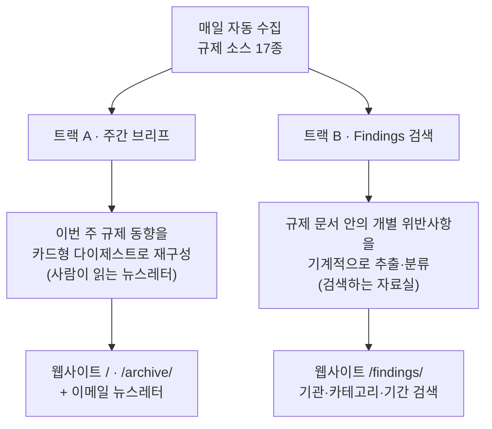
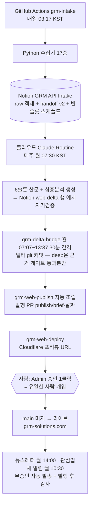
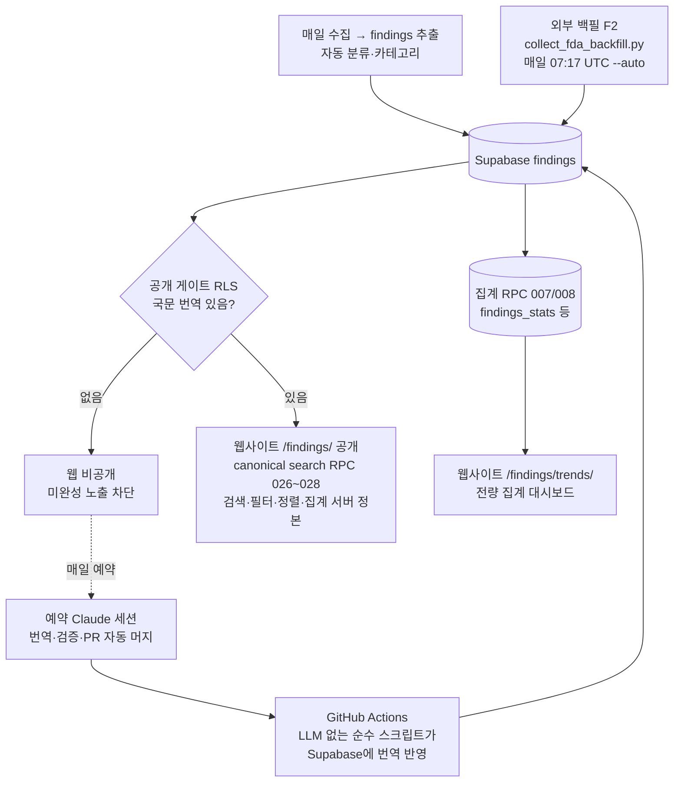

# GRM 시스템 명세서 (System Spec)

> **GRM = Global Regulatory Monitor.** 전 세계·국내(식약처) 제약 GMP·품질 규제 소식을 매일 자동으로 모아, 한국 제약사 QA 담당자가 읽기 쉬운 형태로 매주 웹사이트에 발행하는 자동화 시스템입니다.
>
> 이 문서는 저장소의 단일 시스템 명세서입니다(README 대체). **개발자가 아니어도 시스템의 큰 그림을 이해할 수 있도록** 앞부분(§1~§4)은 쉬운 말로, 뒷부분(§5~§6)은 개발 레퍼런스로 씁니다.

| 문서 메타 | 값 |
|---|---|
| 문서 버전 | `v1.237` |
| 최종 수정일 | 2026-09-05 |
| 현재 상태 | 매일 자동 수집·주간 자동 발행 가동 중 — **2026-07-13 자동화 전수 정비 완료: 매주 사람 개입 = Admin 승인 1클릭 유일**(심층분석 클라우드 생성 **배선 완료 2026-07-27 — 첫 실전은 08-03**[2026-07-13~07-27 은 handoff 에 deep 입력이 실리지 않아 Routine 이 매주 "대상 0건"으로 판단, 사람이 백필해 왔다]·발송 2종 무승인 자동·**월요일 크론 지각 대응 = 비정각+브릿지 14회+워치독 자가 복구**(2026-07-20), 상세 = `docs/GRM_자동화지도_2026-07.md`). 웹사이트(`grm-solutions.com`)가 주 발행 채널. **Findings 인텔리전스(FIND-1) M1~M14 완료·라이브**에 이어 전략 로드맵 F2(볼륨)~F4a(에이전트 자산)까지 진행: 외부 백필 자동 파이프라인 가동 중(**공개 findings 24,797건·문서 6,116건·업체 3,726곳·2016~2026년**(2026-08-12 실측 — 캐나다 실사 백필 9,505건 편입 + 번역 완주로 07-31 대비 2배), 매일 증가), 트렌드 대시보드(`/findings/trends/`) 라이브, Copilot Studio 커넥터 자산 완료(파일럿 대기). "유사 문구 검색"(S1, 렉시컬)에 이어 **의미 유사도 임베딩 저장층(S2, `findings_embed_service.py`+019 마이그레이션) 구현은 완료됐으나 A/B 평가(2026-07-15)에서 S1 대비 유의한 개선을 입증하지 못해 웹 공개는 중단** — "이 지적과 유사한 사례" 버튼은 021(S1 렉시컬, `findings_similar_to` RPC)이 서빙한다(라이브 적용 완료). **2026-07-19 트랙 C 완성형 — 자료실 11카탈로그 502건(주 1회 원문 자동 갱신·변경 알림 — ICH PDF 직링크·식약처 번역본 7토픽·PMDA ORANGE Letter)·용어사전 226어(실무 맥락·조항 — 2026-08-04 미국 FDA 법문 표현 중심 26어 증설)·주간 퀴즈 45문항+월 13:00 자동 출제 파이프라인(2026-08-04 **세트 구성 규율 v2** — 브리프 사건 2 + 용어사전 개념 1~2 로 섞고 세트 단위 lint 게이트 5종 신설)·구름이 펫/성장 시스템(전 페이지)·랜딩 확정 재배치 라이브**(§1.2). |
| 코드 저장소 | https://github.com/MINHOYEOM/grm-api-intake |
| 웹사이트 | https://grm-solutions.com (브리프 `/`·`/archive/`, 지적사항 검색 `/findings/`) |
| 변경 이력 | 상세 이력은 **git 로그**로 확인합니다. 이 문서는 "현재 상태"만 유지하고, 오래된 단계별 기록은 남기지 않습니다. |

---

## 0. 이 문서를 쓰는 법 (유지 규칙)

이 문서는 **"살아있는 명세서"** 입니다. 시스템이 바뀌면 함께 갱신하되, **현재 상태를 간결하게 유지**하는 것이 최우선입니다.

- **큰 변경만 반영한다.** 새 소스·새 단계·데이터 흐름 변경·파일 구조 변경 같은 "구조적 변화"만 씁니다. 자잘한 버그·문구 수정은 git 커밋으로 충분합니다.
- **누적하지 말고 갱신한다.** 과거 단계별 기록을 계속 쌓지 않습니다. 낡은 내용은 **과감히 삭제**하고 현재 사실로 대체합니다. 상세 이력이 필요하면 git 로그를 봅니다.
- **파일·폴더가 바뀌면 §5.1 폴더 구조를 함께 갱신합니다.**
- 상단 "문서 메타"의 버전·수정일을 같이 갱신합니다.
- **Git 정본은 `main` 하나다.** worktree의 이 파일은 브랜치 스냅샷이며, 독립 명세로 유지하지 않습니다. 명세 변경은 코드와 함께 검증한 뒤 `main`에 합쳐야 현재 상태가 됩니다.

---

## 1. 한눈에 보기

### 1.1 무엇을 · 왜 · 누구를 위해
GRM은 FDA·EMA·MHRA·PIC/S·ICH·WHO·Health Canada·식약처(MFDS) 등 **흩어져 있는 규제 소식을 한 곳에 자동으로 모읍니다.** 매주 사람이 일일이 확인하기엔 양이 많고 영문 원문도 부담이라, GRM이 이 모니터링을 자동화하고 핵심을 한국어로 요약하되 **원문 링크를 항상 함께** 제공합니다.

**대상 사용자:** 한국 제약사의 QA(품질보증) 담당자. 특정 제형이 아니라 **화학합성의약품·생물의약품·기타** 3분류로 의약품 전반을 봅니다(의료기기 제외).

### 1.2 두 개의 트랙 (핵심 개념)
같은 원재료(매일 수집한 규제 문서)에서 **완전히 다른 두 가지 제품**이 나옵니다. 이 둘은 서로 데이터를 주고받지 않는 독립 트랙입니다.


```mermaid
flowchart TD
    S[매일 자동 수집<br/>규제 소스 17종]
    S --> A[트랙 A · 주간 브리프]
    S --> B[트랙 B · Findings 검색]
    A --> A1["이번 주 규제 동향을<br/>카드형 다이제스트로 재구성<br/>(사람이 읽는 뉴스레터)"]
    A1 --> A2["웹사이트 / · /archive/<br/>+ 이메일 뉴스레터"]
    B --> B1["규제 문서 안의 개별 위반사항을<br/>기계적으로 추출·분류<br/>(검색하는 자료실)"]
    B1 --> B2["웹사이트 /findings/<br/>기관·카테고리·기간 검색"]
```

| | **트랙 A — 주간 브리프** | **트랙 B — Findings 검색 (FIND-1)** |
|---|---|---|
| 무엇 | "이번 주 규제 뉴스 요약 신문" | "모든 위반사항을 검색하는 자료실" |
| 단위 | 사건 1건 = 카드 1장 | 문서 안의 개별 위반사항 1건씩 |
| 발행 | **매주** 한 번에 묶어 발행 | 매일 계속 쌓이는 **실시간 DB** |
| 읽는 법 | 처음부터 읽는 다이제스트 | 조건으로 검색·필터 |
| 저장 | Notion → 웹 정적 사이트 | Supabase(Postgres) → 웹 |
| 웹 위치 | `/`, `/archive/` | `/findings/`, `/findings/trends/`(전량 집계 대시보드) |

> **영어판 `/en/` (2026-09-04 신설 — 다국어 3단계):** 사이트가 두 언어 트리로 갈렸다. 주소는 `render.PagePath(path, lang)`(1단계)에서, 화면 문구는 `web/data/i18n/en.json` 1,362키 사전(2단계)에서 나온다. ★**영어 트리에 내는 면은 본문이 영어로 성립하는 것만**이다(`EN_TREE_STATIC` + 자료실 카탈로그 = 20장): 지적사항 검색과 그 도구 6면(트렌드·실사 결과·데이터 현황·체크리스트·업체·실사관), 자료실 허브와 11카탈로그, 영어 홈(`landing_en.html`). 근거는 데이터 실측이다 — 공개 지적 25,079건 중 **22,974건(91.6%)이 원문 영어**(`finding_text`)이고 한국어는 그 위에 덧씌운 층이라, `findings_search` RPC 가 이미 내려주는 원문을 **표시 선호만 뒤집으면**(`grm_i18n.JS_BODY_SHIM` 의 `_bodyText`/`_altText`) 진짜 영어 본문이 나온다(새 번역 0). 자료실은 11카탈로그 중 10개가 `title_en` 100%다. ★**빼는 것과 이유**: 문서·모음·조항·업체 정적 페이지는 본문이 `text_ko` 뿐이라(4단계 데이터 선행), 용어사전은 풀이가 한국어라, 이용안내·주간 퀴즈·주간 브리프/아카이브는 한국어 산문 그 자체라(5단계) 내지 않는다 — 껍데기만 영어인 페이지를 만들지 않는다는 것이 이 트리의 유일한 기준이다. ★그 경계를 **영어 홈이 화면으로 밝힌다**(`#scope` 섹션 + 한국어판 링크). 영문 제목이 없는 식약처 문서 40건은 한국어 원제를 그대로 보이고(제목을 지어내지 않는다) 카탈로그 페이지가 그 사실을 고지한다. nav·푸터·언어 전환·hreflang·sitemap 은 **전부 `en_tree_paths()` 하나**를 보므로 없는 페이지로 가는 링크가 생길 수 없고, 짝이 없는 면에는 hreflang·전환 버튼이 아예 붙지 않는다. 언어 전환은 **상대경로**라 홈 BFS 도달성 가드가 영어 트리까지 따라간다. 실사관 프로파일은 실명 개인 집계라 **언어와 무관하게** sitemap 미등록(`EN_SITEMAP_EXCLUDED`). 한국어 산출물은 짝이 있는 20장만 바뀌었다(hreflang 3줄 + 전환 버튼·스타일 6줄). 검증 = `WebEnTreeTest` + 영어 골든 2장(`en_landing`·`en_findings`).
>
> **영어판 2차 — 실사 문서 표면(2026-09-04, 다국어 4단계):** 3단계는 조회 화면만 영어로 냈다. 정적 문서 페이지는 그때 `findings_docs.json` 에 원문이 없어 "영어 껍데기에 한국어 본문"이 될 수밖에 없었는데, **`text_orig`(규제기관 원문)를 정본에 실어** 그 조건을 풀었다(`findings_docs_refresh.py`·`findings_facets_refresh.py` 가 국문과 **다를 때만** 싣는다 — 같은 문장을 두 번 적지 않는다. 실측 8.6MB → 12.7MB). 그 위에서 영어 트리가 **문서 페이지 3,174장 + 기관×연도 목록 + 문서 색인 + 둘러보기 면**을 얻었다. ★편입 기준은 `doc_is_english` — **원문이 실제로 영어인 문서만**이고 판정은 소스 이름이 아니라 값으로 한다(실측: 문서 3,305건 중 3,174건 영어·131건 한국어(전부 식약처)·혼재 0건, 지적 기준 96%가 영어). 빠진 131건은 번역 누락이 아니라 **원문이 한국어**인 것이며, 그 사실을 영어 문서 색인이 화면에 밝힌다. 본문 선택은 렌더가 `finding_body(f, lang)`, 화면 스크립트가 `JS_BODY_SHIM` 으로 한 곳에서 한다. ★데이터에서 오는 표시 라벨(기관명 5종)은 소스에 리터럴이 없어 문구 추출기가 못 보므로 `DATA_LABEL_KEYS` 에 등록하고 테스트가 데이터와 대조해 강제한다 — 새 규제기관이 편입되면 거기서 실패한다. 모음·조항·업체 정적 페이지의 영어판은 아직 없다(다음 단계). 한국어 산출물은 문서·목록 3,206장이 hreflang·언어 전환 블록만 얻었고 그 밖의 변경은 0이다(전 파일 대조).
>
> **영문 주간 브리프 (2026-09-04 배선 — 다국어 5단계, 전향적):** 브리프 서사는 번역이 아니라 **같은 요약의 다른 언어 출력**이다 — Routine 이 원문(대부분 영어)을 요약해 한국어로 내는 그 결과를 영어로도 낸다(설계 문서 §4, 운영자 정정). 카드마다 `en{title_issue·summary·implication·key_facts·checks}` + 브리프 `en.tldr` 슬롯을 쓰며, 프롬프트(`docs/prompts/GRM_Prompt_v16.md`)·주입기(`inject_slots.py`)·렌더러·게이트가 그 계약을 공유한다. ★**전부 채우거나 전부 비운다** — 다섯 중 넷만 영어면 영어 화면에 한국어 한 문단이 섞이므로 부분 제공은 주입 단계에서 오류로 막고, 웹은 그 호를 아예 영어로 내지 않는다(`brief_has_english` — 한 카드라도 빠지면 그 호 전체를 뺀다. 목차·앵커가 서로 엮여 있어 일부만 빼면 화면이 깨진다). ★**생성 경로가 하나 더 생기면 게이트도 하나 더**: `validate_brief_en_facts` 가 영문 서사의 수치를 한국어판·표·인용과 대조해, **없는 수치를 말하면 발행을 차단**한다(`EN_INVENTED_NUMBER`, 발행 게이트에 배선). 검사는 **비대칭**이다 — 요약이 덜 말하는 것은 정상이고 **없는 것을 말하는 것**만 막는다(한 자리 수는 영어가 풀어 쓰는 일이 잦아 대조 제외). 카드 라벨(종류·제형·표 라벨·근거)은 `BRIEF_LABEL_KEYS` 에 등록하고 테스트가 실 데이터와 대조한다 — ★검사는 **언어와 무관하게** 돈다(`tr()` 에 항등 폴백이 없어 `Warning Letter`·`483` 같은 영어 값이 빠지면 영어 빌드가 멈추는데, 한글만 훑던 판은 그걸 못 봤다). 섹션 앵커(`#sec-글로벌`)는 번역하지 않는다 — 두 언어판의 딥링크가 갈라지면 안 된다. **소급 백필 완료(2026-09-05): 과거 11호 중 10호·카드 423장이 영어로 선다**(`/en/briefs/{date}/` 10장 + `/en/archive/`). 백필도 발행 경로와 **같은 게이트**를 탄다 — `inject_slots` 로 넣어 길이·마크업·다섯 슬롯 완결성을 검사하고 `EN_INVENTED_NUMBER` 0을 확인했으며, 한국어 필드는 무변형이다. ★**2026-06-22 는 뺐다**: 서사 다섯과 tldr 이 36장 전건 빈 placeholder 라 "같은 요약의 다른 언어"의 원본이 없다 — 영어만 산문을 갖게 만드는 대신 `en` 을 통째로 비웠다. 검증 = `WebEnBriefTest`(합성 브리프로 양방향 고정 + 실 데이터가 **전부 영어이거나 전부 아니거나**인지 호별 확인).
>
> **404 영문판 + 절대경로 수리 (2026-09-04 — 다국어 6단계):** `/en/404.html` 을 신설했다. Cloudflare 는 매칭 실패 시 **가장 가까운 `404.html`** 의 본문을 원래 요청 주소에 404 상태로 실어 준다. ★그 성질 때문에 **404 의 상대경로는 자기 위치가 아니라 요청 URL 기준으로 풀린다** — 라이브 실측에서 `/findings/doc/zzz/` 의 404 는 되돌림 카드·nav·footer **링크 30개가 전부 죽어** 있었고(`href="library/"` → `/findings/doc/zzz/library/` → 또 404), "본문을 막다른 길로 두지 않는다"는 이 페이지 자신의 규율이 정반대로 깨져 있었다. `emit_not_found()` 가 이 페이지에 한해 `rel_root="/"+접두`·`asset_root="/"` 를 덮어써 **사이트 절대경로**로 그린다(호스트를 박지 않으므로 불변식 #4 의 근거는 유지). 되돌림 카드는 손목록이 아니라 `en_paths`(실제 산출 라우트)에서 걸러 `not_found_cards()` 가 만든다 — 영어 트리에 없는 아카이브·용어사전 카드는 **아예 생기지 않는다**(404 를 고치려다 404 를 여섯 개 만드는 일 방지). 검증 = `WebNotFoundTest`(상대 참조 0·링크 대상 실재·영어판 트리 이탈 금지).
>
> **영어판 검색의 원문 언어 축 (2026-09-04 — 다국어 6단계):** `/en/findings/` 는 **원문이 영어인 지적**을 기본으로 보여준다(서버 축 `p_orig_lang`, `web/migrations/074_findings_search_orig_lang.sql`). ★계기는 실측이다 — 코퍼스 전체로는 영어 원문이 91.7%(FDA 14,936 · HC 9,505 · EMA 78 · MHRA 8)인데 기본 정렬이 최신순이고 식약처가 가장 최근 편입분이라, 영어 사용자가 여는 **첫 3쪽 지적 135건 중 90건이 한글 본문**이었다. 정적 문서 페이지는 4단계에서 원문이 영어인 문서만 골라 냈는데(`doc_is_english`) 런타임 검색에만 그 필터가 없어서 생긴 비대칭이다. ★판정은 **기관이 아니라 본문**으로 한다(`original_is_english` 생성 열 = 원문에 한글이 없는가) — MFDS 2,125건 중 36건이 이미 한글이 아니어서(공개 범위 밖 OCR 잡음) "MFDS = 한국어"는 데이터의 사실이 아니라 현재의 우연이다. ★축은 `filtered` 와 **패싯 6종 전부**에 건다 — 한 곳만 걸면 결과는 영어인데 기관 패싯에 "MFDS 2,058" 이 남아 누르면 0건이 되는 죽은 칩이 생긴다. ★거르는 것보다 **거른다고 말하지 않는 것**이 문제이므로 `#fnd-langnote` 가 무엇을 보고 있는지 한 줄로 밝히고 한 번의 클릭으로 푼다(해제 값은 `'all'` — 빈 문자열이면 URL 에 안 남아 새로고침 때 필터가 되살아난다). RPC 시그니처 확장은 **맨 뒤 + 기본값 + drop/create 한 질의 + 마이그 먼저 배포 나중**으로 #681 을 피했고, 적용 전후 21조합 응답 md5 가 전부 동일해 **종전 동작 무변경**을 증명했다(서버 실행시간 568ms → 546ms, 068 기준선 유지). 실측 효과: `p_orig_lang='en'` 에서 문서 6,185→4,827 · 지적 24,944→22,886, **첫 쪽 한글 0건**.
>
> **영어판 업체 페이지 585장 (2026-09-04):** `/en/findings/firm/{slug}/` — 한국어 588장 중 **영어 원문 문서가 2건 이상인 업체 585곳**(빠진 3곳은 식약처 문서만 있는 업체). 새 데이터 없이 4단계의 `en_docs` 파생이라 집계가 구조적으로 정합한다. ★**슬러그는 한국어판에서 물려받는다** — 영어 문서 집합으로 새로 뽑으면 한국어에서 슬러그를 차지했던 업체가 영어에 없을 때 다른 업체가 그 슬러그를 차지해, 두 트리의 같은 주소가 서로 다른 업체를 가리킨 채 hreflang 으로 묶인다(짝이 아닌 것을 짝이라 말하는 것). ★집계는 `firm_page_view()` 한 함수를 두 트리가 공유하되 **문서 집합만 달리 받아** 다시 센다 — 한국어 숫자를 그대로 실으면 머리의 "문서 7건"과 그 아래 목록이 어긋나고 사용자는 어느 쪽이 맞는지 알 수 없다. ★수리 하나: 문서 행의 대표 발췌가 템플릿에서 `d.findings[0].text_ko` 로 못박혀 있어 **영어 페이지에 한국어 문장이 그대로 실렸다**(실측) — 언어를 정하는 곳을 뷰(`d.excerpt` = `finding_body(f, lang)`)로 옮겼고, 분류 라벨도 같이 번역한다. 영어 문서 페이지의 업체 링크도 이제 그 트리에 있는 업체 페이지에만 걸린다(1,782장). 검증 = `WebEnFirmPageTest`(슬러그 부분집합·같은 업체·집계 정합·한글 0·한국어 전용 모음 링크 금지·sitemap·양방향 짝).
>
> **영어판 모음(패싯) 페이지 (2026-09-04):** `/en/findings/c/`·`/country/`·`/agency/` 와 분류×기관 조합 — **영어 모집단으로 다시 잰 정본**(`web/data/findings_facets_en.json`, `findings_facets_refresh.py --orig-lang en`)에서 낸다. ★한국어 집계를 그대로 실으면 화면의 건수와 그 페이지가 보내는 검색 결과가 갈린다 — 실측으로 `data_integrity` 는 134건 중 **50%가 한국어 원문**이라 두 배 어긋난다. 사후 필터(표본에서 한글만 제거)로는 표본만 고쳐지고 `findings`·`documents`·`by_agency` 가 한국어인 채로 남아 머리 숫자가 거짓이 되므로, **서버에 다시 물어**(마이그 074 의 `p_orig_lang`) 별도 파일로 만든다. ★생산자는 축을 후보 목록(`dash`)에도 물어야 한다 — 거기만 빼면 영어로는 0건인 항목이 "표본 미달"로 빠져 `excluded` 사유가 거짓이 된다. 실측 산출: 분류 20 · 국가 11 · 기관 4(MFDS 탈락) · 조합 36 = 71 + 축 색인 4 = **75장**(한국어 92장 대비 — 나머지는 영어 모집단에서 표본 미달이라 얇은 페이지를 만들지 않는다). 표본 426건 중 원문 한글 **0건**. 주간 워크플로(`grm-findings-facets.yml`)는 두 갈래를 **한 잡에서 연달아** 돌리고 축소 가드도 두 파일을 합쳐 센다 — 한쪽만 갱신된 상태를 커밋하면 같은 페이지의 두 언어판이 다른 주를 말하게 된다. 검증 = `WebEnFacetTest`.
>
> **트랙 C — 자료실 (`/library/`, 2026-07-18 신설):** 뉴스(카드)도 위반(findings)도 아닌 **참조형 콘텐츠**의 상설 표면. 카탈로그 11종·총 502건(2026-08-11 실측) — ICH(31토픽)·MFDS 지침·고시(91)·EU GMP/EudraLex Vol.4(38)·PIC/S(47)·WHO(46)·FDA 가이던스(86)·EMA(33)·Health Canada(26)·PMDA ORANGE Letter(15)·**21 CFR(63조항)**·**MHRA(26)**. ★**21 CFR 은 이 자료실에서 유일한 법령 원문**이다 — 나머지가 가이드라인·기준서인 데 반해 Part 210(총칙)·211(완제의약품 CGMP)은 법 그 자체이고, findings 가 지적마다 뽑아 두는 `cfr_refs` 가 가리키는 조항이 바로 이것이다. 범위를 210+211 로 좁힌 근거는 cfr_refs 실측 4,469건 중 211 이 2,523건(56%)·210+211 합산 59% 로 압도적 1순위이기 때문이며, 개정으로 활성 조항이 6개만 남은 820 은 '완결된 원문' 착시를 만들어 제외했다. ★**MHRA 만 완전한 단일 인덱스가 없다** — gov.uk 검색 API 는 동작하지만 GMP 전용 채널이 못 돼(format=guidance 상위 30건 중 GMP 3건뿐) 허브 정보시트(11·자동)+결함통계(8·2019년 이후 정체)+단독 가이던스(7·고정 목록, 완전성 보장 없음) 3갈래로 나눴고, 그 사실을 수집기 주석과 화면 intro 양쪽에 밝힌다. 정보시트·통계 19건의 발행일이 빈 것은 결손이 아니라 **원문(gov.uk Content API attachments)에 날짜 필드 자체가 없기 때문**이며, 허브 페이지 날짜를 개별 PDF 에 씌우면 없는 정밀도를 지어내는 것이라 비워 둔다. 데이터는 전 링크 실검증(HTTP 200·문서 일치)된 커밋 JSON `web/data/library/*.json`이고, **규제기관·전문기관 원문에서 주 1회 자동 갱신된다** — `grm-library-staging.yml`(월 03:23 KST)이 소스별 수집기 `library_collect_<source>.py`(플러그인 계약: 상수 `LIBRARY_SOURCE` + `collect_library_items(run_date) -> (items, error)`, 파일만 추가하면 `library_staging_build.py`가 자동 발견)를 돌려 후보를 만들고, **안전 게이트**(카탈로그당 신규+변경 ≤20건·≤30%, 자동 삭제 금지, 기존 큐레이션 필드(`code`·`title_en`·`pdf_url`·`ko_url`·`doc_type`) 불변)를 통과한 경우에만 PR→CI green→자동 머지한다. 게이트를 못 넘으면 `automation-warning` 라벨이 붙은 채 사람 검토로 남는다. **수집 실패는 그 소스만 격리한다**(2026-07-25) — 실패한 소스는 이번 실행의 후보에서 빠지고 그 카탈로그는 마지막 정상 수집 상태로 남으며(merge 가 append-only·삭제 금지라 손상되지 않는다), **나머지 소스는 정상 갱신**된다. 예전엔 하나만 실패해도 전 소스가 한 주를 통째로 건너뛰었는데, 실패한 소스는 어차피 아무것도 넣지 못하므로 보호받는 대상 없이 나머지만 손해 보는 구조였다. 격리는 `skipped_sources` 로 리포트에 남고 워크플로가 **이슈 1건**(`automation-warning` 라벨·제목 고정)을 열어 알리며, 연속 3주 이상이면 구조 변경으로 에스컬레이션하고 복구되면 자동으로 닫힌다. 다만 **과반이 실패하면 전면 중단**한다(개별 소스가 아니라 러너·네트워크 문제이므로 그 상태의 부분 결과를 이번 주 기준선으로 남기지 않는다). ★**주간 결손 복구(2026-08-11 신설)**: 위 격리 복구는 "수집기가 **실패**했을 때"만 도는데, 자료실이 한 주를 통째로 거르는 더 흔한 경로는 실패가 아니라 **월요일 정기 실행이 아예 안 도는 것**이다 — 크론이 늦게 떠 KST 로 화요일이 돼 요일 검사에 안 걸리거나(이 저장소는 "월요일 크론 수 시간 지각"을 이미 겪었다), 러너 장애로 실행 자체가 없거나. 둘 다 격리 이슈를 남기지 않아 종전 로직은 그대로 7일을 굳혔고, 실제로 2026-08-11 에 이 경로로 한 주가 빌 뻔해 사람이 손으로 돌려 메웠다. 그래서 평일 크론이 **"이번 주(KST 월요일 기준)에 갱신이 돈 적 있는가"**를 함께 본다 — 판정 근거는 갱신마다 커밋되는 `web/data/library_staging_diff.json` 의 `generated_on` 이라 별도 상태 파일을 만들지 않는다. 복구는 **1회성**(성공하면 generated_on 이 갱신돼 다음 날 안 돈다)이고, 이력을 못 읽으면 **결손으로 단정하지 않고 건너뛴다**(매일 돌아 PR 소음이 되는 것을 막는다 — 월요일 정기 실행은 이 판정과 무관하므로 최악이어도 종전 동작이다). YAML 안의 셸을 `tests/test_library_staging_decide_gate.py` 가 **꺼내서 실제로 실행해** 9개 시나리오로 고정한다(인라인 스텝은 커버리지 0이 되기 쉽다). **링크 점검의 `blocked` 상태(2026-08-11 신설)**: 종전에는 봇 차단 의심을 `needs_review` 에 합쳤는데, 21 CFR 63건이 러너에서 전부 `unblock.federalregister.gov` 로 리다이렉트되면서(미국 정부가 GitHub Actions IP 를 봇으로 차단) 매주 63건이 "검토 필요"로 쌓여 진짜 신호(MFDS 5xx 90건)를 덮게 됐다. 그런데 이 링크들은 사람이 브라우저로 누르면 정상이고 수집기도 eCFR **API** 로 63건을 정상 수집한다 — **링크는 멀쩡한데 검사기만 못 본다.** 그래서 `blocked` 를 별도 축으로 분리했다(`grm-library-health/v2`). ★`blocked` 는 **차단의 적극적 증거**(401/403/429·다른 호스트로 리다이렉트·차단 페이지 문구)가 있을 때만 쓴다 — 타임아웃·TLS 실패는 차단의 증거가 아니라 그냥 못 닿은 것이라 `needs_review` 로 남긴다(그것까지 blocked 에 넣으면 "확인 못 한 게 정상"이라는 통에 진짜 네트워크 장애가 섞여 묻혀 분리의 목적이 무너진다). 404/410 은 봇 민감 호스트여도 `broken` 이다(죽은 링크가 '차단이라 확인 못 함'으로 위장되면 영영 안 고쳐진다). 운영 이슈는 **`broken` 에만** 열린다(종전 그대로). 변경분은 `library_updates.py`가 누적 이력 `web/data/library_updates.json`(id·개수만 저장·같은 날 재실행은 합집합 멱등·52주 보관)에 기록하고, 렌더가 이를 라이브 카탈로그와 join 해 **자료실 허브의 "최근 업데이트" 패널**(카탈로그별 신규/변경 문서 제목·원문 링크)과 **모아보기(`/archive/`) 상단 스트립**(날짜·소스별 건수 + 제목 3건 + "외 N건")으로 보여준다 — 이력의 id 가 카탈로그에 없으면 세지도 보여주지도 않고(확인 가능한 것만 표시), 변경이 없으면 스트립을 그리지 않는다. 같은 이력이 **주간 뉴스레터의 "자료실 업데이트" 블록**으로도 나간다(§3.2 뉴스레터). 렌더는 `LIBRARY_REGISTRY`+공통 템플릿 `library_catalog.html` 1장(카탈로그 추가 = 데이터 파일+registry 1항목, 선택 키 = sort 발행일 내림차순 뷰정렬·link_label·groups_by_url·doc_type_labels·pdf==official 중복 칩 억제). 표기 규약: 발행일만 표기(수집일 노출 금지)·내부 운영 개념(Tier 등) 미노출·한국어 우선 병기(title_ko 주 제목·title_en 병기)·ICH는 현행 문서 PDF 직링크 보유 24토픽 = 제목이 database.ich.org PDF로 직결, 미보유 7토픽(M1·M2·M5·M6·M8·M16·M18) = 무링크 + Q/M 그룹 헤더 "ICH 공식 카탈로그" 링크로만 연결. 식약처 공식 번역본·주제 Q&A 확인 7토픽(Q1A-Q1F·Q7·Q8/Q9/Q10·Q13·M4)은 ko_url 칩. 데스크톱 우선 폭 규약(인트로 720px·프로즈 780px·리스트 820~880px·keep-all, ch 캡 금지). 새 공개 RPC·RLS 없음, 주간 발행 게이트와 무관한 독립 정적 섹션. 부속 표면(전부 라이브): **이용안내**(`/guide/` — 실사용 관점 8섹션·h2 파생 결정론 목차, 본문은 `web/data/guide_content.md`를 render.py 제한 md 서브셋 결정론 변환으로 렌더) · **GMP 용어사전**(`/glossary/` — 공식 용어집 기반 226어: 쉬운 풀이+실무 맥락 `detail_ko`+관련 조항 `reg_refs`+출처 링크+**동의어 `aliases`**(2026-08-04 — 사전은 EU·ICH 어휘로 쓰였는데 코퍼스는 FDA 문서가 대부분이라 **사용자가 아는 이름으로 검색하면 아무것도 안 나왔다**: 구현 전 실측 FDA 표현 14개 도달 **0건**. 56개 용어·91개 동의어, `term_en` 뒤에 배치. 채택 기준 = 코퍼스 1건 이상 실사용 확인 **또는** 표제어 자체의 표기 변형(철자·하이픈) — 추측 금지. ★검색용과 표시용을 나눈다: **검색(`search`)에는 전량**, **화면(`aliases`)에는 하이픈·공백을 지웠을 때 표제어와 같아지는 것을 감춘다**(`Back-up` 카드에 "다른 표현 · backup" 은 같은 말을 두 번 쓰는 잡음이나, 그 동의어가 없으면 "backup" 검색이 실패하므로 데이터에서 빼면 안 된다). ★표제어와 동의어가 같은 이름을 주장하면 사용자가 틀린 카드를 본다 — **표제어가 이긴다**(용어 증설이 `Quality Control Unit`·`Non-conformance`·`Written Procedures` 를 표제어로 올려 quality-unit·deviation·sop 에서 4건 제거). 가드 = `WebGlossaryAliasGuardTest` 의 **도달 탐침 표**(필드 존재가 아니라 "그 표현으로 검색하면 그 용어가 나오는가" 를 검사 — 지우면 어느 표현이 못 닿는지 이름을 대며 실패), 초성 색인·검색 `glossary.js`. **낱개 페이지 `/glossary/{id}/` 226장(2026-08-12 신설 — 검색 유입 트랙)**: 색인 1페이지만 있으면 226어가 URL 하나에 묶여 sitemap 등록 URL 이 29개뿐이었고, 공개 findings 24,802건과 226어 전체가 검색엔진에 **색인 대상 0개**였다(실측 검색 유입 30일 40건의 직접 원인). 용어당 페이지를 내고 sitemap 에 전량 등록한다(29 → 255). 뷰모델은 색인 페이지와 **같은 `build_glossary_view` 산출물을 재사용**하므로 두 화면이 갈라질 수 없고, 화면 문구는 정본 무변형이다 — meta description 도 생성하지 않고 `easy_ko` 를 어절 경계에서 자른다(`glossary_term_description`, 상한 155자). `<title>` 은 "{한글}({영문}) 뜻" 형태로 실제 검색어("OOS 뜻")에 맞추고, JSON-LD `DefinedTerm`(inLanguage=ko·`inDefinedTermSet` → `/glossary/`)을 붙인다. 관련 용어 링크는 색인 앵커가 아니라 **낱개 페이지끼리** 잇는다(내부 링크가 곧 색인 경로다). 가드 = `WebGlossaryTermPageTest` — 용어 목록을 손으로 적지 않고 **정본에서 파생**해 전수 검사하므로(페이지 누락·정본에 없는 유령 페이지·sitemap 미등록·description 상한/접두 일치·관련 링크 대상) 용어가 추가되면 그 페이지의 부재를 자동으로 잡는다. ★§4 한글 안전 가드는 **인라인 스타일에 `letter-spacing`/`text-transform` 문자열 자체를 금지**한다(선택자가 ASCII 전용인지 판별하지 않는다 — 판별을 허용하면 가드가 무력해진다) → eyebrow 는 자체 스타일 대신 grm.css 전역 `.kick` 을 쓴다. **2026-08-04 어휘축 보정 26어**: 초기 200어가 EU·ICH·PIC/S 정의서 중심(200 중 111)이라 정작 코퍼스의 다수인 미국 FDA 법문 표현이 비어 있었다 — `written procedure`(932건)·`quality control unit`(771)·`laboratory controls`(310) 처럼 지적문 최빈 표현이 사전에 없던 상태. 추가분은 21 CFR 조문·ICH·EU GMP Annex 1·WHO TRS·PIC/S PI 041-1·FDA 가이던스·국내 법령(약사법 제39조·의약품 등의 안전에 관한 규칙 [별표 1]·제50조)에서 **원문을 직접 열어 확인한 정의만** 실었고, 공개 정의를 확인하지 못한 후보 2건(`deviation report`·`particulate matter`)은 넣지 않았다. **검증 게이트 `glossary_lint.py`**(2026-08-04 신설 — 이전에는 용어사전만 검사기가 없었고, 퀴즈 린터가 곁다리로 하던 id 존재·중복 확인이 유일했다. 그마저 퀴즈에 용어사전 근거 문항이 없어지면 안 돌았다): 검사 대상은 **"잘못돼도 화면이 멀쩡해 보이는 것"** — 렌더러가 조용히 버리는 값들이다. ERROR = 알 수 없는 필드(★`detail_ko`→`detail_kr` 오타 시 그 용어만 심화 설명이 조용히 사라진다)·필수 필드 누락/빈 값·타입 불일치·id 중복·id 형식(`^[a-z0-9]+(-[a-z0-9]+)*$` — id 는 `/glossary/#<id>` 앵커이자 퀴즈 근거 링크 대상)·related 고아/자기참조/중복·URL 스킴·**보이지 않는 문자**(제로폭 + NBSP·전각공백 등 공백처럼 보이는 다른 문자)·`glossary_cases.json` 전수 정합·**0건 가드**. WARNING 은 기준선 초과 시 ERROR 승격 — term_ko/term_en 중복 쌍(기준선 1: '정확성'=accuracy/accurate)·짧은 필드(0)·**detail_ko 템플릿 복제**. ★★템플릿 복제 기준선은 **개수가 아니라 id 집합**(`BASELINE_DETAIL_KO_SIMILAR_IDS`, 121개 — 개수로 두면 기존 1건 해소 + 신규 1건이 상쇄돼 숨는다). 신규 id = ERROR(겹치는 상대 용어까지 메시지에 찍는다), 해소 = NOTICE 로 기준선 축소 안내. 기준선 안쪽 509쌍은 **한 줄로 접는다**(`--verbose` 로 전개) — 매번 500줄을 찍으면 아무도 안 읽고 진짜 신규 경고가 묻힌다. CI 편입은 `tests/test_glossary_lint.py`(커밋된 실 데이터 lint clean + 검사별 위반 주입 시험). **관련 조항은 공식 원문 링크**(2026-08-04) — URL 을 따로 수집하지 않고 `_reg_ref_url`(R1~R7)이 렌더 시점에 **자료실 카탈로그의 주소를 재사용**한다(주소 단일 소스 → 자료실 주간 갱신이 링크에 자동 반영). 칩 455건 중 421건 연결(ICH 103/103·EU GMP 169/173·21 CFR 115/128[`trends.js` `ecfrHref` 와 동일 규칙]·PIC/S 23/24·WHO 11/11). 카탈로그 `code` 정확 일치가 **딱 1건일 때만** 링크하고 0건·2건 이상이면 무링크 — **틀린 링크가 무링크보다 나쁘다**. 무링크 34건(16종)은 의도: 21 CFR 범위 표기(문서 1개 미특정)·EU GMP Annex 19(2005/2026 두 판본)·EU GMP Part III SMF(코드 중복)·MHRA 지침(자료실 카탈로그 부재)·국내 법령 4종(K-GMP 고시·약사법·총리령 본문·별표 — `mfds.json` 이 고시·가이드라인만 수록하고 법률/총리령 본문은 담지 않아 R6 접두에도 안 걸리고 R7 로 떨어진다). 자료실 갱신이 골든까지 재동결·커밋하므로 링크가 **조용히** 사라질 수 있어 `WebGlossaryRegRefLinkGuardTest` 가 전체 하한 421·계열별 하한·무링크 라벨 상한 16종·0건 가드로 막는다(합계만 보면 한 계열 통째 손실을 놓친다). **사례 연결**(2026-08-04) — 용어 카드 하단 "이 용어로 찾은 지적사례 N건 보기" 링크가 `/findings/?q=<검색어>` 로 보낸다. 정본 `web/data/glossary_cases.json`(`items` 177 + `excluded` 49 = 226 전수, 두 배열 합이 `glossary.json` id 집합과 정확히 일치해야 CI 통과 — 새 용어를 넣으면 링크 여부를 **결정하도록 강제**). 건수는 `findings_search` RPC totals 실측(= 링크를 눌러 나오는 결과와 **같은 함수** — 클라이언트 자체 카운트 금지). 검색어 `q` 는 **사람이 실제 지적 문장을 읽고 판정한 값**이며 자동 갱신 대상이 아니다: 단순 부분일치라 약어·짧은 한국어가 오염된다(`CCI`→va**cci**ne 97%·`RCA` 0/7·`OOS`→b**oos**t 44%·`Purity Test`→im**purity test**ing 100%·`위해`→"~하기 위해"·`viable`→`non-viable`). 제외 49건은 사유를 데이터에 기록(0건 32·변별력 없음 4·의미 오염 8·중복 4·**상용구 1**). ★상용구 = `management review` — 7건 모두 경고서한 시정요구 정형문("…and improved systems for ongoing management review")에 걸린 것이고 지적 자체는 도장 벗겨짐·기록 훼손 등 딴 주제라, **건수만 보면 멀쩡하고 문장을 열어야 드러난다**(의미 오염과는 다른 유형 — 글자도 뜻도 맞는데 그 문장이 지적의 본문이 아니다). `WebGlossaryCaseLinkGuardTest` 가 전수 결정·고아 참조·0건 링크 금지·URL 인코딩·제외 카드 무링크·사유 필수·내부 개념어 미노출을 막는다. 주간 갱신 `grm-glossary-cases.yml`(금 03:15 KST)이 `glossary_cases_refresh.py` 로 **건수만** 다시 세고 PR→CI green→자동 머지 — `q`·`excluded` 는 무변형, 0건 전환은 종전 값 유지+경고, 20% 이상 실패 시 전면 중단[아무것도 쓰지 않음], 항목별 실패 격리) · **주간 퀴즈**(`/quiz/` — 뱅크 45문항(GRM 내부 개념 금지·전 문항 근거 링크)을 embed하고 `quiz.js`가 week(YYYYWW) 지정 문항 우선+ISO 주차 결정론 회전으로 "이번 주 세트" 선택, 즉시 채점·랭킹/서버 저장 없음. **매주 월 13:00 KST 예약 세션이 그 주 라이브 브리프와 용어사전에서 신규 문항을 생성·append하는 자동 출제 파이프라인** 가동 — 게이트 `quiz_lint.py`·정본 규율 `docs/prompts/GRM_주간퀴즈생성_프롬프트_v1.md`(v2). **세트 구성 규율(2026-08-04)**: 한 주 세트는 브리프 사건 문항 2 + **개념 문항(용어사전) 1~2** 로 섞는다 — 종전 규율이 "그 주 카드에 명시된 사실만"을 요구해 3주 연속 노출 12문항이 **전부 브리프 암기**가 됐고, 그 주 브리프를 읽지 않은 직원에게는 4문항 전부가 찍기였다(용어사전 226어 중 출제 21어=9.3%, GMP·일탈·CAPA 등 기초 개념 출제 0). 개념 문항의 오답은 그 용어의 `related` 계열에서 뽑아 **다른 축 선택지가 섞여 지문 없이 소거되는 것**을 막고, 용어 선정은 그 주 **자료실 신규·변경 자료(`library_updates.json`)가 다루는 주제**를 1순위로 한다(카탈로그는 제목·링크만 담고 본문이 없으므로 자료실 *내용* 문항은 만들지 않는다). `quiz_lint.py` 는 스키마·링크 실재에 더해 **세트 단위 게이트**를 강제한다 — `WEEK_SOURCE_MIX`(개념 문항 필수)·`WEEK_SIZE`(3~4문항, 상한은 `render.WEEKLY_QUIZ_COUNT` 와 테스트로 동기화 — 초과분은 화면에 영영 안 뜬다)·`WEEK_DIFFICULTY_MIX`·`WEEK_LONGEST_ANSWER`(정답이 유일 최장인 문항이 과반이면 실패)·`ANSWER_LENGTH_LEAD`(정답이 오답 최장보다 12자 이상 길면 실패 — 실측 "가장 긴 것 찍기" 기대 정답률이 주차 생성분 76.4%였다). 게이트는 `week` 를 가진 **비면제 주차**에만 적용하고 규율 신설 이전 공개분은 `GRANDFATHERED_WEEKS`(202630~202632)로 면제한다 — 뱅크는 append-only 라 소급 수정 대신 명시 집합으로 닫으며, 이 집합은 **줄어들기만 한다**(면제로 게이트를 우회하지 않는다). 테스트가 면제 상한과 **역적용**(면제 주차 세트를 신규 주차로 옮기면 반드시 걸림)을 고정한다. **학습 루프(2026-08-05)**: 새로고침해도 그 주 선택이 복원되고(`grm-quiz-picks-v1` — 화면 상태 전용 키. 성장 정본에 얹으면 `growth-sync.js` 가 `q[id]` 를 0|1 로 정규화해 선택값이 조용히 사라진다), 세트를 다 풀면 완주 요약·오답노트가 뜨고 **틀린 문제만 재도전**할 수 있다(구름이 적립은 주×문항 dedup 이 그대로라 점수는 첫 결과로 남고 그 사실을 문장으로 알린다). 전체 보기에는 개념/사례/**안 푼 문항만** 필터가 붙고, 이는 `growth.js` 가 노출하는 읽기 전용 조회창 `window.GRM_GROWTH.solvedIds()` 를 쓴다(quiz.js 가 localStorage 를 직접 뒤지면 두 파일이 같은 키 모양을 각자 알게 되어 갈라진다). 점수는 저장하지 않고 카드 상태에서 매번 재계산한다. **폴백 규율(2026-08-05)**: 이번 주 지정 세트가 없으면 **`week` 없는 legacy pool 에서만** 뽑고 제목도 "지난 문항으로 복습"으로 바뀐다 — 종전에는 과거 주차 문항이 폴백에 섞여 2026-08-03 오전(생성 머지 전) 세트에 2주 전 `q-202630-01` 이 "이번 주 퀴즈"로 실제로 들어갔다. ISO 주차는 월요일 00:00 에 넘어가는데 생성 머지는 그날 13시대라(3주 실측 13:18·13:15·15:24) **아침 접속자는 매주 이 구간에 들어온다**. 미생성 자체는 `grm-quiz-freshness.yml`(화 13:10 KST)이 이슈로 표면화한다 — 출제는 로컬 데스크톱 예약 태스크라 그 침묵은 로컬 밖에서만 보인다.) · **구름이 성장 시스템+펫**(`growth.js` 성장 데이터 = localStorage v1이 정본·포인트=정답×10+참여주×20+스트릭 보너스·5단계. **하이브리드 서버 동기화**: 로그인 시 `growth-sync.js`가 `gurumi_growth` 테이블(032 — RLS 본인 행만·anon 무권한·delete 무경로, 2026-07-19 적용)에 보관 — pull→병합(week×문항 union·정답 우선 max, 교환·멱등)→수렴 upsert, 비로그인·실패는 조용한 로컬 폴백(로그인 강제 없음). 펫 = `pet.js`·`pet.css`·단계별 투명 PNG 5종 **전 페이지 위젯**: 자유 드래그+6가장자리 자석 착석·위치 저장/복원, 상태 표현(읽는 중/생각 중/완료/수면 등)·눈 깜빡임·퀴즈 실시간 반응·관리 패널·성장 도감·reduced-motion 지원 — 구 인라인 SVG 마스코트 대체, 공식 표기 "구름이"). **웹 로그인/가입**(`reactions.js` 소관 — 반응·워치리스트·구름이 동기화가 세션 `grm-public-auth-v1`을 공유): 공개 진입점은 `window.GRM_AUTH.open({mode})` 하나이고 다른 자산은 별도 로그인 UI를 만들지 않는다. 가입 의도가 명확한 진입점(펫 "구름이 안전하게 보관하기" 등)은 `mode:"signup"` 직행, 가입 진행 상태는 `sessionStorage["grm-signup-progress-v1"]`(이메일+시각만·30분 TTL·비밀번호/토큰 미저장)로 팝업을 닫아도 코드 단계 복원, 미확인 계정 로그인은 Supabase 공식 오류 코드(`email_not_confirmed` 등) 기반 `classifyAuthError`로 분기해 재발송 경로 제공(매칭 실패는 기존 일반 문구로 폴백 — 추측 분기 없음). 이메일 **코드**(`{{ .Token }}`) 방식 유지 — 매직링크는 메일 스캐너의 토큰 선소모 위험으로 금지. nav 6탭 = 모아보기·찾아보기·트렌드·자료실·용어사전·이용안내(소개 탭 제거·용어사전 승격), 자료실 하위 페이지는 breadcrumb("← 자료실")·맨위로 버튼. **랜딩 확정 구성(11차 정리 2026-08-26 — 사용자 요청 "홈 과밀 정리")**: 히어로 → 기능 3종(`#why`) → Card Anatomy → 참여 존 `#engage`(인기 카드+퀴즈 CTA+보조 카드 2종[자료실·워치리스트]을 반폭 한 줄로) → 뉴스레터 → AI 고지 — **브리프행 CTA는 히어로 1개뿐**(불가침 상한). 10차 대비 걷어낸 것 셋: ⓐ단독 WHY 섹션(히어로 lede 와 같은 메시지 — `#why` 앵커는 기능 섹션이 승계해 footer '소개' 링크 무단절) ⓑ기능 6종 중 03·05·06(원문 연결·번역 병기·체크리스트 — **바로 아래 Card Anatomy 범례와 실제 카드가 같은 내용을 눈으로 보여준다**) ⓒThis Week 콜아웃(발행 수치의 3번째 반복 — 히어로 이슈카드가 이미 같은 수치를 싣고, 헤더 상시 '이번 주 소식' 버튼이 마감 CTA 역할). 자료실 카드의 카탈로그 종수·건수는 render 가 카탈로그에서 계산해 넘긴다(하드코딩 금지). **인기 카드 섹션**은 `reactions_weekly_top`(031 count-only RPC) 소비: 정적 정본 = 빈 상태 유도 문구, `popular.js`가 anon GET 성공·1건 이상일 때만 상위 ≤3장으로 교체(search-index 교차·미등록 card_id 제외·조용한 폴백), "가장 많이 본" 표현 금지(조회수 계측 없음).

> **분류·국가·기관 모음 페이지 (`/findings/{c|country|agency}/`, 2026-08-12 신설 — 검색 유입 트랙):** `/findings/` 는 런타임에 RPC 로 결과를 불러오는 검색 앱이라 **HTML 에 지적 본문이 없다** — 공개 24,797건 전체가 검색엔진에 색인 대상 0개였다(용어사전 226어와 함께, sitemap 등록 URL 이 29개뿐이던 것의 나머지 절반). 축마다 정적 표면을 내어 각 축이 색인 대상이 되게 한다. **축 색인 3장 + 항목 36장**(분류 20 · 국가 12 · 기관 4). ★★**분류 × 기관 조합 페이지 `/findings/c/{분류}/{기관}/` 51장(2026-08-19 신설)**: 단일 축이 검색에서 실제로 이겼지만(네이버 "무균공정 밸리데이션 지적" → `/findings/c/process-validation/` **웹문서 1위**, 하위 문서 묶음까지 노출) 사람들이 치는 말은 대개 주제 하나가 아니라 **기관 + 주제**다("FDA 무균 지적사항"·"식약처 회수 사례"). 축 60장으로는 그 조합을 받을 표면이 없었다. `findings_search` RPC 가 `p_category`·`p_agency` 를 **AND 로 결합**해 마이그레이션 없이 성립한다. ★**후보는 새로 세지 않는다** — 분류 축이 이미 가진 `by_agency` 가 곧 조합 건수라, 다시 세면 같은 수를 두 곳에서 재게 되고 반드시 갈라진다(RPC 는 실제로 만들 조합에만 쏜다). ★임계값은 단일 축과 같은 20건(조합만 낮추면 얇은 페이지가 수십 장 생긴다). ★★★**한 기관이 분류를 사실상 독점하면 만들지 않는다**(`MAX_COMBO_SHARE=0.95`) — FDA × 공정밸리데이션이 570/578 = **98.6%** 에 색인 대상 본문인 "최근 사례" 6건이 부모와 **6/6 동일**이라 부모 페이지의 복제본이었다. 같은 질의에 두 페이지가 경쟁하면 검색엔진이 하나를 버리고, 중복 판정이면 둘 다 손해다. **건수만 보면 정상이라 이 결함은 숫자로 안 드러난다** — 부모와의 비율로 잡는다(제외는 사유와 함께 데이터에 남긴다). ★**URL 은 분류 밑에 둔다** — 부모가 분류 페이지 하나뿐이고, 그 페이지의 "기관별로 좁혀 보기" 목록이 곧 **유일한 진입 간선**이다. ★기관이 하나뿐이라 "어느 기관이 지적했나" 막대는 싣지 않고, **기관명에 한국어 조사(가/이)를 붙이지 않는다** — 조사는 앞말의 받침으로 갈리는데 기관명엔 영문 약어(FDA·EMA·MHRA)가 섞여 규칙이 성립하지 않는다(지금 5개가 우연히 전부 받침이 없을 뿐이라 테스트로 고정). 스키마 `grm-findings-facets/**v2**`(v1 을 계속 받으면 조합이 **조용히 0장**이 된다). 워크플로 축소 가드도 `combos.items` 를 **함께 센다** — 단일 축만 세면 조합 51장이 통째로 사라져도 숫자가 36 그대로라 자동 머지된다. ★**축 색인을 함께 내는 이유는 내부 링크다** — 항목 페이지가 sitemap 에만 있으면 사이트 구조에서 그 페이지에 닿는 경로가 없다(내부 링크가 곧 색인 경로다). 데이터 정본은 `web/data/findings_facets.json`(`findings_facets_refresh.py` 가 주 1회 재측정, `grm-findings-facets.yml` 수 03:20 KST). ★**anon 키로 센다(service-role 금지)** — RLS 가 공개 집합을 정의하므로 anon 으로 세야 화면에 실제로 보이는 수와 같다. 실제로 service-role SQL 24,802 vs anon 24,797 로 갈렸고 **공개 페이지의 진실은 anon 쪽**이다. ★**표본 미달(<20건)은 페이지를 만들지 않는다** — 지적 두세 건짜리 페이지는 저품질 대량 페이지로 읽혀 사이트 전체에 손해다. 다만 **뺀 것은 축 색인에 사유와 함께 밝힌다**(상한을 조용히 걸면 '전부 다뤘다'로 읽힌다). 국가 29개 제외(빈 값 5,266건=국가 미상 · IS/MY=한국어 표기 없음 · 나머지 표본 미달), 기관 1개 제외(MHRA 8건). ★**한국어 국가명은 `grm_findings._COUNTRY_CODE_MAP` 역인덱스에서 파생**한다 — 그 맵은 마이그레이션 055 SQL CASE 와 파리티가 테스트로 고정돼 있어 사본을 들면 즉시 갈라진다. 한국어 표기가 없는 코드는 페이지를 만들지 않는다(제목이 "IS" 인 페이지는 검색에 무의미하다). ★**모르는 기관 코드는 코드로 폴백하지 않고 실패**시킨다 — 폴백하면 새 규제기관이 편입돼도 아무도 모른 채 영문 코드가 제목에 박힌다. 기관 한국어 표기 정본은 `AGENCY_LABELS_KO`(저장소에 다른 정본이 없어 여기가 사실상 정본)이고 **데이터에 함께 실어** 템플릿이 사본을 들지 않게 한다. **지적 본문은 자르지 않는다** — 그 문장이 곧 페이지의 색인 대상 본문이고, 저장소는 원문 절단으로 두 번 데였다(deep_analysis·경고서한 조각). 길이 조절은 표시층(CSS)의 일이다. 가드 = `WebFindingsFacetPageTest`(정본 파생 전수 — 페이지 누락·유령 페이지·축 색인 링크·sitemap 등록·건수/라벨 무변형·본문 무절단·제외 고지·검색 딥링크·결정론) + `WebFindingsComboPageTest`(조합 전수 — 부모 진입 간선·**홈 BFS 도달**·복제본 금지·제목 유일성·양 필터 딥링크·조사 금지·기관 막대 생략) + `tests/test_findings_facets_refresh.py`(무네트워크 게이트 시험 — 0건 가드·표본 미달·모르는 기관·실패 격리/상한·국가 라벨 파생). sitemap 255 → **294**. **문서 단위 페이지 `/findings/doc/{document_id}/` 3,202장(2026-08-12 신설)**: 모음 페이지는 축마다 최근 6건만 실어 나머지 본문은 여전히 정적으로 존재하지 않았다 — 실사 보고서 1건을 통째로 담아 그 구멍을 메운다(지적 21,344건·sitemap 294 → **3,496**). 채택 기준은 **지적 3건 이상**(1~2건은 본문이 얇아 저품질 대량 페이지로 읽힌다) + **발행일·원문 링크 필수**. 제외 2,916건(표본 미달 2,908·URL 불가 문서 id 8)은 사유별로 데이터에 남는다. ★**이 페이지들은 실명 업체의 규제 기록이다.** 그래서 문구 규율을 템플릿에 못박았다 — ①규제기관 공개 원문 링크를 머리·꼬리 양쪽에 두고 ②발행일을 제목 옆 칩과 meta description 양쪽에 넣고(스니펫에 연도가 없으면 몇 년 전 지적이 현재 상태로 읽힌다) ③**"그 시점의 기록이고 후속 시정 결과를 이 페이지는 알지 못한다"**를 고정 문구로 적고 ④우리 판단을 덧붙이는 슬롯을 **데이터·템플릿 양쪽에 만들지 않는다**. `WebFindingsDocPageTest` 가 이 고지의 존재를 값으로 검사한다. ★★**렌더 스위치**: `render_site(render_doc_pages=...)` 기본값은 **True**(프로덕션 CLI 는 항상 렌더). 테스트만 끈다 — 스위트가 사이트를 51번 다시 짓는데 문서 렌더가 한 번에 ~27초라 그대로 두면 CI 가 23분 늘어난다(실측: 전체 스위트가 10분 초과로 타임아웃). **끄더라도 sitemap 에는 문서 URL 이 그대로 들어간다**(데이터에서 파생) — 그래야 테스트가 보는 sitemap 과 프로덕션 것이 같다. 실제 HTML 렌더는 `WebFindingsDocPageTest` 하나가 켠 채로 지어 **sitemap↔파일 대조**까지 전수 검증한다(유령 URL 3천 개를 광고하는 것이 이 구조의 유일한 치명적 실패 모드다). 기본값이 뒤집히는 것은 시그니처 검사로 막는다. 규모 한도 확인: dist 파일 3,528개(Cloudflare Pages 상한 20,000)·최대 파일 704KB(상한 25MiB). ★★**sitemap `lastmod`(2026-08-12)**: Search Console 실측에서 사이트맵 **마지막 읽은 날짜가 3주 전(15 URL 시점)**이고 lastmod 보유 URL 이 **14/3,517** 뿐이었다 — 3,500장이 한꺼번에 생겼는데 구글이 **무엇부터 볼지 정할 근거가 없는 상태**였다. 데이터에 실제 날짜가 있는 곳에만 그 값 그대로 붙였다(3,271/3,512): 문서=그 문서 공개일 · 기관×연도 목록=그 묶음 최신 문서일 · 문서 색인=전체 최신 · 모음 항목/축 색인=그 페이지가 싣는 최신 사례 공개일. ★★**지어낸 수정일은 없느니만 못하다** — 신뢰할 수 없는 lastmod 를 만나면 구글은 그 사이트의 lastmod 를 **통째로 무시**하기 시작한다. 그래서 날짜 개념이 없는 용어사전 226장·자료실 등 241장은 **비운다**(테스트가 '용어사전에 lastmod 가 붙으면 실패'로 고정). URL 집합은 불변(3,512 → 3,512). ★★**RSS 피드(`/rss.xml`, 2026-08-12 신설)**: **네이버 서치어드바이저는 사이트맵과 별개 채널로 RSS 를 받는다** — 사이트맵이 "우리 페이지 전부"라면 RSS 는 "새로 나온 것"이다. 내용은 **주간 브리프로 한정**한다(지적사항 문서는 시간순 발행물이 아니라 참조 자료라 sitemap 의 몫). 설명문은 지어내지 않고 그 호의 `tldr` 을 그대로 잇는다. 전 페이지 `<head>` 에 자동발견 링크(`rel=alternate`) — 피드 리더·사내 그룹웨어 위젯에도 쓰인다. sitemap 미등록. ★★**`datetime` 을 쓰지 않는다** — 렌더러 순수성 가드가 그 모듈의 **import 자체**를 막는다(`now()` 를 가능하게 하는 문을 닫아 두는 규율). RFC-822 요일은 Sakamoto 알고리즘으로 직접 세고, 독립 검증은 테스트가 `datetime` 으로 한다(무작위 4,000일 대조 불일치 0·윤년 포함). ★RFC-822 의 요일·월 약어는 **영어 고정**이라 `strftime("%a")` 를 쓰면 한국어 Windows 에서 "월" 이 나온다 — 사양이 정한 표를 쓴다. ★★**404 페이지(`/404.html`, 2026-08-12 신설)**: Cloudflare Pages 는 이 파일이 **있을 때만** 매칭되지 않는 경로에 404 를 준다 — 없으면 루트 `index.html` 을 **200 으로** 돌려준다. 실측으로 `/findings/doc/zzz-does-not-exist/` 가 랜딩 페이지를 200 으로 주고 있었다(soft 404). 검색엔진에게 이것은 ①없는 페이지가 존재한다고 말하고 ②같은 랜딩 본문이 무한한 URL 로 중복돼 있다고 말하는 것이라 색인 품질을 직접 깎는다. **문서 페이지 3천 장이 매주 재생성되며 낡은 URL 이 계속 생기는 구조라 특히 중요하다.** noindex + 주요 표면 복귀 링크, sitemap 미등록. ★부수 발견으로 **문서 목록·색인 21장을 렌더 스위치에서 뺐다** — 비싼 것은 개별 문서 3,202장뿐인데 목록까지 끄면 sitemap·진입 카드·404 가 가리키는 곳이 테스트 빌드에서만 없어져 **링크 무결성 검사가 프로덕션과 다른 것을 보게 된다**(실제로 404 링크 검사가 이걸 잡았다). ★★**내부 링크 구조(2026-08-12 보강)**: 문서 페이지를 sitemap 에만 올려두면 사이트 구조에서 그 페이지에 닿는 경로가 없다 — 용어사전·모음 페이지에는 축 색인을 함께 냈으면서 문서에만 빠뜨렸던 것을 메웠다. **문서 목록 `/findings/docs/{agency}/{year}/` 20장 + 색인 `/findings/docs/` 1장**(공통 템플릿 `findings_doc_list.html` 하나가 두 모드를 그린다 — 데이터가 한 곳이라 두 화면이 갈라질 수 없다) · **같은 업체의 다른 기록**(문서끼리 직접 연결 — ★표시명이 아니라 **정규화 키 `firm_key`** 로 묶는다. "… Limited"와 "… Ltd."는 표시명이 달라도 같은 업체다. 최신 6건만 — 30건짜리 업체가 있어 전부 실으면 목록이 본문을 덮는다) · **모음 페이지 사례 → 그 문서 페이지**(지적 3건 미만이면 페이지가 없으므로 렌더가 `findings_docs.json` 과 대조해 **있을 때만** 잇는다 — 없는 페이지로 보내는 링크는 무링크보다 나쁘다) · 축 색인 3장에 문서 목록 입구. 실측 고아 **0**(3,204/3,204 이 목록에서 링크됨). ★★★**그러나 섬 내부만 이어서는 소용이 없다** — 다각 감사(2026-08-12)에서 홈(`/`)에서 시작한 BFS 가 **3,520장 중 28장**에만 닿는 것이 드러났다. 축 색인·문서 목록·용어 낱개로 들어가는 간선이 nav·푸터·`/findings/` 어디에도 없어 **3,490장이 sitemap 전용 고립 섬**이었다(축 색인 자신의 인바운드는 자기 자식의 breadcrumb 뿐). 수리 = ①`/findings/` 하단에 **정적 표면 진입 블록**(nav 는 6탭이 테스트로 잠겨 있어 여기가 유일한 자리) ②**용어사전 색인이 낱개 페이지를 링크**(종전에는 표제어가 `#` 프래그먼트뿐이라 226장 전부 고아, 그중 45개는 인바운드 0). 결과 **홈 BFS 도달 28 → 3,513/3,515**(남은 2장은 의도적 미링크 = 실사관·업체 프로파일). ★진입 카드는 sitemap 과 같은 규칙으로 **데이터에서 파생**한다 — 렌더 스위치로 가르면 테스트 골든이 프로덕션과 다른 것을 고정하게 된다.  ★가드 `test_no_document_page_is_an_orphan` 이 이 불변식을 지킨다 — **문서가 늘어 새 기관×연도 조합이 생겼는데 목록 생성이 놓치면 그 문서들이 조용히 고아가 되는 것**이 이 구조의 실패 모드다. sitemap 3,496 → **3,517**. ★****표시 규율 3건(2026-08-12 감사 후속)**: ①**"지적이 없었다"는 선언은 지적 사례가 아니다** — 캐나다 실사보고서 중 관찰이 없는 건은 그 사실이 finding 1건으로 적재되는데(실측 138건·문서당 1건), "최근 지적 사례" 칸에 뜨면 제목과 정면으로 모순된다(실제로 캐나다·HC 축 대표 사례가 그것이었다). **문구 전체가 그 선언일 때만** 표시에서 뺀다(부분일치 금지 — "…일탈이 기록되지 않았다" 같은 진짜 지적을 함께 떨어뜨리면 안 된다). **건수에서는 빼지 않고 스킵 수를 데이터에 남긴다**(`samples_skipped_absence`). ②**업체를 식별할 수 없는 문서는 페이지를 만들지 않는다** — `firm_name` 이 7자리 숫자뿐인 FDA 2건(수집 원천 결손)이 "1021343 &mdash; FDA 483 지적사항"이 되고 있었다(3,204 → 3,202). ③**기관 코드를 문서종류로 단정하지 않는다** — 식약처 121장은 `source` 가 `"MFDS"` 라 "(주)태준제약 &mdash; MFDS 지적사항"이 됐다. 지어내지도("GMP 실사 보고서") 코드를 노출하지도 않는 유일한 답은 **생략**이다(`doc_source_label` — 실 문서종류 `FDA 483`·`Health Canada Inspection` 은 그대로 쓴다). ★상류 결함 표면화**: 커밋 데이터에 말줄임표로 끝나는 본문이 1,337건 있는데 **전부 FDA 경고서한**이고 영문 원문이 470~485자에 몰려 문장 중간에서 끊긴다 = `grm-wl-fragment-truncation`(#653)의 **소급되지 않은 잔존분**(#653 은 26건에만 소급). 483 은 10,162건 중 4건뿐이라 사실상 깨끗하다. 이 스크립트는 본문을 자르지 않으므로(테스트로 고정) **기준선 1,337 로 잠가 표면화**한다 — 늘면 실패하고, 상류가 고쳐지면 내리라고 알린다.


### 1.3 핵심 설계 원칙
- **원문 우선·추적 가능:** 모든 카드/항목에 정보 출처와 공식 원문 링크를 붙입니다. 요약·번역이 있어도 법적 판단은 항상 원문 기준.
- **사실과 해석의 분리:** 객관적 사실과 AI 해석을 시각적으로 구분합니다.
- **신뢰도 등급화:** Evidence Level(A/B/C)과 Signal Tier(1/2/3)를 표기합니다.
- **장애에 강하게:** 수집기 하나가 실패해도 나머지는 계속 동작합니다.
- **완성본만 공개:** 미완성(예: 번역 안 된 항목)은 DB 레벨에서 웹 노출을 차단합니다.

### 1.4 현재 개발 단계와 성숙도

GRM은 **기술적으로는 프로덕션 운영 단계**, 조직·제품 측면에서는 **통제된 파일럿 단계**입니다. "기능이 아직 만들어지는 초기 MVP"는 아니지만, 대규모 사용자·다인 운영을 전제로 한 상용 SaaS 완성 단계도 아닙니다.

| 축 | 단계 | 근거 / 남은 과제 |
|---|---|---|
| 수집·발행 코어 | **Production** | 일일 수집·주간 웹 발행·뉴스레터 자동화 가동, 실패 격리·health 경보·발행 게이트 운영 |
| Findings 데이터 제품 | **Production** | 검색·필터·정렬·집계 서버 정본화, RLS 공개 게이트, 번역·백필 자동화 라이브 |
| UI·회귀 안전성 | **Production-grade** | 결정론 렌더러와 골든 테스트, 2026-08-12 CI `main` 전체 **4,597건** 통과(웹 테스트는 shim `tests/test_web_*.py`가 TestCase를 **전수 자동 수집** — 수동 `__all__` 허용목록이 낡아 67건이 침묵 미실행하던 구멍을 PR #351이 근원 수리. 2026-08-12 에 그 한 층 위도 채웠다: `tests/test_web_shims.py`가 **shim 존재 자체**를 글롭으로 강제해, shim 없이 `web/tests/`에 테스트를 추가하면 CI가 빨개진다) |
| 운영 자동화 | **Late beta** | 정기 실행은 자동이나 Admin 승인 1클릭, Claude Routine 활성 상태 육안 확인, 일부 로컬 백업 의존이 남음 |
| 제품 검증 | **Pilot** | Copilot 자산은 완료됐지만 3부서 파일럿·효과 정량화(EVAL-1)·공모전 패키징은 미완료 |
| 조직 성숙도 | **Single-operator** | runbook은 있으나 bus factor 1, 운영 권한·지식의 다인 인수인계가 필요 |

따라서 다음 개발의 우선순위는 기능 수를 늘리는 것보다 **운영 관측성, 내용 품질 Eval, 업체명·실사관 데이터 품질, 파일럿 효과 검증**입니다.

---

## 2. 시스템 구성

무거운 서버 없이 **GitHub Actions(연산) + Notion·Supabase(저장) + Claude(분석·생성) + Cloudflare(웹 호스팅)** 를 조합한 구조입니다.

| 계층 | 역할 | 기술 / 위치 |
|---|---|---|
| ① 수집 | 규제 소스 17종에서 원시 데이터 수집 (§3.4 표가 정본) | Python 3.12 (`requests`, `PyMuPDF`) |
| ② 실행·스케줄 | 수집기를 정시 자동 실행 | GitHub Actions (cron) |
| ③ 저장 | raw 데이터 + 분류 태그 적재 | Notion `GRM API Intake` / Supabase |
| ④ 분석·생성 | 신호를 읽어 카드형 다이제스트로 가공 | 클라우드 Claude Routine |
| ⑤ 발행 | 완성본을 사람에게 노출 | **웹 정적 사이트**(주 채널) + 이메일 |

### 2.1 계층별 요약

**① 수집 — Python 수집기.** 가벼운 순수 Python. 외부 의존성은 HTTP 클라이언트(`requests`)와 PDF 파서(`PyMuPDF`, 식약처 실태조사 PDF용)뿐. 공통 HTTP 로직(재시도·429 백오프·파싱)은 `grm_common.py`가 공유합니다.

**② 실행·스케줄 — GitHub Actions.** `grm-intake.yml`(이름 `GRM API Intake (Daily)`)이 **매일 18:17 UTC(= 03:17 KST)** 자동 실행. 실행 말미에 health check를 판정해 실패는 GitHub Issue로, 경고는 누적 comment로 남깁니다. 비밀값은 GitHub Secrets에만 보관합니다.

**③ 저장 — Notion `GRM API Intake` (staging).** 수집한 모든 항목이 1차로 쌓이는 임시 DB. 각 행에 분류 태그가 붙고, 본문에 원본 API 응답 JSON 전체를 보존합니다(재검증용). 트랙 B(Findings)는 여기에 더해 **Supabase**에도 적재됩니다(§4).

**④ 분석·생성 — 클라우드 Claude Routine.** 매주 월요일, 클라우드 "Routines" 제품("Global Regulatory Monitoring [GRM]", 커넥터=Notion)이 프롬프트(`docs/prompts/GRM_Prompt_v16.md`)에 따라 자동 실행됩니다. 수집기가 만든 카드 골격(handoff)을 받아 카드별 산문 슬롯을 채우고, deep-ready 카드(WL·행정처분·483)가 있으면 **심층분석 4섹션도 직접 생성**합니다(검증은 델타 브릿지의 `verify_deep_analysis` 게이트가 담당 — 생성/검증 역할 분리). WebSearch(이벤트 탐지)·WebFetch(보조 출처 흡수)를 씁니다.

> **심층분석 근거 원문의 정본(2026-08-17):** deep 델타의 `source_text` 는 장식이 아니라 **근거 대조의 기준선**이다 — 브릿지 게이트(`verify_deep_analysis` D2 조항 인용·D4 원문 verbatim·D5b 483 절단)가 전부 그 안에서 근거를 찾고, 조립 단계가 그 문자열을 **다시 파싱**해 발행 카드의 결정론 블록(483 관찰·WL 위반항목)을 만든다. 그런데 종전 계약은 그 원문(483 은 카드당 12~14k자)을 **클라우드 Routine 이 그대로 옮겨 적어** 예치하게 했다 — 옮겨 적다 흘린 만큼이 그대로 "원문에 없음"이 되는 구조다. 2026-08-17 실측에서 예치된 6건이 **6건 전부** 어긋났고(각 51~241자 누락), 같은 주 사람이 백필하며 합성한 483 `source_text` 는 조립 재파싱에서 관찰 4건→1건으로 잘려 **발행본에 관찰 3건이 빠진 채 나갔다**. 무인 실행에는 대조할 사람이 없다. → 그 원문은 애초에 **같은 Notion DB 의 그 주 handoff 페이지**에 `rows[].deep_analysis_input.body_full` 로 이미 있으므로(Routine 이 그걸 읽고 분석했다), 브릿지가 `web_card_id` 로 조회해 채운다(`delta_bridge.fetch_handoff_body_full`). **전사 경로 자체가 사라지고**, 게이트가 보는 원문 = 분석기가 실제로 받은 입력이 되어 판정도 정확해진다. handoff 를 못 읽으면 예치본으로 종전과 동일하게 진행한다(비차단 — deep 은 선택 계층이고 delta 기록은 필수 경로다).

**⑤ 발행 — 웹 정적 사이트 + 이메일 (주 채널).**
- **웹:** `web/render.py`(순수·결정론)가 정적 멀티페이지 사이트를 생성 → `grm-web-deploy.yml`이 Cloudflare Pages로 배포. production 머지만 라이브(사람 승인 게이트).
- **웹 발행 조립:** Routine이 만든 델타(슬롯만)를 빈슬롯 스캐폴드(전 수집 카드)와 `assemble_publish_brief.py`가 합쳐 **채택분만** 남기고 메타(기관·카테고리·커버리지)를 재계산합니다. "수집 89 · 카드 61" 같은 표기의 근거. 이 단계는 **발행 차단 게이트 4종**을 겸합니다 — 유령 카드(다른 run 스캐폴드)·빈 필수 슬롯·**거짓 부재 서술**(원문을 확보한 카드가 "위반내용이 원문에 없다"고 주장하면 차단)·**근거 없는 원문 부재 단정**(facts 칸이 "원문 미기재"라고 말하면 차단 — 코드는 원문을 필드 단위로 확인하지 않으므로 그런 단정을 할 자격이 없습니다. 낡은 스캐폴드의 구 어휘는 차단 대신 `미확인`으로 **교정**하고 보고합니다). 또한 조립 시점에 원문(deep 델타의 `source_text`)에서 483 관찰·**WL 위반항목**을 재추출합니다 — 스캐폴드는 수집 시점 파서로 굳으므로, 파서를 고치거나 새 상세 슬롯이 생겨도 그 주 스캐폴드는 낡은 채로 남기 때문입니다.
- **뉴스레터:** 회원 없이 구독(Brevo SaaS)하고, 그 호 요약 + 웹 링크를 담은 티저 메일을 `grm-newsletter-send.yml`이 **매주 월 14:00 KST 자동 발송**합니다(Admin 콘솔 수동 실행 병행). 발송 게이트 3겹(발행검증·링크체크=발송 보류 게이트·멱등 캠페인명) — environment 사람 승인은 관심업체 통지(`grm-watchlist-notify.yml`)에만 적용됩니다. 그 주 자료실로 새로 들어온 자료가 있으면 **"자료실 업데이트" 블록**이 규제 소식 뒤·면책 앞에 얹힙니다(`newsletter.render_library_block`, 웹과 같은 `library_updates.json` 소비). 메일 규칙 둘: ⓐ 문서 **원문 링크를 걸지 않고** 제목은 텍스트·링크는 우리 카탈로그 페이지로만 갑니다(`gate_provenance`가 메일 내 외부 호스트 링크를 전면 차단 — 설계 불변식 ①) ⓑ **신선도 창 7일**(그 호 발행일 기준·`now()` 미사용) — 자료실이 몇 주 조용하면 같은 소식을 매주 반복 발송하게 되므로 창 밖 이력은 싣지 않고, 실을 게 없는 주는 메일 바이트가 불변입니다.
- **서비스 업데이트 안내(2026-07-20 신설):** 그 주 규제 소식이 아니라 **사이트 자체의 변화**(신규 기능·새 소스 편입)를 알리는 별도 경로입니다(`web/announce.py`, 정본 데이터 `web/data/announcements/{id}.json` — 사람이 큐레이션). 발송 피로를 막기 위해 **2단 구성**입니다: ⓐ 기본선 = 공지의 `weekly_publish_date`를 그 호 발행일로 두면 주간 티저 메일 안에 "서비스 소식" 블록으로 얹힙니다(**추가 발송 0건**, 공지가 없는 주는 메일 바이트 불변) ⓑ 마일스톤 = `grm-announce-send.yml`을 사람이 직접 dispatch해 독립 공지 메일을 보냅니다(**스케줄 없음** — 자잘한 변화까지 매주 별도 메일로 나가면 해지를 부릅니다). 게이트 4겹(스키마·provenance·**링크 실존**=공지한 페이지를 실제로 조회해 broken이면 보류하므로 없는 기능을 홍보할 수 없음·멱등 `GRM Update — {id}`). 발송 배관(Brevo 어댑터·리스트·발신자·수신거부)은 뉴스레터 것을 그대로 재사용하고, 사람이 쓴 안내이므로 **AI 생성 면책은 붙이지 않습니다**(주간호에는 그대로 유지).
- **Admin 콘솔:** `/admin` 단일 페이지 운영 UI(Supabase Edge Function 호출). 주간 운영자는 여기서 미리보기 확인 후 **승인 버튼 하나**만 누릅니다. **문의·제안 탭**에서 접수분을 확인하고 상태(신규/처리 중/완료/보류)를 트리아지합니다(미처리 건수 배지·미처리만 보기·검색·회신 mailto).
- **문의 및 제안(사용자 피드백, 2026-08-26 신설):** 전 페이지 푸터 '안내' 열의 **'문의 및 제안'**(feedback.js 가 런타임 주입·reactions env-gate) → 모달에서 유형(이용 불편/오류·수정/기능 제안/그 밖의 의견)+내용을 받아 Supabase RPC `feedback_submit`(061)로만 적재하고 **접수번호를 돌려줍니다** — anon 은 `user_feedback` 테이블에 직접 쓸 수 없고(060 funnel 관례), 허용 범위는 DB CHECK 가 최종 게이트(category 4종·status 4종·본문 5~2000자·10분 30건 전역 플러드 캡). **이메일은 회신 동의 체크가 있을 때만 저장**하며(개인정보보호법), 동의 없이 들어온 이메일은 RPC 가 폐기합니다(폼이 막아도 DB 가 최종 방어선 — 컬럼 제약 `user_feedback_email_needs_consent`). 함께 보내는 진단 정보(페이지 주소·브라우저·화면 크기)는 모달에 명시합니다. 작성 중 내용은 브라우저에 임시 저장(초안 복원)되고, 운영자 브라우저(`grm-op`)·비프로덕션 호스트 제출은 `is_operator` 로 표식만 하고 막지 않습니다. 열람·상태 변경은 관리자 전용(Edge Function `admin-supabase?action=feedback` / POST `feedback_status`).
- **참고 — Notion `🌐 GRM Weekly Brief` DB는 레거시:** 예전 발행 채널이었으나 2026-06-22 이후 웹 파이프라인으로 대체됨(신규 쓰기 중단, 과거 페이지만 보존).

### 2.2 저장소별 데이터베이스

| DB | 트랙 | 역할 |
|---|---|---|
| Notion `GRM API Intake` | 공용 | 수집 staging(기계 적재) |
| Notion `🌐 GRM Weekly Brief` | A(레거시) | 과거 발행물(신규 쓰기 중단) |
| Supabase `grm-reactions` | B + 웹반응 | `raw_signals`·`findings` 테이블(§4) + 웹 하트/스크랩 반응 + 구름이 성장 보관(`gurumi_growth`, 로그인 사용자 본인 행만) |

---

## 3. 작동 방식 (트랙 A · 주간 브리프)

### 3.1 데이터 흐름


```mermaid
flowchart TD
    A[GitHub Actions grm-intake<br/>매일 03:17 KST] --> B[Python 수집기 17종]
    B --> C[(Notion GRM API Intake<br/>raw 적재 + handoff v2 + 빈슬롯 스캐폴드)]
    C --> D[클라우드 Claude Routine<br/>매주 월 07:30 KST]
    D --> E[6슬롯 산문 + 심층분석 생성<br/>→ Notion web-delta 행 예치·자기검증]
    E --> F[grm-delta-bridge 월 07:07~13:37 30분 간격<br/>델타 git 커밋 — deep은 근거 게이트 통과분만]
    F --> G[grm-web-publish 자동 조립<br/>발행 PR publish/brief-날짜]
    G --> H[grm-web-deploy<br/>Cloudflare 프리뷰 URL]
    H --> I{{사람: Admin 승인 1클릭<br/>= 유일한 사람 개입}}
    I --> J[main 머지 → 라이브<br/>grm-solutions.com]
    J --> K[뉴스레터 월 14:00 · 관심업체 알림 월 10:30<br/>무승인 자동 발송 + 발행 후 감사]
```

### 3.2 주간 발행 생애주기 — 단계별 실행 장치

"매주 월요일 카드가 웹사이트에 올라가기까지" 각 단계가 실제로 무엇으로 실행되는지의 단일 기준입니다. **①~⑤·⑦은 전부 클라우드에서 실행**되어 사람 컴퓨터가 꺼져 있어도 진행됩니다. **매주 사람의 역할은 ⑥(승인 버튼 1클릭) 하나로 수렴합니다**(관심업체 통지도 2026-07-13부터 무승인 자동). 전 자동화의 상세 인벤토리(트리거·시크릿·실패모드·월요일 타임라인)는 `docs/GRM_자동화지도_2026-07.md` 참조.

| # | 단계 | 실행 장치 | 트리거 | 사람 |
|---|---|---|---|---|
| ① | 매일 수집 + handoff v2 + 빈슬롯 스캐폴드 artifact | `grm-intake.yml` | cron 매일 03:17 KST | 없음 |
| ② | 월요일 카드 분석 → 슬롯 델타 + **심층분석 생성** → Notion 예치(자기검증) | 클라우드 Routine | 매주 월 07:30 KST | 없음 |
| ③ | 델타를 git 이관(deep는 `verify_deep_analysis` 게이트 통과분만) | `grm-delta-bridge.yml` | cron 월 07:07~13:37 KST **30분 간격 14회**(PAT push) | 없음 |
| ④ | 스캐폴드+델타 → 발행본 조립 → 캐노니컬 브랜치 `publish/brief-{date}` PR | `grm-web-publish.yml` | ③ 델타 커밋(PAT라 자동 트리거) | 없음 |
| ⑤ | 발행본 렌더 → 미리보기 URL | `grm-web-deploy.yml` | ④ PR 생성 | 없음 |
| ⑥ | **미리보기 확인 후 승인 = PR 머지** | Admin 승인 버튼 → `admin-github`(check-runs green 게이트) | 사람 클릭 | **있음(유일)** |
| ⑦ | production 반영 → 라이브 | `grm-web-deploy.yml` | ⑥ 머지 | 없음 |
| 보조 | 델타 부재 감지 → **브릿지 자가 기동 후 재확인**, 복구 실패 시에만 경보 | `grm-publish-watchdog.yml` | cron 월 09:13·11:13·13:13 KST | 없음 |
| 보조 | 발행 준비 검증+가속(클라우드 산출 확인·부재 시만 백필) | 로컬 태스크 `grm-monday-brief-publish` | 월 09:05 KST(데스크톱 ON 전제) | 없음 |
| 보조 | 주간 퀴즈 자동 출제(그 주 브리프 2 + 용어사전 개념 1~2 생성→quiz_lint→PR→CI 머지, 미라이브 시 스킵) | 로컬 태스크 `grm-monday-quiz-gen` | 월 13:00 KST(데스크톱 ON 전제) | 없음 |
| 보조 | **주간 퀴즈 미생성 감시**(로컬 태스크의 침묵을 클라우드에서 본다 — 이번 주 세트 부재 시 `quiz-freshness` 이슈, 생기면 자동 종료) | `grm-quiz-freshness.yml` | cron 화 13:10 KST | 없음 |
| 보조 | 뉴스레터 자동 실발송(멱등·새 호만) | `grm-newsletter-send.yml` | cron 월 14:00 KST | 없음 |
| 보조 | 관심업체 통지 자동 발송(멱등 로그·상한) | `grm-watchlist-notify.yml` | cron 월 10:30 KST | 없음 |
| 보조 | 서비스 업데이트 안내 발송(멱등·마일스톤에만) | `grm-announce-send.yml` | **수동 dispatch만**(스케줄 없음 — 의도적) | 없음 |
| 보조 | 발행 후 provenance 감사 | `grm-brief-audit.yml` | cron 월 11:00 KST + 발행 머지 직후 | 없음 |
| 보조 | **발행 카드 ↔ 원문 대조**(483/WL 원문 재수집·건수 비교 → 불일치 시 이슈) | `grm-source-verification.yml` | cron 화 13:20 KST + dispatch | 없음 |

**사람 개입 지점은 정확히 3개다**: ⓐ claude.ai Routine 주간 스케줄(월 07:30 KST)이 활성인지 주기 확인(세션·코드에서 접근 불가 — 사람만 볼 수 있음) ⓑ 월요일 낮 **Admin 승인 1클릭**(프리뷰 확인 후 머지 = 라이브) ⓒ 백업 레이어를 쓰는 주라면 월요일 아침 데스크톱 ON(로컬 예약 태스크 전제). 이 밖의 모든 단계는 무인이며, 각 단계의 방어선·멱등성은 `docs/GRM_자동화지도_2026-07.md` §7~§9 참조.

**월요일 크론 지각과 자가 복구(2026-07-20).** GitHub 예약 크론은 보장이 아니라 best-effort이고, 실측된 실패 양상은 드롭이 아니라 **수 시간 지각**이다(07-13·07-20 두 주 모두 목표 09:30 KST 브릿지가 13:1x KST에 발화 — 정각·30분이 부하 피크라 큐가 그때야 풀린다). 발행 약속 시각을 지키기 위해 세 겹으로 대응한다: ⓐ 크론 분을 **비정각**으로 옮기고(`grm-intake.yml`의 `:17`과 같은 이유) ⓑ 브릿지 기회를 30분 간격 **14회**로 늘리며(OPEN 델타가 없거나 이미 이관됐으면 1분 내 무해 skip) ⓒ 워치독이 델타 부재를 감지하면 경보에 그치지 않고 **브릿지를 직접 기동**해 최대 10분 재확인한다. 판정은 워크플로 bash가 아니라 `publish_watchdog.py`(순수 함수·단위 테스트)가 담당하며 안전 계약은 **멱등**(델타 또는 발행 브랜치가 있으면 기동 금지)·**유한**(당일 브릿지 dispatch 상한 2회 — 사람이 손으로 돌린 횟수 포함)·**관측성**(기동 여부·사유를 step summary와 경보 이슈에 기록 — 조용한 복구 금지)이다. 자가 복구는 **델타 이관까지만** 하므로 ⑥ 승인 게이트는 불변이다(무인 라이브 0).

> **한계(과장 금지):** 워치독 자신도 예약 크론이라, 워치독 크론이 늦거나 드롭된 주에는 자가 복구도 그만큼 늦거나 아예 돌지 않는다. 이 구조는 크론 지각으로 인한 미발행을 **줄일 뿐 없애지 못한다.** 최후 수단은 사람의 한 줄 — `gh workflow run grm-delta-bridge.yml`(멱등).

### 3.3 핵심 개념
- **Signal Tier(신호 강도):** Tier 3(우선 카드화·고위험) / Tier 2(참고) / Tier 1(로그만).
- **Evidence Level(근거 등급):** A(1차 공식문서 직접 확인 — 원문 인용 허용) / B(공식 인덱스+보조) / C(보조 단독) / D(예정·Watch).
- **듀얼 링크:** 모든 카드에 정보 출처(📰) + 공식 원본(📎). 모든 링크는 수집 근거(provenance)가 있어야 하며, 근거 없는 링크는 **발행 차단**(발행 전 게이트 + 발행 후 감사 이중 방어).
- **Graceful degradation:** 수집기·Notion 장애로 handoff가 없어도 Routine은 WebSearch 단독 모드로 계속 동작.

### 3.4 수집 대상 소스 (기본 8 + 글로벌 확장 3 + FDA 483 + ISPE + EU GMP NCR + MHRA GMP NCR + HC GMP 실사 + FDA 실사등급)

| # | 소스 | 채널 | 상태 |
|---|---|---|---|
| 1 | Federal Register (FDA 규칙·고시) | 공식 API | 운영 |
| 2 | OpenFDA Drug Enforcement (회수) | 공식 API | 운영 |
| 3~6 | EMA · MHRA · PIC/S · ECA Academy | RSS | 운영 |
| 7 | FDA Warning Letters | 웹 스크래핑 | 운영 (부서 노이즈 필터 적용) |
| 8 | MFDS 식약처 (지침·고시·법령·안전성서한·행정처분·회수·GMP 실태조사·적합판정) | RSS + data.go.kr API + nedrug | 운영 (일부 opt-in) |
| 9 | ICH (가이드라인·공개협의) | 스냅샷 + Routine 검색 | 활성 |
| 10 | WHO Prequalification (WHOPIR 실사보고서 등) | RSS + Drupal + PDF **구조화 추출**(결론·항목별 요약) | 활성 |
| 11 | Health Canada (약품 recall·safety) | 오픈데이터 JSON | 활성 |
| 12 | FDA 483 (실사 Observation = 가장 깊은 결함 원본) | OII FOIA Reading Room(백본 3단: DataTables→전수 JSON→정적 HTML) + PDF(**스캔본 OCR 폴백**) | 활성 |
| 13 | ISPE iSpeak (전문지 브리핑 — GMP/품질 관련 항목만 keep_item 필터) | RSS(Drupal) | Expert Secondary · `ENABLE_ISPE`(기본 off) |
| 14 | EU GMP NCR (EudraGMDP — EU/EEA 업체별 GMP 비준수 보고서) | Struts `.do` 서버렌더 스크래핑 + 공식 Statement PDF | 활성 · `ENABLE_EU_GMP_NCR`(기본 off) |
| 15 | MHRA GMP NCR (영국 MHRA 업체별 GMP 비준수 성명서) | Drupal Facets 서버렌더 스크래핑(세션 독립) | 활성 · `ENABLE_MHRA_GMP_NCR`(기본 off) |
| 16 | Health Canada GMP 실사 리포트카드 (관찰번호+조항+요약 — FDA 483 과 동형) | 무인증 JSON API(`drug-inspections.canada.ca`) | 활성 · **백필 경로 전용**(일일 크론 미편입) |
| 17 | FDA 의약품 GMP 실사 등급 (NAI/VAI/OAI — **지적사항이 아니라 실사 건 자체**) | Data Dashboard API(DDAPI, 발급 키 인증) | 활성 · **월 1회 자동 갱신 + 수동 dispatch**(일일 크론 미편입) · 카드/Findings 미생성(맥락 표) |

> **소스 14 상세(EudraGMDP GMP Non-Compliance):** FDA WL/483 과 동일하게 **News 카드(kind `eu-gmp-ncr`·Evidence A·발행 NCA·위반내용·당국조치 전문) + Findings 이중 편입**. `eudragmdp_client.py`(requests 전용·세션 쿠키 → POST 날짜창 → `action=Page&param=N` 절대 페이징 → `action=Drilldown&param=<doc_ref>` 상세 → `generateGMPCPDF.do` 공식 PDF)를 `collect_eu_gmp_ncr.py`가 IntakeItem 으로 변환. **dedup 키 = doc_ref**(1 NCR 이 다중 사이트로 여러 행 반복 가능 — report_no 부적합). 발행일 지연공개형 + 성긴 소스(4년 61건)라 enforcement 윈도우(30일) 수집. **출처 durability**: drilldown/PDF 가 세션상태 의존이라 URL 저장 불가 → 수집 시점에 공식 Statement PDF 를 Supabase Storage 공개버킷 `eudragmdp-ncr` 에 아카이브하고 그 공개 URL 을 official_url 로(아카이브 실패 시 EudraGMDP 검색 페이지 폴백). Findings 는 `grm_classify_483_scope` 우회 자동(트리거가 FDA 483/WL 만 분기 → EU NCR 은 scope_status 기본 `'ok'`). **과거분(2019~) 딥백필**: 매일 크론은 window_days 상한 [1,90] 이라 최근 90일만 봐서 과거 ~65건은 안 들어온다 → `collect_eu_ncr_backfill.py`(+`grm-eu-ncr-backfill.yml`, workflow_dispatch 1회성)가 넓은 발행일 창을 한 번에 수집해 `append_intake_item_with_findings_to_supabase` 로 raw+findings 직행 적재(멱등·Notion 무접촉). 적재 후 finding_text 는 영어라 **RLS 공개 게이트(finding_text_ko/finding_language='KO') 통과를 위해 번역 필요**.

> **소스 16 상세(Health Canada GMP 실사 리포트카드, 2026-08-11 신설):** 캐나다 보건부가 의약품 제조소 GMP 실사 결과를 **인증 없는 JSON API** 로 공개한다(`drug-inspections.canada.ca`, 목록 `controller/searchResult.ashx` 는 페이지네이션 없이 전량 반환 · 상세 `controller/fullReportCard.ashx?insNumber=`). 리포트카드가 **관찰번호+조항+요약**을 실어 FDA 483 과 동형이다(예: `C.02.015 - Quality control department` / "The investigation, handling, and/or reporting of test results that were out-of-specification was inadequate."). ★★**"부적합 건수"로 이 소스의 크기를 재면 45배를 버린다** — 적합 판정 문서에도 관찰이 붙기 때문이다(실측 표본 관찰 100개 중 적합 83·부적합 17). 2021~2026 창 실측: 실사 7,543건 → 리포트카드 보유 1,941 → 판정확정 1,900 → 비사람용 제외 76 → **적재 대상 1,824문서·관찰 4.67/문서 ≈ 8,500 findings**. **일일 크론에 붙이지 않고 백필 경로만 쓴다**(`collect_hc_inspection_backfill.py` + `grm-hc-inspection-backfill.yml`) — 일일 intake 로 붙이면 수동 레지스트리 6곳(`INTAKE_SOURCE_SPECS`·`CollectionStats`·`_insert_items_map`·`card_scaffold._REGISTRY`·`grm_health.enabled_source_failures`·transient 코드)을 전부 고쳐야 하고 하나만 빠져도 "조용히 죽거나 월요일 발행이 멈춘다"; 백필은 Notion 을 우회해 PostgREST 직행이라 그 여섯 곳을 하나도 안 건드린다. 월 ~37건이라 일일 유입은 급하지 않다. ★**SOURCE 문자열 `"Health Canada Inspection"` 은 불가침** — `raw_signal_id`/`finding_id` 해시 입력이 `(schema_version, source, document_id)` 라 적재 후 바꾸면 전량 고아가 된다. 기존 `SOURCE_HC("Health Canada")` 재사용은 금지: `card_scaffold.resolve_kind` 가 그 소스면 type_or_class 를 안 보고 **무조건 `hc-recall`** 을 돌려줘 실사가 회수 카드로 렌더된다. ★**조항맵(C.02.xxx → taxonomy)은 도입하지 않는다** — 최빈 `C.02.015` 하나에 품질부서/불만조사/시험실 3축이 들어 있고 `C.02.007`·`C.02.022` 에서는 조항맵과 현행 텍스트 분류기가 **상반된 답**을 낸다. category_code 는 종전대로 텍스트 분류기가 채운다. ★`site_country` 는 **Domestic 만 "Canada"** 로 단정한다 — 1,900건 중 172건이 `insType="GMP Foreign"`(인도·미국 등)인데 원천의 `country` 가 전건 null 이라, 고정하면 "캐나다 소재 Hetero Labs" 라는 거짓 사실이 생긴다(판정 근거는 `raw.site_country_basis` 로 보존). ★비사람용(수의·치과·기기·건기식) 제외는 **이름 기반이라 부정확하다는 것을 알고 쓴다** — 그래서 좁게 잡고(`--include-veterinary` 로 해제 가능), 리포트에 **제외 업체명 전량 + 매칭 토큰**을 남긴다(건수는 오분류를 못 잡는다). 적재 후 finding_text 는 영어라 **번역 전에는 /findings/ 에 안 보인다**(EU NCR 과 동일 구조이나 물량이 약 100배라 일일 큐 ~100건으로는 부족 — 대량 배치 별도 실행).

> **소스 17 상세(FDA 의약품 GMP 실사 등급 — "지적사항"이 아니라 "모집단", 2026-08-12 신설):** FDA 가 실사를 끝낼 때마다 매기는 **분류 등급**(NAI 무지적 / VAI 자발시정 / OAI 규제조치 필요)을 Data Dashboard API(`api-datadashboard.fda.gov/v1/inspections_classifications`, POST · `Authorization-User`/`Authorization-Key` 헤더 · secrets `FDA_DDAPI_USER`/`FDA_DDAPI_KEY`)에서 그대로 옮긴다. **이 소스만 성격이 다르다** — 다른 16개는 "규제기관이 무엇을 지적했나"(문장)를 주지만, 이건 "실사가 몇 건 있었고 그중 몇 %가 중대(OAI)였나"(건)를 준다. 그래서 **카드도 findings 도 만들지 않고** 별도 표(`public.fda_inspections`, 058)로 두고 트렌드 페이지에서 findings **옆에** 나란히 보여준다(§4.5). findings 총계를 나누는 분모로 계산하지 않는다 — 단위가 다르다. ★★**모집단 오염이 이 소스의 유일하고 치명적인 함정이다**: DDAPI 는 `ProjectArea` 로 GMP 실사(`Drug Quality Assurance`)와 **임상시험 감시**(Bioresearch Monitoring 등)를 한 표에 섞어 준다. 섞은 채 세면 "한국 307건"이 나오는데 그 대부분이 임상시험 실시기관·시험책임자 개인(예: `Min-Hee Ryu, MD, PhD`)이라 GMP 제조소 통계로는 **거짓 분모**다. 실측: GMP 만 남기면 한국 **85건**(NAI 12 / VAI 56 / OAI 17 = OAI 20.0%). 이 배제는 DB CHECK 제약(`project_area = 'Drug Quality Assurance'`)으로 못 박아 적재 경로가 무엇이든 뚫리지 않게 한다. ★**`ProjectArea` 는 필터로 못 쓴다**(요청에 넣으면 413) — 반환 전용 컬럼이라 **클라이언트에서 거른다**. 서버측 필터는 `ProductType=Drugs` + `FiscalYear` 뿐이고, 회계연도 창(**10/1 시작**·기본 최근 7년)은 **실행일에서 계산한다**(하드코딩하면 해가 바뀌는 순간 조용히 낡는다 — `--fiscal-years` 로 조절, `fiscal_year_window()`). 창을 안 걸면 39,783건을 받아 승인 범위(11,104)를 훌쩍 넘긴다. `rows` 상한은 5,000(20,000 은 400). 적재 대상 실측 **6,417건**(NAI 1,409 / VAI 4,055 / OAI 953). ★**`country_key` 생성열이 `grm_normalize_country()`(055)에 의존하므로 마이그레이션은 057 → 058 → 059 순서로 적용해야 한다** — DDAPI 국가명 27종(`Korea (the Republic of)` 등)이 055 사전에 없어서, 057 없이 058 을 적용하면 그 나라들이 조용히 `''`(미확인)로 굳는다. 수집기는 `collect_fda_inspections.py`(+`grm-fda-inspections-backfill.yml`). 표는 `raw_signals` 관례대로 RLS enable + 전체 revoke 이고 공개 노출은 `fda_inspection_stats()`(security definer·파라미터 없음) 한 곳뿐이다. **범위 고지는 하드코딩하지 않고 RPC 응답 `scope`(project_area/excluded_project_areas/fiscal_year 범위)를 그대로 화면에 적는다.** ★**갱신 주기(2026-08-12 신설)**: 최초 6,417건은 1회성 수동 실행이었고, FDA 가 새 등급을 계속 등록하므로 이제 **매월 1일 15:47 UTC(= 2일 00:47 KST)** 크론이 회계연도 창 전량을 다시 upsert 한다(멱등 — `merge-duplicates` 라 부분 재실행이 필요 없고 수집 상태를 저장하지 않는다). 스케줄 실행은 워크플로가 **이벤트로 명시 판정해 항상 `--apply`** 이고(dispatch 의 `dry_run` 기본 true 는 수동 실행 전용), 실패하면 운영 이슈(`automation-failure`)를 열고 **8·15·22일에 자동 재시도**한다 — 월간 크론은 지각·실패를 흡수할 기회가 없어 한 번 놓치면 한 달이 빈다. ★★**복구 판정은 두 신호를 OR 로 본다**: ①실패 이슈가 열려 있다, ②실패는 없는데 **표의 마지막 유입일이 이번 달 이전이다**(= 정기 실행이 아예 안 돌았거나, 초록으로 끝났는데 아무것도 안 실렸다). ①만 보면 **"실행이 없었던 달"을 영원히 못 잡는다** — 실패한 적이 없으니 이슈도 없기 때문이다(`grm-library-staging.yml` 이 2026-08-11 에 세 번째 분기를 추가한 이유와 같고, 그 파일도 데이터에서 마지막 갱신일을 읽어 판정한다). ②의 입력은 059 가 실은 `last_ingested_date_kst` 다 — **이번 변경이 만든 값이 곧 자기 결손을 감지하는 계기**가 된다. ★**어느 크론이 발화했는지는 `github.event.schedule` 로 읽는다**(실행 시각에서 `date -u +%d` 로 되짚지 않는다): 정기 크론이 8시간 13분 넘게 지각하면 UTC 날짜가 넘어가 정기 분기를 놓치고, 실패 이슈도 없으니 복구도 건너뛰어 **한 달이 전부 초록인 채 조용히 빈다**. ★**수집기에 0건 하한**(`gmp_candidates == 0` → exit 2): DDAPI 가 200+빈 배열을 주거나 FDA 가 `ProjectArea` 라벨을 바꾸면 전량이 조용히 제외돼 종전에는 **초록으로 끝나며 열린 실패 이슈까지 닫아** 알람을 스스로 껐다(둘 다 실행으로 재현). 사람이 리포트를 읽던 안전장치가 크론 승격으로 사라졌으므로 코드가 대신 요란해야 한다. **그리고 "낡음"은 화면에도 드러난다**: 059 가 `scope` 에 신선도 2키를 실어 트렌드 페이지가 기준일을 적는다 — `last_ingested_date_kst`(새 실사를 마지막으로 받아온 날)와 `latest_inspection_end_date`(담긴 실사 중 가장 최근 종료일). 두 날짜는 **뜻이 다르므로 라벨을 각각 붙여** 적는다(2026-08-12 실측 2026-08-12 / 2026-07-16 — 26일 격차는 FDA 등급 확정·공개 지연이다).

> **소스 15 상세(MHRA GMP Statement of Non-Compliance):** 소스 14(EudraGMDP)의 **영국판 쌍둥이**로, 동일하게 **News 카드(kind `mhra-gmp-ncr`·Evidence A·위반내용·당국조치 전문) + Findings 이중 편입**. `mhra_gmdp_client.py`가 MHRA GMDP 등록부의 비준수 필터(`/mhra/gmp?f[0]=gmp_compliance:Non Compliant` — Drupal Facets·**세션 불요**)에서 slug 목록을 파싱하고, 각 상세 페이지(`/mhra/gmp/<slug>`)를 GET 해 "Statement of Non-Compliance" 원문을 결정론 추출(`<b>` 마커 split — Part 3 액션 필드가 레코드마다 가변). **EudraGMDP 대비 구조적으로 단순**: 상세 페이지가 세션 독립 서버렌더라 그 URL 자체가 영속 official_url → **Supabase Storage PDF 아카이브·세션/쿠키/페이징 로직 없음**. **dedup 키 = report_no**(파싱 실패 시 slug 폴백). 발행일 = 성명서 서명일(`contact-details`·실사일과 별개). 성긴 소스(7년 6건)라 enforcement 윈도우(30일) 수집 — facet 이 전량 반환하므로 **별도 백필 스크립트 불필요**(go-live 시 wide-window 1회 dispatch 로 시딩). Findings 는 `grm_classify_483_scope` 우회 자동(EU NCR 과 동일). `agency_from_source` 는 `"mhra"→"MHRA"`.

> **소스 8 상세(MFDS 과거분 딥백필, 2026-08-05):** 국내 소스는 매일 크론의 창이 짧아 과거분이 영영 안 들어온다(2026-08-05 실측: `admin-action` 은 2026-04-28 이전이 raw_signals 에 0건). data.go.kr 행정처분/회수 API 는 과거분 노출을 보장하지 않는 **소멸성 데이터**라 `collect_mfds_backfill.py`(+`grm-mfds-backfill.yml`)가 넓은 창을 1회 수집해 `append_intake_item_with_findings_to_supabase` 로 raw+findings 직행 적재한다(멱등·Notion 무접촉). **세 수집기 공용 배관** — `--source {admin-action,recall,gmp-inspection}` 로 갈아끼운다. 시그니처가 계열마다 달라(`SourceSpec.arity`) data.go.kr 계열은 `(start, end, service_key)` 3개, nedrug 게시판 계열은 `(start, end)` 2개다. ★★**상한 도달을 알리는 통로도 계열마다 다르다** — data.go.kr 계열은 `err` 문자열로 알리지만 `collect_mfds_gmp_inspections` 는 **반환값에 아무것도 안 남기고** 모듈 전역 `LAST_HEALTH["max_pages_reached"]`·WARN 로그로만 알린다(부분 페이지 실패 `page_warnings` 도 동일) → `read_health()` 로 매번 읽어 리포트에 싣지 않으면 **잘린 수집이 성공으로 끝난다**. ★gmp-inspection 은 창 안의 문서마다 첨부를 1초 간격으로 받으므로 **비용이 창 크기에 비례** — 배치 분할은 날짜 창으로만 가능하다(수집 후 자르는 `--limit` 은 비용을 못 줄이고 누락만 감춘다). ★`ENABLE_GMP_DEFICIENCY_TABLE` 이 꺼진 채 돌면 지적 표 구조화가 죽어 문서당 findings 가 급감하는데 **건수로는 정상으로 보인다** → 스크립트가 자체 가드로 정지(`--allow-degraded-yield` 로만 우회). ★**상한이 창보다 먼저 걸린다**: 두 수집기 모두 페이지 상한(admin 20 / recall 25 × 100행)이 있고 **날짜 필터가 서버측이 아니라 클라이언트측**이라 창만 넓히면 아무것도 더 안 들어온다 → `--max-pages` 로 수집기 모듈 전역을 런타임에 상향하고(수집기 자체 불변), 상한 도달(truncated)은 **exit 3** 으로 잡을 빨갛게 끝낸다. 수집기가 truncated 를 `(items, err)` 의 err 로 돌려주므로 EU NCR 템플릿처럼 err 만 보고 버리면 최대 2,000행을 통째로 잃는다. ★★**세 수집기 모두 페이지 단위 실패를 `(items, None)` 으로 성공처럼 돌려준다** — 매일 라인에서는 옳은 계약이지만(다음 날 다시 받는다) **1회성 백필에서는 조용한 부분 수집이 가장 위험한 실패**다(다시 안 돌리면 그 페이지는 영영 빈다). 반환값 규약은 그대로 두고 관측치를 모듈 전역 `LAST_HEALTH` 에 남겨 백필이 읽어 **exit 4** 로 표면화한다. exit 규약 = 0 정상 / 1 append 실패 / 2 수집 실패 / 3 상한 도달 / 4 부분 수집(우선순위 1 > 3 > 4). ★**"적재 후 번역 불요"는 공개 RLS 한정 사실이다**: 공개 게이트(`finding_text_ko <> '' OR finding_language='KO'`)는 KO 로 통과하고 UI 도 `ko || finding_text` 폴백이라 표시는 정상이지만, `findings_translation_queue` RPC 는 `coalesce(finding_text_ko,'')=''` 만 보고 **`finding_language` 를 안 본다** → 한국어 원문 findings 가 전부 큐에 쌓인다. 그 잔량은 "번역 대기"가 아니라 **가독성 정리 대기**이므로 영문 미번역(공개를 실제로 막는 건)과 **한 숫자로 합산하면 진단이 틀린다**. `ENABLE_MFDS_URL_VERIFY` 는 건별 nedrug 접속(해외 IP 차단)이라 스크립트가 켜진 채 실행되면 자체 중단한다.

> **소스 8 상세(GMP 실사 수율의 두 축, 2026-08-05 전량 626문서 실측):** 백필 검증에서 문서당 findings 가 2026년 4.75건 → 2023년 0.09건으로 무너지는 것이 관측됐다. 적합(무지적)·사전평가 문서를 제외하고도 그렇다. 원인은 **둘이고 성격이 다르다.** ①**유형 게이트 결손(수리 완료)** — `_detect_inspection_type` 이 `"의약품 해외 제조소 현지실사 결과"` 표제를 인식하지 못해 `unknown` 으로 떨어뜨렸고, 그러면 지적 표 추출이 **시도조차 되지 않는다**(`skipped-type`). 게시판 626문서 중 **398건(64%)** 이 여기 해당했다. 표제 정규식에 해외 제조소 현지실사/실태조사(실사)를 추가해 수리(pre_market 우선 판정·표 채택 조건은 불변). ②**원문 마스킹(수리 불가)** — 과거 해외 실사 보고서는 식약처가 지적 내용을 가려 공개해 PDF 에 글자 대신 `0000` 이 들어간다. 표본 실측 마스킹 비율은 2022~23년 **100%** → 2024년 73% → 2025년 53% → 2026년 **0%**. 즉 **옛 해외분의 findings 0건은 결손이 아니라 원문에 읽을 내용이 없어서 맞는 값**이다. 표 추출을 켜도 회수분은 2024년 이후에만 생긴다. ★마스킹 행·표 라벨만 남은 행은 `_gmp_is_boilerplate` 가 차단한다 — 판정은 **길이가 아니라 실질내용**이고, 라벨 제거는 **토큰 정확일치**로 해야 한다(부분문자열로 지우면 `제조` 가 `제조기록서` 를, `품질` 이 `품질관리기록서` 를 갉아먹는다). 결재란 부서명은 세로쓰기라 `의 료 제 품 안 전 과` 로 한 글자씩 추출되므로 한 글자 어절도 버린다.

> **GMP실사 지적 표 — 침묵 사각지대와 소급(2026-08-25):** 발행분 실측(50장)에서 지적 표(`deterministic_detail`)가 없는 26장을 건별 분류한 결과 **정상 18 / 결손 8 / 미상 0** 이었다 — 부재의 대부분(무지적 11·사전평가 7)은 표가 없는 것이 맞는 문서다(★건수만 세면 정상을 결손으로 오진한다). 결손 8장의 원인은 넷으로 갈렸다: 표 기능 탄생(07-02) 이전 발행 3 · 유형 게이트 미인식 3 (08-12 기본값 반전으로 현행 코드는 시도한다) · 파서 0행 1 · 첨부가 HWPX 라 PDF 전제 추출기가 시도조차 못 함 1. ★★**`empty` + assess=`unknown` 조합은 여태 경고가 없었다** — gate-degraded WARN 은 assess=`present` 일 때만 울려서, 원문에 표가 실재하는데 파서가 0행을 낸 문서(서울대병원)가 소리 없이 흘렀다. 이제 그 조합에 WARN + health 관측 항목을 남긴다(status·카운터·raw_payload 는 불변 — 실패 단정이 아니라 "표가 실재하면 유실일 수 있는" 후보의 가시화다). 결손 3장(11행)은 08-05 재수집으로 raw_signals 에 rows 가 이미 있어 재수집 없이 `backfill_gmp_detail_0626.py` 로 소급 병합 완료 — 변환은 `card_scaffold._detail_gmp_deficiencies` 를 그대로 호출해 운영 산출과 동형이다. ★부수 관측: `raw_signals` 는 재수집이 행을 덮어쓰므로 **현재 raw 로 과거 발행 시점 산출을 평가하면 오판한다**(플래그 off 런이 rows 를 지운 사례가 실재한다).

> **483 페이지 경계 관찰 회수(2026-08-25):** 위 3결함 수리 뒤 남은 소실 15개의 원인은 하나였다 — 관찰 **표제**가 페이지 맨 아래에 걸리면 그 직후가 곧 페이지 경계라 서명블록·양식 헤더가 먼저 오고 진짜 본문은 다음 페이지에서 시작한다. `_clean_observation_chunk` 는 "가장 이른 푸터 마커에서 자른다"(관찰이 페이지 하단에서 **끝날** 때는 맞는 규칙)라서 chunk 가 위치 0~1 에서 잘려 **통째로 비었다**(실측 15건 전부 푸터 위치 = 1). ★판정 신호는 하나다 — **푸터가 표제 바로 뒤에서 시작하면 관찰의 끝이 아니라 페이지 경계다**(정상 관찰은 표제 뒤에 곧바로 산문이 오므로 이 경로에 들어오지 않는다). 본문 시작점은 양식 블록과 산문의 **줄 모양 차이**로 찾는다: 양식 줄은 라벨·이름·날짜라 짧고(실측 최장 49자) 소문자가 거의 없으며, 산문은 길고(실측 최단 86자) 소문자가 많다 — 길이만 보면 긴 주소줄에, 소문자만 보면 `Eileen A. Liu, Investigator` 에 걸리므로 **두 조건을 함께** 건다. 경계를 못 찾으면 원본을 그대로 돌려준다(종전 동작·회귀 0). 회귀 대조군 112문서 실측: **10문서 13관찰 회수 · 회귀 0**. 배선을 빼면 코퍼스가 회귀 10문서를 검출하는 것도 실측했다. 이로써 소실 33개 중 **32개 회수**(잔여 1건 = 193886 관찰 4 — OCR 이 본문을 표로 뭉개 원문에 읽을 내용이 없다·원천 품질 한계). 공유 함수 `grm_findings.strip_fda483_page_header` 는 **건드리지 않았다** — findings 파이프라인 블라스트 반경을 피해 수집기 안에서 해결했다.

> **483 관찰 소실 3결함(2026-08-25 전수 측정·수리):** 발행 483 카드 121장 중 **17장에서 관찰 33개**가 원문에 있는데도 카드에 실리지 않았다 — 판정 기준은 **파서 자신의 앵커 정규식**(`_OBS_RE`)이다(임의 기준을 쓰면 측정이 결론을 만든다: 느슨한 번호목록 패턴으로 재면 양식 보일러플레이트"1. Pursuant to Section 704(b)…"·다른 관찰 안쪽 하위목록까지 세어 13장으로 부풀고, 콜론을 요구하면 콜론 없는 표제를 놓쳐 3장으로 줄어든다). OCR 여부와 결번율은 무관했다(23% vs 26%) — 판독 품질이 아니라 로직 문제다. 근본원인 셋을 각각 **양성 신호 하나로만** 좁혀 고쳤다(기각 규칙 ①②③은 전부 실사고 산물이라 완화하면 193490 4조각 분열·193583 번호 중복이 재발한다):
>   ① **`WE OBSERVED` 스코프 절단** — 이 문구는 양식에 페이지마다 반복 인쇄되고 스캔본 OCR 은 페이지를 원순서대로 붙이지 못하는 일이 있다. 첫 매치가 목록 중간에 떨어지면 앞쪽 관찰이 통째로 잘렸다(실측 43건 중 7건). 수리 = **잘려나갈 구간에 관찰 표제가 있으면 자르지 않는다**.
>   ② **대문자 `SEE` 오판** — 페이지 하단 서명란("EMPLOYEE(S) SIGNATURE … SEE")이 OCR 로 깨져 앵커 앞이 대문자 `SEE` 로 끝나면 진짜 표제가 상호참조로 오판됐다. 수리 = **전부 대문자인 `SEE`/`PER` 는 참조로 보지 않는다**(`refer to` 계열은 양식에 안 나오므로 종전 동작 유지).
>   ③ **OCR 오독 소문자** — ③규칙(뒤 문장이 소문자로 시작)은 문장 중간에 낀 참조를 잡으려는 것인데, 스캔본은 진짜 표제 첫 글자를 오독한다("Facility"→"eacitity"). 수리 = **앵커 앞이 문장 경계면 소문자여도 표제로 본다**(문장 속 참조는 문장이 안 끝난 채 이어진다).
>   ★**회귀 대조군 112문서 전수**(델타 `source_text`)로 검증했다 — 소실 33개 → **15개**, **회귀 0**, 본문 변화 0. 사고 문서 193490·193583 이 코퍼스에 포함돼 그 사고를 실제로 지킨다. 하네스가 나쁜 변경을 잡는 것도 실측했다(임계값 완화 주입 → 본문 변화 검출). **잔여 15개는 성격이 다르다** — 앵커 바로 뒤가 페이지 경계의 양식 헤더 블록이고 진짜 본문은 그 뒤에 있다. 제거기(`grm_findings.strip_fda483_page_header`)는 있으나 라벨 목록이 OCR 변형을 못 잡는다(`TYPE ESTABLISHMENT INSPECTED` vs 목록의 `TYPE OF ESTABLISHMENT INSPECTED`). findings 파이프라인과 공유하는 함수라 별건으로 둔다(§6.2).

> **소스 12 상세(FDA 483 PDF 텍스트 확보 — 스캔본 OCR 폴백, 2026-07-27):** FOIA 열람실 483 의 **대다수가 스캔 이미지**다(2026-07-26 실측: PDF 시도 40건 중 텍스트층이 온전한 것은 5건뿐). 그런데 그 스캔본에도 **마지막 장**에는 FDA 정형 고지문("The observations of objectionable conditions…" ≈1133자)이 텍스트로 들어 있어서, 문서 단위로 "텍스트가 하나라도 있으면 정상"이라고 보던 종전 판정이 스캔본 21건을 **정상 텍스트 PDF 로 오분류**했다. 그 결과 관찰 0건 → `fda483_body_full` 미보존 → deep 델타에 `source_text` 없음 → 조립 시점 재추출도 불가 → 디제스트가 "원문이 제공되지 않아"로 발행(원문은 공개돼 있는데도). **수리 = 페이지 단위 판정 + OCR 폴백**: `collect_fda_483._ocr_483_pdf_text` 가 텍스트 없는 페이지만 PyMuPDF 내장 OCR(`get_textpage_ocr`)로 읽고, 텍스트가 있는 페이지는 그대로 쓴다(읽을 수 있는 글자에 OCR 오인식을 덧씌우지 않는다). 새 파이썬 의존성 0 — tesseract 바이너리만 `grm-intake.yml` 이 설치한다(`ENABLE_FDA_483_OCR` **기본 on**, 엔진 부재 시 `scan-ocr-unavailable` 로 무해 degrade). 문서당 OCR 상한 30쪽.

> **NCR 상세 국문 병기(2026-07-27):** 소스 14·15 의 "비준수 상세" 블록은 도입 이래 **영문 verbatim 만** 렌더했다(483·WL 에는 `deficiency_ko`/`statement_ko` 병기 층이 있는데 NCR 만 없었다 — 원인은 문구가 아니라 파이프라인 부재로, NCR kind 는 `deep_body_key` 가 없어 fan-out 대상 자체가 아니었다). **번역 전용 층을 신설**: `CardScaffold.translation_fields()` 가 `ncr_translation_ready`/`ncr_translation_input`(결정론 상세와 **같은 producer** 산출 — 짝 안 맞는 번역 불가능)을 handoff 에 싣고, Routine §B[2단계]④ 가 `ncr_ko` 를 예치하고, `inject_slots._merge_ncr_translations` 가 원문을 보존한 채 `*_ko` 를 얹는다. 심층분석과 **독립** — NCR 은 4섹션 분석 대상이 아니므로 근거 게이트를 태우지 않고 짝 맞춤만 검사한다. `_ko` 없는 카드는 기존대로 영문 단독(additive).

> **483 심층분석 과거주차 공백 — 해소 완료(2026-08-26):** 아래 69장은 fan-out 생성 후 `backfill_deep_483_past_weeks.py merge` 로 전건 병합했다(07-12 11 · 07-20 33 · 07-27 25 · **게이트 보류 0**). 발행분 483 심층분석 충족률 **39% → 91%**(52 → 121/132장). 잔여 11장은 결정론 관찰 자체가 없는 카드(원문 미확보)라 대상이 아니다. 아래는 그 공백의 원인 기록이다.
>
> **483 심층분석 과거주차 공백(2026-08-25 확인):** 2026-07-12·07-20·07-27 발행분 FDA 483 카드 **69장**(11·33·25)에 심층분석이 없다. 원인은 `#453`("심층분석 fan-out 입력이 handoff 에 실리지 않던 2중 단절 수리", 2026-07-27) **이전** 3주라 handoff 에 `body_full` 이 안 실려 `deep_analysis_ready` 가 False 였던 것이다 — Routine 은 매주 "대상 0건"으로 판단했고, 같은 주 3·5·4장은 사람이 손으로 백필한 예외다. ★**원문은 그 주차 deep 델타에 이미 남아 있다**(`source_text` 중앙값 11~12K자 = 파싱된 관찰 합계의 3.3~4.1배 = 원본 483 PDF 본문 전체) — 재수집·재-fetch 없이 **생성만** 하면 되는 결손이다. 소급 도구 `backfill_deep_483_past_weeks.py` 가 두 구멍을 채운다: ①운영 `deep_analysis_fanout.build_jobs()` 는 handoff 를 받는데 과거 handoff 는 CI 아티팩트라 만료됐으므로 **델타의 source_text 로 같은 Job 계약**을 만든다(jobs 파일은 저장소 밖 — 같은 원문 이중 커밋 금지) ②이 69장은 브리프 카드에 `deep_analysis` **키 자체가 없어**(스캐폴드 시점 비대상) `inject_slots` 가 건너뛰므로 병합 전 placeholder 를 삽입한다(#453 이 못 세운 표지를 뒤늦게 세우는 것 — 대상은 "델타에 원문이 실재하는 483 카드"로 좁힌다). 병합 자체는 **운영 경로를 그대로 호출**해 게이트 D1~D5 와 D5b 결정론 수리가 동일하게 돌고, 게이트 미통과 카드는 싣지 않으며 삽입했던 표지도 회수한다(빈 키를 남기지 않는다). 생성 단계는 클라우드 fan-out 이 수행 — 절차는 `docs/prompts/GRM_483심층_과거주차소급_실행프롬프트.md`.

> **483 원문 병기 절단의 결정론 수리(2026-08-25):** `D5-483-ORIGINAL-TRUNCATED`(D5b)는 `key_violations[].original` 이 결함 문장까지만 발췌되고 뒤이은 "Specifically…" 상세가 잘린 것을 **하드 FAIL** 로 잡는다 — 국문 해석(observation)만 구체적이고 원문은 짧아 병기쌍이 깨지기 때문이다. 판정 자체는 옳지만 **결과가 entry 통째 보류**라, 절단 한 건 때문에 카드가 심층분석 4섹션을 통째로 잃었다 (실측: 2026-07-12 발행분 FDA 483 3장 — 델타에는 멀쩡한 4섹션이 그대로 있었고 발행본만 비었다). ★핵심은 **잘려나간 부분이 이미 델타의 `source_text` 안에 verbatim 으로 있다**는 것이다 — LLM 을 다시 부를 필요가 없는, 붙이기만 하면 되는 결손이었다. 수리 = `verify_deep_analysis.repair_fda483_original_truncation`(순수 함수·원문 slice·생성 0 → 환각 0)이 병합 직전에 잘린 original 을 이어붙이고, 그 뒤 게이트가 평소대로 돈다(`inject_slots.inject_deep_analysis` 배선). 수리 조건은 D5b 판정 조건과 **같은 상수·같은 정규화**를 쓴다 — 한쪽만 바뀌면 "게이트는 FAIL 인데 수리는 대상 아님"이라는 교착이 생긴다. 경계는 ①카드의 결정론 관찰 분해(`deterministic_detail.observations[]` 의 deficiency+detail — 저장소 파서가 같은 원문에서 이미 뽑아 둔 정본) ②원문의 다음 `OBSERVATION <n>:` 표제 순으로 찾고, ★**둘 다 못 정하면 수리하지 않는다**(임의 길이 절단은 근거가 아니라 추측 — 게이트가 그대로 FAIL 시키고 미수리 인덱스를 반환한다). ②가 필요한 이유는 실측 사고다: 193455 는 원문에 OBSERVATION 2 가 있는데 카드의 결정론 관찰 목록엔 1·3~8 만 있어(파서 결손) 정본 경로만으로는 영영 수리 불가였다. `OBSERVATION <n>:` 형식은 전 코퍼스 보편이 **아니므로**(실측 109건 중 14건) 폴백으로만 쓴다. 과거 발행분 3장은 `backfill_deep_original_truncation.py` 로 소급 병합 완료(운영 병합 경로를 그대로 호출 — 별도 병합 구현을 두지 않아 라이브와 갈라질 자리가 없다).

> **소스 10 상세(WHOPIR 공개 실사보고서 구조화, 2026-07-27):** WHOPIR PDF 는 15~40쪽(실측 29K~90K자)에 **[Part 2 활동범위·항목별 요약(최대 22항목) → Part 3 결론(Inspection outcome)]** 으로 잘 정돈돼 있는데, 카드에는 링크와 1,500자 excerpt 만 실려 그 구조가 통째로 유실됐다(2026-07-27 사용자 지적). 게다가 텍스트 추출 상한이 P6 기본값 12,000자여서 **결함 구간에 닿기도 전에 잘렸다**. **수리** = `collect_who.extract_whopir_report`(순수 함수·LLM 0)가 Part 경계로 결론과 번호 항목을 결정론 추출하고, `_fetch_whopir_detail` 이 PDF 를 **한 번만** 받아 excerpt 와 구조를 함께 낸다(`WHOPIR_TEXT_MAX_CHARS=120,000` — 읽는 범위이지 싣는 범위가 아니다. 발행 길이는 항목 600자·결론 1,200자 상한이 잡는다). 항목 표제 판별은 **빈 줄이 앞선 후보 우선 → 없으면 본문 길이(≥300자) 폴백** — 본문 속 중첩 문서 목록이 진짜 항목을 밀어내던 실측 회귀(Tianjin) 방지. SRA/NRA 실사증거 의존 보고서(`report_kind="reliance"`)는 항목 요약이 원문에 없으므로 결론 + 인용 실사기관만 싣는다(없는 항목을 만들지 않는다). Part 경계를 못 찾으면 키 자체를 안 쓰고 링크 카드로 유지 — 읽은 척하지 않는다. 카드 상세 타입 `whopir_report`, 수집 게이트 `ENABLE_WHOPIR_EXCERPT`(2026-07-27 on). **PDF 보강 시점**: 목록 순회 중이 아니라 **Notion 중복 제거 뒤 신규 항목에만**(`collect_who.enrich_whopir_items`) — WHO 목록은 최신순이 아니라 **알파벳순**이라(실측: Accutest→ADVITY→Aizant… 사이에 2023-09·2024-01 혼재) 수집 루프에서 받으면 fetch 예산 40건을 매일 같은 알파벳 앞쪽 40건이 다 써버리고 새로 올라온 뒤쪽 보고서는 카드만 나오고 상세가 영영 빈다(종전 주석의 "목록 newest-first" 전제가 사실이 아니었다). 옮긴 뒤로는 목록 순서와 무관하게 신규 전수가 보강되고(정상 운영 하루 0~3건) 매일 165건을 다시 받던 낭비도 사라진다. **실사일·findings 정정(2026-08-10)**: WHOPIR 항목은 그동안 날짜가 늘 비어 있었다 — 수집기가 `<a>` 앵커 텍스트에서 날짜를 찾았는데 WHO Drupal 티저의 앵커에는 제조소명뿐이고 날짜는 형제 필드(`field-whopir-inspection-dates`)의 `<time datetime>` 두 개(시작·종료)에 있다(실측 168행 전건). 이 결손은 카드 표시로 끝나지 않고 `published_date` 필수 검증에 걸려 **raw_signals POST 자체를 막고 있었다**(WHO raw_signals 0건). 수리 후 값은 **실사 시작일**이고 WHO 는 보고서 게시일을 싣지 않으므로 카드 라벨도 `발행일`이 아니라 **`실사일`**로 부른다(`card_scaffold.SourceSpec.date_label`). 미추출은 `LAST_HEALTH["whopir_dates"]` 로 세고 전건 미추출은 error(마크업 변경 신호)로 올린다. 아울러 **WHOPIR 은 findings 를 만들지 않는다** — WHOPIR 은 지적 목록을 싣지 않는 문서이고(전수 조사 25건 표제 0건) WHO 가 결론부에서 비순응은 비공개 full report 에 있으며 발행 전 모두 해소됐다고 명시한다. 종전 `_from_whopir` 는 그 **"지적이 없다"는 보일러플레이트**를 문서당 1건씩 needs_review 로 적재했고 승격 경로가 없어 영구 적체했다 → 추출기 배선 제거(카드·구조화 상세·검색 노출은 그대로).

> **상세 국문 병기 채널(2026-07-27):** 위 NCR 층은 **결정론 상세 일반**으로 확장됐다 — WHOPIR(소스 10)도 필요한 것이 "분석"이 아니라 "이미 확보한 원문의 국문 병기"라는 점이 같아 **같은 채널**(`ncr_translation_ready`/`ncr_ko`)을 탄다(와이어 키는 Routine 프롬프트가 참조 중이라 유지·의미는 상세 일반). 필드명은 상세 타입이 정한다(NCR=`nature`/`action`/… · WHOPIR=`outcome`/`s<번호>_title`/`s<번호>`) — WHOPIR 필드명 계약은 `card_scaffold.whopir_translation_input` **단독 정의**를 방출·병합이 함께 호출한다(한쪽만 바뀌는 표류 구조적 차단). 짝 맞춤은 **원문 섹션 번호** 기준(위치 인덱스였다면 항목 증감 시 국문이 다른 항목에 붙는다 — 2026-07-21 findings 교차연결 사고와 같은 종).
>
> **WL 위반항목 국문 병기(2026-08-24):** WL "위반항목 상세"(결정론 표제 블록)의 `statement_ko` 는 슬롯·병합층(`inject_slots._merge_wl_violation_translations`, 2026-08-10 #670)만 있고 **라우틴에 산출 지시·입력이 없어** 세 주 연속(08-10~08-24) 채널이 비었다(08-24 발행분 WL 5카드·14표제문 영문 단독). 수리 = 같은 번역-전용 원리의 **전용 와이어**(산출이 번호 목록이라 ncr 채널과 분리): `CardScaffold.translation_fields()` 가 `wl_violation_translation_ready`/`wl_violation_translation_input`(`[{number, statement}]` — 발행 카드 결정론 블록과 같은 producer)을 handoff 에 싣고, Routine §B[2단계]⑤ 가 deep 델타 항목 최상위에 `violations_ko: [{number, statement_ko}]` 를 예치하며(4섹션 중첩은 브릿지가 방어적으로 리프팅), 병합은 **번호 1:1**. 결손은 483 과 동일한 2겹 **브리프 단위 차단**: `assemble_publish_brief._lint_wl_violation_ko`(게이트 6) + `web/render.validate_wl_violations`(배포 fail-closed) — WL 템플릿의 조용한 영문 degrade 가 결손을 5주 살린 것의 재발 방지. 브릿지 `_gate_deep_analysis` 는 분석 게이트 FAIL 시에도 번역/원문 층(`_TRANSLATION_ONLY_KEYS`)을 보존한다(번역은 분석과 독립 — 종전엔 entry 통째 drop 이라 483 `observations_ko` 도 이 경로에서 죽어 브리프 전체 차단으로 번질 수 있었다). 과거 발행분(06-26~08-24, 14카드 44표제문)은 결정론 백필 CLI `backfill_wl_violation_ko.py`(deep 델타의 `violations_ko` 를 발행 브리프 JSON 에 직접 병합 — 병합 함수는 inject_slots 재사용)로 소급 병기 완료. fanout 세션용 계약은 `deep_analysis_fanout.build_wl_translation_jobs`/`assemble_wl_translation_deltas`.

> **MHRA 회수 알림 본문(2026-08-26) — 2026-08-25 판단의 정정:** 회수 4종 중 `mhra-recall` 만 상세를 배선하지 않았다. 근거는 "Atom 피드가 주는 5개 키를 카드가 이미 전부 쓴다 = 미사용 원천이 실재하지 않는다"였고, 그 판단은 **피드만 봤을 때** 옳았다. 그러나 gov.uk 는 **Content API**(`/api/content/<base_path>`)로 알림 전문을 JSON 으로 공개한다 — HTML 스크래핑이 아니라 발행 시스템이 직접 주는 구조라 마크업 변경에 흔들리지 않는다. 실측(Zentiva Fingolimod 회수): `details.body` 에 **DMRC 참조번호·판매허가권자(MAH)·의약품 상세(PL 번호·성분·SNOMED·GTIN)·영향 배치/유효기한 표·회수 배경**이 2,333자로 들어 있다(피드 요약은 한 문장). ★**빈도 재측정이 판단을 뒤집었다** — 초판은 "10주 1장"으로 봤는데 그건 발행 카드 수였고, 수집 실적은 **2026-06~08 6건(월 2건)** 이다. 수집기는 ECA/ISPE 기사 보강과 같은 관용구(플래그 `ENABLE_MHRA_ALERT_BODY` 기본 off·실행당 cap 10·per-item delay 1s·실패 조용히 skip)로 `raw_payload["mhra_alert_body"]` 를 싣고, 카드는 `_detail_mhra_recall`(type `mhra_recall_alert`)이 verbatim 으로 렌더한다(생성 0). `mhra_alert_body` 는 `_SOURCE_BODY_KEYS` 에도 편입 — 이제 이 유형도 "원문 확보"가 참이다(피드 요약만 있던 시점엔 False 가 맞았다). 영문 자유서술이라 `body_ko` 병기 슬롯만 열어 두고 번역은 하지 않는다(NCR·HC 형제 동형). 골든은 **쌍으로** 둔다 — 피드 단독(`mhra_recall_chemical`, 상세 없음)과 본문 확보(`mhra_recall_alert_body`, 상세 있음)를 함께 검사해 "본문이 있을 때만 상세가 난다"를 고정한다.

> **회수 계열 결정론 상세(2026-08-25):** 회수 4종(소스 2 OpenFDA·소스 8 식약처 회수·소스 11 Health Canada·소스 3~6 중 MHRA 회수)은 발행 카드의 **26%(10주 누적 114장)** 를 차지하면서 부가층이 W3 인용 한 줄뿐이었다 — `SourceSpec` 에 `detail`·`deep_body_key` 가 둘 다 없어 카드가 W2 사실표 + 인용에서 끝났다. 원인은 **원천이 아니라 발행**이었다: 수집기는 이미 원천 레코드를 통째로 저장하고 있었고(openfda `raw_payload=r` · MFDS `**raw` · HC `**rec`), 카드가 그중 일부만 읽고 있었다(OpenFDA 는 24개 top-level 필드 중 5개). **수리 = `detail` producer 3종 신설**(`openfda_recall_detail`·`mfds_recall_detail`·`hc_recall_detail`) — 수집기 변경·재수집·마이그레이션 0. 여기서 LLM 심층분석이 아니라 결정론 상세를 쓰는 이유는 값진 부분이 전부 이미 구조화된 사실이라 **생성할 것이 없기 때문**이다(환각 0·근거대조 게이트 불필요). 싣는 값 — OpenFDA: 진행상태·자진/명령 구분·최초 통지수단·로트/유효기한·회수 수량·유통범위·업체 소재지·FDA 처리 타임라인(착수→등급확정→공표)·성분/투여경로/허가번호. 식약처: **`ENFRC_YN`(강제여부 — 자진회수와 회수명령을 가르는 규제 신호인데 43장 내내 한 번도 발행된 적이 없다)** + 품목기준코드·표준코드·사업자등록번호. HC: 유효성분·제형 + **권고 조치(`What you should do` — W3 인용의 폴백이라 `Issue` 가 있는 한 화면에 안 나왔다·실측 19장 전건)**. ★**통제어휘만 국문을 병기한다** — `status`·`voluntary_mandated`·`initial_firm_notification` 은 값 집합이 닫혀 있어(전체 코퍼스 약 17,900건 count 집계로 확정) 결정론 매핑이 되고, **미등재 값은 fail-open**(원문 그대로 노출)이라 손목록이 낡아도 값이 사라지지 않는다. 자유서술(로트·수량·유통범위)은 원문 verbatim 으로 두고 옮겨 적지 않는다. ★**병합 대표 카드는 범위를 명시한다** — `merge_recall_cards` 는 멤버 raw 를 보존하지 않아 나머지 품목의 로트를 알 수 없으므로(실측 병합 21장·최대 14품목), 상세에 `merged_count` 를 실어 "아래 값은 대표 품목 1건 기준"이라고 적는다(모르는 것을 사건 전체의 사실처럼 두면 그게 곧 오보다). ★**부수 수리 — `source_body_captured`**: 회수 3종은 Evidence A(= 원문 인용 가능)인데 이 신호가 줄곧 False 였다. 카드는 원문을 인용해 싣는데 LLM 입력은 "원문을 못 받았다"고 말하던, 2026-07-20 거짓 요약 사고와 같은 조건이다 → `reason_for_recall`·`RTRVL_RESN`·`Issue`·`What you should do` 를 `_SOURCE_BODY_KEYS` 에 편입. **`mhra-recall` 만 배선하지 않는다** — gov.uk Atom 피드가 주는 5개 키를 카드가 이미 전부 쓰고 있어 미사용 원천이 실제로 없고, 그래서 이 소스만 `source_body_captured` 도 False 로 남는 것이 맞다(피드 요약 ≠ 원문 본문. `summary` 를 본문 키에 넣으면 같은 키를 쓰는 RSS 뉴스 티저까지 "원문 확보"로 뒤집혀 신호가 거짓이 된다). 늘리려면 알림 상세 페이지를 수집해야 한다 → §6.2. **적용 시점은 다음 조립분부터**다 — 발행 브리프 JSON 에는 raw 가 없어 이미 나간 114장은 소급되지 않는다(백필 경로 §6.2).

> **검토 후 제외:** TGA(WAF 차단·PIC/S로 커버), PMDA(공개 per-event 결함 피드 없음·일본어 전용 — 자료실로 완결).

### 3.5 운영 모니터링 (health check)
수집기 실행 말미에 `_evaluate_health()`가 단일 기준으로 판정합니다.
- **Failure(exit 1 + 실패 Issue):** Notion insert 실패, handoff 실패, Federal Register+OpenFDA 동시 실패, 활성 소스 전체 실패 등.
- **Warning(exit 0 + 경고 Issue 갱신):** 공개 endpoint 일시 오류(timeout·429·5xx·403), GMP 첨부 수동검토 필요, 미소비 New 행 잔존 등. **알림은 코드별로 신규 발생 또는 지속 사다리(1·3·7·14·30일, 이후 30일마다) 도달 때만** 보냅니다(노이즈 억제). ★종전에는 "경고 구성(코드 집합)이 바뀔 때만" 이었는데, 장애가 지속되면 그 집합은 불변이라 **지속이야말로 침묵이 보장되는 상태**였습니다 — 감쇠 논리가 거꾸로였습니다. 실제로 MFDS 가 2026-08-02~08-05 4연속 0건이었는데 첫날 한 번만 울렸고, fda483 경고 3종은 6일 넘게 침묵하며 그 안에 실제 결함(#655)을 덮고 있었습니다. 상태(코드별 최초 감지일·마지막 알림 단계)는 경고 이슈 본문의 HTML 주석에 싣습니다(`grm-library-staging.yml` 의 `first-failed` 관용구와 동형 — 저장소 상태가 없으므로 이슈가 유일 정본). 주석이 지워지거나 깨지면 "상태 없음"으로 떨어져 1회 알립니다(침묵으로 빠지는 폴백 금지).
- **0건 판정:** 저빈도 소스의 일일 0건은 정상으로 봅니다.

---

## 4. Findings 인텔리전스 (트랙 B · FIND-1)

### 4.1 무엇인가
트랙 A(브리프)가 "이번 주 뉴스"를 사람이 읽게 재구성한다면, **트랙 B는 규제 문서 안의 개별 위반사항(finding)을 하나씩 기계적으로 추출해 검색 가능한 데이터베이스로 쌓습니다.** 예: FDA 483 실사보고서 한 건 안의 "Observation 1: 작업자가 청정구역에서 빠르게 이동함" 같은 개별 지적을 각각 한 행으로 저장하고, 기관·카테고리·증거등급·기간으로 검색하게 합니다. 웹사이트 `/findings/`가 이 검색 화면입니다.

### 4.2 자동 파이프라인
매일 수집분에서 findings를 뽑아 Supabase에 쌓고, 미번역 항목은 웹에 안 보이게 막았다가, 매주 자동으로 번역해 공개하는 전 과정이 자동입니다. **"번역(AI 판단)"과 "DB 쓰기(기계적 실행)"를 분리**해, AI가 프로덕션 DB에 직접 쓰지 않으면서도 무인 자동화를 달성합니다.


```mermaid
flowchart TD
    A[매일 수집 → findings 추출<br/>자동 분류·카테고리] --> B[(Supabase findings)]
    Z[외부 백필 F2<br/>collect_fda_backfill.py<br/>매일 07:17 UTC --auto] --> B
    B --> C{공개 게이트 RLS<br/>국문 번역 있음?}
    C -->|없음| D[웹 비공개<br/>미완성 노출 차단]
    C -->|있음| E[웹사이트 /findings/ 공개<br/>canonical search RPC 026~028<br/>검색·필터·정렬·집계 서버 정본]
    D -. 매일 예약 .-> F[예약 Claude 세션<br/>번역·검증·PR 자동 머지]
    F --> G[GitHub Actions<br/>LLM 없는 순수 스크립트가<br/>Supabase에 번역 반영]
    G --> B
    B --> H[(집계 RPC 007/008<br/>findings_stats 등)]
    H --> I[웹사이트 /findings/trends/<br/>전량 집계 대시보드]
```

- **매일 적재(M4):** `collect_intake.py`가 Notion 적재 성공분을 Supabase `findings`에 직행 append(기본 off 플래그, 현재 활성).
- **외부 백필(F2):** `collect_fda_backfill.py`(+ `grm-findings-backfill-fetch.yml`)가 FDA 483(총 2,002건)·Warning Letter(3,608건, 2021년~)의 과거분을 Notion을 우회해 Supabase에 직행 적재. robots.txt `Crawl-Delay: 30`초를 완전 준수하며, 매일 07:17 UTC cron이 `--auto` 모드로 1청크씩 소진합니다(483→WL 순, 완료되면 자가 종료 후 신규 문서 2차 안전망으로 전환). MFDS는 nedrug robots `Disallow: /` 정책 판단에 따라 백필 대상에서 제외(일일 수집만 유지). 진척(2026-07-15): 483 문서 1,886건 수집(WL 백필은 483 완주 후 착수 — 현재 WL 문서는 일일 수집분 위주).
- **공개 게이트(M9):** `findings_public_read` RLS 정책이 `국문 번역 있음 또는 원문이 한국어`인 행만 anon(공개)에 노출. 미번역은 DB가 원천 차단.
- **일일 번역(M8·M9):** **매일** 예약된 Claude Code 세션(`grm-findings-weekly-translate` 예약 태스크·구독 사용량·API 비용 0)이 미번역분을 추출(`findings_translation_queue` 009 RPC·최신순 ≤100건/일)→번역→검증→PR 자동 머지. 머지되면 `grm-findings-translate-apply.yml`(LLM 미관여 순수 스크립트)이 Supabase에 반영. 번역 큐는 공개 게이트와 정합(scope_status='ok' AND review_status≠'rejected' — 035): 공개될 findings 만 번역 슬롯을 쓴다. 대량 백필(수백~수천)은 100건/일 상한을 초과하므로 사람이 수동 일괄 처리한다(정상 일일 유입은 상한 이내라 무인 완결).
- **검수 자동승격(P2, C-S2):** WL finding 은 태생 `review_status='needs_review'`(confidence 0.72)라 승격 경로가 없으면 영구 적체했다. `findings_review_promote_service.py`(`grm-findings-review-promote.yml` 매일 20:30 UTC 크론·LLM 0)가 `scope_status='ok' AND review_status='needs_review' AND source∈(WL,483)` 중 **고신뢰 신호**(저장 cfr_refs 조항 인용 AND finding_text 위반/조건 신호[`findings_extractors.wl_violation_signal_present`, A-S1 게이트와 동일 원천] AND 길이≥60)만 `accepted` 로 PATCH(가드 `review_status=eq.needs_review`·멱등). 라이브 3,144 accepted WL 대조에서 이 규칙 만족 rejected 0건(정밀도). 그 외는 needs_review 유지(애매하면 유지). 자동 반려는 opt-in(기본 off — A-S1 이 신규 오추출을 애초에 방출 안 함).
- **오추출 차단·격리:** ①**A-S1 WL 파서 품질 게이트**(`findings_extractors._from_warning_letter`) — 방출 전 조항 인용 or 위반/조건 신호가 있는 블록만 채택, 화장품/OTC WL 이 인용한 제품 라벨 사용법("Use thick amount…")·파편은 드랍(문서 단위 유효 블록 0이면 통짜 폴백). ②**rejected 공개 숨김**(034) — 검수 반려 finding 을 공개 read RLS·`findings_stats` 집계에서 제외(삭제 아닌 숨김, 관리자는 RLS 우회로 조회). 라이브: anon rejected 15→0.
- **백로그 모니터(P0):** `findings_backlog_monitor.py`(`grm-findings-backlog-monitor.yml` 매일 21:00 UTC 크론·읽기 전용)가 `findings_stats` 로 미번역 격차(findings−public_findings)·needs_review 백로그를 산출, 임계(기본 gap>300·needs_review>300) 초과 시 exit 1(red)+운영 이슈 생성/갱신(label `findings-backlog`), 정상 복귀 시 자동 종료. 대량 백필이 조용히 쌓이던 사각(RCA 원인 B-2/C-3)을 없앤다. 배너(`findings.js`)도 격차 소량이면 "다음 날 공개", 대량이면 "과거 자료 순차 공개 중"으로 정직 분기(B-S4).
- **분류 표류 모니터:** `grm-findings-taxonomy-drift.yml`(주 1회 화 22:00 UTC·읽기 전용)가 `findings_reclassify_service.py --dry-run --fail-on-category-drift 0` 으로 "지금 적용하면 몇 행의 category_code 가 바뀌는가"를 재고, 0이 아니면 운영 이슈를 연다(label `taxonomy-drift`, 해소 시 자동 종료). ★**적용은 자동화하지 않는다** — 분류 변경은 공개 데이터의 의미를 바꾸므로 사람이 `grm-findings-reclassify` 를 dispatch 한다. ★임계를 `changes_planned` 가 아니라 `category_changes` 에 거는 이유는 전자가 taxonomy 버전 스탬프만 바뀌는 행까지 세기 때문이다(버전을 올린 직후엔 그게 전건이라 알람이 영원히 켜진다). ★**왜 생겼나**: 재분류가 dispatch 전용·크론 없음이라 2026-08-02 이후 24일간 **233행이 현행 분류기와 어긋난 채** 라이브에 남아 있었다(103행은 더 나은 답이 이미 계산돼 있는데 캐치올에 갇혀 있었다). **분류기를 고쳐도 적용이 안 되면 사용자 화면은 그대로다.**
- **추출 격차 감시(2026-08-02 신설·046):** 위 백로그 모니터의 **세 번째 검사**. `extraction_gap_by_source()` RPC(security definer·카운트 전용·원문 무반환)가 소스별로 "적재됐으나 findings 0건"인 문서를 세고, 임계(기본 **비율 5% 초과 AND 절대 10건 이상 — 둘 다** 넘을 때만) 초과 시 소스별 breach + exit 1. 왜 필요한가: **추출 실패는 예외를 던지지 않는다.** 정상 종료하고 빈손을 남기므로 실패 카운터·에러 로그·CI 초록 어디에도 흔적이 없고, 오직 "산출물이 0인 입력"을 세야만 보인다. 이 계수기가 없어 FDA 483 이 444건까지 조용히 쌓인 뒤 사람이 손으로 물어 발견됐고, 원인을 세 번 연속 OCR 로 오진했다(2026-08-02 RCA). 감시 대상은 **`(source, source_kind)` 단위로 거르고 `source` 단위로 보고**한다 — source 로만 거르면 식약처가 영구 적색(가이던스 문서는 0건이 정상), kind 로 보고하면 Warning Letter 가 감시에서 사라진다(WL 의 `source_kind` 는 문서 종류가 아니라 **발행 부서명**이라 49종으로 쪼개져 소량 억제 임계에 전부 걸린다). 첫 실행에서 **식약처 gmp-inspection 12건**이 지적사항 0건으로 지목됐고, 전수 확인 결과 **12건 모두 0건이 정상**이었다(누락 지적사항 0). 5건은 원문에 `지적(보완)사항 없음`이 적혀 있고, 7건은 수입 **사전 GMP 평가** 보고서라 결론이 `실사 결과: 적합` 한 줄뿐인데 수집기가 그 어법을 몰라 `unknown`(판정 불능)으로 적재했다 — 원문이 명시한 사실을 우리의 실패로 기록한 것이라 카드에서 "지적사항 판정" 줄이 통째로 빠졌다. **048**: 원문이 무지적이라고 명시한 문서(`…assessment='none'`)는 감시 모집단에서 **분자·분모 양쪽에서** 제외하고 제외 건수를 함께 보고한다(조용한 축소 금지) — 안 빼면 식약처가 영구 적색이 되고 무시되는 알림은 진짜 신호를 가린다.
- **국가 미매핑 감시(2026-08-11 신설·055 국가 축의 짝):** 위 백로그 모니터의 **네 번째 검사**. `findings_country_unmapped()` RPC 가 `site_country` 는 채워져 있는데 `country_key` 가 빈 문자열인 행(=정규화 사전 밖으로 샌 표기)을 변종별로 세고, **1건이라도 있으면 breach + exit 1**. 왜 임계가 1인가: 추출 격차와 달리 **비율이 아니라 존재 자체가 신호**다 — 미매핑 변종 1종은 그 나라가 국가 축에서 통째로 빠진다는 뜻이고, 화면에서는 "미확인"에 섞여 결손이 보이지 않는다. 변종마다 breach 를 따로 낸다(수리가 변종별 매핑 추가라 합산하면 무엇을 고칠지 알 수 없다). 상위 10종만 싣되 **잘라낸 종 수를 메시지에 함께 적는다**(조용한 절단 금지). breach 메시지는 `grm_normalize_country()`(SQL)와 `grm_findings._COUNTRY_CODE_MAP`(Python) **양쪽**을 지목한다 — 한쪽만 고치면 파리티 테스트가 깨진다. ★**055 가 이 RPC 를 만들어 뒀는데 호출자가 0건이었다**(2026-08-11 검증에서 발견 — 만들어만 두고 아무도 안 보는 슬롯, 이 저장소가 반복해 당한 바로 그 결함). 배선을 테스트로 고정했다(`CountryUnmappedWiringTest`). 정규화 사전은 2026-08-11 실측 84변종/47코드로 고정돼 **반드시 낡으므로**(표시층 라벨이 "23종 verbatim"으로 박혀 낡았던 전적이 있다) 이 감시가 그 노후를 알리는 유일한 통로다.
- **웹 표시(M6·M7·M10):** `/findings/`가 국문 우선 + 원문 접기 + 대시보드(기관·카테고리·기간·업체 통계)를 제공. M10 검증 브랜치에서는 카드 기본 접힘(3줄 요약→자세히 보기), 칩 필터(건수 병기), 정렬, 매칭어 하이라이트, 검토 필요 시각 경계, URL 쿼리 공유, 화면표시값 검색을 보강했다. `/findings/?finding_id=finding-<24hex>` 딥링크(PR-0)는 페이지 위치와 무관하게 대상 finding 이 속한 문서 카드 1장을 단독 렌더하고 해당 observation 까지 자동 펼침·스크롤·강조하며, 비공개/미존재/형식오류는 구분 없이 동일한 "찾을 수 없음" 안내로 수렴한다(findings.js 단독 구현). "유사 문구 검색"(S1) 토글은 `findings_similar` RPC(018, trigram+FTS 렉시컬 매칭 — 의미 매칭 아님)를 호출해 문서 그룹핑 없이 finding 단위로 결과를 보여주고 동일 문구 중복 배지·PR-0 딥링크 착지를 제공하며, RPC 실패/미적용 시 조용히 기존 키워드 검색으로 폴백한다. 각 카드의 "유사 사례" 버튼은 `findings_similar_to` RPC(021, finding_id 기준 S1 렉시컬)를 on-demand(클릭 전 fetch 없음)로 호출해 같은 문서를 제외한 상위 5건을 카드 내부에 인라인으로 보여주며, 1회 fetch 후 캐시(재클릭은 토글만)·RPC 실패 시 조용한 빈 결과 폴백을 적용한다(021 라이브 적용 완료).
- **서버 canonical search(026→027→028, 2026-07-16 라이브):** `/findings/`의 검색·필터·정렬·문서 단위 페이지네이션·파셋·대시보드 집계는 전부 **`findings_search` RPC 하나가 정본**이고, 클라이언트(`findings.js`)는 결과를 소비만 한다(딥링크는 `findings_document` 1회 호출). 종전에는 클라이언트가 최신순 최초 1,000행만 로드해 그 위에서 전부 수행했기 때문에 화면 통계가 부분집합이었고(실측: 화면 `FDA 483 (910)` vs DB 진실 `8,078`), 발행월 옵션이 로드분의 월만 노출·오래된순/업체명순은 비활성화 회피·검색이 로드분 밖(첫 로드 기준 2025-03 이전, 약 6년치)을 조회조차 못 했다 — 025는 무필터 랜딩만 전역 truth로 때우고 필터 시 숫자를 숨기는 응급 처치였고, canonical search가 그 뿌리(부분 로드 결과가 전역 결과처럼 행동)를 제거했다. 이제 총수(`전체 N문서 · M지적`)는 필터·검색 적용 후에도 항상 exact라 "이상" 접미사가 없고, 파셋 건수는 필터 중에도 항상 표시되며(자기 축 제외 표준 파세팅 — "이 값으로 바꾸면 몇 건"), 대시보드는 필터 전량 적용 분포(`dash` 블록 — 파셋과 **모집단이 다른 별도 집계**), 정렬 3종은 항상 활성이다(전 정렬 `min(finding_id)` 최종 타이브레이크 + 업체명순은 `ko-KR-x-icu` collate). `findings_stats`(007→025)는 웹에서 커버리지 노트·`/findings/trends/` 전용으로 역할이 좁혀졌다(파셋·대시보드 정본 역할을 canonical search에 반납 — 웹 밖 Copilot 커넥터 소비는 별개 유지). Codex 통합점검(2026-07-16) 후속으로 **030**(hardening)이 findings_search를 재차 supersede했다: `work_mem 8MB`(대시보드 축 추가 후 CTE materialize가 인스턴스 기본 2184kB를 넘겨 temp 스필하던 것을 해소 — 웜 125ms·스필 0 실측), `p_page` 상한 400,000(int overflow 22003 차단), blob을 종전 클라이언트 semantics로 정렬(refs는 JSON 구두점 없이 **원소만** — `[]` 질의 전건 매치 확대 제거, `needs review` 표기 변형 복원, 필드 순서 종전 일치).
- **임베딩 저장층(S2, 구현 완료·웹 공개 중단):** `findings_embed_service.py`(LLM 미관여 순수 스크립트)가 공개 게이트 통과분을 로컬 모델(`intfloat/multilingual-e5-small`, 384차원, GitHub Actions CPU)로 임베딩해 `finding_embeddings`(019, embedding_version·finding_id 복합 PK)에 upsert한다. 아이템-투-아이템 대칭 유사도라 양쪽 모두 `"query: "` prefix(019 주석·서비스가 함께 고정). embed_input B(483 전용)는 `raw_signals.raw_json`의 Observation deficiency+detail 재조합을 시도하고 모호/무매치/detail없음이면 A(finding_text 단독)로 결정론 폴백한다. `findings_similar_by_id` RPC(019)가 `embedding_config.active_version`과 일치하는 벡터만 서빙하지만, **A/B 평가 실측(2026-07-15, 평가셋 40건·블라인드 pooled 판정·부트스트랩 95% CI)에서 S1(렉시컬) 대비 유의한 개선을 입증하지 못해(P@5/nDCG 동률 또는 오히려 열세 — 공개 483 의 59.4%가 CFR 조항을 옮긴 동일 문구라 렉시컬이 이미 정답을 찾는다) §4.3 공개 게이트를 불통과, S2 웹 공개는 중단됐다.** 저장층·서비스 자체는 유지하되 `findings_similar_by_id` 는 호출하지 않는다(inert) — 웹의 "유사 사례" 기능은 021(S1 렉시컬) 이 전담한다. **F-04(수리 완료):** `fetch_existing_embeddings`가 `text_sha256`뿐 아니라 `model`도 함께 읽어(`finding_id -> (text_sha256, model)`), 재임베딩 판정을 `text_sha256 일치 AND model 일치`로 강화했다 — `resolve_model_revision` 호출도 스킵 판정보다 먼저 수행하도록 순서를 옮겼다(모델 로드 자체는 종전대로 실제 임베딩 직전에만). 리포트에 `revision_changed`(텍스트는 같으나 model 이 달라 재임베딩된 행 수) 카운터를 추가했다. **F-05(수리 완료):** `grm-findings-embed.yml`의 action 3종(`checkout`/`setup-python`/`cache`)을 전부 full commit SHA로 pin했고, **전이 의존성까지 sha256 hash-lock**했다(2026-07-16). 설치는 `pip install --require-hashes -r requirements-embed.lock` **1회**뿐이다 — `--require-hashes`는 한 invocation 안의 *모든* 요구사항이 해시를 가질 것을 요구하므로, `requirements.txt`를 따로 설치하면 그 경로가 hash 미검증으로 남는다. 그래서 `requests`를 소스 spec(`requirements-embed.txt`)에 편입했다(intake 의 `requirements.txt` 자체는 무변경·여전히 torch-free). lock(32 패키지·해시 709개·`torch==2.13.0+cpu`)은 **`grm-findings-embed-lock.yml`을 dispatch 해 embed job 과 동일한 ubuntu/cp312 러너에서 생성**한다 — 개발 PC(Windows)에서 컴파일하면 플랫폼별 휠이 달라져 CI 에서 해시가 깨지기 때문이다. 의존성을 올릴 때만 그 워크플로를 돌려 아티팩트를 커밋한다. 리포트는 `--output` 유무와 무관하게 **항상 stdout 에도 출력**된다(종전에는 파일로만 나가 dry-run 의 `to_embed=0` 을 정황 추론해야 했다). 리포트 키 집합은 15개 허용목록으로 닫혀 있고 센티널 자격증명 테스트가 시크릿 미유출을 고정한다. **F-09(정리 완료):** 020/023/024 범위 정제로 `non_pharma`가 된 findings 377건의 죽은 벡터 **754건(377×2 버전)을 삭제**했다(2026-07-16). 서비스는 upsert 전용이라(019 §4단계 컷오버는 사람이 수행) 삭제는 컨트롤타워가 직접 했다. 정리 후 `finding_embeddings` = **16,336건 = 공개 findings 8,168 × 2버전**으로 정확히 정합하며 stale·orphan 0건이다. 임베딩은 (model, revision, text)의 결정론적 함수라 범위가 다시 넓어지면 서비스가 재생성한다.

### 4.3 데이터 계약
- **범위 순도(`scope_status`, 010→020→023→024→**033 현행**):** GRM 범위는 의약품 전반(의료기기·식품 제외, §1.1)인데 FDA 483 코퍼스에는 식품·기기·병원 483이 섞여 들어온다. `grm_classify_483_scope()`가 `'ok'`/`'non_pharma'`/`'fragment'` 3종으로 판정하고 공개 게이트·집계 RPC가 `'ok'`만 취한다(**삭제가 아니라 노출 차단** — row 는 전부 보존). 020이 010의 est_type **부정목록**을 **허용목록 우선 + 가드된 본문·업체명 폴백**으로 교체했다: FDA가 일반값(`Manufacturer`·빈값 등)을 쓰면 부정목록이 그대로 통과시켰기 때문이다(2026-07-15 실측 누출 375건/4.39% — Blue Bell·Plainview Milk·Hill-Rom·Boston Scientific·병원 MDR 등). 단순 배제는 정당 제약 392건을 함께 숨기므로(과잉 차단) 일반값은 본문 신호로 2차 판정한다. **허용목록이 부정목록보다 먼저** 오는 순서가 핵심 — FDA 복합 라벨("Pharmaceutical and Medical Device Manufacturer" 등)을 살린다(순서를 뒤집으면 과잉 차단 4→42건). 라이브 적용 결과: 공개 8,545→**8,187**(358건 차단), 정당 제약(Hospira·Teva·Gilead·Genentech·Catalent·Baxter) 전량 `'ok'` 유지 실측. **023**(2026-07-16)은 허용목록을 **강/약 2계층으로 분리**해 넓은 토큰(`sterile`·`blood`·`tissue` 등)이 명백한 기기/식품 라벨을 선점하던 경로를 막았다(`Sterile Medical Device Manufacturer`→`ok` 반례. 실존 어휘 76종에는 없어 발현 0이었으나 트리거가 신규 insert 에 연결돼 있어 수리 — 실존 라벨 판정은 020 과 전량 동일). **024**(현행)는 **HCT/P(21 CFR 1271 인체 세포·조직)를 범위에서 제외**한다(의약품 GMP 210/211 밖·한국은 인체조직안전법 소관). ★배제 축은 **est_type 만** — 본문 HCT/P 신호로 배제하면 FDA 가 **미승인 생물의약품으로 규제한 세포치료 집행 사례**(Celltex `Biological Drug Manufacturer` 12건·Liveyon 18건)가 함께 사라지기 때문이다. 혈액·혈장분획은 의약품이라 유지(`Blood Bank`·`Plasma Derivative Manufacturer`·`American National Red Cross`·`Biological Drug Manufacturer` 전부 `'ok'` 실측). 024 영향: 조직시설 22건 차단(`Human Tissue Establishment` 13·`Human Tissue and Medical Device Manufacturer` 6·`Reproductive Human Tissue` 3). **033**(2026-07-21)은 scope 분류를 **Warning Letter 로 확장**한다: 종전 트리거는 `source='FDA 483'` 에만 걸려 WL 은 전량 기본값 `'ok'` 로 무검증 통과했다(RCA 원인 A-1). WL 은 est_type 이 없어 483 분류기를 못 쓰므로 문서 본문(`wl_body`) 신호로 판정하는 `grm_classify_wl_scope()` 를 신설(483 ④ 본문 축과 동형·비대칭 안전: 제약/의약품/생물의약품/미승인drug[505·355] 신호가 하나라도 있으면 `'ok'`). 라이브 적용: WL 118 findings(28 문서)를 `non_pharma` 로 격리 — 전부 의료기기(21 CFR 820)·식품·IRB·임상시험자. 미승인drug WL(VitaCig·Swisschems 등)은 `'ok'` 유지. 483 분포 불변(회귀 0).
- **`raw_signals`** (원본 보존층): 재추출 가능한 원본. `raw_json`은 원문 byte 그대로 보존해 해시 재검증 가능. **비공개**(service_role 전용).
- **`findings`** (지적사항 분석층): FDA 483 Observation·Warning Letter·MFDS GMP 지적 등에서 정규화한 개별 위반. `finding_text`(영문 원문·불변) + `finding_text_ko`(국문 해석) + 카테고리·증거등급·검토상태. **공개 게이트 통과분만 노출.**
- **taxonomy v6(현행):** 20개 카테고리(코드·한국어·영문 라벨·매치 순서 고정, v1~v6 전부 불변 — 버전이 올라간 것은 매칭 규칙뿐이다). 분류기는 단어경계 키워드 매칭 + 카테고리별 선택적 명시 정규식(`patterns`)을 병행하고, 매칭 **전에** 두 단계로 haystack 을 정규화한다(①v6 쪼개진 신호어 복원 → ②v5 역극성 스팬 중립화, 순서가 계약). v3(2026-07-12 층화 감사, 실질 정확도 71%→89%)가 범용 "written procedure" 가로채기·"computer system" 경직 구문·"non-sterile" 부정어 오탐 등 구조적 오분류를 고쳤고, v4(사후 재감사)는 잔여 wrong 9건을 근거로 확인된 OCR 오탈자 혼동쌍 한정 내성·캐치올로 새는 CFR 조항 어휘·원자재 샘플링/CPV 어순변형을 보강했다. **v5**(2026-08-01)는 21 CFR 211.113(a)("**not required to be** sterile" = 비무균 조항)가 문장 속 "sterile" 한 단어 때문에 무균 카테고리로 가던 **역극성** 결함을 고쳤다 — 부정어 lookbehind 를 늘리는 대신 역극성 스팬을 매칭 전에 중립화한다(실측 25건 전량 오분류). **v6**(2026-08-02, 현행)은 스캔 PDF 텍스트층이 단어 중간에 공백을 끼워 넣어("appropriate laborator y testing", "purporting to be steril e") 단어경계 키워드가 **조용히** 실패하던 결함을 고쳤다 — 복원 어휘를 분류기 키워드에서 **파생**시켜 조인 결과가 실제 신호어일 때만 공백을 지운다(광범위 휴리스틱 아님). 라이브 실측: 공개 11,844행 전수 스윕에서 쪼개진 행 134건·카테고리 변경 48건, 이어진 **전수(14,944행) 재분류 dry-run 에서 전이 62건**(공개 밖 행 포함). 캐치올로 내려간 행은 전수 1건뿐이며 그마저 정본 동작이다 — 복원이 `(?<!outsourcing )facilit(?:y|ies)` 의 부정 lookbehind 를 활성화해 "Outsourcing Facility"(업소 유형 라벨)를 v3 의도대로 배제한다. ★복원은 **분류기 메모리 안 haystack 한정**이라 저장된 `finding_text` 는 바이트 불변이다 — 즉 화면에 보이는 원문은 여전히 손상된 채이며(알려진 한계) 표시 계층 수리는 별건이다. 라이브 재분류는 `findings_reclassify_service.py`(workflow_dispatch 전용, LLM 0)가 담당한다. `finding_id`는 내용 해시 기반 안정 ID(번역·재분류로 안 바뀜).
- **번역 도구(`findings_translate.py`):** `--source {sqlite,supabase}` export/apply. 적용 시 원문 byte 대조 all-or-nothing 검증(원문 변조·미번역·번역=원문 동일 등 거부).
- **집계 RPC(007/008, 카운트 전용 안전 계약):** `findings_stats`/`findings_firm_stats`(007)·`findings_category_matrix`(008)는 공개 게이트(006)를 우회해 **전량** 집계(건수·연도·카테고리·업체 통계)를 서빙하되, 원문 텍스트(`finding_text`/`finding_text_ko`)는 어떤 경로로도 반환하지 않습니다. `/findings/trends/`가 이 **네** RPC(`findings_stats`·`findings_category_matrix`·`findings_firm_stats`·**`findings_zone_category`(038)**)를 소비하고, 웹 밖에서는 Copilot Studio 커넥터(F4a)도 `findings_stats`를 소비합니다. **038(해외 실사 vs 미국 내 실사)** 은 483 을 실사 **소재국** 축으로 갈라 카테고리 분포를 비교합니다 — `site_country`가 실제로 채워지는 소스가 483 뿐이라(WL 은 전량 미상 3,270) **483 한정**이며, 그 범위와 미상 제외 건수를 응답(`scope`)에 실어 화면이 반드시 밝히게 강제합니다. **2026-08-11(055)부터 이 판정은 원문 문자열이 아니라 정규화 코드(`country_key`)를 봅니다** — 종전엔 `site_country in ('United States','USA')` 라는 문자열 비교였고 `top_countries` 도 `group by site_country` 라, 같은 나라가 표기 변종만큼 여러 행으로 흩어졌습니다(실측 84종 중 한국 5종·미국 4종·중국/인도/영국/대만 각 3종). 038 파일 주석이 이미 "한국 전용 뷰를 만들 때 정규화가 필요하다"고 이 결함을 스스로 적어두고 있었습니다. 비율은 서버가 내보내지 않고 클라이언트가 계산합니다(007 관례: 서버는 센다 — 반올림 정책이 서버에 박히면 화면과 어긋납니다).
- **`finding_embeddings`/`embedding_config`(S2, 019, inert):** 벡터 저장층(비공개, service_role 전용) + 활성 버전 스위치 1행. `findings_similar_by_id` RPC는 활성 버전과 raw_signal_id 배제·공개 게이트를 적용하도록 구현돼 있으나, A/B 평가 결과 웹에서 호출하지 않는다(§4.2 S2 항목 참조) — 인덱스(HNSW)도 의도적으로 미생성 상태로 남아 있다.
- **canonical search RPC(`findings_search`/`findings_document`, 026→027→028 supersede 체인):** `/findings/` 목록의 유일 데이터원. 계약 4가지가 테스트로 고정돼 있다(`tests/test_findings_search_rpc.py`). ①**`security invoker`(의도적 관례 이탈)** — 기존 findings RPC는 전부 definer라 공개 게이트 술어를 각자 복제하는데(정책 1곳+RPC 5곳=6중복), 이 두 함수는 findings만 읽으므로 invoker로 만들어 RLS(010)가 게이트의 단일 진실이 되게 했다. 따라서 **게이트 검증은 반드시 anon 키로 PostgREST를 통해** 한다(SQL Editor는 service_role이라 RLS 미적용 — 라이브 실증: anon totals 8,168 = 공개분 정확 일치·비공개 누출 0). ②**검색은 ILIKE 부분일치, FTS 금지** — `simple` 사전은 한국어 형태소를 몰라 `무균`이 `무균실`·`무균의`를 놓친다(조용한 검색 축소). 018의 FTS 인덱스는 유사 문구 검색 전용. LIKE 와일드카드(`%`·`_`·`\`)는 이스케이프(클라이언트 `indexOf` 리터럴 semantics와 일치). ③**문서 단위 정렬의 전제** — `raw_signal_id` 하나가 단일 published_date/firm_name/source를 가진다(라이브 실측 위반 0건). ④**행 투영 패리티** — 렌더러가 행 객체에서 읽는 필드는 두 RPC의 `findings[]` 투영에 전부 실려야 한다. 026/027이 `firm_key`/`translation_method`/`confidence`를 빠뜨려 업체 링크·**AI 번역 고지**·신뢰도가 조용히 소실될 뻔했다(전부 방어적 분기 뒤라 크래시 없음, 028이 수리) — `jsonb_build_object`는 키를 빠뜨려도 조용하고 클라이언트 방어 분기도 조용해서 두 침묵이 겹치면 기능이 소리 없이 사라지므로, 가드는 클라이언트 소스에서 실제 읽기를 파싱해 서버 투영과 대조한다. 성능: 랜딩 서버 127ms(왕복 p50 ~0.5s) — `searched` CTE에 본문 텍스트를 싣지 않고 페이지 24문서분만 PK로 되읽는 좁은 작업집합이 계약(본문을 실으면 무검색 랜딩에서 temp 스필로 659ms, 검색 시엔 안 터져 숨는 함정). trgm 인덱스는 의도적 보류(ILIKE semantics 불변 가속이라 언제든 추가 가능 — 라이브 p95가 나빠지면 별도 마이그레이션).
- **`findings_similar_to` RPC(021, S1 렉시컬, finding_id 기준):** 웹 카드의 "이 지적과 유사한 사례" 버튼이 소비하는 실제 서빙 경로(라이브 적용 완료). 기준 finding 의 공개 게이트를 재확인한 뒤 같은 문서(raw_signal_id)를 **붕괴 전에** 제외하고, 018 과 동일한 trigram+FTS 재랭킹·동일 문구 그룹 붕괴(`dup_documents`/`dup_findings`)·결정론 정렬을 적용해 상위 N건을 반환한다. **제외 순서가 계약의 핵심** — 018 을 그대로 호출하고 클라이언트가 같은 문서를 걸러내면, 기준이 자기 중복 그룹의 대표로 뽑힌 경우 그 그룹 전체가 사라진다(평가셋 40건 실측: top-1 이 같은 문서라 버려짐 21건, 그중 5건은 동일 위반 보유 문서 최대 12곳이 통째 소실). 반환 필드·안전 계약은 018 과 동일(서지+본문+score/중복 카운트뿐, evidence_url/raw_json 미반환).

### 4.4 구현 마일스톤 요약 (M1~M14, 전부 완료·라이브)

> **번호 체계 주의:** 아래 M1~M14는 **구현 작업 단위**(스키마→적재→UX→품질개선 순으로 세션마다 이어 붙인 번호)이며, §6.4의 **전략 로드맵 M1~M5**(공모전 5개월 계획)와는 다른 체계다. 이 표 전체가 전략 로드맵의 "M1(스키마+내부 백필)" 한 칸에 해당한다.

| 단계 | 내용 |
|---|---|
| M1 | `raw_signals`·`findings` 스키마 동결 + 7월 내부 백필(raw 112 / findings 24) |
| M2 | 로컬 read-only 조회 계층 + 정적 검색 export/뷰어 |
| M3 | Supabase 적재(Postgres) + `/findings/` 웹 검색 페이지 라이브 |
| M4 | 매일 수집분 Supabase 직행 자동 적재(1·2단계 모두 활성) |
| M5 | taxonomy v2(단어경계 분류기·v1/v2 이중 수용 마이그레이션) |
| M6 | 국문 번역 + 웹 국문 우선 표시·카테고리 영문 병기 |
| M7 | `/findings/` 대시보드 밴드(필터 연동 분포·추이·업체 통계) |
| M8 | 번역 도구 라이브 소스 모드(`--source supabase`) |
| M9 | 공개 게이트(RLS) + 주간 번역 완전 자동화(예약 세션 + outbox 워크플로, git 쓰기 없는 CI 반영) |
| M10 | `/findings/` 탐색 UX 오버홀(483 페이지헤더 잡음 스크럽·카드 접힘·매칭어 하이라이트·검토 필요 시각 경계·칩 필터·정렬·모바일 접기·URL 동기화) |
| M11 | Warning Letter 벽텍스트를 개별 위반으로 분해 + 법조항(CFR/U.S.C./FD&C) 추출 강화 |
| M12 | findings 백필 도구(수집은 됐지만 findings 미변환된 raw_signals 소급 적재, 재사용 가능한 CI 경로) |
| M13 | 신뢰도 UX 분리(Evidence 배지 vs 검토 필요 배지 시각 구분) + 번역 반영 오류 표면화 |
| M14 | `/findings/` 디자인 전면 정돈(전문 SaaS 수준 — 신호색 절제·위계 정리·모바일 오버플로 제거) |

**[사이트 컨셉 2026-08-26] 각 nav 탭이 답할 질문.** nav 6탭은 **형식**으로 나뉘어 있고(카드·검색·통계·문서·사전·도움말) 그 자체는 문제가 아니다 — 사용자가 이미 그 말을 안다. 문제는 **트렌드만 job 이 비어 있었다**는 것이었다. 탭 구조를 흔들지 않고 각 탭의 약속을 한 줄로 고정한다. 이 표가 앞으로 "이 기능을 어디에 넣지?"의 판정 기준이다.

| 탭 | 답할 질문 |
|---|---|
| 주간 브리프 | 이번 주에 무슨 일이 있었나 |
| 지적사항 | 아는 것을 찾는다 — 업체·조항·문장(검색 면) / 무엇이 있는지 본다(둘러보기 면) |
| **트렌드** | **이번 달 무엇을 점검하면 되나**(2026-08-26 재정의) |
| 자료실 | 원문 규정을 찾는다 |
| 용어사전 | 모르는 말을 푼다 |
| 이용안내 | 쓰는 법을 익힌다 |

★이 기준에서 나온 판정 하나: **'데이터 현황'은 어느 탭의 job 에도 속하지 않는다** — 그래서 탭도 세그먼트도 아닌 **각주의 목적지**가 맞는 자리다.

**[발견 허브 2026-08-27] `/findings/` 첫 화면 재배열 + 홈 진입 섹션.** 존 재편(#807)이 도구 진입로(footer 도구 열·도구 카드)를 놓은 뒤에도 첫 화면은 검색·필터 벽으로 시작했고 도구 카드는 검색 결과 아래에 있어 "무엇을 하는 곳인지"가 보이지 않았다(처음 온 사용자는 검색할 업체명·조항을 모른 채 들어온다). `/findings/` 를 **목적 카드 4장(업무 상황 기준 질문형) → 최근 공개 문서 5건(`findings_docs.json` 정적 파생 — fetch 0·공개일 desc·slug 타이브레이크) → 축 둘러보기 → 상세 검색(`#fnd-search`, 내부 블록 불변)** 순서의 발견형 허브로 재배열했다. 검색 파라미터(`?cat=` 등)를 들고 온 딥링크는 findings.js 가 검색 섹션으로 자동 착지시킨다. 홈에는 `#records` 섹션(질문형 진입 4개 + 정본 파생 수치 — 하드코딩 금지 계약)을 `#why` 와 `#engage` 사이에 신설 — 종전 홈의 findings 진입은 env 게이트 뒤 워치리스트 CTA 1개뿐이었다. **같은 PR 의 홈 12차 정리**: Card Anatomy 쇼케이스를 걷어냈다 — 홈 실측(@1280w) 단일 최대 블록(1,000px/본문 3,317px)이자 유일한 무CTA 순수 설명이었고, 같은 내용(사실/해석 분리·등급 배지·실물 카드)을 히어로 라이브 이슈 카드·`#why` 미리보기 칩·실제 브리프가 이미 보여준다(3회 설명 → 1회). `#records` 신설분을 상쇄하고도 홈 총량은 재편 전보다 줄어든다(약 −600px). 프로파일(업체·실사관) 카테고리 링크는 `q=이름`을 함께 실어 맥락을 유지하고(검색 RPC 에 업체·실사관 구조 필터가 없어 자유 검색 경유 — 040 blob 관용구·별칭 표기는 부분일치에서 빠질 수 있어 전수는 프로파일이 정본), 문서 상세 전 장에 업체 프로파일 간선(`rel="nofollow"`)을, 체크리스트에 종착지 탈출 링크를 추가했다. nav 6탭·라벨은 불변(M15 사용자 피드백 결정 존중). 가드: `WebDiscoveryHubTest`(순서·수치 파생·맥락 계약) + `WebZoneIaTest.test_doc_pages_link_firm_profile`. 이 허브는 위 표의 '지적사항' job("아는 것을 찾는다")을 **모르는 채로 온 사용자**까지 넓히는 진입층이다 — 검색(아는 것)은 그대로 두고 그 앞에 목적·실물을 놓았다.

**[2면 분리 + 네이밍 2026-08-27 — 사용자 피드백 반영]** ⓐ**한 페이지 과밀 해소**: 허브 재배열 직후 "너무 많은 정보가 한 페이지에 담겨 잘 못 쓰겠다"는 피드백을 받아, 허브 세 섹션(업무별 바로가기·최근 공개 문서·축별 탐색)을 **둘러보기 면**(`/findings/browse/`, `findings_browse.html`)으로 분리했다. `/findings/` 는 **검색 면**(도구 전용 — 세그 아래 바로 툴바)이고 면 전환은 `partials/findings_seg.html`(trends_seg 와 동형·실제 `<a>`)이 맡는다. ⓑ**네이밍**: M15 의 "지적사항→찾아보기"(캐주얼 대구)를 오늘 피드백("전문성이 보이는 워딩")이 뒤집어 **모아보기→주간 브리프·찾아보기→지적사항**으로 복원·정비했다(footer 열 제목 둘러보기→바로가기). ⓒ**워딩 규율**: 기능 부재를 광고하지 않는다 — "순위·비교는 제공하지 않습니다" 류 문구를 걷어냈다(037 순위 금지 **정책 자체는 RPC 게이트가 지킨다** — 정책과 그 부재의 광고는 다르다). 숫자 해석에 필요한 정직 고지(공개일≠실사일·기타 각주·법적 면책)는 유지. 구어투 제목("어떤 일로 오셨나요?")은 명사형("업무별 바로가기")으로. ⓓ**문서로 찾기 기관 완전성**: `findings_docs_refresh.py` 의 min_findings=3 게이트가 문서당 지적 1~2건인 EU NCR·MHRA 를 전량 기각해 **기관 자체가 목록에서 침묵 소실**돼 있었다("다른 정보도 있는데 왜 뺐는지" 피드백의 실체). ★**임계를 내리는 것은 답이 아니었다** — 전역 3→1 로 고치면 그 임계가 원래 막던 것(얇은 문서 대량 페이지)까지 함께 열려 문서가 3,145→6,156 으로 배가 되고 CI 가 10분 상한에 걸렸다(실측). 실측 문서당 지적 1건 비율은 **EMA 100% · MHRA 100% · MFDS 89% · FDA 28% · HC 16%** — 즉 EU/영국은 임계가 **소스를 통째로 지운** 것이고, 나머지는 임계가 **의도대로 얇은 문서를 거른** 것이다. 성격이 다른 두 사건을 한 숫자로 다루면 반드시 한쪽이 틀린다. 그래서 임계는 3 그대로 두고 **그 소스의 최대 지적 수가 임계 미만이면 면제**한다(`apply_thickness_gate` — 손목록이 아니라 수집 데이터에서 파생하므로 새 소스 자동 편입, 면제 사유를 실행 로그에 남긴다). ★면제가 **과반**이면 소스 성질이 아니라 상류 데이터 모양이 바뀐 것으로 보고 **아무것도 쓰지 않는다** — 이 안전장치가 없으면 상류가 findings 배열을 잘라 보낼 때 전량 면제로 두께 게이트가 사라진 스냅샷이 조용히 커밋된다(주간 축소 게이트는 **증가**를 못 잡는다). MHRA 는 문서 id 의 공백·슬래시가 슬러그 검사에서 추가 전량 기각돼 있어 결정론 변환(`_safe_slug`: 몸통 정리 + 원본 sha1 8자 접미, 안전한 기존 id 는 무변형 = URL 불변)으로 해소했다. 기관 축(facets)도 표본 미달 게이트 면제(항목이 소수·유한하고 완전성이 곧 신뢰 — 분류·국가·조합 축의 얇은 페이지 방벽은 유지). 실측: 문서 3,145 → **3,301**(FDA 1,756·HC 1,330·MFDS 129·**EMA 78·MHRA 8** — 5기관 전부). 가드는 `WebDiscoveryHubTest` 가 재작성 승계(면 분업·세그·기관 완전성·면제 규칙·워딩 규율·슬러그 결정론).

### 4.5 트렌드 존 — 이번 달 점검 브리핑 (`/findings/trends/` · `/findings/inspections/`, 부속 `/findings/coverage/`)
`web/templates/{trends,inspections,coverage}.html` + `web/assets/trends.js`(세 면 공용 단일 스크립트)가 집계 RPC를 직접 fetch해 그리는 통계 페이지입니다. 렌더러는 빈 셸만 결정론적으로 출력하고 실데이터는 클라이언트 JS가 채웁니다(env 미설정 시 "준비 중" 안내로 조용히 종료). 각 RPC는 **독립 promise 체인**이라 하나가 실패해도(미적용 라이브의 404 포함) 그 섹션만 hidden 으로 남고 나머지는 정상 렌더됩니다.

**[존 재편 2026-08-26] 한 페이지 12섹션 → 세 면.** 이 페이지는 섹션 12개·데스크톱 10.9화면(9,770px @1440×900)·모바일 15.9화면까지 자랐고, 본문 글자의 **32%**(2,589자 / 8,054자)가 차트를 오독하지 말라는 주석이었습니다. 원인은 분량이 아니라 **한 페이지가 분모가 다른 세 질문에 동시에 답하고 있었다는 것**입니다 — 실사 6,417건(실사 단위) · 최근 12개월 지적 4,557건(12개월 창) · 누적 지적 24,884건(전 기간). 서로 나누면 안 되는 수치가 한 스크롤에 이어져 있으니 섹션마다 경고문이 붙고, 그 경고문이 다시 페이지를 늘렸습니다(주석 32%는 증상이지 원인이 아닙니다). 그래서 **분모를 페이지 단위로** 갈랐습니다:

| 면 | URL | 답하는 질문 | 주 데이터 |
|---|---|---|---|
| 지적 경향 | `/findings/trends/` | 지금 무엇이 지적되나 | 007 `findings_stats` |
| 실사 결과 | `/findings/inspections/` | 실사는 어떻게 끝나고 있나 | 058/059 `fda_inspection_stats` |
| 데이터 현황 | `/findings/coverage/` | 이 숫자를 어디까지 믿나 | 007 + 008 `findings_category_matrix` |

**nav 탭은 '트렌드' 하나로 유지**하고(저장소 'nav 과밀 금지' 원칙) 면 전환은 `partials/trends_seg.html` 세그먼트가 맡습니다 — 실제 `<a>` 라 JS 없이도 오갈 수 있고, 크롤러가 두 신설 면을 발견하는 경로이기도 합니다. 셸의 `cfg data-page` 로 공용 `trends.js` 가 **그 면이 그릴 수 있는 것만 fetch** 하고(불필요 RPC 0), 각 면의 **주 데이터**가 로딩 해제를 책임집니다(부 데이터는 실패해도 자기 블록만 hidden — 종전 원칙 그대로). 하드 게이트는 셸 4개(cfg/loading/error/content)로 줄이고 섹션 렌더러마다 null 가드를 뒀습니다 — 섹션 엘리먼트가 게이트에 남아 있으면 "자기 면에 없는 섹션" 하나 때문에 그 면이 통째로 죽습니다.

**같은 축을 재던 표 셋을 한 자리로.** 재편 전에는 카테고리별 지적 순위를 재는 표가 분모만 다른 채 **세 개의 별개 섹션**(최근 12개월 / 전 기간 누적 / 해외vs미국)으로 흩어져 있었고, 그 오독을 막으려고 섹션 사이에 구분선(`.tr-divider`)과 해설 문단까지 두고 있었습니다. 이제 셋은 **같은 자리의 보기 전환**(`#tr-rank-block` 탭 3개)이고, 두 수치가 나란히 보이지 않으므로 그 오독이 애초에 생기지 않습니다 — **해설로 막던 것을 구조로 막았습니다**(구분선은 삭제). ★데이터 모델은 합치지 않습니다: 세 pane 은 기존 렌더러의 컨테이너를 그대로 옮긴 것이고 전환은 표시 계층에서만 합니다(세 RPC 의 분모를 하나로 뭉개면 정확히 그 오독을 코드가 저지릅니다). ★탭은 **데이터가 실제로 도착한 보기만** 노출합니다(빈 탭 금지). ★기본 보기는 값이 아니라 `RANK_VIEWS` 선언 순서가 정합니다 — 초기값을 박아 두면 fetch 도착 순서에 따라 fallback 이 그 값을 덮어써 기본 보기가 엉뚱하게 굳습니다(로컬 프리뷰에서 실제로 038 이 041 보다 먼저 도착해 '해외vs미국'이 기본이 된 것을 잡았습니다).

**결과(실측, 동일 1440×900):** 지적 경향 면 9,770px → **3,150px(10.9화면 → 3.5화면)**. 실사 결과 2.3화면 · 데이터 현황 3.1화면.

**[컨셉 재정의 2026-08-26] 통계 페이지 → 이번 달 점검 브리핑.** 존 재편이 분량을 줄였지만 **목적은 그대로였다.** 사용자 자리에서 블록마다 "보고 나서 무엇을 하나"를 물으면 여섯 중 하나(조항 순위 → 체크리스트)만 답이 있었다. 홈이 하는 약속("규제 정보 수집에 쓰던 **시간을 줄여드립니다**")에 비추면 모아보기·찾아보기·자료실은 전부 그 약속을 지키는데 트렌드만 **읽을 것을 늘리고** 있었다.

**이 페이지가 답할 질문 하나:** *"내 기관·내 영역에서 지금 무엇이 지적되고 있고, 그래서 무엇을 점검하면 되는가."*

*실측 근거 셋(2026-08-26 라이브)*
1. **합산 순위는 어느 기관의 현실도 아니다.** '기타'를 빼고 기관별 최근 12개월 상위 5를 세면 **FDA 와 식약처가 하나도 겹치지 않는다** — FDA(무균보증 319·설비 204·시험실 199·표시포장 174·품질부서 167) vs 식약처(불만회수 187·세척밸리 69·문서화 68·밸리데이션 51·안정성 50) vs 캐나다(설비 221·일탈CAPA 123·시험실 115·안정성 103·CSV 86). 식약처 실사를 준비하는 사람이 합산 순위를 보면 **틀린 우선순위**를 받아 간다. 052/053/054 의 "성격이 다른 모집단을 한 축에 합치면 진단이 반드시 틀린다"를 **표시 계층에서** 반복하고 있었다(서버는 이미 갈라 두었다).
2. **1위가 '기타'인데 그건 분류 실패다.** 946건(21%)의 출처: 식약처 36.7% · 캐나다 26.7% · FDA 483 9.1% · FDA 경고서한 3.4%. FDA 문서에서 3~9%인 값이 한국어·캐나다 문서에서 27~37%로 뛴다 = 규제 현상이 아니라 분류기 상태다.
3. **국내 축이 없었다.** 식약처가 최근 12개월의 26%(국내 업체 490곳)인데 좁혀 볼 길이 없고, 국내 실무자와 가장 무관한 캐나다 실사가 분모의 32%를 차지했다.

*규율 셋(이 존의 편집 기준)*
1. **기관을 먼저 고르게 한다** — `#tr-agency` 가 화면 맨 위(식약처 · FDA · 전체). **기본은 식약처**(독자가 국내 실무자이고 FDA 는 수출하는 사람에게만 걸린다)이고 선택은 localStorage 에 기억된다. ★**마이그레이션 0** — 053 `by_category_source`(레인 8종 × 카테고리 110행)가 이미 브라우저까지 오고 있었고, 종전에는 소스 정렬 계산에만 쓰고 버렸다. 레인 매칭은 정규식이 아니라 **접두 문자열**(`MFDS`/`FDA`)이라 새 채널이 생겨도 자동 편입된다.
   ★**[2026-08-27] 순위의 모집단은 실사 지적이다.** 접두 하나로 접다 보니 053 이 갈라 둔 식약처 세 채널이 다시 합쳐져, 1위가 "불만/회수 187"로 나오고 있었다 — 규제 현상이 아니라 **회수 공고를 회수로 분류한 동어반복**이다(같은 959건이 본문에 '회수'가 있으면 불만/회수 418, 없으면 기타 456 으로 갈렸다). 3위 문서화 67 중 34 는 행정처분의 '재평가 자료 미제출'이라 기록관리 SOP 문제로 오독된다. 식약처 2,008건 중 **1,105건(55%)이 실사 지적이 아니다.** 실사만 세면 1위가 통째로 바뀐다(진단 시점 실측: 세척밸리 58 · 밸리데이션 51 · 안정성 48 · 설비 41 · **데이터 완전성 40** — 종전 순위에서는 안 보이던 항목이다). ★**재분류 적용 후 현재(2026-08-27 프로덕션 실측)는 또 다르다** — 설비/시설 83 · 시험실 71 · 세척밸리 62 · 데이터완전성 41 · 무균보증 34. 캐치올에 갇혀 있던 103행이 제자리를 찾으면서 설비가 41→83, 시험실이 27→71 로 늘었다(드라이런 매트릭스의 기타→설비 42 · 기타→시험실 37 과 일치). **진단 시점 숫자는 '왜 고쳤나'의 근거로 남기고, 현재 상태는 따로 적는다** — 하나로 합치면 둘 중 하나는 반드시 거짓말이 된다. 판정은 `isInspectionLane()` 이 하고 **허용목록이 아니라 거부목록**이다(`NON_INSPECTION_TYPES`) — 쪼개지 않은 레인은 전부 통과, 쪼갠 레인은 아는 비실사 유형만 뺀다. "gmp-inspection 만 통과"로 적으면 나중에 쪼개진 소스가 통째로 조용히 사라진다. 뺀 몫은 각주가 건수와 갈 곳(찾아보기 — 회수 공고도 findings 행이라 지적사항 검색에 그대로 있다)을 함께 밝힌다.
2. **분류 실패를 순위에 올리지 않는다** — '기타 품질시스템'은 순위에서 빼되 **분모에는 남긴다**(빼면서 분모까지 줄이면 나머지 비율이 부풀어 다른 수치를 거짓말하게 된다). 크기는 각주로 밝힌다. ★**[2026-08-27] 상류 수리 결과** — 캐치올의 정체를 전건(24,876행)으로 읽으니 셋으로 갈렸다: (가) **재분류 미적용** — 분류기는 고쳐졌는데 `grm-findings-reclassify` 가 dispatch 전용·크론 없음이라 마지막 실행이 08-02 였다. 코드 변경 0으로 236행 정정(**103행이 캐치올에서 빠져나온다**). **2026-08-27 적용 완료** — 전 26,581행 v10 도달(미적용 0), 카테고리 변경 249행, 식약처 캐치올 33%(222건)→**23%(157건)**. ★적용 실행이 `timeout-minutes: 45` 에 걸려 40%(10,732행)만 찍힌 채 cancelled 된 사고가 있었다(#813 에서 180분으로 상향) — PATCH 는 행마다 왕복 1회라 약 250행/분이고 **버전을 올리는 실행은 전건을 찍는다**. 데이터는 멱등이라 안 깨지지만 **"성공처럼 보이는 부분 적용"은 다음 사람이 못 알아챈다**(보고서도 안 남는다 — run 상태가 cancelled 인 것으로만 드러났다). 그 상태를 잡는 것이 아래 분류 표류 모니터다. (나) **taxonomy v10** — 한글 조사가 영문 키워드의 단어경계를 깨서 `audit trail` 이 등록돼 있으면서 조용히 매칭되지 않았다(매칭 엔진 결함이라 어휘 보강으로는 안 고쳐진다) + `annual product review` 의 국내 표기 '제품품질평가' 누락. 17행 이동·역행 0·영문 22,868행 변동 0. (다) **남는 캐치올은 대체로 정직하다** — 마스킹된 원문 33행, 그리고 식약처 서식의 '기타 [별표 1] 제N호 … 추가 자료를 제출할 것'(보완요구라 지적 유형이 없다). 캐치올을 더 줄이는 후보 3종은 **이미 맞게 분류된 행을 더 많이 훔쳐** 기각했다(근거는 `tests/test_findings_taxonomy_v10.py` 에 음성 검사로 고정).
3. **모든 블록이 산출물로 끝난다** — 영역 순위 → 실제 지적 문장, 조항 순위 → 체크리스트. **보고 끝나는 블록은 싣지 않는다.** 이 규율로 걷어낸 것: 핵심 통계 5개(누적 총량) · 최근 12개월 월별 막대(문서 공개 행정 리듬이지 규제 신호가 아니다 — "마지막 막대는 진행 중" 주석이 그 사실을 이미 인정하고 있었다) · '먼저 알아두세요' 3줄(꼬리 각주 한 줄로) · 전 기간 누적 순위와 해외vs미국(둘 다 우리 코퍼스 이야기 → 데이터 현황 면).

*세그먼트는 2면.* '데이터 현황'이 답하는 것("우리 수치를 어디까지 믿나")은 사용자가 하려는 일이 아니라 **우리가 신뢰를 얻으려는 일**이라 nav 여섯 탭 어느 job 에도 속하지 않는다. 라우트·sitemap·footer 도구 열은 그대로 두고 **두 면의 꼬리 각주가 그 페이지를 연다** — 숫자를 의심하는 사람은 각주를 누르고 나머지는 마주치지 않는다.

*실사 결과 면* — '한국 소재 제조소'를 **두 번째**로 올렸다(종전 맨 끝). 국내 독자에게 가장 직접적인 슬라이스인데 가장 늦게 만나는 자리였다.

**결과(실측, 동일 1440×900):** 지적 경향 면 3,150px → **2,583~2,662px(약 3.0화면)** · 정적 블록 6개 → **3개** · 조항 순위는 유지. 기관 전환은 추가 네트워크 호출 0(같은 041 응답을 다시 접는다).

**실사일 축(062, 2026-08-26 라이브 적용).** `fda_inspections.inspection_end_date` 는 6,417건 전부 채워져 있는데(결측 0) 집계 RPC 가 회계연도만 노출하고 있었다. 같은 데이터가 FY 축에서는 OAI 비율 9.4→22→…% 로 출렁이는 것처럼 보이고 실사일 분기로 재면 최근 2년 16~17% 안정 — FY 경계·백필 편중의 착시였다. 062 가 `by_quarter`(실사 종료일 분기, `citations_posted` 병기)와 `korea`(한국 소재 제조소 달력연도 슬라이스 — 누적 85건·사업장 67곳·OAI 20%)를 **추가만** 한다(무인자 시그니처 유지 · 순수 가산은 적용 후 신설 2키 제거 md5 = 적용 전 md5 로 검증 완료). 미완 분기 판정은 서버가 아니라 화면이 `scope.latest_inspection_end_date`(데이터의 전선)에서 파생한다 — 서버 임계는 반드시 낡는다. 실사 결과 면에 '실사일 기준 분기 추이'(고정 스케일 0~30% — 자기 최댓값 정규화는 안정과 변동을 구분 못 한다)와 '한국 소재 제조소' 두 섹션이 이 키를 그린다.

**[B1 색인 표면] 업체 단위 정적 페이지 588장(`/findings/firm/{slug}/`, 2026-08-27).** 사람들이 검색창에 치는 말은 "업체명 + 483"인데, 그 질문에 답하는 화면(`/findings/firm/?key=`)은 **런타임 RPC 라 검색엔진에 안 잡힌다**. 문서 상세 3,301장은 이미 실명으로 색인되고 있으므로 같은 정본(`findings_docs.json`)에서 업체 단위 표면을 내는 것은 공개 범위를 넓히는 게 아니라 **이미 공개된 것에 닿는 길을 내는 것**이다. ★**문서 2건 이상만** 만든다(업체 2,100곳 중 588곳·문서 1,789장) — 1건짜리는 그 문서 상세의 얇은 복제본이라 색인에 해롭고, 2건부터는 어느 문서 상세에도 없는 것(여러 실사에 걸친 구성·기간)이 생긴다(조합 페이지 복제본 방벽과 같은 취지). ★**실사관은 대상이 아니다** — 사람에 대한 페이지는 정책이 달라 037 대로 noindex 유지(가드가 음성으로 잰다). 슬러그는 `_firm_slug`(정규화 키 → 몸통 + sha1 8자, **접미가 항상 붙는다** — 한글 상호는 몸통이 비고 "(주)한국콜마"와 "한국콜마"는 다른 키라 몸통만으로는 뭉갠다). 도달성은 **문서 상세 → 업체 페이지** 간선으로 확보하고(정적 페이지가 있으면 팔로우, 1건 업체는 종전대로 조회 화면 nofollow), 그래서 페이지 렌더는 문서 페이지와 **같은 스위치**를 탄다(문서 페이지를 끈 빌드에서 이것만 쓰면 고아가 된다 — sitemap 은 종전 관례대로 데이터에서 파생). 범위 고지 필수: 이 페이지는 **상세 페이지가 있는 문서만** 담으므로(전량은 24,876건·6,147문서) 그 사실과 조회 화면 경로를 화면에 적는다. 가드 = `WebFirmPageTest`(sitemap↔파일 대조·1건 업체 미생성·슬러그 결정론/유일·범위 고지·링크 전환·복제본 아님·실사관 미생성).

**[P1 해석층] 프로파일이 원시 건수에서 해석으로(065, 2026-08-27 라이브 적용).** 트렌드 면은 #810 이 비율·해석 문장을 붙였지만 업체·실사관 프로파일은 여전히 "무균보증 51건"이었다 — 읽는 사람이 숫자의 의미를 스스로 만들어야 했고, **실사를 많이 받은 곳이 무조건 커 보였다.** 065 는 두 프로파일 RPC 에 `documents[].categories` 와 `repeats` 두 키만 **순수 가산**한다(시그니처·기존 키 무변경 — 인자 하나만 달라도 PostgREST 404 다). 화면 변화 넷: ①**프로파일 안에서 좁히기** — 분류를 누르면 검색으로 나가지 않고 그 화면의 문서 목록이 걸러진다(종전 `?cat=&q=이름` 우회는 표기 변형 문서를 놓쳤다; 065 미적용·구버전 응답이면 **응답에서 판정해** 종전 링크로 조용히 내려간다) ②**반복 확인된 영역** — 서로 다른 문서 2건 이상에서 재등장한 분류를 연도와 함께. **건수가 아니라 문서 수로 센다** — 같은 문서 안 5건은 반복이 아니라 한 번의 실사다(이 정의가 핵심이라 게이트로 박았다) ③해석 문장 — "가장 많이 확인된 영역은 X(N건 · 전체의 P%)" ④행별 구성비 + **업체에만** 문서당 지적(밀도). ★밀도를 실사관에 붙이지 않는 것은 누락이 아니라 판정이다 — 실사관의 문서당 건수는 곧 "까다로움 지표"라 037(순위·비교·위험도 금지)이 막으려는 읽기를 정확히 만든다. 두 화면을 '일관성' 때문에 맞추지 말 것. 적용 검증: 순수 가산 md5(신설 2키 제거 = 적용 전) 업체 3·실사관 2 전건 일치 · 반복 정의 실측(문서 1건짜리 누출 0 · 12/12 일치). 가드 = `WebProfileInterpretationTest`.

**업체 조회 ↔ 실사 이력(063, 2026-08-26 라이브 적용).** `fda_inspections.firm_key` GENERATED STORED(013 `grm_normalize_firm_name` 정본 재사용 — 새 정규화 함수 금지, 6,417행 자동 소급) + `fda_inspection_firm(p_firm_key)` RPC. 업체 프로파일(/findings/firm/?key=)이 지적 이력 아래에 **FDA GMP 실사 이력**(등급·사업장·지적서 공개 여부)을 붙인다. 연결률 실측: 겹치는 업체키 783 · 실사 1,627행(25.4%) 연결 · findings 상위 30개 업체 중 17곳(57%) — **25%대는 결함이 아니라 모집단 차이다**(미연결 다수가 Health Canada 전용 캐나다 소재로 애초에 FDA 실사 대상이 아님). ★부재 어휘: 0건이어도 null 이 아닌 0건 구조를 반환하고("미배포"와 "기록 없음"의 구분), 화면은 "확인된 FY2020~FY2026 FDA 의약품 GMP 실사 기록이 없습니다"처럼 **범위를 반드시 함께** 적는다(범위는 RPC scope 에서만 — 하드코딩 금지).

"먼저 알아두세요" 노트 바로 뒤, ①보다 앞에 **FDA 의약품 GMP 실사 등급**(058, 임무3) 맥락 섹션이 하나 더 있습니다. `fda_inspection_stats()`(파라미터 없음)는 findings 계열 RPC 전부와 무관한 별도 소스(`public.fda_inspections` — FDA Data Dashboard API `inspections_classifications`를 원본 그대로 옮긴 표, ProjectArea='Drug Quality Assurance' GMP 실사만·임상시험 감시 등 성격이 다른 모집단은 제외)입니다. findings 는 "지적사항"(문장) 단위, 이 RPC 는 "실사 건"(NAI/VAI/OAI 등급 하나) 단위라 findings 총계를 나누는 분모로 계산하지 않고, FDA 의약품 GMP 실사 모집단 자체의 크기·중대(OAI) 비중·연도별 등급 구성·국가별 구성(한국 강조)을 findings 옆에 나란히 보여주는 맥락으로 둡니다. 범위 고지(project_area/excluded_project_areas/fiscal_year 범위)는 하드코딩하지 않고 RPC 응답 `scope`를 그대로 읽어 화면에 적습니다. **기준일도 같은 방식입니다** — 059 가 `scope`에 더한 두 날짜(`last_ingested_date_kst` = 새 실사를 마지막으로 받아온 날, `latest_inspection_end_date` = 담긴 실사 중 가장 최근 종료일)를 라벨과 함께 `#tr-fda-asof`에 적고, 값이 없으면(059 미적용 라이브·구버전 캐시) **그 항목만 빠집니다**(오늘 날짜나 빌드 시각으로 지어내지 않습니다). 0건·058 미적용 라이브에서는 섹션 자체를 그리지 않습니다(빈 껍데기 금지).

페이지는 두 구간으로 나뉩니다.

**① 최근 12개월(041)** — 누적 분모가 특정 연도의 대량 공개 배치(FOIA)에 크게 치우쳐 있어, 전 기간 순위는 사실상 그 배치의 그림자였습니다(설계 당시 2024년이 47%. 이후 캐나다 백필이 2021~2026 에 걸쳐 들어오며 희석돼 **비율은 계속 변합니다** — 그래서 화면 문구에는 비율을 박지 않고 '연도별 공개량' 차트가 그리게 두었습니다). `findings_recent_window(p_months)`(041)가 최근 N개월 창과 **직전 동일 길이 창**을 월 경계로 잘라 카테고리/소스/월별 집계를 함께 돌려줍니다. 이 응답 하나로 세 가지를 그립니다.
- 월별 문서 수 막대 24개월(최근/직전 2색) — 창의 마지막 달은 구조상 진행 중이라 그 사실을 화면에 적습니다.
- 최근 창 카테고리 순위 — 누적 순위와 **같은 잣대(건수+구성비)** 로 맞춰 나란히 비교할 수 있게 합니다. 행을 누르면 026 `findings_search`로 그 영역의 **실제 지적 문장** 3건을 펼칩니다(아래 ★).
- 달라진 점 — 두 창의 **구성비 차이(%p)**. 각 창에서 합이 100%로 닫히는 지표라야 두 창 비교가 성립합니다. 초기 구현의 "문서 등장률"은 합이 고정되지 않아, 창마다 문서당 지적 수가 달라지면(실측 3.9→2.7건/문서) 전 영역이 한 방향으로 쏠렸습니다(무균보증이 문서 119→136건으로 늘었는데도 "줄었다"로 표시). 구성비 변화는 건수 증감이 아니므로 각 행에 건수를 병기합니다. 표본 하한(창 200건·영역 20건)·유의 폭(1.0%p) 미달분은 빼되 **뺐다는 사실을 화면에 적습니다**. 최대 교란 요인인 **소스 구성 변화는 화면에 적기만 하지 않고 계산에서 정렬합니다(052, 2026-08-06)** — 각주는 수동적인데 표제("달라진 점 1위")는 단정적이라 독자가 표를 먼저 믿기 때문입니다. 실제로 국내 백필로 식약처 점유율이 직전 10.63%→최근 30.01%(2.82배)가 되자 표시 8행 중 **5행이 유령이고 그중 3행은 부호까지 반대**였고(기타 품질시스템 +3.75 → 정렬 후 −0.18), 진짜 신호인 컴퓨터화시스템(+1.18)은 임계 아래에 가려졌습니다. 052 가 `by_category_source`(카테고리×소스 교차표)를 추가하고 **053 이 그 축을 소스에서 수집 채널(`lane`)로 낮췄습니다.** `trends.js alignSourceMix` 가 두 창에서 견줄 수 있는 레인만 남겨 **분자·분모를 함께** 좁힙니다(분모에서만 빼면 유령이 오히려 커집니다 — 실측 +3.65→+5.27). 판정은 표본 하한(한쪽 창 10건)과 점유율 배율 상한(2배)이고, **뺀 레인은 사람이 읽는 이름·건수·사유를 화면에 적습니다**. 견줄 수 있는 레인이 하나도 없으면 조정 전 표를 대신 내보내지 않고 패널을 숨깁니다.

★★**임계값을 쫓지 마십시오 — 하루에 두 번 낡았습니다.** 식약처 점유율 배율은 설계 시점 99.2배(상한 3 제안) → 세션2 적재 후 2.82(상한 2 로 낮춤) → 세션3 적재 후 **1.572 로 게이트 통과**였습니다. 세 번째에 값을 또 낮추는 것은 답이 아니었습니다. **문제는 임계값이 아니라 축의 입도였습니다** — 식약처는 한 기관이지만 공개 채널이 셋이고(행정처분 API·회수 API·nedrug 게시판) 채널마다 공개 이력 길이와 마스킹 정책이 달라, 합치면 성격이 전혀 다른 것들이 서로를 가립니다(실측 증가율 회수 **1.22** · GMP실사 **3.69** · 행정처분 **67.0**, 합계 2.45 = "정상"). 축을 레인으로 낮추자 **같은 상한 2 로 정확히 갈렸습니다** — 표시 7행 → 3행(표시/포장 +4.99 · 컴퓨터화시스템 +1.01 · 무균보증 −3.68), 유령 4행 제거, 가려져 있던 컴퓨터화시스템 노출. **식약처 회수는 살아남습니다**(증가율 1.22로 FDA 경고서한 1.18과 같은 수준) — 국내 자료를 통째로 버리지 않습니다. 쪼개는 기준은 하나입니다: **`document_type` 이 수집 채널을 뜻하는가.** 경고서한의 `document_type` 은 발신 부서(문서 속성)라 쪼개면 수십 종으로 갈라져 전부 표본 미달로 떨어집니다.

**② 전체 기간 누적** — 스탯 스트립·카테고리 상위 10 바(007/010/017)·카테고리×연도 히트맵(008)·연도별 공개량·업체 Top 30(클릭 시 `?firm=` 상세 패널·URL 공유)·소스 구성·해외 vs 미국 내 실사(038). 위 ①과 분모가 다르다는 사실을 구분선에서 한 번 끊어 알립니다.

**많이 인용된 조항(042)** — 카테고리는 우리가 붙인 분류라 그 자체로는 자가점검 항목이 되지 못합니다. 규제기관이 지적서에 **실제로 적은 조항**은 사내 SOP 와 1:1로 붙는 단위라, 각 행이 조문 원문(eCFR 딥링크)과 그 조항으로 지적된 실제 문장 양쪽으로 이어집니다. `findings_cfr_ranking(p_months)` 는 세 겹으로 걸러야 성립합니다.
- **부 필터** — 21 CFR 210/211 조항만. Part 201/200 은 대부분 정의 조항이고(`the intended use (as defined in 21 CFR 201.128)`), Part 330 은 OTC 모노그래프 입법 근거, Part 312/50/1271 은 GMP 제조소 범위 밖입니다. 정규식이 점+숫자를 요구해 **부 전체 참조**(`21 CFR parts 210 and 211`)도 자동으로 빠집니다 — 부 전체는 100개 조항을 가리키는 이름이지 확인 가능한 요구사항이 아닙니다.
- **명시 제외** — Part 211 안에도 위반 인용이 아닌 조항이 있습니다. `21 CFR 211.34`(Consultants)는 FDA 가 모든 경고서한 맺음말에 붙이는 시정 권고로, 본문에 조항이 남은 72건을 전수 확인한 결과 **72/72(100%)** 가 권고문이었습니다. 필터 없이 세면 이 조항이 **1위**가 됩니다. `21 CFR 210.1(b)` 는 책임 소재 정의 조항입니다. ★통계적 휴리스틱(문서당 1회·다수 카테고리 산포)으로는 못 가릅니다 — 진짜 위반 인용인 `211.22` 가 정확히 같은 모양이라, 가르는 것은 **문장이 무엇을 말하는가**뿐입니다. 그래서 근거 문구와 함께 사람이 확인해 목록에 넣습니다.
- **단위는 문서 수** — `cfr_refs` 는 위반 블록 단위 추출이고, 블록 분해 실패 시 편지 전체가 1건이 되는 degrade 경로에서 편지의 모든 조항이 한 finding 에 실립니다(실측: refs 20개 이상인 finding 200건+). 지적 문장 단위 배정은 신뢰 구간이 넓지만, "이 조항을 인용한 문서가 몇 건인가"는 그 잡음과 무관하게 참입니다.

하위 항목은 조항 뿌리로 합치고(`211.22(a)`→`211.22`) 인용된 항 목록은 함께 돌려줍니다. **범위 한계**: FDA 483 은 210/211 조항을 인용한 문서가 실측 0건이라(조항 대신 요구사항을 산문으로 씁니다) 사실상 Warning Letter 전용이며, 무엇을 뺐는지·어느 소스 기준인지는 전부 응답(`scope`)에서 읽어 화면에 적습니다.

### 4.6 자가점검 체크리스트 (`/findings/checklist/`)
조항 순위까지는 "읽는 자료"입니다. 자가점검은 회의실에 종이로 들고 가거나 엑셀에 붙여 넣어 채우는 **산출물**이라 화면 구성이 다릅니다 — 설정 바는 화면에만, 본문은 인쇄에도, 판정·근거란은 비어 있어야 합니다. 그래서 트렌드 안이 아니라 별도 페이지로 둡니다(nav 는 6탭 고정이라 진입은 트렌드의 [많이 인용된 조항] 섹션 링크 하나뿐입니다).

왕복은 **2회**입니다. `findings_cfr_ranking`(042)로 조항 순위를 받아 상위 N개를 고르고, 그 섹션 목록을 `findings_checklist`(043)에 한 번에 넘겨 조항별 대표 지적 문장을 받습니다(조항마다 검색을 돌리면 N+1이 됩니다). 조항 순위·필터의 정본은 **042 하나뿐**이고 클라이언트는 정렬 키(누적/최근 12개월)만 고릅니다 — 필터를 복제하면 트렌드와 체크리스트가 서로 다른 순위를 말하게 됩니다.

- **043은 security invoker**(042와 반대) — 사례는 원문 문장이라 definer 로 내보내면 미번역·비공개 행까지 샙니다. invoker 면 RLS(010)가 게이트를 강제해 `/findings/` 검색 페이지와 정확히 같은 노출 범위가 됩니다. 그래서 **사례 수가 042의 인용 문서 수보다 적을 수 있고**, 인쇄물 말미가 그 사실을 적습니다.
- **조항 매칭**은 정확일치 또는 하위 항 괄호까지만 허용합니다 — 접두 매치면 `211.22` 질의가 `211.25`·`211.28`을 삼킵니다.
- **업체 중복 제거**(firm_key) 후 **본문에 그 조항 번호가 실제로 적힌 사례를 우선**합니다. WL 위반 블록 하나가 여러 조항을 함께 인용하면 문장에 다른 조항만 보여 "왜 이게 이 조항 사례지?"에서 막힙니다(실측: 211.25 사례로 뽑힌 문장이 211.22(a)를 인용). 그래도 못 채우면 `anchored:false` 로 표시해 그 사실을 화면에 적습니다.
- **내보내기 3종**(인쇄/PDF · TSV 클립보드 · CSV)은 `exportRows()` 하나가 만든 같은 표를 세 경로로 낼 뿐입니다. CSV 에는 BOM 을 붙입니다(없으면 엑셀이 한글을 깨뜨립니다). 인쇄에서는 내비·푸터·펫·설정 바가 사라지고 항목은 페이지 경계에서 잘리지 않습니다(`break-inside:avoid`).

**업체 찾기(041)** — `findings_firm_search(p_q, p_limit)`가 업체명 부분일치(ILIKE, 와일드카드 이스케이프·2자 미만 차단)로 `firm_key` 단위 집계를 돌려주고, 결과 행은 013 업체 프로파일 페이지(`/findings/firm/?key=`)로 직행합니다. 그 페이지는 지금까지 업체 Top 30 을 거치지 않으면 도달할 수 없어 사실상 사장돼 있었습니다.

★ **원문 노출 계약:** 집계 RPC(007/010/017/038/041)는 카운트·서지 메타만 반환하고 원문은 어떤 경로로도 내려주지 않습니다(§4.3, 공개 게이트 006 과 무충돌). 카테고리 사례 문장만은 **다른 층**에서 옵니다 — 026 `findings_search`(security invoker)라 RLS(010 정책)가 공개 게이트를 강제하며, `/findings/` 검색 페이지가 이미 쓰는 바로 그 경로입니다.

> **운영 지위:** 신규 유입분의 정본은 Supabase. 로컬 SQLite sidecar(`grm-findings.sqlite3`)는 7월 백필 스냅샷 + 로컬 개발용. **공개 findings 8,168건 · 문서 1,356건 · 업체 978곳 · 2018~2026년**(2026-07-16 실측 — 024 범위 순도 적용 후, F2 외부 백필 진행 중이라 매일 증가) — §6.4의 F2(볼륨) 단계가 가동 중입니다. **범위 내(`scope_status='ok'`) 미번역은 0건**이라 집계와 row 공개가 일치합니다. 전체 9,292건 중 범위 밖 1,124건(비제약 932·단편 192)은 공개 게이트가 차단하며 번역·공개 대상이 아닙니다. 업체 수는 `firm_name` 기준(트렌드 대시보드 표기와 동일)이며, `firm_key` 정규화 기준으로는 850곳입니다(표기 정규화 잔여 과제).

---

## 5. 개발자 레퍼런스

### 5.1 저장소 폴더 구조 (요약)
코드(`.py`)는 루트에 평면 배치합니다(`collect_intake.py`가 같은 폴더 모듈을 이름으로 import하므로 하위 폴더 이동 금지).

```
grm-api-intake/
├─ GRM_SYSTEM.md, CLAUDE.md, requirements.txt
├─ collect_intake.py               # 수집 오케스트레이터(단일 진입점)
├─ collect_mfds*.py                # 식약처 수집기(recall/admin/gmp_inspection/law/gmp_cert/safety_letter)
├─ collect_ich.py, collect_who.py, collect_hc.py, collect_fda_483.py, collect_search.py
├─ collect_eu_gmp_ncr.py           # EU GMP NCR(EudraGMDP) 수집기 — News+Findings 이중편입
├─ eudragmdp_client.py             # EudraGMDP GMP 비준수 requests 클라이언트(세션·페이징·상세·PDF)
├─ collect_mhra_gmp_ncr.py         # MHRA GMP NCR 수집기 — EU NCR 영국판(News+Findings·아카이브 없음)
├─ mhra_gmdp_client.py             # MHRA GMDP 비준수 requests 클라이언트(세션 독립·필터→상세)
├─ collect_mhra_ncr_backfill.py    # MHRA GMP NCR 과거분 딥백필(넓은 창 1회 수집→raw+findings 직행)
├─ collect_fda_backfill.py         # [FIND-1 F2] FDA 483·WL 외부 백필(Notion 우회, Supabase 직행)
├─ collect_eu_ncr_backfill.py      # [FIND-1] EU GMP NCR 과거분 딥백필(넓은 창 1회 수집→raw+findings 직행)
├─ collect_mfds_backfill.py        # [FIND-1] MFDS data.go.kr 과거분 딥백필(--source admin-action|recall 공용 배관·MAX_PAGES 런타임 상향)
├─ collect_hc_inspection_backfill.py # [FIND-1] Health Canada GMP 실사 리포트카드 딥백필(목록+상세 2콜을 자체 수행→raw+findings 직행·비사람용 이름필터)
├─ collect_fda_inspections.py      # FDA 실사 등급(NAI/VAI/OAI) DDAPI 수집기 → public.fda_inspections 직행(findings/카드 미생성·GMP 외 ProjectArea 클라이언트 배제·회계연도 창 실행일 계산·월 1회 크론 + 수동 dispatch)
├─ probe_source_reachability.py    # 후보 소스에 러너가 닿는지 착수 전 1회 판정(기본 UA/브라우저 UA 2회 → OPEN·UA_GATED·BLOCKED)
├─ backfill_483_inspectors.py      # [FIND-483-SIGNER] 483 실사관 소급 백필(PDF 재fetch→서명블록 파서→findings.inspector_names 만 UPDATE·raw_signals 불변)
├─ backfill_483_ocr_recovery.py    # OCR 엔진 부재로 빈 본문 적재된 스캔 483 복구(PDF 재fetch→라이브 함수로 행 재구성→raw_signals upsert)
├─ backfill_deep_483_past_weeks.py  # 483 심층분석 과거주차(07-12~07-27, 69장) 소급 — 과거 델타 → fan-out 작업 생성 / 응답 병합(placeholder 표지 삽입 + 운영 병합 경로 호출)
├─ backfill_deep_original_truncation.py  # D5b(원문 병기 절단)로 병합 보류된 483 심층분석 소급 병합 — 운영 병합 경로(inject_slots) 그대로 호출
├─ backfill_gmp_detail_0626.py     # 표 기능 탄생(07-02) 이전 발행 GMP실사 카드의 지적 표 소급 병합(raw_signals rows → 발행 브리프 JSON·card_scaffold 변환 함수 재사용)
├─ backfill_wl_violation_ko.py     # WL 위반항목 국문(violations_ko) 소급 병합 — deep 델타 → 발행 브리프 JSON(재조립 없이, inject_slots 병합 함수 재사용)
├─ grm_common.py                   # 공통 HTTP·유틸
├─ grm_cli.py                      # CLI JSON I/O·PostgREST 경계 파싱·자격증명 해석 단일 소스
├─ grm_notion.py, grm_handoff.py   # Notion 적재 · handoff 멱등성
├─ card_scaffold.py, inject_slots.py, assemble_publish_brief.py, delta_bridge.py
├─ brief_lint.py, verify_published_brief.py, verify_deep_analysis.py, deep_analysis_fanout.py
├─ publish_watchdog.py              # 워치독 자가 복구 판정(기동 멱등·상한 / 경보 조건) — 순수 함수
├─ verify_published_sources.py     # 발행 카드 ↔ 원문 대조(네트워크 검증층 — 수집 실패로 인한 누락 탐지)
├─ verify_gmp_redaction_guard.py   # GMP 지적 표 가림막 가드 회귀 코퍼스 실측(가드 on/off 산출 지문 대조 — §6.2 GMP-REDACTION)
├─ grm_findings.py                 # [FIND-1] 스키마 계약·taxonomy·validator·SQLite DDL
├─ findings_extractors.py          # raw_signal → findings 변환 (WL 조각: 표시 상한 6000·문장경계 절단 / **분류 상한 480 별도** — 아래 각주)
├─ findings_store.py, findings_views.py
├─ findings_supabase.py, findings_supabase_append.py   # Postgres DDL/로드 · 직행 append
├─ findings_translate.py, findings_translate_apply_service.py  # 번역 export/apply · CI 반영
├─ findings_search_export.py, findings_search_page.py  # 검색 export · 오프라인 뷰어
├─ findings_backfill*.py, findings_notion_export.py    # 백필 도구(M12, 내부 소급 적재)
├─ findings_taxonomy_migrate_sqlite.py, findings_translation_migrate_sqlite.py  # sidecar 마이그레이터
├─ findings_reclassify_service.py  # taxonomy 라이브 재분류(현재 v4, workflow_dispatch 전용, LLM 0)
├─ findings_embed_service.py       # [FIND-1 S2] 공개 findings 임베딩 → finding_embeddings upsert(LLM 0)
├─ quiz_lint.py                    # 주간 퀴즈 뱅크 검증 게이트(스키마·source_ref 실재·week + 세트 단위 출제 품질 — CI·예약 세션 공용)
├─ quiz_freshness_check.py         # 주간 퀴즈 신선도 감시(이번 주 세트 존재 확인 — 무의존·읽기 전용, grm-quiz-freshness.yml 전용)
├─ glossary_lint.py                # 용어사전 검증 게이트(구조·id 형식·참조 무결성·URL·보이지 않는 문자·사례연결 전수 정합 + 템플릿복제 기준선)
├─ library_collect_*.py            # [트랙 C] 자료실 소스별 수집기 플러그인(cfr·ema·eu_gmp·fda_guidance·health_canada·mhra·pics·pmda·who — 파일 추가만으로 자동 발견)
├─ library_staging_build.py        # 자료실 후보 생성·diff·안전 게이트·라이브 스왑(mfds·ich 는 수집 진입점 재사용)
├─ library_updates.py              # 자료실 변경 이력 누적(id·개수만 · 같은 날 합집합 멱등 · 52주 보관)
├─ library_linkcheck.py            # 자료실 전 링크 실검증(HTTP) → web/data/library_health.json
├─ library_brief_reconcile.py      # 발행 브리프 ↔ 자료실 카탈로그 대조(수록 대상 보드는 수집기×MFDS_TYPES 에서 유도)
├─ glossary_cases_refresh.py       # [트랙 C] 용어사전 사례연결 건수 주간 재측정(findings_search RPC · q/excluded 무변형 · 0건은 종전 값 유지 · 20% 실패 시 중단)
├─ findings_facets_refresh.py      # [검색 유입] 분류·국가·기관 모음 페이지 정본 재측정(findings_search RPC · anon=공개 RLS · 표본 미달 제외·모르는 기관 코드는 실패)
├─ findings_docs_refresh.py        # [검색 유입] 문서 단위 페이지 정본 재측정(지적 3건 이상 · 발행일/원문링크 필수 · 본문 무절단 · 문서 id 정렬로 작은 diff)
├─ requirements-embed.txt          # S2 전용 의존성(sentence-transformers/torch) -- requirements.txt 와 분리
├─ web/
│  ├─ render.py, linkcheck.py, newsletter.py, announce.py(서비스 업데이트 안내 — 주간 삽입 + 독립 공지)
│  ├─ grm_i18n.py                 # [다국어 2026-09-03] 문구 사전·추출기·검사기 — 키=한국어 원문(템플릿 `_()`·JS `_t()`·py `tr()`/`N_()`), ko 항등·en 결손 시 빌드 실패. 지적 본문 언어별 선택 사본(JS_BODY_SHIM)도 여기가 정본
│  ├─ templates/  (landing·archive·brief·findings·**findings_browse**(둘러보기 면)·trends·**inspections**·**coverage**·**checklist**·firm·**inspector**·me·admin·base·library·library_catalog·guide·glossary·**glossary_term**·**findings_facet**·**findings_facet_index**·**findings_doc**·**findings_doc_list**·quiz·**landing_en**(영어판 홈 — 주간 브리프 히어로가 없는 별도 면))
│  ├─ assets/  (grm.css·archive.js·findings.js·trends.js·**checklist.js**·firm.js·**inspector.js**·reactions.js·admin.js·glossary.js·quiz.js·popular.js·**feedback.js**·growth.js·growth-sync.js·pet.js·pet.css·gurumi-{egg,baby,youth,adult,legend}.png)
│  ├─ migrations/  (001_reaction ~ 064_findings_taxonomy_v10 — findings 스키마·공개 게이트·분류/집계 RPC·업체 키·유사 문구 검색(018 렉시컬·019 임베딩)·범위 순도(010→020→023→024 HCT/P 제외)·유사검색 사실값(022)·집계 RPC 검토상태 축(025)·canonical search(026→027 대시보드 축→028 RPC 투영→030 hardening supersede)·HTML 엔티티 오염 정정(029 firm_name/site_name 언이스케이프)·반응 주간 Top(031 count-only RPC — 2026-07-18 라이브 적용)·구름이 성장 보관(032 gurumi_growth — 2026-07-19 라이브 적용, RLS 본인 행·사실만 저장)·WL 범위(033)·rejected 공개 숨김(034)·번역 큐 정합(035)·**실사관 투영(036 — 라이브 정의 베이스 자기검증 DO 블록, 2026-07-30 라이브 적용: 17종 파라미터 조합에서 새 키 제거 시 적용 전과 md5 동일 = 순수 가산 증명)**·**실사관 프로파일(037 — 코호트 게이트 ≥5문서를 UI 가 아닌 RPC 안에 둬 딥링크 우회 차단·008 의 "조사관별 집계 금지" 주석을 명시 개정)**·**해외/미국 실사 패턴(038 — 483 한정·미상 제외 건수와 국가 구성을 함께 반환해 "해외=한국" 오독 차단)**·실사관 별칭 병합(039)·검색 blob 실사관 이름(040)·**트렌드 기간 축 + 업체 조회(041 — `findings_recent_window` 최근 N개월/직전 동일 창 월 경계 집계 + `findings_firm_search` 업체명 ILIKE 조회, 둘 다 007 안전 계약과 동종으로 카운트·서지 메타만 반환)**·**인용 조항 랭킹(042 — 21 CFR 210/211 조항만·보일러플레이트 명시 제외(211.34 컨설턴트 권고 실측 72/72·210.1(b) 정의)·하위 항목 뿌리 통합·단위는 문서 수. ★`excluded(ref)` + `where e.ref = ref` 별칭 충돌로 NOT EXISTS 가 전량을 걸러 낸 004 함정을 실제로 밟아 `bad_ref`/`cf(ref_txt)` 로 분리)**·**자가점검 체크리스트 사례(043 — 042 가 고른 조항 목록을 받아 조항별 대표 지적 문장 반환. security **invoker**(원문을 내보내므로 RLS 가 게이트)·업체 중복 제거·본문에 조항이 실제로 적힌 사례 우선·정확일치+하위 항 괄호만 매치(접두 매치면 211.22 가 211.25 를 삼킨다))**·**트렌드 소스 구성 정렬(052 — 041 과 같은 함수의 create or replace 로 `by_category_source` 카테고리×소스 교차표를 **추가만** 한다. 기존 5개 키는 이름·타입·값·정렬이 041 과 동일해 하위호환이 깨지지 않고, 052 미적용 라이브에서는 키가 없어 `alignSourceMix` 가 조정 없이 종전 경로로 간다. 041 의 f/cur/prv CTE 를 그대로 재사용해 테이블 재스캔이 없고 필터·창 경계가 구조적으로 같다. ★어느 소스를 뺄지는 서버가 정하지 않는다 — 서버는 교차 카운트만 주고 판정·표기는 클라이언트가 한다)**·**비교 단위를 수집 채널로(053 — 교차표 묶음키를 `source` → `lane` 로 낮춘다. 식약처만 `source||'/'||document_type` 으로 쪼개고 나머지는 소스 그대로. 기준은 "document_type 이 **수집 채널**을 뜻하는가" 하나이며, 경고서한의 document_type 은 발신 부서라 쪼개면 전부 표본 미달로 떨어진다. `findings.document_type` 으로 파생하므로 raw_signals 조인·테이블 재스캔 없음. lane 없는 응답에서는 클라이언트가 source 로 폴백)**·**대시보드 문서 축(054 — `findings_search` 의 dash 블록에 `by_agency_docs`/`by_month_docs`(count distinct raw_signal_id)를 **추가만** 한다. 기관별 대표 숫자가 지적사항 건수였는데 문서당 지적 건수가 소스마다 구조적으로 다르다(483 6.01·경고서한 2.53·MFDS 회수/행정처분 1.00) → 같은 코퍼스가 지적사항 축에서 FDA:MFDS = 87:13, 문서 축에서 69:31 로 보였다. 052/053 과 같은 계열의 결함(성격이 다른 모집단을 한 축에 합침)이되 여기선 **분모가 문서마다 다른 지표를 기관 비교에 쓴 것**이 원인. ★지적사항 축을 지우지 않는다 — 카테고리 분포는 지적사항이 자연 단위이고, 툴팁 병기가 두 축을 모두 요구하며, 옛 키를 지우면 캐시된 구버전 findings.js 가 기관 스탯을 통째로 잃는다. 040 을 기계적으로 읽어 앵커 4곳에 덧붙여 생성)**·**국가 축 신설(055 — `grm_normalize_country()` IMMUTABLE + `findings.country_key` GENERATED STORED + 038 재작성 + `findings_country_unmapped()`. `site_country` 는 자유 텍스트였고 수집기 5갈래가 제각각 써넣어(483 영문 verbatim·MFDS GMP실사 한국어 verbatim·EU NCR 영문 정식·MHRA 주소 마지막 세그먼트 휴리스틱=전체대문자 변종의 출처·WL 과 MFDS 국내는 아예 미기입) 실측 84종으로 갈라져 있었다. 013 firm_key 의 4단 구조(SQL IMMUTABLE 함수 + Python 파리티 + GENERATED STORED + 파리티 테스트)를 그대로 계승했고, GENERATED 라 기존 16,986행이 자동 소급돼 백필 스크립트가 없다. ★매핑 밖은 NULL 이 아니라 `''` — 모르는 나라를 찍지 않는다. ★사전은 반드시 낡으므로(trends.js 의 "23종 verbatim" 하드코딩이 실제로 낡은 것이 증거) 새 변종이 조용히 `''` 로 떨어지는 침묵 실패를 막을 관측 RPC 를 **같은 마이그레이션에서** 함께 만든다. ★푸에르토리코는 별도 코드(PR)로 두되 zone 판정에서만 미국으로 합산 — FDA 관할 미국령이자 제약 제조 거점)**·**검색 국가 축(056 — `findings_search` 에 `p_country`(ISO2) 파라미터와 `dash.by_country` 를 054 의 앵커 기반 생성 방법론으로 **추가만** 한다. ★미확인(`country_key=''`)을 숨기지 않고 별도 항목으로 노출한다 — 27.4%(4,651행)이고, 그 대부분이 원문에서 뽑지 않은 값이라 추측으로 메우지 않고 "미확인"으로 표시하는 것이 정직하다)**·**국가 사전 확장(057 — DDAPI 국가명 27종을 `grm_normalize_country` 에 추가(when 80→107·ISO2 47→68). 시그니처가 같은 `create or replace` 라 `findings.country_key` 생성열의 pg_depend 참조 OID(pg_proc 30300)가 보존돼 **컬럼 재생성·백필이 불필요**하고, 기존 매핑은 한 건도 바뀌지 않아 소급 변경 **0건**이다. ★058 의 `country_key` 가 이 사전에 의존하므로 **반드시 057 을 먼저 적용**한다 — 순서를 바꾸면 `Korea (the Republic of)` 같은 값이 조용히 `''` 로 굳는다)**·**FDA 실사 등급 표(058 — `public.fda_inspections`(inspection_id PK·`country_key` 생성열) + `fda_inspection_stats()`. `raw_signals` 관례대로 RLS enable + 전체 revoke 이고 노출은 이 RPC 하나. ★**CHECK 제약으로 모집단을 못 박는다** — `project_area='Drug Quality Assurance'`·`product_type='Drugs'`·`classification_code in ('NAI','VAI','OAI')`. 임상시험 감시가 섞이면 한국이 85 → 307 건으로 부풀어 GMP 통계로서 거짓이 되는데, 적재 코드에만 두면 다음 사람이 다른 경로로 넣을 때 조용히 뚫린다. ★findings 와 **단위가 다르므로**(실사 건 vs 지적 문장) 분모로 계산하지 않고 나란히 보여주기만 한다)**·**FDA 실사 등급 기준일(059 — `fda_inspection_stats()` 를 **같은 무인자 시그니처로** create or replace 해 `scope` 에 신선도 2키만 더한다: `last_ingested_date_kst`(= `max(ingested_at)` 를 `at time zone 'Asia/Seoul'` 로 명시 변환한 날짜 — timestamptz 를 그냥 내보내면 문자열이 세션 TimeZone GUC 에 의존한다)와 `latest_inspection_end_date`(= `max(inspection_end_date)`). 054/056 의 앵커 기반 가산 방법론으로 058 정의를 기계 삽입해 생성했고, 프로덕션 **읽기 전용** 사전 대조에서 신설 2키만 제거한 결과가 현행 응답과 md5 동일(`f2e3238a…`)임을 확인했다 = 순수 가산. ★파라미터를 하나라도 붙이면 새 오버로드가 생겨 무인자 호출이 PostgREST 404 가 되고, 새 함수는 058 의 `revoke ... from public` 을 물려받지 못해 PUBLIC EXECUTE 로 태어난다 — 무인자 유지가 유일하게 안전한 경로다. ★빈 표에서 두 값은 JSON null 이고 화면은 그 항목만 뺀다(coalesce 로 오늘 날짜를 채우지 않는다). ★한계: 두 키 중 어느 것도 "수집기가 죽었다"를 말하지 못한다 — 그 신호는 월간 워크플로가 실패 시 여는 운영 이슈가 담당한다)**·**사용자 피드백(061 — `user_feedback` 테이블 + 접수 RPC. 상세 설계·어휘 계약은 §1.2 '문의 및 제안' 항목 참조. 이 목록에 빠져 있어 채운다 — 번호 목록은 전수여야 다음 번호를 고를 때 충돌하지 않는다)**·**FDA 실사일 축(062 — `fda_inspection_stats()` 에 `by_quarter`(실사 종료일 분기·`citations_posted` 병기)와 `korea`(한국 달력연도 슬라이스)를 **추가만**. 무인자 시그니처 유지(오버로드 생기면 기존 호출 404 + PUBLIC EXECUTE 로 태어남 — 059 근거)·순수 가산은 신설 2키 제거 md5 = 적용 전 md5 로 검증·완결성 판정은 서버가 아니라 화면이 scope.latest_inspection_end_date 에서 파생)**·**업체 실사 이력(063 — `fda_inspections.firm_key` GENERATED STORED(013 정본 재사용·백필 0) + `fda_inspection_firm(p_firm_key)`. 0건도 null 아닌 0건 구조(미배포와 기록없음 구분)·빈 키는 센티널 아닌 조건으로 거름·연결률 실측 783키/1,627행/상위30중 17 — 25%는 모집단 차이지 결함 아님)**·**구독 깔때기 계측(060 — `funnel_counts` 5키(band_view/band_submit/cta_view/cta_submit/cta_dismiss) + `funnel_bump(p_key)` security definer·anon EXECUTE. 무PII: 키 문자열과 정수 합계만 저장 — 증가는 RPC 로만 가능하고 허용 키는 테이블 CHECK 가 최종 게이트, 모르는 키는 raise(폴백 금지). 호출부는 base.html 의 계측 블록(newsletter 게이트 안·기존 밴드/배너 스크립트 무수정 관찰·운영자 브라우저 'grm-op' 플래그는 전송 직전 제외 = RUM 게이트와 동일 규칙·**프로덕션 호스트 밖은 IIFE 진입 시 제외** — 배포 워크플로가 전 브랜치를 같은 repo var 로 프리뷰 배포해 `*.pages.dev` 프리뷰가 prod `funnel_counts` 를 직접 올리고 있었다(실측). localStorage 가 origin 스코프라 'grm-op' 으로는 못 막는 경로) — "전환 0" 을 노출 부족/제출 부재로 분해하는 진단 계기)**·**분류 taxonomy v10(064 — `taxonomy_version` CHECK 를 v1..v10 으로 확장. 050 의 drop-then-add DO 블록·루프변수/별칭 분리 함정 그대로 계승. ★고치는 것이 **어휘 공백이 아니라 매칭 엔진 결함**이다 — 파이썬 `re` 의 `\b` 가 한글도 `\w` 로 보므로 "Audit Trail**과**" 에서 뒤쪽 경계가 성립하지 않아 v2 부터 등록돼 있던 `audit trail` 키워드가 **조용히 매칭되지 않았다**. "한국어 본문 + 영문 GMP 용어" 조합에서만 발화해 FDA 원문 위주 코퍼스에는 안 보였다. 둘째 변경은 표기 누락("annual product review" 의 국내 표기 "제품품질평가"). 전건 24,876행 실측: 회수 13·재배치 4(전부 개선)·**역행 0**·영문 레인 변동 0)**)
│  ├─ partials/  (card·resource_notes·**trends_seg**(트렌드 존 면 전환)·**findings_seg**(지적사항 존 면 전환 — 검색·둘러보기)·**trends_style**(세 면 공용 스코프 CSS)·**lookup_style**(firm/inspector 조회 랜딩 CSS))
│  ├─ data/  (briefs·deltas·library/ 11카탈로그 502건 + library_updates.json 변경 이력·glossary.json 226어 + glossary_cases.json 사례연결 정본(items 177·excluded 49)·guide_content.md·quiz_bank.json 33문항·announcements/ 서비스 업데이트 안내·**findings_facets.json 분류·국가·기관 모음 페이지 정본**·**findings_docs.json 문서 단위 페이지 정본(3,202문서·지적 21,344건·8MB)**·**i18n/en.json 영어 문구 카탈로그(키=한국어 원문, 정렬 유지·`grm_i18n.py lint` 가 결손/고아 검사)** — 전 링크 실검증 커밋 데이터)  ·  partials/  ·  tests/  (render 골든, trends.expected.html 포함)
├─ translations/
│  ├─ outbox/                      # [FIND-1 M9] 번역 배치 큐(CI가 읽어 Supabase 반영·최신 우선). 미반영 배치만 유지
│  └─ applied/                     # 반영 완료 배치 아카이브(누적 시 apply 10분 timeout 기아 → 번역 세션이 apply green 확인 후 이동)
├─ tests/                          # unittest + pytest (golden·fixtures 포함)
├─ docs/  (prompts/·specs/ 포함, 현행 설계·운영 문서만 유지)
│  ├─ GRM_자동화지도_2026-07.md          # 전 자동화 인벤토리·데이터계약·실패모드·월요일 타임라인
│  ├─ specs/GRM_규제인텔리전스_업그레이드_설계_2026-07-15.md  # 승인 대기 중인 다음 구현 설계
│  ├─ specs/GRM_퀴즈_운영설계_2026-07-18.md               # 주간 퀴즈 v1 운영 설계(/quiz/ 라이브)
│  ├─ specs/GRM_인기카드_구르미위젯_설계조사_2026-07-18.md   # 인기 카드 랭킹·구르미 위젯 설계 조사(위젯=라이브, 인기카드=RPC 적용 완료·웹 통합 대기)
│  ├─ specs/GRM_031_적용검증계획_2026-07-18.md             # 031 RPC 적용 전 검증 절차·롤백(2026-07-18 적용 완료)
│  ├─ specs/GRM_퀴즈_운영설계_addendum_week회전_성장시스템_2026-07-18.md  # week 회전·성장 시스템 운영 규칙
│  ├─ prompts/GRM_주간퀴즈생성_프롬프트_v1.md              # 월 13:00 예약 퀴즈 생성 세션 정본 규율
│  └─ copilot/  (grm_findings_connector.swagger.json, COPILOT_SETUP_GUIDE.md, QA_SCENARIOS.md)  # [FIND-1 F4a]
└─ .github/workflows/
   ├─ grm-intake.yml, grm-ci.yml
   ├─ grm-web-deploy.yml, grm-web-publish.yml, grm-delta-bridge.yml, grm-publish-watchdog.yml
   ├─ grm-newsletter-send.yml, grm-watchlist-notify.yml, grm-admin-backend-deploy.yml
   ├─ grm-brief-audit.yml, grm-reconciliation.yml, grm-supabase-keepalive.yml
   ├─ grm-source-verification.yml        # 발행 카드 ↔ 원문 대조(주간 화요일) — 불일치 시 이슈
   ├─ grm-findings-translate-apply.yml   # [FIND-1 M9] 번역 outbox → Supabase 반영
   ├─ grm-findings-backfill-fetch.yml    # [FIND-1 F2] 외부 백필 매일 07:17 UTC cron(--auto)
   ├─ grm-findings-backfill.yml          # [FIND-1 M12] 내부 소급 적재(workflow_dispatch 전용)
   ├─ grm-eu-ncr-backfill.yml            # [FIND-1] EU GMP NCR 과거분 딥백필(workflow_dispatch 1회성, dry_run 기본 true)
   ├─ grm-mhra-ncr-backfill.yml          # [FIND-1] MHRA GMP NCR 과거분 딥백필(workflow_dispatch 1회성, dry_run 기본 true)
   ├─ grm-mfds-backfill.yml              # [FIND-1] MFDS data.go.kr 과거분 딥백필(workflow_dispatch·source 선택·dry_run 기본 true·max_pages 상향)
   ├─ grm-hc-inspection-backfill.yml     # [FIND-1] Health Canada GMP 실사 리포트카드 딥백필(workflow_dispatch 1회성, dry_run 기본 true)
   ├─ grm-fda-inspections-backfill.yml   # FDA 실사 등급(NAI/VAI/OAI) DDAPI 적재(월 1일 15:47 UTC 크론 = 항상 --apply · 8/15/22일은 실패 이슈가 열렸을 때만 복구 재시도 · workflow_dispatch 는 dry_run 기본 true)
   ├─ grm-fda483-inspector-backfill.yml  # [FIND-483-SIGNER] 483 실사관 소급 백필(workflow_dispatch 1회성·apply 기본 false·OCR 필수·concurrency 는 OCR 백필과 동일 그룹)
   ├─ grm-fda483-ocr-recovery.yml        # 엔진 부재로 빈 본문 적재된 스캔 483 소급 복구(workflow_dispatch 1회성·apply 기본 false·OCR 필수·M12 체인)
   ├─ grm-library-staging.yml            # [트랙 C] 자료실 주간 자동 갱신(월 03:23 KST) — 수집→게이트→PR→CI green→자동 머지 · decide 게이트가 주간 결손도 복구(2026-08-11)
   ├─ grm-library-linkcheck.yml          # [트랙 C] 자료실 링크 상태 점검(status 4값: ok·broken·needs_review·blocked)
   ├─ grm-glossary-cases.yml             # [트랙 C] 용어사전 사례연결 건수 주간 재측정(금 03:15 KST) — q·excluded 무변형·건수만·PR→CI green→자동 머지
   ├─ grm-findings-facets.yml            # [검색 유입] 분류·국가·기관 모음 페이지 정본 주간 재측정(수 03:20 KST) — 표본 미달 제외 고지·페이지 20% 축소 시 사람 검토·PR→CI green→자동 머지
   ├─ grm-findings-docs.yml              # [검색 유입] 문서 단위 페이지 정본 주간 재측정(일 03:25 KST) — 발행일/원문링크 필수·문서 10% 축소 시 사람 검토·PR→CI green→자동 머지
   ├─ grm-findings-reclassify.yml        # taxonomy 재분류(workflow_dispatch 전용, dry_run 기본 true, 버전 무관 재사용)
   ├─ grm-findings-taxonomy-drift.yml    # 분류 표류 감시(주 1회 크론, 읽기 전용 — 적용은 사람이 위 워크플로로)
   └─ grm-findings-embed.yml             # [FIND-1 S2] 임베딩 적재(cron=ENABLE_FINDINGS_EMBED 게이트, dispatch=플래그 무관 dry-run 가능)
└─ .github/actions/
   └─ setup-ocr/action.yml               # 스캔 483 OCR 엔진(tesseract+eng) 설치·검증 단일 정의
                                         #   — 483 PDF 경로를 실행하는 워크플로 6종이 공유(required 로 hard/soft 구분)
```

### 5.2 주요 실행 파일
- **수집 진입점:** `collect_intake.py` (워크플로가 호출하는 유일 파일).
- **Routine 프롬프트:** `docs/prompts/GRM_Prompt_v16.md` (내부 버전 v16).
- **웹 렌더러:** `web/render.py` (순수·결정론, 골든 테스트로 고정).
- **경고서한 조각 절단(2026-08-05 수리):** WL 은 편지를 위반 단위로 쪼개 finding 을 만드는데(`_split_wl_violation_blocks`), 표시 상한이 **480자 하드캡·단어 경계 절단**이라 조각 2,448건 중 **1,920건(78%)이 문장 중간에서 끊겨** 있었다(국문 번역까지 잘린 채로). 480 은 도입 커밋의 "벽텍스트 방지" 주석 한 줄이 근거의 전부였고, 그 목적은 이미 `findings.html` 의 3줄 클램프+"자세히 보기"가 화면에서 담당한다 — 백엔드 캡은 펼쳤을 때 토막이 나오게 만드는 역효과만 냈다. 수리 = 표시 상한 **6000**(캡 없는 조각 길이 분포의 p90=6,119 — 그 위는 위반 하나가 아니라 미분해 덩어리일 가능성이 커 신호로 남긴다) + **문장 경계 절단**(`card_scaffold._truncate_at_sentence` 재사용). 실측 문장중간절단 **2,033 → 197(90% 해소)**.
  ★★**표시 상한과 분류 상한을 일부러 분리했다**(`_WL_BLOCK_CHAR_CAP=6000` vs `_WL_CLASSIFY_CHAR_CAP=480`, `_legacy_cap_for_classify`). 처음엔 "분류기가 잘린 글을 보는 건 이상하니 전체 본문을 보게 하자"고 설계했는데 **실측이 반증**했다 — 경고서한은 **앞부분이 위반 서술·뒷부분이 FDA 표준 시정권고 정형문**이라("customer notifications and product recalls… CAPA", "thorough review of production…", "Data Integrity Remediation…" 이 편지마다 반복) 분류 입력을 넓히면 분류기가 정형문을 집는다. 규모: 표시 상한만 올려도 2,631건 중 **1,282건(48.7%)** 재분류, 전체 본문이면 1,288건. 표본 27건을 읽어 확인(예: "failed to establish an adequate quality control unit…"(품질부서 감독)이 "completion and efficacy of all CAPAs…"(정형문) 때문에 뒤집힘). **즉 480 캡은 우연히 정형문 차단기였다** — 그 효과를 잃지 않으려 분류만 옛 알고리즘에 묶어 두고(수리 전후 분류 차이 **0건** 실측), 재분류는 측정·검토를 따로 거칠 별도 변경으로 남긴다. 가드 = `tests/test_wl_block_truncation.py`(두 상한을 서로 붙이면 실패·실제 경고서한 픽스처 포함).
- **용어사전 검증 게이트:** `glossary_lint.py` — CLI(인자 없으면 커밋된 실 데이터, 종료코드 0/1, `--verbose`) + `tests/test_glossary_lint.py` 로 CI 자동 편입. **데이터를 고쳐 게이트를 통과시키지 말 것** — 위반이 나오면 데이터가 아니라 그 위반을 판단해야 한다. ★동의어 검사는 **비교 기준이 둘로 갈린다**(2026-08-04 실패에서 배움): **자기 표제어·같은 용어 안 중복은 글자 그대로**(표제어 `Back-up` 에 동의어 `backup` 은 정상이고 필요하다 — 검색이 정규화 없는 부분일치라 그게 없으면 못 찾는다), **다른 용어와의 충돌만 정규화**(`_label_key` = 소문자+괄호 병기 제거+공백·하이픈 제거. 처음엔 글자 그대로 비교라 동의어 `non-conformance` 와 표제어 `Non-conformance` 를 다른 것으로 보고 통과시켰다 — **검사 기준이 사용자가 겪는 것과 어긋나면 그 검사는 헛돈다**). 복수형 차이는 의도적으로 안 잡는다(어간 추출은 오탐을 만든다 — 표제어/동의어 배정은 사람이 정한다).
- **자료실 자동 갱신:** `library_staging_build.py`(수집·게이트·스왑) + `library_updates.py`(변경 이력) — 워크플로 `grm-library-staging.yml`.
- **MFDS KR-egress 배선(2026-08-10 수리):** `MFDS_HTTP_PROXY` secret 은 2026-07-05 부터 있었고 `grm_common.proxies_for` 가 MFDS 계열 호스트만 태우는 층도 있었지만, **그 secret 을 넘기는 워크플로가 `grm-intake.yml` 하나뿐이었다.** 그래서 8/10 브리프에는 실린 식약처 지침(`data0010-15270`)이 자료실에는 없었다. 실측이 원인을 못 박는다 — 같은 날 같은 시각, 프록시를 넘긴 intake 는 같은 RSS 를 피드당 2초에 받았고(3/3) 안 넘긴 자료실 갱신은 7개 피드 × 재시도 3회가 전부 connect timeout(0/21), **새 러너로 재디스패치해도 또 0/21** 이었다(러너 복불복이 아니다). 수리 = `grm-library-staging.yml`·`grm-library-linkcheck.yml` 에 secret 배선 + `library_linkcheck.py`·`brief_lint.verify_url_live` 가 `proxies_for` 를 실제로 거치게 수정(**env 전달 ≠ 배선** — 이 둘은 `requests` 를 직접 잡아 env 만 받으면 무효였다). ★자료실은 `MFDS_RSS_BOARD_MODE` 를 **의도적으로 상속하지 않는다**(intake 의 `residual` 3보드를 물려받으면 커버리지가 조용히 좁아진다). 배선 표류는 `tests/test_mfds_egress_wiring.py` 가 호출 그래프·카탈로그 데이터에서 유도해 두 층(워크플로 env / 코드가 헬퍼 경유) 모두 막는다.
- **자료실 격리 복구 자동화:** 소스 격리가 감지되면 ① **새 러너로 최대 2회 즉시 재시도**(`retry_attempt` 입력 — 같은 프로세스의 HTTP 재시도 3회는 같은 IP 라 IP 거부에 무력) ② 격리 이슈가 열려 있는 동안 **매일 03:23 KST 재시도**(평상시 주 1회 → `decide` 잡이 요일·이슈 상태로 판정, 복구되면 자동으로 주 1회 복귀). 주 1회 cadence 에서는 1회 실패가 곧 7일 결손이었다.
- **브리프 ↔ 자료실 대조:** `library_brief_reconcile.py` — 발행 브리프의 식약처 카드 문서번호가 자료실 카탈로그에 있는지 매 갱신마다 대조하고 격차를 전용 이슈로 남긴다(격리 이슈와 **분리** — 원인이 다르다). 판정 기준은 분류 결과가 아니라 **보드 id** 이고, 수록 대상 보드는 `collect_mfds.MFDS_RSS_BOARDS ∩ library_staging_build.MFDS_TYPES` 에서 유도한다(목록을 다시 적지 않는다). 브리프는 일일 intake, 자료실은 주간 갱신이라 두 경로는 원리상 어긋날 수 있는데 2026-08-10 까지 이를 대조하는 층이 없어 **사람이 발행본을 눈으로 보고 탐지**했다.
- **용어사전 사례연결 갱신:** `glossary_cases_refresh.py` — 워크플로 `grm-glossary-cases.yml`(금 03:15 KST, 자료실 갱신과 요일 분리 = 골든 재동결 커밋 충돌 회피). `web/data/glossary_cases.json` 의 **건수(`findings`/`documents`)만** `findings_search` RPC(anon 권한 — service-role 은 과잉) 로 다시 세고 `measured_on` 을 갱신한다. **검색어 `q` 와 `excluded` 는 절대 건드리지 않는다**(사람이 지적 문장을 읽고 판정한 값). 게이트: 0건 전환 = 종전 값 유지 + 경고, ±50% 초과 변동 = 값 반영 + 경고, 항목별 실패는 그 항목만 종전 값 유지, **20% 이상 실패 시 전면 중단**(부분 갱신 상태로 커밋하지 않는다). `--dry-run` 지원.
- **FDA 실사 등급 적재:** `collect_fda_inspections.py`(+ `grm-fda-inspections-backfill.yml` — **매월 1일 크론은 항상 `--apply`**, 수동 dispatch 는 `--dry-run` 기본) — DDAPI 를 5,000행씩 페이징해 `public.fda_inspections` 로 upsert 한다. 세 가지가 이 스크립트의 계약이다. ① **모집단**: 서버측 필터는 `ProductType=Drugs` + `FiscalYear` 뿐이고 GMP 여부(`ProjectArea`)는 **반환 전용 컬럼이라 클라이언트에서 거른다**(요청에 넣으면 413). ② **회계연도 창을 실행일에서 계산한다**(`fiscal_year_window()` — 10/1 시작·기본 7년·`--fiscal-years`). 창을 하드코딩하면 해가 바뀌는 순간 조용히 낡고, 아예 안 걸면 39,783건을 받아 승인 범위를 넘긴다. ③ **적재 대상이 findings 가 아니다** — 카드도 지적사항도 만들지 않는다(§3.4 소스 17). ★스케줄 실행의 모드는 **`github.event_name` 으로 명시 판정**한다 — 스케줄에서 dispatch 입력은 전부 빈 문자열이라, 그 빈 값이 어디로 떨어지는지에 기대면 (a) `--max-pages ""` 가 argparse 를 exit 2 로 죽이거나 (b) `dry_run` 게이트가 우연히 else 로 빠져 사람 승인 없이 적재된다. `tests/test_fda_inspections.py` 가 워크플로 안의 셸을 **실제로 실행해** 스케줄이 dry-run 으로 떨어지지 않는지, 빈 인자를 넘기지 않는지, 그 판정이 dispatch 입력값과 무관한지를 고정한다.
- **Findings 번역 루프:** `findings_translate.py`(export/apply) + `findings_translate_apply_service.py`(CI 반영).
- **스캔 483 OCR 소급 복구:** `backfill_483_ocr_recovery.py`(+ `grm-fda483-ocr-recovery.yml`, dispatch 전용·apply 기본 false) — 엔진 부재로 `raw_json.fda483_text_status = scan-ocr-unavailable:…` 상태로 적재된 483 행을 되찾는다. raw_json 을 부분 패치하지 않고 **라이브 수집과 같은 함수**(`_to_item` → `findings_store.raw_signal_from_intake_item`)로 행 전체를 재구성해 `raw_signal_id`(= document_id 에만 의존) 그대로 upsert(`merge-duplicates`)한다 — DELETE 를 쓰지 않으므로 findings CASCADE 위험이 없다. 본문을 못 얻으면 **아무것도 쓰지 않는다**(빈손을 빈손으로 덮지 않음). `collected_at` 은 원본 보존. nrow 무손실 복원 전제는 `tests/test_483_ocr_recovery.py` 의 왕복 동일성 테스트가 고정한다.
- **스캔 483 OCR 엔진:** `.github/actions/setup-ocr`(복합 액션) — 483 PDF 텍스트 경로(`collect_fda_483._fetch_fda483_pdf_text`)를 실행하는 워크플로 **6종**(`grm-intake` · `grm-findings-backfill-fetch` · `grm-fda483-ocr-backfill` · `grm-fda483-inspector-backfill` · `grm-fda483-ocr-recovery` · `grm-source-verification`)이 공유하는 단일 정의. 설치 정의를 호출지마다 복제하면 한쪽이 뒤처진다(2026-07-30 실장애: 백필·원문대조 2종이 엔진 없이 돌았다). 엔진 부재는 조용히 지나가지 않는다 — 워크플로 주석·잡 요약 + 수집 health 경보(`fda483-ocr-engine-missing`)로 드러나고, 백필은 빈 본문을 적재하지 않고 **보류**한다(`skipped_ocr_unavailable`). 배선 표류는 `tests/test_ocr_engine_wiring.py` 가 호출 그래프에서 유도해 막는다.

### 5.3 비밀값(Secrets) · 기능 플래그(Variables)
**Secrets:** `NOTION_TOKEN` · `NOTION_DATABASE_ID` · `OPENFDA_API_KEY`(선택) · `BRAVE_API_KEY` · `DATA_GO_KR_SERVICE_KEY` · `MFDS_HTTP_PROXY`(선택) · `LAW_GO_KR_OC`(선택) · `CLOUDFLARE_*`(웹 배포) · `NEWSLETTER_API_KEY`(Brevo) · `SUPABASE_URL`(vars) · `SUPABASE_SERVICE_ROLE_KEY`(findings 적재·번역 반영, admin 배포와 공용) · `FDA_API_USER`/`FDA_DDAPI_KEY`(FDA Data Dashboard API — 실사 등급 백필 전용, 발급 계정 이메일 + 키) · `FDA_IRES_KEY`(FDA Enforcement Reports API 키 — **2026-08-12 현재 어느 코드도 읽지 않는다**. 회수 정보는 종전대로 OpenFDA(소스 2)가 담당하며, iRES 는 `firmfeinum`·`eventlmd` 같은 추가 필드가 있어 후보로 발급만 받아 둔 상태다).

**주요 기능 플래그 (`vars.ENABLE_*`, 운영 기본):**

| 플래그 | 상태 |
|---|---|
| `ENABLE_MFDS` / `_RECALL` / `_ADMIN` / `_GMP_INSPECTION` | `true` |
| `ENABLE_ICH` / `_WHO` / `_HC` (글로벌 확장) | `true` |
| `ENABLE_FDA_483` | `true` |
| `ENABLE_MODALITY_TAG` | `true` |
| `ENABLE_MFDS_LAW` / `_GMP_CERT` / `_SAFETY_LETTER` (공식 API opt-in) | `false` |
| `ENABLE_SEARCH`(Brave) / `_SCRAPE` / `_MOLEG_API` | `false` |
| `ENABLE_FINDINGS_SUPABASE_APPEND` (M4 raw 적재) | `true` |
| `ENABLE_FINDINGS_SUPABASE_FINDINGS_APPEND` (M4 findings 적재) | `true` (2026-07-08 활성) |
| `ENABLE_FINDINGS_SQLITE_APPEND` / `_FINDINGS_APPEND` (로컬 개발용) | `false` |
| `ENABLE_FINDINGS_EMBED` (S2 임베딩 cron 게이트 — `workflow_dispatch`는 플래그 무관 dry-run 가능) | `false`(CI 실측(콜드 117초·전량 적재 24분·HF 캐시 적중 시 일일 델타 1~2분 예상) 완료) |

> 운영 기본값은 `grm-intake.yml`의 `vars.* || 'true/false'` fallback으로 정해집니다.

### 5.4 이 저장소 작업 환경 메모
- Python 전체경로: `C:\Users\user\AppData\Local\Programs\Python\Python313\python.exe` (`python` 별칭은 스텁이라 미동작). pytest 9.1.1.
- 로컬 정본 = `v15.0-implementation/`의 `main`. 작업 전 `git fetch origin --prune` → `git status` → `git worktree list` 순으로 확인합니다.
- 기능 worktree는 동시 작업이 꼭 필요할 때만 만들고, 머지 후 즉시 제거합니다. dirty worktree와 로컬 작업공간 현황은 저장소 밖 `WORKSPACE_INDEX.md`가 관리합니다.
- 라이브 Supabase 쓰기(마이그레이션·데이터)는 세션 권한 게이트상 사람이 SQL Editor에서 실행하거나 CI가 수행합니다(대화 세션 직접 쓰기 회피).

---

## 6. 로드맵 & 잔여 작업

### 6.1 단계 이력 (Phase)
| Phase | 목표 | 상태 |
|---|---|---|
| Phase 1 | 기반 구축(FR + OpenFDA → Notion, GitHub Actions 자동화) | ✅ 완료 |
| Phase 2a | 글로벌 다소스(EMA·MHRA·PIC/S·ECA + FDA WL) | ✅ 완료 |
| Phase 2b | 국내 MFDS(RSS + 행정처분·회수·GMP 실태조사) | ✅ 완료·운영 |
| Phase 3 | 글로벌 심화(ICH·WHO·Health Canada) | ✅ 완료·활성 |
| Phase 4 | 제품군 확장(경구 고형제 → 의약품 전반 3분류) | ✅ 완료·운영 |
| 웹/뉴스레터 | 웹 발행·뉴스레터·Admin 콘솔·클라우드 자동화 | ✅ 완료·라이브 |
| **FIND-1** | Findings 인텔리전스 — 스키마·자동적재·검색·번역자동화·UX(M1~M14) | ✅ 완료·라이브 |

### 6.2 잔여 작업 (OPEN)
| ID | 내용 | 상태 |
|---|---|---|
| FIND-483-SIGNER | FDA 483 실사관(서명자) **1·2단계 전부 완료·라이브**. ①추출·표기(파서·수집 배선·findings 전달·소급 백필·문서 카드 표기·036 투영) ②프로파일(`/findings/inspector/?key=` · 037 RPC 3종) ③**주간 브리프 483 카드에도 표기**(2026-07-30 — `card_scaffold._detail_fda_483_observations()` 가 실사관 필드를 안 읽어 브리프 조립에서 조용히 버려지던 것을 수리. 발행분은 수집 시점 이후분만 실리므로 **08-03 브리프는 부분 커버리지**가 정상이고 과거분 소급은 하지 않는다) ④백필 경로 배선(2026-07-31 — `collect_fda_backfill.py` 가 `_to_item` 에 실사관을 안 넘겨 백필 유입분이 빈 채로 적재되던 결함. 일일 수집기와 **동일 입력 → 바이트 동일 산출**을 테스트로 고정). **백필 실측**: 1,546문서 중 1,102 성공(71%)·실패 5·findings 6,840행·표기 922 → **정규화 808명**. **코호트(문서 ≥5건) 95명**·최다 24건. ★**코호트 게이트는 UI 가 아니라 RPC 안**에 둬 딥링크로도 빈 프로파일이 열리지 않는다(미달·미존재를 **구분 없이** 동일 안내로 수렴). ★노출 범위 제한: `noindex,nofollow`·사이트맵 제외·nav 미등록 — 진입은 "보던 문서의 서명자" 경로뿐(실명 개인 집계라 검색 색인은 목적 밖). 순위·비교·성향 추론 없음(범위 가드 테스트로 고정). 잔여 품질 한계는 [[grm-483-inspector-names]] 의 "OCR 은 고유명사만 틀린다" 항목 참조 | ✅ 완료·라이브 |
| FIND-WL-BACKFILL | WL 백필(3,608건, 2021년~) 완주 관찰 — 매일 07:17 UTC `--auto` 로 진행 중, 완료 시 자가 종료 확인 | 🟡 관찰 대기 |
| ROUTINE-VISIBILITY | Claude Routine 활성·최근 실행 상태가 저장소/운영 콘솔에서 직접 관측되지 않아 사람이 주기 확인해야 함 | 🟡 관측성 보강 필요 |
| RECALL-BACKFILL | 회수 결정론 상세 **과거분 소급 — 실질 완료(2026-08-27 실측 115/116, 99%)**: openfda 51/51 · hc 19/19 · mhra 3/3 · recall-quality 42/43. ★잔여 1장(`recall-709cff0f6b75`)은 **의도적 미소급**이다 — 글로틴듀오정 2.5/500·850·1000mg **3품목을 한 장으로 덮는 카드**인데 원천은 품목마다 별개 행이고 `ITEM_SEQ`/`STD_CD` 가 전부 다르다(202001274/5/6). 상세가 화면에 내는 것은 "품목·업체 식별코드"라는 **품목 단위 주장** 이라 그중 하나를 붙이면 나머지 두 품목이 그 코드로 조회되지 않는다. 공통분만 골라 싣는 것은 운영 producer 가 만들지 않는 산출이라 이 CLI 원칙에 어긋난다 → `_covers_multiple_items` 가드로 **건너뛰고 보고**한다(카드 최상위 `merged_count` 는 1 이라 그것으로는 못 거른다 — 병합이 상류에서 일어났다). 근본 해소는 상세를 복수 레코드로 확장하는 별건 | ✅ 완료 |
| MHRA-TIER-CLASS | MHRA 알림의 **심각도 등급(Class 1~4)을 tier 엔진이 직접 읽는다**(2026-08-27 배선). 진범은 `type_or_class` 였다 — 자리는 있었는데 gov.uk drug-device-alerts Atom 이 **`<category>` 를 아예 안 내보내서**(전건 실측: 의약품 엔트리 7건 모두 없음) 늘 리터럴 `"Medicines Recall"` 로 덮였다. 등급은 제목에 늘 있으므로 제목에서 뽑아 담는다. ★위험의 증거는 코퍼스 자신이다 — 07월 수집분 Class 4 세 건은 T2 어휘에 안 걸려 Tier 1 로 저장됐는데, **`#629`(08-03)가 "defect notification" 을 어휘에 추가하자 같은 제목이 지금은 Tier 2** 다. 문서도 등급도 안 변했는데 목록이 변해 tier 가 움직였고, 반대로도 성립한다(문구가 바뀌면 Class 2 회수가 조용히 Tier 1 로 떨어진다 — Tier 1 은 폴스루 기본값이라 소리가 안 난다). 배선은 **순수 가산**이다(`or` 로만 붙여 기존 승격을 낮추지 않음, 배치는 openFDA 형제와 동형: Class 1 은 qa_unrelated 클램프 앞·Class 2 는 뒤). 회귀 실측: **비-MHRA 10/10 · MHRA tier 6/6 동일**, 바뀐 것은 판정 근거뿐(`t2_keywords` → `recall_class_ii`). 부수 수확 — `_w2_extra_mhra_recall` 이 등급이 없어 **한 번도 못 내던 카드 "Class" 행**이 이제 렌더된다 | ✅ 완료 |
| MHRA-CLASS34-POLICY | **결정: 내리지 않고 올린다**(2026-08-27). Class 3·4 와 **등급표기가 없는 company-led 회수**까지 Tier 2 바닥을 깔아 MHRA 의약품 알림 전체를 결정론화했다. ★근거는 전수 실측이다 — gov.uk search API 1,437건 중 의약품 회수/결함 **427건**: Class 1 = 6(1.4%) · Class 2 = 166(38.9%) · Class 3 = 68(15.9%) · Class 4 = 165(38.6%) · **등급표기 없음 = 22(5.2%)**(전부 "Company led medicines recall" 이고 수집기 keep 필터가 이미 받는 진짜 회수 — `#821` 배선만으로는 이들이 여전히 어휘에 맡겨져 있었다). ★판단의 핵심 — **MHRA 등급은 환자 위해의 긴급도지 GMP 관련성이 아니다.** 실측 내용은 Class 3 = 잘못된 PIL 동봉·GMP 일탈 예방적 회수·불순물 기준초과, Class 4 = 병 속 이물 관찰·정제 수량 오류·PIL/SmPC 안전정보 누락으로 **전부 제조·품질 일탈**이다. 이 사이트 독자(제약 GMP/품질 실무)에게는 바로 그 제조 결함 정보가 목적물이므로, 환자위해 등급으로 낮추면 **목적과 정반대로** 제조 결함 신호를 체계적으로 가리게 된다. ★현행 대비 **tier 델타 0**(발행 코퍼스 6/6 · 등급 표본 6/6 · 타 소스 10/10 동일) — 이들은 지금도 어휘로 Tier 2 에 닿고 있고, 바뀌는 것은 **어휘 의존이 사라지는 것**뿐이다. 계기 라벨은 `recall_class_ii` 와 **분리**해 `mhra_medicines_alert` 로 둔다(원인이 다른 사건을 한 카운터에 합치면 진단이 틀린다). 분량은 2026년 실측 C2=15·C3=7·C4=15 로 월 2~3건 | ✅ 완료 |
| GMP-TABLE-EXTRACT | GMP실사 지적 표 추출 실패. ★**등록 당시 전제가 세 군데 틀렸다**(2026-08-27 전수 실측 · 근거 `docs/specs/GMP_지적표_추출불가_실측_2026-08-27.md`): ①**페이지 걸침이 아니다** — Guangdong 은 p1 표 자체가 미검출, 서울대병원은 양 페이지 모두 표 0개 ②**두 문서가 아니라 71문서** ③**두 결손의 뿌리가 다르다**(`skipped-type` vs `empty`)이고 Guangdong 쪽은 08-12 유형 게이트 반전으로 **이미 해소**. ★수리 시도 4종 전부 실패 — `strategy=text`/`lines_strict`(헤더 미검출) · 줄 단위 텍스트 파싱(48/71 '회수'되나 근거법령 칸에 지적 문장이 들어가는 **발행 불가 품질**) · 좌표 기반 칸 재구성(헤더가 단어로 온전하지 않아 경계 오류) · 허용오차 스윕 8종(**0/24**). 격자선 부족이 아니다(벡터 line/rect 중앙값 CONTROL 1,215 vs TARGET 1,169). 71건 중 10건은 0 마스킹·9건은 세로 분해로 **텍스트층 자체가 깨져** 파서 대상이 아니다. ★**발행 화면 손실은 현재 0** — 지적 표 없는 발행 GMP실사 카드 21건 중 현재 파서로 회수되는 것 0건이고, 회수 가능한 23건(63행)은 2022~2023년이라 발행 창 밖이거나 이미 반영돼 있다. 남은 경로는 **OCR 표 재구성**(이 트랙이 의도적으로 배제해 온 방향 — 채택하려면 설계 결정을 먼저 뒤집어야 한다) 또는 **원천 구조화 데이터 요청** 둘뿐이다. 회귀 코퍼스(CONTROL 194건/934행 · TARGET 97건)는 SQL 로 재생성 가능 | 🔲 보류(근거 확보) |
| GMP-HWPX | **완료(2026-08-27)** — hwpx 첨부의 지적 표 추출 경로 신설. ★PDF 와 상황이 정반대였다: hwpx 는 표가 **명시 마크업**(`hp:tbl`/`hp:tr`/`hp:tc`)이라 좌표 추정도 어휘 휴리스틱도 필요 없고, 셀을 그대로 읽어 **PDF 와 같은 정규화기**(`_normalize_deficiency_table`)에 넘기면 끝이다(산출 모양이 갈릴 자리 없음). 막고 있던 것은 게이트 한 줄(`file_format == "pdf"`)이었다 — 본문 텍스트는 `_extract_hwpx_text` 로 이미 뽑고 있었으므로 첨부 자체는 읽히고 있었고, `gmp_deficiency_table_status` 만 16건 전건 비어 있었다. ★전건 실측(hwpx 16): 지적 `present` **7건 → 23행 회수** · `none` 6건 → 0행(**오탐 0**) · `unknown` 3건은 표는 있으나 데이터행이 전부 비어 0행이 정답. ★부수 수리 — **붕괴 colmap 가드**(`_DEFICIENCY_MIN_COLUMNS=3`): 병합 셀 하나에 페이지 전체 텍스트가 담기면 헤더 토큰 3개가 우연히 다 포함돼 모든 필드가 같은 열을 가리키고, 데이터행 한 칸이 다섯 필드에 복제된 **가짜 행**(`분야=근거법령=지적내용='한약정책과'`)이 나온다(실측 6건). 이 가드는 PDF 경로에도 적용되므로 채택 전 회귀 코퍼스 **194문서/934행 전건 산출 지문이 바이트 불변**임을 실측했다(불일치 0건) | ✅ 완료 |
| GMP-REDACTION | **완료(2026-08-27)** — GMP실사 지적 표 **가림막 가드**. ★문제는 "추출이 안 된다"가 아니라 **"추출해도 되는 것인가"** 였다: 식약처는 일부 PDF 에서 지적(보완)사항 요약·근거법령 칸을 검은 막대로 가려 배포하는데, 그 막대는 글자를 지운 게 아니라 **살아 있는 텍스트 위에 덧그린 벡터 사각형**이라 `page.get_text()` 가 막대 **아래 글자를 그대로 돌려준다**. 즉 파서가 원천이 의도적으로 감춘 문장을 읽어 내고 있었다(육안 확인: `gmpinspect-1P0r6voXjK9` p3 — 보이는 지적 줄과 검은 막대가 섞여 있는데 우리 산출에는 가려진 줄의 문장이 들어 있다). ★실측(CONTROL 194문서/934행): 가려진 단어 보유 **17문서**, 그중 **14문서가 35행**을 낸다. **발행 브리프 카드 도달 0건**(`web/data/briefs/*.json` 전건 대조)이라 실사고는 아니고 **잠복**이다 — 그 문서가 발행·소급되는 순간 실현된다. ★★**같은 사실을 셋으로 세야 한다** — 가려진 단어를 *가진* 문서 17 · 그 단어가 지적 *행*에 걸린 문서 14 · 막대는 있으나 산출이 그대로인 문서 3(막대가 표지·머리말 등 행 밖). 조사 단계 기록은 "13문서/35행"이었는데 **행 수 35 는 정확히 일치**하고 문서 수만 하나 다르다: `1OyuoHKrL9G`·`1P2UhIKFRbG` 는 가려진 단어가 1개뿐이고 baseline 산출이 `지적사항='-'`(각각 `'b'`)인 **한 글자짜리 쓰레기 행** 하나라, "행을 낸다"에 이걸 넣느냐가 13 과 14 를 가른다(어느 쪽이든 실질 손실 0). ★탐지: `fill` 채널 평균 < 0.25 인 drawing 의 `re` 항목 중 **가로 20pt·세로 5pt 이상**(이 하한이 표 괘선·밑줄을 가른다) → 단어 rect 면적의 **절반 넘게** 한 막대와 겹치면 가려진 단어. ★★**행을 통째로 버린다**(칸만 비우지 않는다) — 지적 한 행은 「분야·근거법령·지적사항」이 묶여 하나의 규제 진술이라, 가려진 칸만 비우면 남은 칸이 **온전한 진술처럼 읽힌다**(근거법령이 빈 행 = "근거 없이 지적받았다"). 규정에 대한 거짓 진술이 되므로 없는 것보다 나쁘다 — 줄 파싱 산출물을 기각한 `GMP-TABLE-EXTRACT` 와 같은 기준. 버린 행은 기존 강등 경로(요약카드 유지)로 떨어진다. ★같은 가림을 **텍스트층에서** 하는 문서(`0000…` 런)도 같은 가드가 함께 버리며, 이쪽은 좌표가 필요 없어 **PDF·HWPX 두 경로 공통**(`_normalize_deficiency_table`)이다. ★**fail-closed 의 경계를 나눴다** — 좌표를 행에 대응 못 시키면(행 수 불일치·병합 셀·완결성 미달) 그 표 전체를 버리지만, `get_drawings()` 자체가 실패하면 `[]`(가드 미적용)로 둔다. 후자를 fail-closed 로 하면 **가림막 없는 문서 전부**가 영향을 받아 "안 가려진 문서는 바이트 불변"이라는 대전제가 깨진다. ★가드는 **표가 잡힌 페이지에서만** 돌고, 막대가 없으면 단어 추출조차 하지 않는다 → 가려지지 않은 문서의 산출은 바이트 불변. **전건 실측(2026-08-27 run 33063283255)**: 열람 194/194 · baseline 이 DB 저장값 `gmp_deficiencies` 를 **194/194 재현**(총 934행 — baseline = 지금 발행 계약이 보는 값 그대로) · **산출 지문 불변 180문서** · 가드 발동 14문서 35행(934→899) · **부분수열 위반 0**(가드가 행을 고치지 않았다). ★정밀도의 증거는 **안 버린 쪽**이다 — 막대가 있는데 산출이 그대로인 3문서와 문서 안에서 갈린 2문서(`1P2hKsqMr6T` 3→2 · `1P41wm3_bah` 5→2)가 fail-closed 광역 발화를 반증한다. ★텍스트층 `0000` 규칙은 CONTROL 에서 **완전 중복**이다(먹은 9문서 23행이 전부 막대 규칙에도 걸린다 — 원천이 막대를 그리면서 그 아래를 0 으로 채웠으니 같은 자리가 두 번 걸린다). 그래도 남기는 이유는 값이 CONTROL 이 아니라 ①막대 없이 텍스트만 `0000` 인 TARGET 10건 ②**좌표가 없어 막대 규칙 자체가 없는 HWPX 경로**에 있기 때문이다. 검증은 `verify_gmp_redaction_guard.py`(같은 바이트·같은 프로세스에서 가드만 켜고 꺼 sha256 대조 + **부분수열 판정**: 가드는 행을 버리기만 해야 하고 고치면 안 된다)와 `.github/workflows/grm-gmp-redaction-verify.yml`(dispatch 전용, `MFDS_HTTP_PROXY` 필수 — nedrug 는 러너 IP 차단). ★`gmp_deficiency_table_status` 어휘는 **손대지 않았다**(raw_payload·health 카운터 바이트 불변 유지) — "원천이 감춤"과 "우리가 못 읽음"을 상태값으로 가르는 것은 별건이고, 지금은 WARN 로그로만 남긴다. 근거 문서 `docs/specs/GMP_지적표_추출불가_실측_2026-08-27.md` | ✅ 완료 |
| EVAL-1 | 발행물 내용 품질 Eval 하니스(구조 lint가 못 보는 사실정합성) | 🔲 후보 |
| GAP-2 | 브랜드-only 생물주사제 모달리티 오분류 해소 | 🔲 후보 |
| WHY-1 | 결함 내용 표출 감사(FDA 483/WHOPIR/WL/MFDS GMP로 사실상 확보, 지속 관찰) | 🟡 진행 |
| 운영 | Bus factor 1 대비 `docs/ops_runbook.md` 인수인계·아카이브 정책 실행 | 🟡 문서 완료·실행 대기 |

### 6.3 정기 운영 (사람 개입 지점)
- **매주 월요일:** Admin 콘솔에서 웹 브리프 미리보기 확인 후 **승인 버튼 1클릭**(트랙 A). Findings 번역(트랙 B)은 예약 세션이 자동 처리 — 데스크톱 앱이 열려 있어야 정시 실행(꺼져 있으면 다음 실행 시 처리).
- **매일 07:17 UTC:** 외부 백필(F2) cron이 `--auto` 로 483→WL 순 1청크씩 자동 소진(사람 개입 없음, 완료 시 자가 종료 후 신규 문서 안전망으로 전환).
- **가끔:** health 경고 Issue 확인, Secrets 로테이션.

### 6.4 FIND-1 전략 로드맵 대비 현황 (공모전 목표)

FIND-1의 원래 목표는 검색 DB 하나가 아니라 **"규제 지적사항 트렌드 인텔리전스 + Copilot 에이전트"** 로, AI 공모전(2026-07-07 기준 D-5개월+) 출품과 이후 상용화를 겨냥한 5개월 전략 계획(`docs/GRM_Findings인텔리전스_전략로드맵_2026-07-07.md`, 확정 결정 사항·평가기준 매핑 포함)이 별도로 존재한다. §4.4의 M1~M14는 이 전략 로드맵의 **1단계(M1: 스키마+내부 백필)** 에 해당한다. 2026-07-09 구현 M-번호와의 충돌을 피해 잔여 전략 단계를 **F2~F5**로 개칭했고, **2026-07-10 기준 F2(볼륨)가 가동 중, F3(인텔리전스)의 핵심(트렌드 대시보드)이 라이브, F4(에이전트)는 연동 자산이 완료**됐다 — 원계획 대비 앞서 있다.

| 단계 | 목표 | 시기 | 현황 |
|---|---|---|---|
| (원 M1) 스키마+내부 백필 | grm-finding/v1 동결, 이중 적재, 검색·번역 자동화 | 7월 | ✅ 완료(§4.4 구현 M1~M14) |
| **F2** 볼륨 — 외부 백필 | FDA 483 전수(~2,000건)·WL 수년치 → findings ≥2,000건·3년+ 커버리지 | 7월 중순~8월 말 | ✅ **목표 초과 달성**(`collect_fda_backfill.py`+매일 07:17 UTC cron — 공개 findings 8,168건·업체 978곳(2026-07-16 실측·024 범위 순도 적용 후)·**2018~2026년 8년 커버리지**, 매일 증가. 범위 내 미번역 0이라 집계=row 공개 일치. WL 백필은 483 완주 후 착수 예정. MFDS는 robots 정책상 제외) |
| **F3** 인텔리전스 — 분석 대시보드 | 사전계산 집계 서빙 + 히트맵·업체 지적 이력·실사관 프로파일 | 8월 중순~9월 말 | 🟡 핵심 라이브(`/findings/trends/` 스탯·카테고리·히트맵·연도추이·업체 Top30 라이브 + **2026-07-31 기간 축 고도화**: 최근 12개월 창·달라진 점(구성비 %p)·카테고리별 실제 지적 사례 드릴다운·업체 이름 검색 → 업체 프로파일 진입·인용 조항 랭킹(보일러플레이트 제외) → **자가점검 체크리스트 내보내기**(§4.5~§4.6); **실사관은 2026-07-30 "사실 표기"까지 완료**(추출·백필·문서 카드 표기) — **프로파일/집계는 표본 미달로 의도적 보류**, 근거·재검토 조건은 §6.2 FIND-483-SIGNER 참조) |
| **F4** 에이전트·검증 | Copilot Studio 커넥터+Q&A + 생산·품질·RA 3부서 파일럿(효과 정량화 4종) | 9월 중순~10월 말 | 🟡 자산 완료·파일럿 대기(F4a: `docs/copilot/` Swagger 커넥터 스펙+셋업 가이드+Q&A 시나리오 12건 완료; Studio 등록·부서 파일럿=사람 수행 대기) |
| **F5** 패키징 | 효과 정리·데모·발표자료 | 11월~공모전 | 🔲 D-day 확정 필요 |

> 이 문서는 그동안 git에 커밋되지 않고 로컬 파일로만 존재해 유실 위험이 있었다(2026-07-09 `docs/`로 이관). 단계 진행 시 이 표와 로드맵 문서 부록을 함께 갱신한다.
